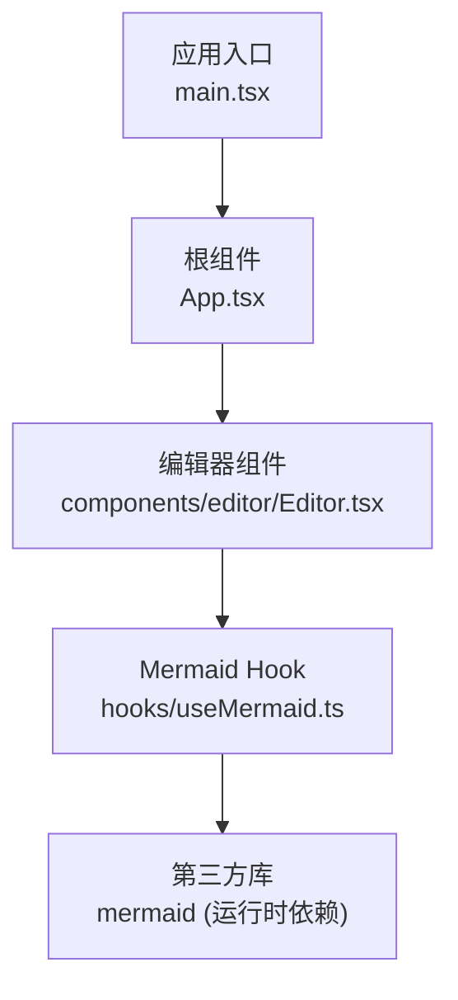
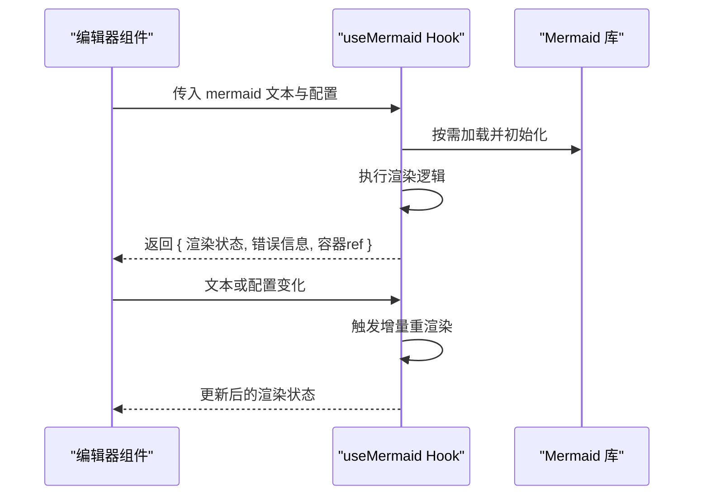
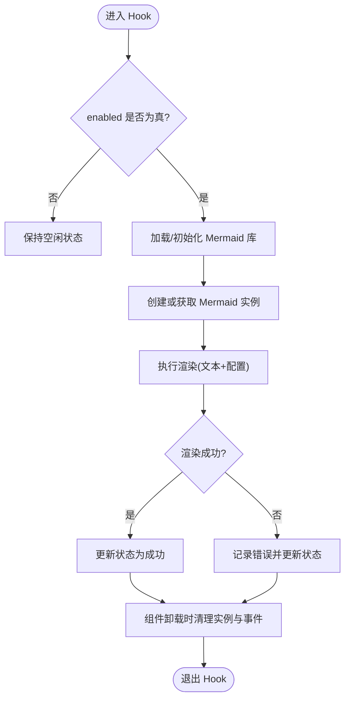
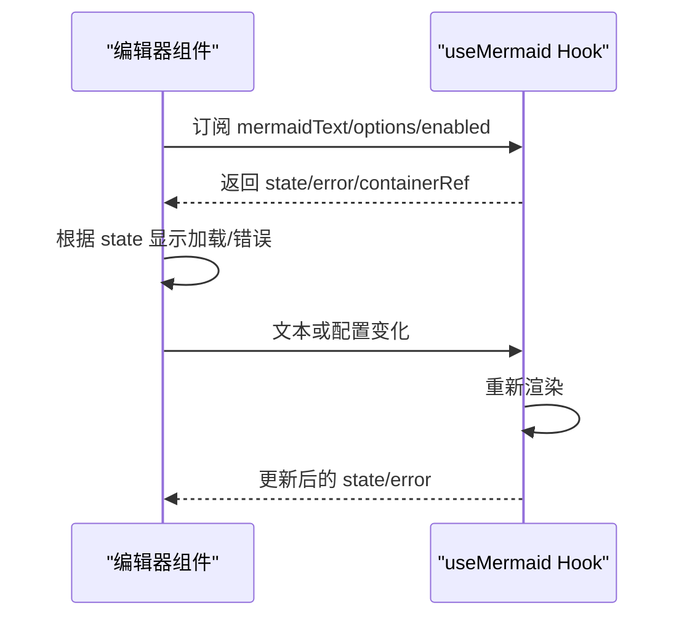

# Hooks与工具函数

<cite>
**本文引用的文件**
- [useMermaid.ts](file://src/hooks/useMermaid.ts)
- [Editor.tsx](file://src/components/editor/Editor.tsx)
- [App.tsx](file://src/App.tsx)
- [main.tsx](file://src/main.tsx)
- [package.json](file://package.json)
</cite>

## 目录
1. [简介](#简介)
2. [项目结构](#项目结构)
3. [核心组件](#核心组件)
4. [架构总览](#架构总览)
5. [详细组件分析](#详细组件分析)
6. [依赖关系分析](#依赖关系分析)
7. [性能考量](#性能考量)
8. [故障排查指南](#故障排查指南)
9. [结论](#结论)
10. [附录](#附录)

## 简介
本文件聚焦于 ZenNote 中的自定义 Hook 与工具函数，重点解析 useMermaid Hook 的实现细节、调用关系、接口定义与使用模式。文档面向初学者提供循序渐进的理解路径，同时为有经验的开发者提供深入的技术分析与优化建议。内容涵盖参数与返回值说明、副作用处理、与其他组件的集成方式，以及常见问题与解决方案。

## 项目结构
ZenNote 采用模块化组织：
- hooks：存放可复用的 React Hook，如 useMermaid
- components：页面级与业务组件，如编辑器 Editor
- store：状态管理（未在本节展开）
- i18n：国际化资源
- styles：全局样式
- main.tsx / App.tsx：应用入口与根组件

图表来源
- [main.tsx](file://src/main.tsx)
- [App.tsx](file://src/App.tsx)
- [Editor.tsx](file://src/components/editor/Editor.tsx)
- [useMermaid.ts](file://src/hooks/useMermaid.ts)

章节来源
- [main.tsx](file://src/main.tsx)
- [App.tsx](file://src/App.tsx)
- [Editor.tsx](file://src/components/editor/Editor.tsx)
- [useMermaid.ts](file://src/hooks/useMermaid.ts)

## 核心组件
本节对 useMermaid Hook 进行核心能力梳理：
- 职责：封装 Mermaid 渲染生命周期，管理渲染状态、错误处理与资源清理
- 输入：通常包含待渲染的 mermaid 文本、配置项（主题、语言、安全策略等）、是否启用渲染开关
- 输出：渲染结果引用或容器元素引用、当前渲染状态（加载中/成功/失败）、错误信息
- 副作用：动态加载 mermaid 库、初始化实例、执行渲染、监听外部变更并重新渲染、在卸载时清理事件与实例

章节来源
- [useMermaid.ts](file://src/hooks/useMermaid.ts)

## 架构总览
useMermaid Hook 在编辑器中作为“渲染能力”被复用，遵循“数据驱动 + 副作用隔离”的模式：
- 编辑器负责维护 mermaid 源文本与用户交互
- Hook 负责将文本转换为可视化图形，暴露统一的状态与错误
- 组件通过 Hook 返回的 ref 挂载到 DOM，完成渲染

图表来源
- [Editor.tsx](file://src/components/editor/Editor.tsx)
- [useMermaid.ts](file://src/hooks/useMermaid.ts)

## 详细组件分析

### useMermaid Hook 设计要点
- 参数约定
  - mermaidText：字符串，Mermaid 语法图代码
  - options：对象，包含主题、语言、安全策略、渲染选项等
  - enabled：布尔值，控制是否执行渲染
- 返回值约定
  - state：渲染状态（如 loading/success/error）
  - error：错误对象或消息
  - containerRef：用于挂载渲染结果的 DOM 引用
- 副作用管理
  - 首次渲染或依赖变化时，检查并加载 mermaid 库
  - 创建或复用 mermaid 实例，执行渲染
  - 捕获异常并转为错误状态
  - 组件卸载时销毁实例、移除事件监听，避免内存泄漏

图表来源
- [useMermaid.ts](file://src/hooks/useMermaid.ts)

章节来源
- [useMermaid.ts](file://src/hooks/useMermaid.ts)

### 编辑器组件集成模式
- 编辑器维护 mermaid 文本与配置，并在变化时传递给 Hook
- 通过 Hook 返回的 containerRef 将渲染结果挂载到指定节点
- 根据 Hook 返回的状态展示加载指示器或错误提示
- 支持切换主题、语言等配置以触发重渲染

图表来源
- [Editor.tsx](file://src/components/editor/Editor.tsx)
- [useMermaid.ts](file://src/hooks/useMermaid.ts)

章节来源
- [Editor.tsx](file://src/components/editor/Editor.tsx)
- [useMermaid.ts](file://src/hooks/useMermaid.ts)

### 使用示例（基于仓库实际文件）
- 在编辑器中使用 Hook：参考 [Editor.tsx](file://src/components/editor/Editor.tsx)
- 在应用入口初始化：参考 [App.tsx](file://src/App.tsx)
- 运行环境依赖声明：参考 [package.json](file://package.json)

章节来源
- [Editor.tsx](file://src/components/editor/Editor.tsx)
- [App.tsx](file://src/App.tsx)
- [package.json](file://package.json)

## 依赖关系分析
- 内部依赖
  - Editor 组件依赖 useMermaid Hook
  - useMermaid Hook 依赖 mermaid 运行时库
- 外部依赖
  - mermaid：通过 package.json 引入，可能在构建阶段按需加载或在运行时动态加载
- 耦合与内聚
  - Hook 将渲染逻辑与组件解耦，提升复用性
  - 编辑器仅关注数据与 UI 呈现，降低复杂度

图表来源
- [Editor.tsx](file://src/components/editor/Editor.tsx)
- [useMermaid.ts](file://src/hooks/useMermaid.ts)
- [package.json](file://package.json)

章节来源
- [Editor.tsx](file://src/components/editor/Editor.tsx)
- [useMermaid.ts](file://src/hooks/useMermaid.ts)
- [package.json](file://package.json)

## 性能考量
- 懒加载与按需初始化：仅在需要时加载 mermaid 库，减少首屏体积
- 防抖/节流：对频繁变化的 mermaid 文本进行去抖，避免重复渲染
- 增量更新：当仅有局部配置变化时，尽量复用已有实例，减少重建开销
- 内存管理：确保卸载时销毁实例、移除事件监听，防止内存泄漏
- 渲染稳定性：对大型图进行分片渲染或延迟渲染，避免阻塞主线程

[本节为通用指导，不直接分析具体文件]

## 故障排查指南
- 常见症状
  - 渲染无输出：检查 enabled 开关、mermaid 文本合法性、容器 ref 是否正确挂载
  - 渲染报错：查看 Hook 返回的错误信息，确认语法错误或安全策略限制
  - 性能卡顿：检查是否存在高频重渲染，考虑添加防抖或条件渲染
  - 内存增长：确认是否在组件卸载时正确清理实例与事件
- 定位步骤
  - 打印 Hook 返回的 state 与 error，观察状态流转
  - 验证 mermaid 文本是否符合语法规范
  - 检查浏览器控制台是否有脚本加载或权限相关错误
  - 在开发模式下开启严格模式，观察副作用执行次数

章节来源
- [useMermaid.ts](file://src/hooks/useMermaid.ts)

## 结论
useMermaid Hook 将 Mermaid 渲染能力封装为可复用的 React Hook，通过清晰的参数与返回值约定，使编辑器组件专注于数据与交互。其副作用管理与错误处理机制保证了渲染的稳定性和可维护性。结合懒加载、防抖与内存清理等优化策略，可在复杂场景下获得良好的性能表现。

[本节为总结性内容，不直接分析具体文件]

## 附录
- 最佳实践
  - 将 mermaid 文本与配置分离，便于测试与缓存
  - 为不同主题与语言提供默认配置，减少重复代码
  - 在单元测试中模拟 mermaid 库行为，验证 Hook 的状态流转
- 扩展方向
  - 增加导出功能（PNG/SVG/PDF）
  - 支持多实例并行渲染与独立生命周期管理
  - 集成实时预览与协作编辑

[本节为补充信息，不直接分析具体文件]