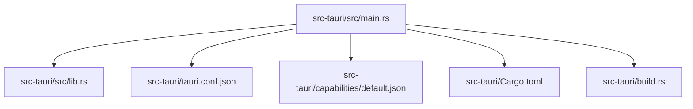
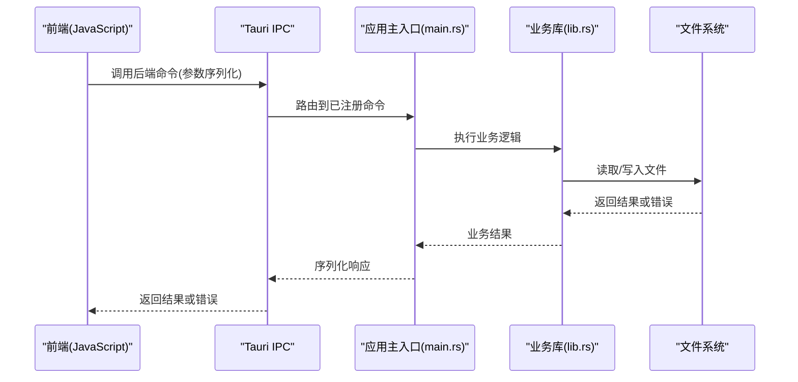
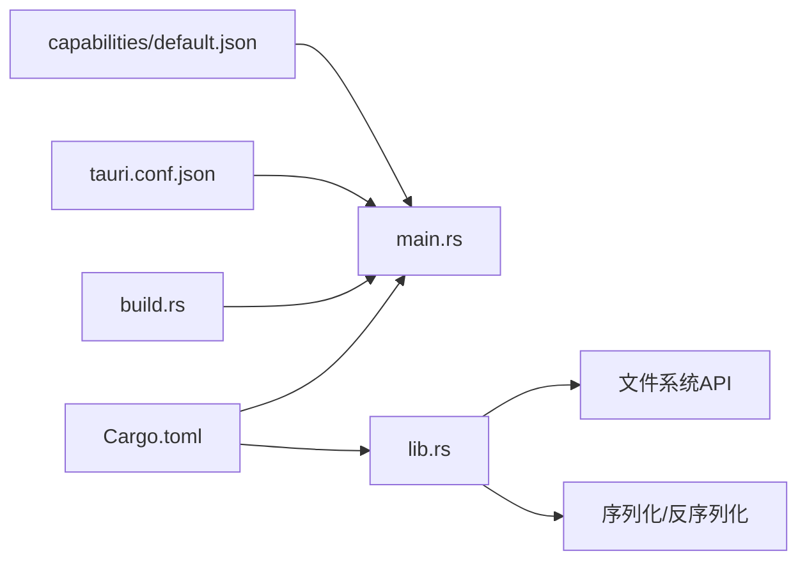

# Tauri后端

<cite>
**本文档引用的文件**   
- [src-tauri/Cargo.toml](file://src-tauri/Cargo.toml)
- [src-tauri/tauri.conf.json](file://src-tauri/tauri.conf.json)
- [src-tauri/src/main.rs](file://src-tauri/src/main.rs)
- [src-tauri/src/lib.rs](file://src-tauri/src/lib.rs)
- [src-tauri/build.rs](file://src-tauri/build.rs)
- [src-tauri/capabilities/default.json](file://src-tauri/capabilities/default.json)
</cite>

## 目录
1. [简介](#简介)
2. [项目结构](#项目结构)
3. [核心组件](#核心组件)
4. [架构总览](#架构总览)
5. [详细组件分析](#详细组件分析)
6. [依赖分析](#依赖分析)
7. [性能考虑](#性能考虑)
8. [故障排查指南](#故障排查指南)
9. [结论](#结论)
10. [附录](#附录)

## 简介
本文件面向ZenNote的Tauri后端，系统性阐述Rust服务架构、IPC通信机制、文件系统操作、Tauri配置与安全权限、窗口管理、后端API接口定义与请求处理流程、错误处理策略、性能优化与内存管理最佳实践、以及与前端JavaScript的通信协议和数据序列化格式。文档力求在技术深度与可读性之间取得平衡，便于不同背景的读者理解与使用。

## 项目结构
Tauri后端的源码位于src-tauri目录，包含Rust入口、库模块、构建脚本、能力与权限配置以及Tauri应用配置等关键文件。整体采用“最小化主进程 + 模块化库”的组织方式：
- src-tauri/src/main.rs：Tauri应用主入口，负责初始化运行时、注册命令与插件、启动窗口。
- src-tauri/src/lib.rs：业务逻辑与命令实现所在，暴露给前端的Rust API通常在此处定义。
- src-tauri/Cargo.toml：Rust依赖与包元数据。
- src-tauri/tauri.conf.json：Tauri应用配置（窗口、安全、插件、资源等）。
- src-tauri/capabilities/default.json：能力与权限声明，控制前端可访问的后端功能。
- src-tauri/build.rs：构建期脚本，用于生成或注入资源/模式文件。

图表来源 
- [src-tauri/src/main.rs](file://src-tauri/src/main.rs)
- [src-tauri/src/lib.rs](file://src-tauri/src/lib.rs)
- [src-tauri/tauri.conf.json](file://src-tauri/tauri.conf.json)
- [src-tauri/capabilities/default.json](file://src-tauri/capabilities/default.json)
- [src-tauri/Cargo.toml](file://src-tauri/Cargo.toml)
- [src-tauri/build.rs](file://src-tauri/build.rs)

章节来源
- [src-tauri/Cargo.toml](file://src-tauri/Cargo.toml)
- [src-tauri/tauri.conf.json](file://src-tauri/tauri.conf.json)
- [src-tauri/src/main.rs](file://src-tauri/src/main.rs)
- [src-tauri/src/lib.rs](file://src-tauri/src/lib.rs)
- [src-tauri/build.rs](file://src-tauri/build.rs)
- [src-tauri/capabilities/default.json](file://src-tauri/capabilities/default.json)

## 核心组件
- Tauri应用主入口（main.rs）：负责创建应用上下文、加载配置、注册命令与插件、启动UI窗口。
- 业务逻辑库（lib.rs）：集中实现后端命令、数据处理、文件系统操作、持久化与缓存等。
- 构建脚本（build.rs）：在构建阶段执行代码生成或资源准备，确保运行期所需文件可用。
- 能力与权限（capabilities/default.json）：声明前端可调用哪些命令或系统能力，配合白名单机制保障安全。
- 应用配置（tauri.conf.json）：定义窗口行为、安全策略、插件启用、打包资源等。

章节来源
- [src-tauri/src/main.rs](file://src-tauri/src/main.rs)
- [src-tauri/src/lib.rs](file://src-tauri/src/lib.rs)
- [src-tauri/build.rs](file://src-tauri/build.rs)
- [src-tauri/capabilities/default.json](file://src-tauri/capabilities/default.json)
- [src-tauri/tauri.conf.json](file://src-tauri/tauri.conf.json)

## 架构总览
Tauri后端以Rust为核心，通过IPC通道为前端提供稳定的API。整体分层如下：
- 前端层（JS/TS）：通过Tauri客户端调用后端命令，发送结构化请求并接收响应。
- IPC层：基于Tauri的消息总线，将前端请求路由到Rust命令处理器。
- 业务层（lib.rs）：实现具体业务逻辑，包括文件读写、数据转换、状态管理等。
- 系统层：操作系统文件API、平台相关能力（由能力配置限制）。

图表来源 
- [src-tauri/src/main.rs](file://src-tauri/src/main.rs)
- [src-tauri/src/lib.rs](file://src-tauri/src/lib.rs)
- [src-tauri/tauri.conf.json](file://src-tauri/tauri.conf.json)
- [src-tauri/capabilities/default.json](file://src-tauri/capabilities/default.json)

## 详细组件分析

### Rust应用主入口（main.rs）
职责与要点：
- 初始化Tauri运行时与应用上下文。
- 加载并解析应用配置（tauri.conf.json）。
- 注册后端命令（从lib.rs导出），使前端可通过IPC调用。
- 配置窗口属性（大小、标题、可见性等）。
- 启动事件循环，处理用户交互与系统事件。

建议关注点：
- 命令注册顺序与命名空间组织，避免冲突。
- 窗口生命周期钩子，用于资源清理与状态保存。
- 日志与调试输出，便于定位问题。

章节来源
- [src-tauri/src/main.rs](file://src-tauri/src/main.rs)

### 业务逻辑库（lib.rs）
职责与要点：
- 定义并实现所有后端命令（如文件读写、设置管理、搜索索引等）。
- 封装文件系统操作，统一错误类型与返回值。
- 提供数据序列化/反序列化工具，保证前后端数据结构一致。
- 可选地实现缓存、并发控制与异步任务调度。

建议关注点：
- 命令输入校验与边界条件处理。
- 错误分类（IO错误、权限错误、数据格式错误等），便于前端差异化处理。
- 性能敏感路径的批处理与惰性加载。

章节来源
- [src-tauri/src/lib.rs](file://src-tauri/src/lib.rs)

### 构建脚本（build.rs）
职责与要点：
- 在构建阶段生成或复制必要文件（如模式文件、静态资源）。
- 根据目标平台调整构建行为。
- 确保运行期依赖可用，减少运行时失败概率。

建议关注点：
- 增量构建友好，避免不必要的重编译。
- 错误信息清晰，便于快速定位构建问题。

章节来源
- [src-tauri/build.rs](file://src-tauri/build.rs)

### Tauri配置（tauri.conf.json）
职责与要点：
- 定义窗口外观与行为（尺寸、位置、是否透明、是否全屏等）。
- 配置安全策略（CSP、白名单、命令访问控制）。
- 启用或禁用插件（如fs、dialog、shell等）。
- 指定打包资源与图标。

建议关注点：
- 最小权限原则：仅开放必要的命令与能力。
- 开发/生产环境差异化配置，便于调试与发布。

章节来源
- [src-tauri/tauri.conf.json](file://src-tauri/tauri.conf.json)

### 能力与权限（capabilities/default.json）
职责与要点：
- 声明前端可访问的命令与系统能力。
- 结合白名单机制，限制潜在风险操作。
- 支持按场景或角色细粒度授权。

建议关注点：
- 定期审计能力清单，移除未使用权限。
- 对敏感能力进行额外验证与日志记录。

章节来源
- [src-tauri/capabilities/default.json](file://src-tauri/capabilities/default.json)

### 依赖管理（Cargo.toml）
职责与要点：
- 声明Rust依赖项与版本约束。
- 配置特性开关与目标平台。
- 管理构建脚本与测试依赖。

建议关注点：
- 锁定依赖版本，确保构建可重复。
- 按需启用特性，减小二进制体积。

章节来源
- [src-tauri/Cargo.toml](file://src-tauri/Cargo.toml)

## 依赖分析
Tauri后端依赖关系清晰，主入口依赖业务库，业务库依赖标准库与第三方crate（如文件系统、序列化、异步运行时）。构建脚本独立于运行期，能力与权限配置由Tauri框架消费。

图表来源 
- [src-tauri/Cargo.toml](file://src-tauri/Cargo.toml)
- [src-tauri/src/main.rs](file://src-tauri/src/main.rs)
- [src-tauri/src/lib.rs](file://src-tauri/src/lib.rs)
- [src-tauri/build.rs](file://src-tauri/build.rs)
- [src-tauri/tauri.conf.json](file://src-tauri/tauri.conf.json)
- [src-tauri/capabilities/default.json](file://src-tauri/capabilities/default.json)

章节来源
- [src-tauri/Cargo.toml](file://src-tauri/Cargo.toml)
- [src-tauri/src/main.rs](file://src-tauri/src/main.rs)
- [src-tauri/src/lib.rs](file://src-tauri/src/lib.rs)
- [src-tauri/build.rs](file://src-tauri/build.rs)
- [src-tauri/tauri.conf.json](file://src-tauri/tauri.conf.json)
- [src-tauri/capabilities/default.json](file://src-tauri/capabilities/default.json)

## 性能考虑
- I/O优化：批量读写、延迟加载、缓存热点数据；避免阻塞主线程，使用异步I/O。
- 序列化开销：选择高效序列化格式（如JSON/MessagePack），减少字段冗余，按需传输。
- 内存管理：及时释放大对象，避免持有全局引用；使用零拷贝策略处理大文件。
- 并发模型：合理划分任务，避免锁竞争；使用工作池处理高并发请求。
- 构建优化：启用LTO、裁剪未用特性、减少依赖体积。

[本节为通用指导，不直接分析具体文件]

## 故障排查指南
常见问题与解决思路：
- 命令未注册或调用失败：检查main.rs中命令注册是否正确，确认capabilities允许该命令。
- 权限不足：核对tauri.conf.json与capabilities/default.json中的权限声明。
- 文件操作异常：确认路径存在、权限足够；捕获并分类错误，返回明确错误码。
- 序列化不一致：确保前后端数据结构定义一致，必要时增加版本兼容层。
- 构建失败：查看build.rs输出，检查依赖版本与目标平台兼容性。

章节来源
- [src-tauri/src/main.rs](file://src-tauri/src/main.rs)
- [src-tauri/src/lib.rs](file://src-tauri/src/lib.rs)
- [src-tauri/tauri.conf.json](file://src-tauri/tauri.conf.json)
- [src-tauri/capabilities/default.json](file://src-tauri/capabilities/default.json)
- [src-tauri/build.rs](file://src-tauri/build.rs)

## 结论
ZenNote的Tauri后端以清晰的模块化设计为基础，通过IPC为前端提供稳定、安全的API。合理的权限控制与错误处理保障了系统的健壮性。遵循本文的性能优化与内存管理建议，可进一步提升用户体验与系统稳定性。

[本节为总结性内容，不直接分析具体文件]

## 附录

### IPC通信机制与数据序列化
- 通信协议：前端通过Tauri客户端调用后端命令，参数与返回值采用JSON或其他序列化格式。
- 数据一致性：前后端共享类型定义，确保字段名与类型一致；必要时引入版本协商。
- 错误传播：后端统一错误类型，前端根据错误码与消息进行提示与重试。

章节来源
- [src-tauri/src/main.rs](file://src-tauri/src/main.rs)
- [src-tauri/src/lib.rs](file://src-tauri/src/lib.rs)
- [src-tauri/tauri.conf.json](file://src-tauri/tauri.conf.json)
- [src-tauri/capabilities/default.json](file://src-tauri/capabilities/default.json)

### 文件系统操作最佳实践
- 路径校验：防止路径穿越与非法字符。
- 权限检查：提前判断读写权限，避免运行时异常。
- 原子操作：使用临时文件+重命名保证数据一致性。
- 错误分类：区分IO错误、权限错误、格式错误，便于前端差异化处理。

章节来源
- [src-tauri/src/lib.rs](file://src-tauri/src/lib.rs)

### 窗口管理与生命周期
- 窗口配置：在tauri.conf.json中定义窗口属性，支持多窗口与动态创建。
- 生命周期钩子：监听窗口关闭、最小化等事件，执行资源清理与状态保存。
- 跨窗口通信：通过IPC或事件总线实现数据同步。

章节来源
- [src-tauri/tauri.conf.json](file://src-tauri/tauri.conf.json)
- [src-tauri/src/main.rs](file://src-tauri/src/main.rs)

### 调试技巧
- 启用详细日志：在开发与测试环境开启调试输出。
- 断点与堆栈：利用IDE调试器定位崩溃与性能瓶颈。
- 网络与IPC监控：观察请求/响应内容与耗时，识别慢路径。

章节来源
- [src-tauri/src/main.rs](file://src-tauri/src/main.rs)
- [src-tauri/src/lib.rs](file://src-tauri/src/lib.rs)