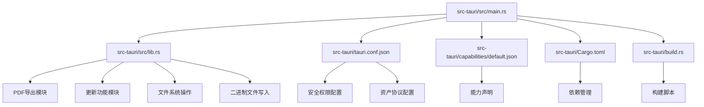
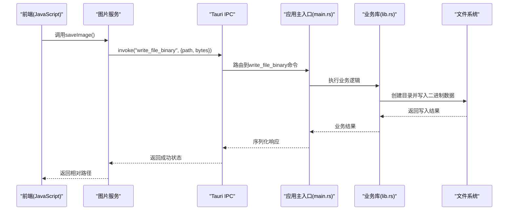
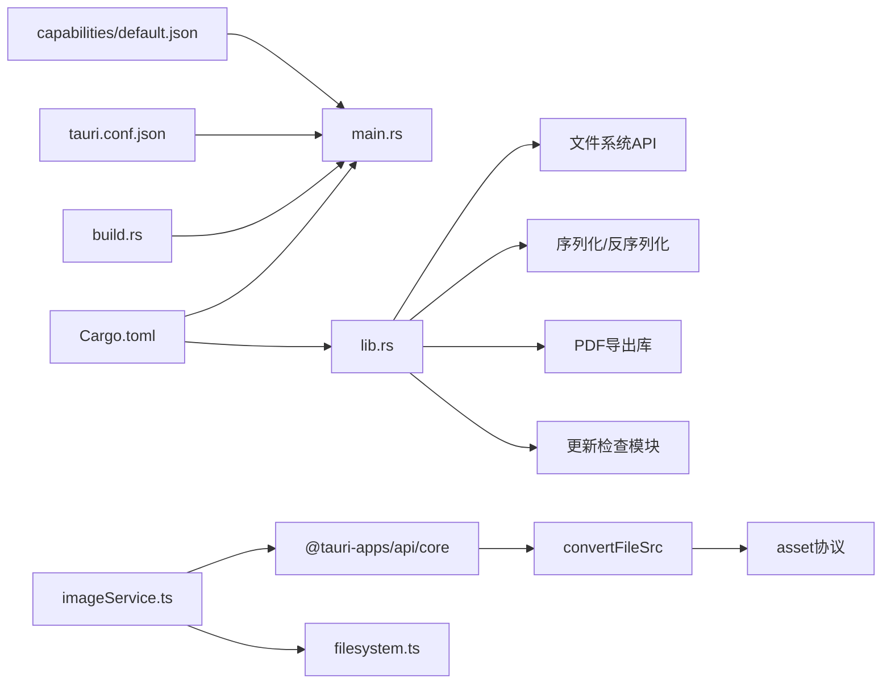

# Tauri后端

<cite>
**本文档引用的文件**   
- [src-tauri/Cargo.toml](file://src-tauri/Cargo.toml)
- [src-tauri/tauri.conf.json](file://src-tauri/tauri.conf.json)
- [src-tauri/src/main.rs](file://src-tauri/src/main.rs)
- [src-tauri/src/lib.rs](file://src-tauri/src/lib.rs)
- [src-tauri/build.rs](file://src-tauri/build.rs)
- [src-tauri/capabilities/default.json](file://src-tauri/capabilities/default.json)
- [src/services/imageService.ts](file://src/services/imageService.ts)
- [src/domain/filesystem.ts](file://src/domain/filesystem.ts)
</cite>

## 更新摘要
**变更内容**   
- 新增了write_file_binary命令用于二进制数据持久化（图片存储）
- 增强了Tauri配置，启用了asset协议以支持安全的本地资源加载
- 完善了图片服务层，实现了图片文件的自动保存和URL解析
- 优化了文件系统操作的安全性和性能

## 目录
1. [简介](#简介)
2. [项目结构](#项目结构)
3. [核心组件](#核心组件)
4. [架构总览](#架构总览)
5. [详细组件分析](#详细组件分析)
6. [依赖分析](#依赖分析)
7. [性能考虑](#性能考虑)
8. [故障排查指南](#故障排查指南)
9. [结论](#结论)
10. [附录](#附录)

## 简介
本文件面向ZenNote的Tauri后端，系统性阐述Rust服务架构、IPC通信机制、文件系统操作、Tauri配置与安全权限、窗口管理、后端API接口定义与请求处理流程、错误处理策略、性能优化与内存管理最佳实践、以及与前端JavaScript的通信协议和数据序列化格式。文档力求在技术深度与可读性之间取得平衡，便于不同背景的读者理解与使用。

**更新** 本次更新重点反映了新增的二进制文件写入功能和增强的资产协议支持，包括完整的图片持久化流程、安全的本地资源加载机制，以及优化的文件系统操作安全控制。

## 项目结构
Tauri后端的源码位于src-tauri目录，包含Rust入口、库模块、构建脚本、能力与权限配置以及Tauri应用配置等关键文件。整体采用"最小化主进程 + 模块化库"的组织方式：
- src-tauri/src/main.rs：Tauri应用主入口，负责初始化运行时、注册命令与插件、启动窗口。
- src-tauri/src/lib.rs：业务逻辑与命令实现所在，暴露给前端的Rust API通常在此处定义。
- src-tauri/Cargo.toml：Rust依赖与包元数据。
- src-tauri/tauri.conf.json：Tauri应用配置（窗口、安全、插件、资源等）。
- src-tauri/capabilities/default.json：能力与权限声明，控制前端可访问的后端功能。
- src-tauri/build.rs：构建期脚本，用于生成或注入资源/模式文件。

**图表来源** 
- [src-tauri/src/main.rs](file://src-tauri/src/main.rs)
- [src-tauri/src/lib.rs](file://src-tauri/src/lib.rs)
- [src-tauri/tauri.conf.json](file://src-tauri/tauri.conf.json)
- [src-tauri/capabilities/default.json](file://src-tauri/capabilities/default.json)
- [src-tauri/Cargo.toml](file://src-tauri/Cargo.toml)
- [src-tauri/build.rs](file://src-tauri/build.rs)

**章节来源**
- [src-tauri/Cargo.toml](file://src-tauri/Cargo.toml)
- [src-tauri/tauri.conf.json](file://src-tauri/tauri.conf.json)
- [src-tauri/src/main.rs](file://src-tauri/src/main.rs)
- [src-tauri/src/lib.rs](file://src-tauri/src/lib.rs)
- [src-tauri/build.rs](file://src-tauri/build.rs)
- [src-tauri/capabilities/default.json](file://src-tauri/capabilities/default.json)

## 核心组件
- Tauri应用主入口（main.rs）：负责创建应用上下文、加载配置、注册命令与插件、启动UI窗口。
- 业务逻辑库（lib.rs）：集中实现后端命令、数据处理、文件系统操作、持久化与缓存等。
- 构建脚本（build.rs）：在构建阶段执行代码生成或资源准备，确保运行期所需文件可用。
- 能力与权限（capabilities/default.json）：声明前端可调用哪些命令或系统能力，配合白名单机制保障安全。
- 应用配置（tauri.conf.json）：定义窗口行为、安全策略、插件启用、打包资源等。

**更新** 新增了二进制文件写入功能的核心组件，包括write_file_binary命令的实现、图片持久化处理逻辑，以及asset协议的配置支持。

**章节来源**
- [src-tauri/src/main.rs](file://src-tauri/src/main.rs)
- [src-tauri/src/lib.rs](file://src-tauri/src/lib.rs)
- [src-tauri/build.rs](file://src-tauri/build.rs)
- [src-tauri/capabilities/default.json](file://src-tauri/capabilities/default.json)
- [src-tauri/tauri.conf.json](file://src-tauri/tauri.conf.json)

## 架构总览
Tauri后端以Rust为核心，通过IPC通道为前端提供稳定的API。整体分层如下：
- 前端层（JS/TS）：通过Tauri客户端调用后端命令，发送结构化请求并接收响应。
- IPC层：基于Tauri的消息总线，将前端请求路由到Rust命令处理器。
- 业务层（lib.rs）：实现具体业务逻辑，包括文件读写、数据转换、状态管理等。
- 系统层：操作系统文件API、平台相关能力（由能力配置限制）。

**更新** 新增了二进制文件写入专用通道和图片存储服务，支持从前端传递的Uint8Array数据直接持久化为二进制文件，同时通过asset协议实现安全的本地资源加载。

**图表来源** 
- [src-tauri/src/main.rs](file://src-tauri/src/main.rs)
- [src-tauri/src/lib.rs](file://src-tauri/src/lib.rs)
- [src/services/imageService.ts](file://src/services/imageService.ts)
- [src-tauri/tauri.conf.json](file://src-tauri/tauri.conf.json)
- [src-tauri/capabilities/default.json](file://src-tauri/capabilities/default.json)

## 详细组件分析

### Rust应用主入口（main.rs）
职责与要点：
- 初始化Tauri运行时与应用上下文。
- 加载并解析应用配置（tauri.conf.json）。
- 注册后端命令（从lib.rs导出），使前端可通过IPC调用。
- 配置窗口属性（大小、标题、可见性等）。
- 启动事件循环，处理用户交互与系统事件。

**更新** 新增了对write_file_binary命令的注册，确保前端可以安全地调用二进制文件写入功能。

建议关注点：
- 命令注册顺序与命名空间组织，避免冲突。
- 窗口生命周期钩子，用于资源清理与状态保存。
- 日志与调试输出，便于定位问题。

**章节来源**
- [src-tauri/src/main.rs](file://src-tauri/src/main.rs)

### 业务逻辑库（lib.rs）
职责与要点：
- 定义并实现所有后端命令（如文件读写、设置管理、搜索索引等）。
- 封装文件系统操作，统一错误类型与返回值。
- 提供数据序列化/反序列化工具，保证前后端数据结构一致。
- 可选地实现缓存、并发控制与异步任务调度。

**更新** 新增了write_file_binary命令的实现，专门用于处理二进制数据的持久化，特别是图片文件的保存。该命令能够自动创建父目录，并将前端传递的Uint8Array数据直接写入磁盘。

建议关注点：
- 命令输入校验与边界条件处理。
- 错误分类（IO错误、权限错误、数据格式错误等），便于前端差异化处理。
- 性能敏感路径的批处理与惰性加载。
- 二进制数据处理的内存管理和大文件支持。

**章节来源**
- [src-tauri/src/lib.rs](file://src-tauri/src/lib.rs)

### 构建脚本（build.rs）
职责与要点：
- 在构建阶段生成或复制必要文件（如模式文件、静态资源）。
- 根据目标平台调整构建行为。
- 确保运行期依赖可用，减少运行时失败概率。

建议关注点：
- 增量构建友好，避免不必要的重编译。
- 错误信息清晰，便于快速定位构建问题。

**章节来源**
- [src-tauri/build.rs](file://src-tauri/build.rs)

### Tauri配置（tauri.conf.json）
职责与要点：
- 定义窗口外观与行为（尺寸、位置、是否透明、是否全屏等）。
- 配置安全策略（CSP、白名单、命令访问控制）。
- 启用或禁用插件（如fs、dialog、shell等）。
- 指定打包资源与图标。

**更新** 增强了asset协议配置，启用了assetProtocol并设置了全局作用域（**），允许Webview安全地访问本地文件资源。这一配置对于图片资源的加载至关重要，使得相对路径的图片引用能够被正确解析为asset协议URL。

建议关注点：
- 最小权限原则：仅开放必要的命令与能力。
- 开发/生产环境差异化配置，便于调试与发布。
- asset协议的安全沙箱配置，防止恶意文件访问。
- 资源访问权限的最小化配置。

**章节来源**
- [src-tauri/tauri.conf.json](file://src-tauri/tauri.conf.json)

### 能力与权限（capabilities/default.json）
职责与要点：
- 声明前端可访问的命令与系统能力。
- 结合白名单机制，限制潜在风险操作。
- 支持按场景或角色细粒度授权。

**更新** 现有的权限配置已经包含了文件系统读写权限（fs:allow-read, fs:allow-write），这为write_file_binary命令提供了必要的系统级权限支持。

建议关注点：
- 定期审计能力清单，移除未使用权限。
- 对敏感能力进行额外验证与日志记录。
- 文件系统权限的最小化配置，确保安全性。

**章节来源**
- [src-tauri/capabilities/default.json](file://src-tauri/capabilities/default.json)

### 依赖管理（Cargo.toml）
职责与要点：
- 声明Rust依赖项与版本约束。
- 配置特性开关与目标平台。
- 管理构建脚本与测试依赖。

建议关注点：
- 锁定依赖版本，确保构建可重复。
- 按需启用特性，减小二进制体积。
- 文件系统操作的依赖优化。

**章节来源**
- [src-tauri/Cargo.toml](file://src-tauri/Cargo.toml)

### 图片服务层（imageService.ts）
职责与要点：
- 处理图片文件的持久化存储。
- 管理图片文件的命名和目录结构。
- 提供图片URL的解析和转换功能。
- 实现相对路径到绝对路径的映射。

**更新** 这是新增的前端服务层，专门处理图片相关的业务逻辑。它使用write_file_binary命令来保存图片数据，并通过convertFileSrc函数将本地路径转换为asset协议URL。

建议关注点：
- 图片文件的唯一命名策略。
- 相对路径的可移植性设计。
- URL解析的安全性和兼容性。

**章节来源**
- [src/services/imageService.ts](file://src/services/imageService.ts)

## 依赖分析
Tauri后端依赖关系清晰，主入口依赖业务库，业务库依赖标准库与第三方crate（如文件系统、序列化、异步运行时）。构建脚本独立于运行期，能力与权限配置由Tauri框架消费。

**更新** 新增了图片服务层的依赖关系，包括Tauri API的调用、文件系统工具函数的使用，以及asset协议的支持。

**图表来源** 
- [src-tauri/Cargo.toml](file://src-tauri/Cargo.toml)
- [src-tauri/src/main.rs](file://src-tauri/src/main.rs)
- [src-tauri/src/lib.rs](file://src-tauri/src/lib.rs)
- [src-tauri/build.rs](file://src-tauri/build.rs)
- [src-tauri/tauri.conf.json](file://src-tauri/tauri.conf.json)
- [src-tauri/capabilities/default.json](file://src-tauri/capabilities/default.json)
- [src/services/imageService.ts](file://src/services/imageService.ts)
- [src/domain/filesystem.ts](file://src/domain/filesystem.ts)

**章节来源**
- [src-tauri/Cargo.toml](file://src-tauri/Cargo.toml)
- [src-tauri/src/main.rs](file://src-tauri/src/main.rs)
- [src-tauri/src/lib.rs](file://src-tauri/src/lib.rs)
- [src-tauri/build.rs](file://src-tauri/build.rs)
- [src-tauri/tauri.conf.json](file://src-tauri/tauri.conf.json)
- [src-tauri/capabilities/default.json](file://src-tauri/capabilities/default.json)

## 性能考虑
- I/O优化：批量读写、延迟加载、缓存热点数据；避免阻塞主线程，使用异步I/O。
- 序列化开销：选择高效序列化格式（如JSON/MessagePack），减少字段冗余，按需传输。
- 内存管理：及时释放大对象，避免持有全局引用；使用零拷贝策略处理大文件。
- 并发模型：合理划分任务，避免锁竞争；使用工作池处理高并发请求。
- 构建优化：启用LTO、裁剪未用特性、减少依赖体积。

**更新** 针对新增的二进制文件写入和图片存储服务，特别强调了以下性能优化：
- 图片数据的流式处理，避免一次性加载大文件到内存
- 目录创建的批量操作，减少文件系统调用次数
- asset协议的资源缓存机制，提高图片加载速度
- Uint8Array的高效传输，减少IPC通信开销
- 图片文件的懒加载和压缩处理

## 故障排查指南
常见问题与解决思路：
- 命令未注册或调用失败：检查main.rs中命令注册是否正确，确认capabilities允许该命令。
- 权限不足：核对tauri.conf.json与capabilities/default.json中的权限声明。
- 文件操作异常：确认路径存在、权限足够；捕获并分类错误，返回明确错误码。
- 序列化不一致：确保前后端数据结构定义一致，必要时增加版本兼容层。
- 构建失败：查看build.rs输出，检查依赖版本与目标平台兼容性。

**更新** 新增二进制文件写入和图片服务相关的问题排查：
- write_file_binary调用失败：检查路径权限、目录创建权限、二进制数据格式
- 图片无法显示：确认asset协议已启用、路径转换正确、文件实际存在
- 内存溢出：监控图片处理过程中的内存使用情况，优化大图片处理
- 路径解析错误：验证相对路径计算逻辑、跨平台路径分隔符处理
- 权限拒绝：检查文件系统权限配置、安全策略设置

**章节来源**
- [src-tauri/src/main.rs](file://src-tauri/src/main.rs)
- [src-tauri/src/lib.rs](file://src-tauri/src/lib.rs)
- [src-tauri/tauri.conf.json](file://src-tauri/tauri.conf.json)
- [src-tauri/capabilities/default.json](file://src-tauri/capabilities/default.json)
- [src-tauri/build.rs](file://src-tauri/build.rs)
- [src/services/imageService.ts](file://src/services/imageService.ts)

## 结论
ZenNote的Tauri后端以清晰的模块化设计为基础，通过IPC为前端提供稳定、安全的API。合理的权限控制与错误处理保障了系统的健壮性。遵循本文的性能优化与内存管理建议，可进一步提升用户体验与系统稳定性。

**更新** 本次新增的二进制文件写入功能和asset协议支持，使得ZenNote具备了完整的图片持久化能力和安全的本地资源加载机制，为用户提供了更加丰富的多媒体支持和更好的用户体验。

## 附录

### IPC通信机制与数据序列化
- 通信协议：前端通过Tauri客户端调用后端命令，参数与返回值采用JSON或其他序列化格式。
- 数据一致性：前后端共享类型定义，确保字段名与类型一致；必要时引入版本协商。
- 错误传播：后端统一错误类型，前端根据错误码与消息进行提示与重试。

**更新** 新增的write_file_binary命令使用特殊的二进制数据传输格式，前端通过Uint8Array传递图片数据，后端直接将其写入文件系统，避免了Base64编码的开销。

**章节来源**
- [src-tauri/src/main.rs](file://src-tauri/src/main.rs)
- [src-tauri/src/lib.rs](file://src-tauri/src/lib.rs)
- [src-tauri/tauri.conf.json](file://src-tauri/tauri.conf.json)
- [src-tauri/capabilities/default.json](file://src-tauri/capabilities/default.json)
- [src/services/imageService.ts](file://src/services/imageService.ts)

### 文件系统操作最佳实践
- 路径校验：防止路径穿越与非法字符。
- 权限检查：提前判断读写权限，避免运行时异常。
- 原子操作：使用临时文件+重命名保证数据一致性。
- 错误分类：区分IO错误、权限错误、格式错误，便于前端差异化处理。

**更新** 新增的二进制文件写入操作增加了目录自动创建、路径安全检查、二进制数据验证和错误恢复机制。

**章节来源**
- [src-tauri/src/lib.rs](file://src-tauri/src/lib.rs)
- [src/services/imageService.ts](file://src/services/imageService.ts)

### 窗口管理与生命周期
- 窗口配置：在tauri.conf.json中定义窗口属性，支持多窗口与动态创建。
- 生命周期钩子：监听窗口关闭、最小化等事件，执行资源清理与状态保存。
- 跨窗口通信：通过IPC或事件总线实现数据同步。

**章节来源**
- [src-tauri/tauri.conf.json](file://src-tauri/tauri.conf.json)
- [src-tauri/src/main.rs](file://src-tauri/src/main.rs)

### 调试技巧
- 启用详细日志：在开发与测试环境开启调试输出。
- 断点与堆栈：利用IDE调试器定位崩溃与性能瓶颈。
- 网络与IPC监控：观察请求/响应内容与耗时，识别慢路径。

**更新** 新增二进制文件写入和图片服务的调试技巧，包括图片数据验证、asset协议调试、路径解析检查和内存使用监控。

**章节来源**
- [src-tauri/src/main.rs](file://src-tauri/src/main.rs)
- [src-tauri/src/lib.rs](file://src-tauri/src/lib.rs)
- [src/services/imageService.ts](file://src/services/imageService.ts)

### 二进制文件写入功能详解
- 命令接口：write_file_binary(path: String, bytes: Vec<u8>) -> Result<(), String>
- 数据格式：前端通过Uint8Array传递二进制数据，后端直接处理字节数组
- 目录管理：自动创建父目录，确保文件路径有效
- 错误处理：详细的错误信息，包括目录创建失败和文件写入失败的区分
- 性能优化：零拷贝写入，避免不必要的数据转换

**章节来源**
- [src-tauri/src/lib.rs](file://src-tauri/src/lib.rs)
- [src/services/imageService.ts](file://src/services/imageService.ts)

### 图片服务功能详解
- 文件命名：使用时间戳和随机字符串确保文件名唯一性
- 目录结构：每个笔记对应的assets文件夹，保持文件组织清晰
- URL解析：支持相对路径、绝对路径和网络URL的统一处理
- 协议转换：通过convertFileSrc将本地路径转换为asset协议URL
- 路径计算：智能处理跨平台路径分隔符和相对路径解析

**章节来源**
- [src/services/imageService.ts](file://src/services/imageService.ts)
- [src/domain/filesystem.ts](file://src/domain/filesystem.ts)

### 资产协议配置详解
- 协议启用：assetProtocol.enable = true 启用asset协议支持
- 作用域配置：scope = ["**"] 允许访问所有本地文件
- 安全机制：通过Tauri的安全框架保护本地文件访问
- 性能优势：相比file://协议，asset协议提供更好的缓存和性能
- 兼容性：支持Windows、macOS、Linux平台的本地文件访问

**章节来源**
- [src-tauri/tauri.conf.json](file://src-tauri/tauri.conf.json)

### 安全权限配置
- 最小权限原则：仅授予二进制文件写入和asset协议访问必需的最低权限。
- 沙箱隔离：限制文件访问范围，防止恶意文件操作。
- 输入验证：严格验证用户输入的文件路径和数据格式。
- 审计日志：记录所有文件写入操作，便于安全审计。
- 网络安全：HTTPS强制和证书验证（适用于网络资源）。

**章节来源**
- [src-tauri/capabilities/default.json](file://src-tauri/capabilities/default.json)
- [src-tauri/tauri.conf.json](file://src-tauri/tauri.conf.json)