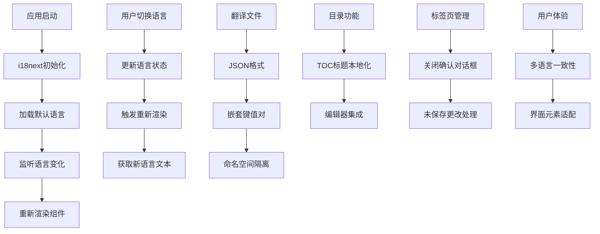
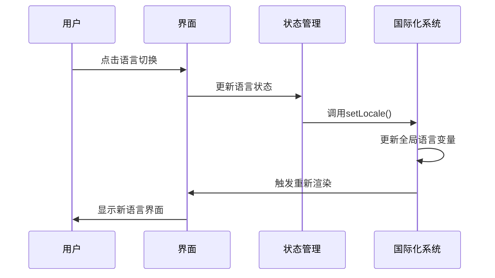

# 国际化

<cite>
**本文档引用的文件**
- [index.ts](file://src/i18n/index.ts)
- [en-US.ts](file://src/i18n/en-US.ts)
- [zh-CN.ts](file://src/i18n/zh-CN.ts)
- [Editor.tsx](file://src/components/editor/Editor.tsx)
- [TabBar.tsx](file://src/components/layout/TabBar.tsx)
</cite>

## 更新摘要
**所做更改**
- 新增了目录（Table of Contents）功能的完整国际化支持，包括英文和中文翻译
- 添加了标签页关闭功能的国际化字符串，支持未保存更改确认对话框
- 在英文（en-US.ts）和中文（zh-CN.ts）语言文件中添加了新的编辑器、标签页相关键值
- 增强了编辑器自定义功能和用户交互的国际化覆盖范围
- 完善了目录功能、标签页管理和未保存更改处理的本地化体验

## 目录
- [概述](#概述)
- [架构设计](#架构设计)
- [语言包结构](#语言包结构)
- [新增语言步骤](#新增语言步骤)
- [翻译文件格式规范](#翻译文件格式规范)
- [动态语言切换实现](#动态语言切换实现)
- [翻译键值管理最佳实践](#翻译键值管理最佳实践)
- [翻译质量检查](#翻译质量检查)
- [国际化组件使用示例](#国际化组件使用示例)
- [自定义语言包创建指南](#自定义语言包创建指南)
- [日期数字格式化和本地化规则](#日期数字格式化和本地化规则)

## 概述
ZenNote的国际化系统基于React i18next库构建，支持多语言界面显示。系统采用模块化设计，将翻译内容按语言分离存储，通过统一的接口进行访问和管理。当前支持简体中文（zh-CN）和英文（en-US）两种语言。

**最新更新**：v0.8.0版本新增了目录（Table of Contents）功能的完整国际化支持，包括"目录"标题的本地化显示；同时添加了标签页关闭功能的国际化字符串，支持未保存更改确认对话框的多语言提示。这些更新确保了编辑器核心功能的完整本地化体验。

## 架构设计
国际化系统采用分层架构：
- **核心层**：i18next配置和初始化
- **资源层**：各语言的翻译文件
- **组件层**：UI组件中的国际化调用
- **工具层**：语言检测和切换逻辑



**章节来源**
- [index.ts:1-22](file://src/i18n/index.ts#L1-L22)

## 语言包结构
每个语言包遵循统一的目录结构和命名规范：

### 目录结构
```
src/i18n/
├── index.ts          # 国际化配置入口
├── en-US.ts          # 英文翻译文件
└── zh-CN.ts          # 中文翻译文件
```

### 文件组织原则
- 按功能模块分组翻译键
- 使用点号分隔的层级结构
- 保持键名的一致性和可读性
- 避免硬编码字符串

### 新增功能模块
根据v0.8.0更新，以下功能模块已添加完整的国际化支持：
- **编辑器功能**：tocTitle（目录标题）、zoomOpen/zoomClose（缩放控制）
- **标签页管理**：closeTab（关闭标签页）、unsavedClose（未保存确认）
- **大纲功能**：noHeadings（无标题提示）
- **搜索功能**：placeholder、searching、noResults等搜索相关文本

**章节来源**
- [en-US.ts:57-73](file://src/i18n/en-US.ts#L57-L73)
- [zh-CN.ts:57-73](file://src/i18n/zh-CN.ts#L57-L73)

## 新增语言步骤
要添加新的支持语言，需要执行以下步骤：

### 1. 创建语言文件
在`src/i18n/`目录下创建新的语言文件，如`ja-JP.ts`

### 2. 复制基础结构
参考现有语言文件的结构，创建完整的翻译键值对

### 3. 更新配置文件
在`index.ts`中添加新语言的配置

### 4. 测试验证
确保所有界面元素都能正确显示新语言文本

### 5. 更新语言选择器
在设置界面中添加新语言选项

### 6. 验证新功能
特别关注新增的目录功能、标签页管理和未保存确认对话框是否在新语言中正确显示

**章节来源**
- [index.ts:7-15](file://src/i18n/index.ts#L7-L15)

## 翻译文件格式规范
翻译文件采用TypeScript模块格式，导出包含完整翻译内容的对象：

### 基本结构
```typescript
const translation = {
  // 命名空间分组
  namespace: {
    key: 'value'
  }
}
```

### 命名约定
- 使用小写字母和下划线
- 描述性强的键名
- 层次化的组织结构
- 避免缩写和歧义

### v0.8.0新增术语
根据最新变更，以下术语已添加和完善：

#### 编辑器相关术语
- `editor.tocTitle`: 目录标题
- `editor.zoomOpen`: 放大查看
- `editor.zoomClose`: 关闭
- `editor.copyPlainText`: 复制纯文本
- `editor.copyMarkdown`: 复制 Markdown 源码

#### 标签页管理术语
- `tabs.closeTab`: 关闭标签页
- `tabs.unsavedClose`: 未保存确认对话框文本

#### 大纲功能术语
- `outline.title`: 大纲标题
- `outline.noHeadings`: 无标题提示

**章节来源**
- [en-US.ts:57-77](file://src/i18n/en-US.ts#L57-L77)
- [zh-CN.ts:57-77](file://src/i18n/zh-CN.ts#L57-L77)

## 动态语言切换实现
系统实现了无缝的语言切换功能：

### 核心机制
- 使用简单的状态管理管理语言状态
- 监听语言变化事件
- 自动重新渲染受影响的组件
- 持久化用户语言偏好到localStorage

### 切换流程


### v0.8.0功能集成
新增的目录功能、标签页管理和未保存确认对话框已完全集成到语言切换系统中：
- 目录标题支持实时语言切换
- 标签页关闭提示使用本地化文本
- 未保存更改确认对话框支持多语言显示
- 编辑器功能菜单项支持多语言适配

**图表来源**
- [index.ts:13-21](file://src/i18n/index.ts#L13-L21)

**章节来源**
- [index.ts:10-21](file://src/i18n/index.ts#L10-L21)

## 翻译键值管理最佳实践
### 组织原则
- **模块化**：按功能域组织翻译键
- **一致性**：保持键名风格统一
- **可维护性**：便于查找和更新
- **可扩展性**：支持未来功能扩展

### 命名规范
```typescript
// 推荐的结构
{
  editor: {
    tocTitle: '目录',
    zoomOpen: '放大查看',
    zoomClose: '关闭'
  },
  tabs: {
    closeTab: '关闭标签页',
    unsavedClose: '此笔记尚未保存，确定要关闭吗？'
  },
  outline: {
    title: '大纲',
    noHeadings: '暂无标题'
  }
}
```

### 版本控制
- 使用Git跟踪翻译变更
- 定期审查翻译完整性
- 建立翻译审核流程

### v0.8.0新增键值管理
新增的功能模块键值遵循相同的组织原则：
- 统一的命名空间前缀：`editor.*`、`tabs.*`、`outline.*`
- 清晰的层次结构：`editor.tocTitle`、`tabs.closeTab`
- 直观的标签表达：`outline.noHeadings`

**章节来源**
- [en-US.ts:57-77](file://src/i18n/en-US.ts#L57-L77)
- [zh-CN.ts:57-77](file://src/i18n/zh-CN.ts#L57-L77)

## 翻译质量检查
### 自动化检查
- 缺失键检测
- 重复键识别
- 语法错误检查
- 长度限制验证

### 人工审核
- 上下文准确性
- 文化适应性
- 专业术语一致性
- 用户体验优化

### 持续集成
- 提交时自动检查
- 构建时验证完整性
- 部署前质量门禁

### v0.8.0功能质量保证
针对新增的功能模块，特别增加了以下检查：
- 目录功能术语的准确性
- 标签页管理术语的一致性
- 未保存确认对话框的用户体验
- 编辑器功能菜单的本地化质量

## 国际化组件使用示例
### 基础用法
```tsx
import { t } from './i18n';

function Component() {
  return (
    <div>
      <h1>{t().app.title}</h1>
      <button>{t().titlebar.settings}</button>
    </div>
  );
}
```

### 目录功能使用示例
```tsx
// 在编辑器中使用目录标题
function TocComponent() {
  const tocTitle = t().editor.tocTitle;
  return (
    <div className="zn-toc">
      <div className="zn-toc-title">{tocTitle}</div>
      {/* TOC内容 */}
    </div>
  );
}
```

### 标签页管理使用示例
```tsx
// 在标签栏中使用关闭提示
function TabBar() {
  const closeTabText = t().tabs.closeTab;
  const unsavedCloseText = t().tabs.unsavedClose;
  
  const handleTabClose = (path: string) => {
    if (isDirty(path) && !confirm(unsavedCloseText)) return;
    closeTab(path);
  };
  
  return (
    <div>
      <span title={closeTabText}>×</span>
    </div>
  );
}
```

### 大纲功能使用示例
```tsx
// 在大纲要素中使用无标题提示
function OutlineComponent() {
  const noHeadingsText = t().outline.noHeadings;
  return (
    <div>
      {headings.length === 0 ? (
        <p>{noHeadingsText}</p>
      ) : (
        <ul>{/* 标题列表 */}</ul>
      )}
    </div>
  );
}
```

**章节来源**
- [Editor.tsx:192](file://src/components/editor/Editor.tsx#L192)
- [TabBar.tsx:23,48:23-48](file://src/components/layout/TabBar.tsx#L23-L48)

## 自定义语言包创建指南
### 准备工作
1. 确定目标语言和地区代码
2. 准备翻译资源
3. 了解项目结构

### 创建步骤
1. **复制模板**：复制现有语言文件作为模板
2. **翻译内容**：完成所有键值的翻译
3. **测试验证**：确保无语法错误
4. **集成配置**：添加到系统配置中

### 质量控制
- 使用翻译记忆工具
- 保持一致的术语表
- 进行母语者审核

### v0.8.0新增功能翻译要点
在创建新的语言包时，特别注意新增功能的翻译：
- 目录功能术语的准确性和自然度
- 标签页管理术语的简洁明了
- 未保存确认对话框的用户友好性
- 编辑器功能菜单的专业性

## 日期数字格式化和本地化规则
### 日期格式化
系统使用原生JavaScript API进行本地化处理：
- 日期格式根据区域设置自动调整
- 支持多种日期表示法
- 日历系统适配

### 数字格式化
- 小数点和千分位符本地化
- 货币格式支持
- 百分比显示优化

### 文本方向
- 支持从左到右和从右到左布局
- 文本对齐自动调整
- 图标和符号适配

### v0.8.0功能本地化特性
新增功能支持以下本地化特性：
- 目录标题的多语言显示
- 标签页操作提示的语言适配
- 未保存确认对话框的文化适应性
- 编辑器功能菜单的本地化优化

**章节来源**
- [index.ts:17-21](file://src/i18n/index.ts#L17-L21)