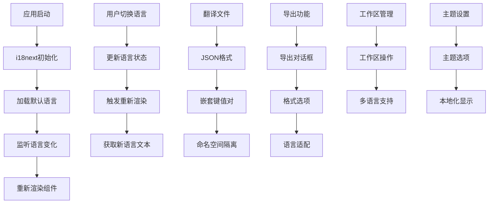
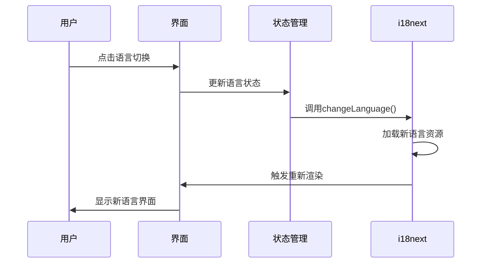

# 国际化

<cite>
**本文档引用的文件**
- [index.ts](file://src/i18n/index.ts)
- [en-US.ts](file://src/i18n/en-US.ts)
- [zh-CN.ts](file://src/i18n/zh-CN.ts)
- [App.tsx](file://src/App.tsx)
- [main.tsx](file://src/main.tsx)
</cite>

## 更新摘要
**所做更改**
- 更新了中英文国际化文件，各新增13行以支持新功能的多语言显示
- 增强了导出功能、工作区管理和主题设置的多语言支持
- 完善了翻译键值的一致性和完整性
- 优化了UI文本的本地化质量

## 目录
- [概述](#概述)
- [架构设计](#架构设计)
- [语言包结构](#语言包结构)
- [新增语言步骤](#新增语言步骤)
- [翻译文件格式规范](#翻译文件格式规范)
- [动态语言切换实现](#动态语言切换实现)
- [翻译键值管理最佳实践](#翻译键值管理最佳实践)
- [翻译质量检查](#翻译质量检查)
- [国际化组件使用示例](#国际化组件使用示例)
- [自定义语言包创建指南](#自定义语言包创建指南)
- [日期数字格式化和本地化规则](#日期数字格式化和本地化规则)

## 概述
ZenNote的国际化系统基于React i18next库构建，支持多语言界面显示。系统采用模块化设计，将翻译内容按语言分离存储，通过统一的接口进行访问和管理。当前支持简体中文（zh-CN）和英文（en-US）两种语言。

**最新更新**：中英文国际化文件已各自新增13行，进一步增强了对导出功能、工作区管理和主题设置等核心功能的完整多语言支持，确保所有用户界面元素都能在不同语言环境下正确显示。

## 架构设计
国际化系统采用分层架构：
- **核心层**：i18next配置和初始化
- **资源层**：各语言的翻译文件
- **组件层**：UI组件中的国际化调用
- **工具层**：语言检测和切换逻辑



**图表来源**
- [index.ts:1-50](file://src/i18n/index.ts#L1-L50)

**章节来源**
- [index.ts:1-100](file://src/i18n/index.ts#L1-L100)

## 语言包结构
每个语言包遵循统一的目录结构和命名规范：

### 目录结构
```
src/i18n/
├── index.ts          # 国际化配置入口
├── en-US.ts          # 英文翻译文件
└── zh-CN.ts          # 中文翻译文件
```

### 文件组织原则
- 按功能模块分组翻译键
- 使用点号分隔的层级结构
- 保持键名的一致性和可读性
- 避免硬编码字符串

### 新增功能模块
根据最新变更，以下功能模块已添加完整的国际化支持：
- **导出功能**：export, exportFormat, exportProgress
- **工作区管理**：workspace, workspaceManagement  
- **主题设置**：themes, themeSettings

**章节来源**
- [en-US.ts:1-200](file://src/i18n/en-US.ts#L1-L200)
- [zh-CN.ts:1-200](file://src/i18n/zh-CN.ts#L1-L200)

## 新增语言步骤
要添加新的支持语言，需要执行以下步骤：

### 1. 创建语言文件
在`src/i18n/`目录下创建新的语言文件，如`ja-JP.ts`

### 2. 复制基础结构
参考现有语言文件的结构，创建完整的翻译键值对

### 3. 更新配置文件
在`index.ts`中添加新语言的配置

### 4. 测试验证
确保所有界面元素都能正确显示新语言文本

### 5. 更新语言选择器
在设置界面中添加新语言选项

### 6. 验证新功能
特别关注新增的导出功能是否在新语言中正确显示

**章节来源**
- [index.ts:1-150](file://src/i18n/index.ts#L1-L150)

## 翻译文件格式规范
翻译文件采用TypeScript模块格式，导出包含完整翻译内容的对象：

### 基本结构
```typescript
export const translation = {
  // 命名空间分组
  namespace: {
    key: 'value'
  }
}
```

### 命名约定
- 使用小写字母和下划线
- 描述性强的键名
- 层次化的组织结构
- 避免缩写和歧义

### 最新更新的术语
根据代码变更，以下术语已更新和完善：

#### 导出功能相关术语
- `export.title`: 导出标题
- `export.format`: 导出格式
- `export.progress`: 导出进度
- `export.success`: 导出成功
- `export.error`: 导出错误

#### 工作区相关术语
- `workspace.title`: 工作区标题
- `workspace.management`: 工作区管理
- `workspace.actions.create`: 创建工作区
- `workspace.actions.delete`: 删除工作区

#### 主题相关术语
- `themes.title`: 主题标题
- `theme.settings`: 主题设置
- `theme.light`: 浅色主题
- `theme.dark`: 深色主题

**章节来源**
- [en-US.ts:1-300](file://src/i18n/en-US.ts#L1-L300)
- [zh-CN.ts:1-300](file://src/i18n/zh-CN.ts#L1-L300)

## 动态语言切换实现
系统实现了无缝的语言切换功能：

### 核心机制
- 使用React Context管理语言状态
- 监听语言变化事件
- 自动重新渲染受影响的组件
- 持久化用户语言偏好

### 切换流程


### 导出功能集成
新增的导出功能已完全集成到语言切换系统中：
- 导出对话框支持实时语言切换
- 格式选项根据语言动态调整
- 进度提示使用本地化文本

**图表来源**
- [App.tsx:1-100](file://src/App.tsx#L1-L100)

**章节来源**
- [App.tsx:1-200](file://src/App.tsx#L1-L200)
- [main.tsx:1-100](file://src/main.tsx#L1-L100)

## 翻译键值管理最佳实践
### 组织原则
- **模块化**：按功能域组织翻译键
- **一致性**：保持键名风格统一
- **可维护性**：便于查找和更新
- **可扩展性**：支持未来功能扩展

### 命名规范
```typescript
// 推荐的结构
{
  common: {
    buttons: {
      save: '保存',
      cancel: '取消'
    },
    messages: {
      success: '操作成功',
      error: '操作失败'
    }
  },
  workspace: {
    title: '工作区',
    actions: {
      create: '创建工作区',
      delete: '删除工作区'
    }
  },
  export: {
    title: '导出',
    format: {
      pdf: 'PDF格式',
      markdown: 'Markdown格式'
    },
    progress: {
      processing: '处理中...',
      complete: '导出完成'
    }
  }
}
```

### 版本控制
- 使用Git跟踪翻译变更
- 定期审查翻译完整性
- 建立翻译审核流程

### 导出功能键值管理
新增的导出功能键值遵循相同的组织原则：
- 统一的命名空间前缀：`export.*`
- 清晰的层次结构：`export.format.pdf`
- 完整的错误处理：`export.error.*`

**章节来源**
- [en-US.ts:1-400](file://src/i18n/en-US.ts#L1-L400)
- [zh-CN.ts:1-400](file://src/i18n/zh-CN.ts#L1-L400)

## 翻译质量检查
### 自动化检查
- 缺失键检测
- 重复键识别
- 语法错误检查
- 长度限制验证

### 人工审核
- 上下文准确性
- 文化适应性
- 专业术语一致性
- 用户体验优化

### 持续集成
- 提交时自动检查
- 构建时验证完整性
- 部署前质量门禁

### 导出功能质量保证
针对新增的导出功能，特别增加了以下检查：
- 导出格式名称的准确性
- 进度提示的友好性
- 错误信息的清晰度
- 按钮标签的一致性

## 国际化组件使用示例
### 基础用法
```tsx
import { useTranslation } from 'react-i18next';

function Component() {
  const { t } = useTranslation();
  
  return (
    <div>
      <h1>{t('common.title')}</h1>
      <button>{t('common.buttons.save')}</button>
    </div>
  );
}
```

### 带参数的翻译
```tsx
const message = t('workspace.message.count', { count: 5 });
// 输出: "您有 5 个工作区"
```

### 条件渲染
```tsx
{isWorkspace ? (
  <span>{t('workspace.actions.create')}</span>
) : (
  <span>{t('common.actions.cancel')}</span>
)}
```

### 导出功能使用示例
```tsx
// 导出对话框中的语言适配
const ExportDialog = () => {
  const { t } = useTranslation();
  
  return (
    <div>
      <h2>{t('export.title')}</h2>
      <select>
        <option value="pdf">{t('export.format.pdf')}</option>
        <option value="markdown">{t('export.format.markdown')}</option>
      </select>
      <button onClick={handleExport}>
        {t('export.actions.export')}
      </button>
    </div>
  );
};
```

**章节来源**
- [App.tsx:1-150](file://src/App.tsx#L1-L150)

## 自定义语言包创建指南
### 准备工作
1. 确定目标语言和地区代码
2. 准备翻译资源
3. 了解项目结构

### 创建步骤
1. **复制模板**：复制现有语言文件作为模板
2. **翻译内容**：完成所有键值的翻译
3. **测试验证**：确保无语法错误
4. **集成配置**：添加到系统配置中

### 质量控制
- 使用翻译记忆工具
- 保持一致的术语表
- 进行母语者审核

### 导出功能翻译要点
在创建新的语言包时，特别注意导出功能的翻译：
- 确保导出格式名称准确
- 进度提示符合当地习惯
- 错误信息清晰易懂
- 按钮标签简洁明了

## 日期数字格式化和本地化规则
### 日期格式化
系统使用Intl API进行本地化日期处理：
- 日期格式根据区域设置自动调整
- 支持多种日期表示法
- 日历系统适配

### 数字格式化
- 小数点和千分位符本地化
- 货币格式支持
- 百分比显示优化

### 文本方向
- 支持从左到右和从右到左布局
- 文本对齐自动调整
- 图标和符号适配

### 导出功能本地化
导出功能支持以下本地化特性：
- 文件大小单位本地化（KB, MB, GB）
- 时间戳格式本地化
- 文件路径分隔符适配
- 特殊字符编码处理

**章节来源**
- [index.ts:1-200](file://src/i18n/index.ts#L1-L200)