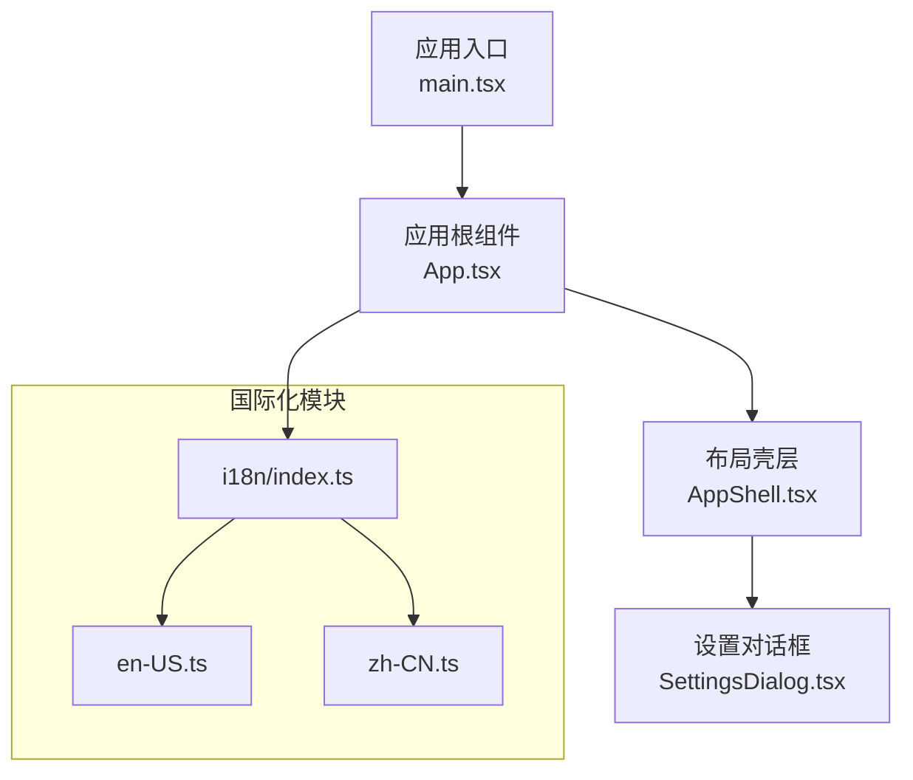
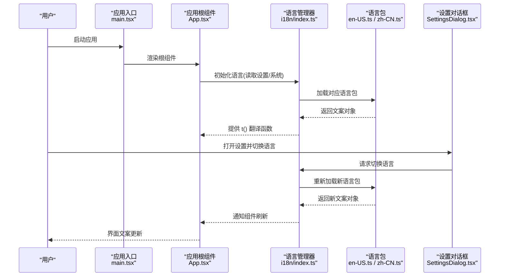
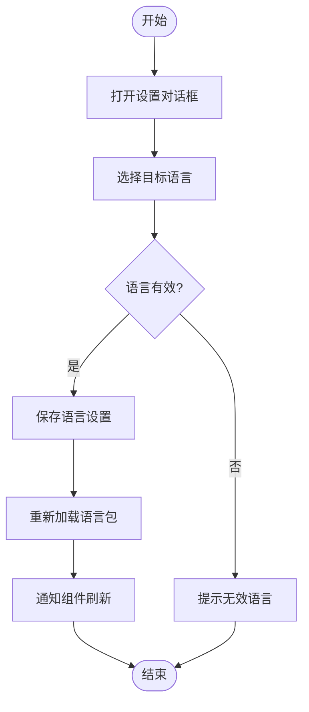
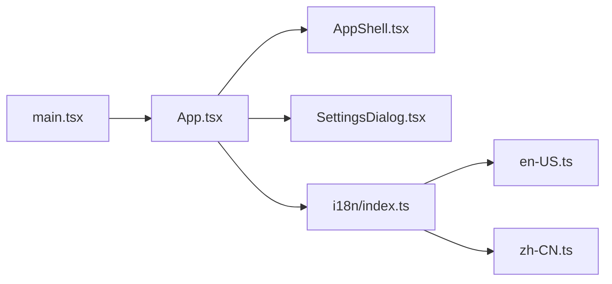

# 国际化

<cite>
**本文引用的文件**   
- [src/i18n/index.ts](file://src/i18n/index.ts)
- [src/i18n/en-US.ts](file://src/i18n/en-US.ts)
- [src/i18n/zh-CN.ts](file://src/i18n/zh-CN.ts)
- [src/main.tsx](file://src/main.tsx)
- [src/App.tsx](file://src/App.tsx)
- [src/components/layout/AppShell.tsx](file://src/components/layout/AppShell.tsx)
- [src/components/dialogs/SettingsDialog.tsx](file://src/components/dialogs/SettingsDialog.tsx)
- [package.json](file://package.json)
</cite>

## 目录
1. [简介](#简介)
2. [项目结构](#项目结构)
3. [核心组件](#核心组件)
4. [架构总览](#架构总览)
5. [详细组件分析](#详细组件分析)
6. [依赖关系分析](#依赖关系分析)
7. [性能考量](#性能考量)
8. [故障排查指南](#故障排查指南)
9. [结论](#结论)
10. [附录](#附录)

## 简介
本文件为 ZenNote 的国际化（i18n）系统提供完整文档，涵盖多语言支持的整体架构、语言包结构与翻译管理机制。文档包含新增语言的步骤、翻译文件格式规范、动态语言切换的实现方式、翻译键值管理最佳实践与质量检查建议，以及国际化组件使用示例和自定义语言包创建指南。同时覆盖日期、数字格式化和本地化规则的处理方法。

## 项目结构
ZenNote 的国际化实现集中在 src/i18n 目录下，采用“按语言分文件”的组织方式：每种语言一个独立模块，统一由入口 index.ts 聚合导出。应用启动时加载当前语言包，并在运行时根据用户设置或系统偏好进行切换。UI 组件通过统一的 i18n API 获取文本，确保界面文案与业务逻辑解耦。

图表来源
- [src/main.tsx](file://src/main.tsx)
- [src/App.tsx](file://src/App.tsx)
- [src/components/layout/AppShell.tsx](file://src/components/layout/AppShell.tsx)
- [src/components/dialogs/SettingsDialog.tsx](file://src/components/dialogs/SettingsDialog.tsx)
- [src/i18n/index.ts](file://src/i18n/index.ts)
- [src/i18n/en-US.ts](file://src/i18n/en-US.ts)
- [src/i18n/zh-CN.ts](file://src/i18n/zh-CN.ts)

章节来源
- [src/i18n/index.ts](file://src/i18n/index.ts)
- [src/i18n/en-US.ts](file://src/i18n/en-US.ts)
- [src/i18n/zh-CN.ts](file://src/i18n/zh-CN.ts)
- [src/main.tsx](file://src/main.tsx)
- [src/App.tsx](file://src/App.tsx)
- [src/components/layout/AppShell.tsx](file://src/components/layout/AppShell.tsx)
- [src/components/dialogs/SettingsDialog.tsx](file://src/components/dialogs/SettingsDialog.tsx)

## 核心组件
- 语言包模块
  - 每个语言文件以键值对形式组织文案，键名需具备语义性与稳定性，便于长期维护与增量更新。
  - 推荐分层命名空间，如页面、模块、通用文案等，避免键冲突。
- 统一入口
  - index.ts 负责聚合各语言包并提供当前语言选择、默认回退、缺失键提示等能力。
- 应用集成
  - main.tsx 与 App.tsx 在初始化阶段读取用户设置或系统语言，并加载对应语言包。
- UI 组件
  - AppShell.tsx 与 SettingsDialog.tsx 展示语言切换入口与当前语言状态，触发语言切换流程。

章节来源
- [src/i18n/index.ts](file://src/i18n/index.ts)
- [src/i18n/en-US.ts](file://src/i18n/en-US.ts)
- [src/i18n/zh-CN.ts](file://src/i18n/zh-CN.ts)
- [src/main.tsx](file://src/main.tsx)
- [src/App.tsx](file://src/App.tsx)
- [src/components/layout/AppShell.tsx](file://src/components/layout/AppShell.tsx)
- [src/components/dialogs/SettingsDialog.tsx](file://src/components/dialogs/SettingsDialog.tsx)

## 架构总览
下图展示了从应用启动到语言切换的关键调用链路与数据流向。

图表来源
- [src/main.tsx](file://src/main.tsx)
- [src/App.tsx](file://src/App.tsx)
- [src/i18n/index.ts](file://src/i18n/index.ts)
- [src/i18n/en-US.ts](file://src/i18n/en-US.ts)
- [src/i18n/zh-CN.ts](file://src/i18n/zh-CN.ts)
- [src/components/dialogs/SettingsDialog.tsx](file://src/components/dialogs/SettingsDialog.tsx)

## 详细组件分析

### 语言包结构与格式规范
- 文件组织
  - 每种语言一个文件，文件名遵循 locale 约定（如 en-US、zh-CN）。
  - 键名建议使用层级式命名，例如 section.key，提高可读性与可维护性。
- 内容范围
  - 所有面向用户的可见文案都应纳入语言包，包括按钮、提示、错误信息、占位符等。
- 缺失处理
  - 当某个键在当前语言中缺失时，应回退到默认语言或显示占位提示，避免空白或崩溃。
- 版本兼容
  - 新增键时保持向后兼容，旧键不可随意删除或重命名；如需变更，提供迁移策略与回退键。

章节来源
- [src/i18n/en-US.ts](file://src/i18n/en-US.ts)
- [src/i18n/zh-CN.ts](file://src/i18n/zh-CN.ts)

### 统一入口与翻译 API
- 聚合导出
  - index.ts 汇总所有语言包，暴露当前语言配置与翻译函数。
- 翻译函数
  - 提供 t(key, params?) 形式的接口，支持基础键值查找与可选参数插值。
- 默认回退
  - 若当前语言缺少某键，自动回退到默认语言（通常为 en-US），保证界面可用性。
- 调试模式
  - 开发环境下可开启缺失键告警，帮助快速定位未翻译项。

章节来源
- [src/i18n/index.ts](file://src/i18n/index.ts)

### 应用初始化与语言加载
- 启动流程
  - main.tsx 启动应用，App.tsx 负责初始化全局状态，包括语言设置。
- 语言检测
  - 优先读取用户持久化设置，其次回退到浏览器/系统语言，最后使用默认语言。
- 资源加载
  - 按需加载对应语言包，避免一次性加载全部语言导致首屏延迟。

章节来源
- [src/main.tsx](file://src/main.tsx)
- [src/App.tsx](file://src/App.tsx)

### 动态语言切换
- 触发点
  - SettingsDialog.tsx 提供语言选择器，用户更改后触发切换流程。
- 切换流程
  - 更新本地存储中的语言设置，重新加载语言包，通知相关组件刷新。
- 无刷新体验
  - 通过响应式状态或上下文机制，使界面即时反映新语言，无需重启应用。

图表来源
- [src/components/dialogs/SettingsDialog.tsx](file://src/components/dialogs/SettingsDialog.tsx)
- [src/i18n/index.ts](file://src/i18n/index.ts)

章节来源
- [src/components/dialogs/SettingsDialog.tsx](file://src/components/dialogs/SettingsDialog.tsx)
- [src/i18n/index.ts](file://src/i18n/index.ts)

### 国际化组件使用示例
- 在组件中使用翻译函数
  - 通过导入统一入口提供的 t() 函数，在模板或渲染逻辑中调用，传入键名与必要参数。
- 列表与条件文案
  - 对于复数、条件分支等场景，可在语言包中定义子键或使用插值参数组合。
- 表单与验证
  - 将错误消息、占位符、标签等文案全部放入语言包，确保一致性。

章节来源
- [src/components/layout/AppShell.tsx](file://src/components/layout/AppShell.tsx)
- [src/i18n/index.ts](file://src/i18n/index.ts)

### 自定义语言包创建指南
- 新建语言文件
  - 在 src/i18n 下新增语言文件，命名遵循 locale 约定。
- 复制基准
  - 基于现有语言包（如 en-US）复制键结构，逐条翻译为新语言。
- 注册与测试
  - 在 index.ts 中注册新语言，并在设置对话框中添加选项，验证切换效果。
- 持续维护
  - 新增功能时同步补充新键，定期清理无用键，保持语言包整洁。

章节来源
- [src/i18n/index.ts](file://src/i18n/index.ts)
- [src/i18n/en-US.ts](file://src/i18n/en-US.ts)
- [src/components/dialogs/SettingsDialog.tsx](file://src/components/dialogs/SettingsDialog.tsx)

### 日期、数字格式化与本地化规则
- 日期时间
  - 使用本地化 API 或库进行日期格式化，遵循区域设置的顺序、分隔符与星期表示。
- 数字与货币
  - 根据区域设置处理小数点、千分位、货币符号与单位。
- 排序与比较
  - 字符串排序与比较需考虑大小写、重音字符与区域差异。
- 时区与夏令时
  - 涉及跨时区展示时，正确处理偏移量与夏令时切换。

[本节为通用指导，不直接分析具体文件]

## 依赖关系分析
- 模块耦合
  - 语言包模块与入口 index.ts 低耦合，便于扩展新语言。
  - UI 组件仅依赖翻译 API，不感知语言包内部实现细节。
- 外部依赖
  - 若使用第三方库进行日期/数字格式化，需在 package.json 中声明版本约束。
- 循环依赖
  - 避免语言包与 UI 组件之间相互引用，保持单向依赖。

图表来源
- [src/main.tsx](file://src/main.tsx)
- [src/App.tsx](file://src/App.tsx)
- [src/components/layout/AppShell.tsx](file://src/components/layout/AppShell.tsx)
- [src/components/dialogs/SettingsDialog.tsx](file://src/components/dialogs/SettingsDialog.tsx)
- [src/i18n/index.ts](file://src/i18n/index.ts)
- [src/i18n/en-US.ts](file://src/i18n/en-US.ts)
- [src/i18n/zh-CN.ts](file://src/i18n/zh-CN.ts)

章节来源
- [package.json](file://package.json)

## 性能考量
- 按需加载
  - 仅在需要时加载目标语言包，减少初始包体积与首屏时间。
- 缓存策略
  - 对已加载的语言包进行内存缓存，避免重复解析与网络请求。
- 懒渲染
  - 非关键路径的文案渲染可延迟至用户交互后再执行。
- 监控与度量
  - 记录语言切换耗时与失败率，优化瓶颈环节。

[本节为通用指导，不直接分析具体文件]

## 故障排查指南
- 常见问题
  - 键缺失：检查语言包是否包含该键，确认回退逻辑是否生效。
  - 切换无效：确认设置持久化是否正确，组件是否订阅了语言变化事件。
  - 格式化异常：检查区域设置与本地化库版本兼容性。
- 调试手段
  - 开启开发模式的缺失键告警，定位未翻译项。
  - 在控制台输出当前语言与已加载键集合，辅助比对。
- 回归测试
  - 针对关键页面与表单进行端到端测试，确保切换后文案正确。

章节来源
- [src/i18n/index.ts](file://src/i18n/index.ts)
- [src/components/dialogs/SettingsDialog.tsx](file://src/components/dialogs/SettingsDialog.tsx)

## 结论
ZenNote 的国际化系统以模块化语言包为核心，结合统一的翻译 API 与应用级初始化流程，实现了稳定、可扩展的多语言支持。通过规范的键值管理与质量检查机制，配合日期与数字的本地化处理，能够为用户提供一致且高质量的本地化体验。建议在后续迭代中持续完善语言包覆盖率与自动化校验流程，进一步提升维护效率与用户体验。

[本节为总结性内容，不直接分析具体文件]

## 附录
- 新增语言步骤清单
  - 新建语言文件，复制基准键结构。
  - 在 index.ts 中注册新语言。
  - 在设置对话框中添加语言选项。
  - 验证切换效果与回退逻辑。
- 翻译质量检查建议
  - 自动化扫描缺失键与空值。
  - 人工校对关键文案与术语一致性。
  - 建立翻译评审流程与版本基线。
- 本地化规则参考
  - 日期时间、数字货币、排序比较与时区处理的区域差异说明。

[本节为补充信息，不直接分析具体文件]