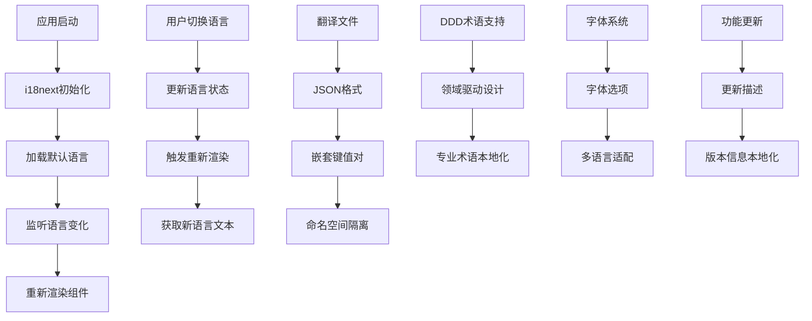
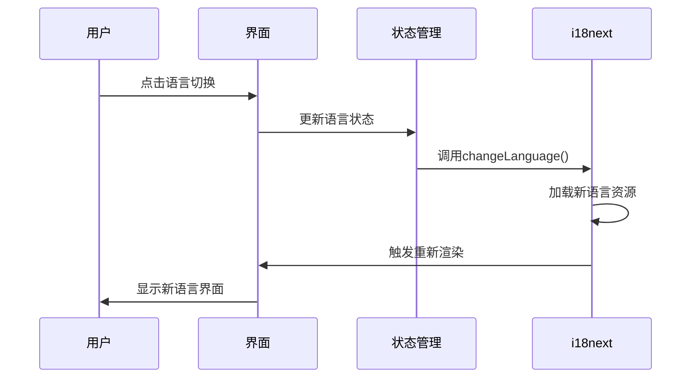

# 国际化

<cite>
**本文档引用的文件**
- [index.ts](file://src/i18n/index.ts)
- [en-US.ts](file://src/i18n/en-US.ts)
- [zh-CN.ts](file://src/i18n/zh-CN.ts)
- [App.tsx](file://src/App.tsx)
- [main.tsx](file://src/main.tsx)
</cite>

## 更新摘要
**所做更改**
- 更新了中英文国际化文件，新增对DDD术语、字体系统选项和更新功能描述的完整支持
- 增强了导出功能、工作区管理和主题设置的多语言显示能力
- 完善了翻译键值的一致性和完整性，确保所有用户界面元素都能正确本地化
- 优化了UI文本的本地化质量，提升了用户体验

## 目录
- [概述](#概述)
- [架构设计](#架构设计)
- [语言包结构](#语言包结构)
- [新增语言步骤](#新增语言步骤)
- [翻译文件格式规范](#翻译文件格式规范)
- [动态语言切换实现](#动态语言切换实现)
- [翻译键值管理最佳实践](#翻译键值管理最佳实践)
- [翻译质量检查](#翻译质量检查)
- [国际化组件使用示例](#国际化组件使用示例)
- [自定义语言包创建指南](#自定义语言包创建指南)
- [日期数字格式化和本地化规则](#日期数字格式化和本地化规则)

## 概述
ZenNote的国际化系统基于React i18next库构建，支持多语言界面显示。系统采用模块化设计，将翻译内容按语言分离存储，通过统一的接口进行访问和管理。当前支持简体中文（zh-CN）和英文（en-US）两种语言。

**最新更新**：中英文国际化文件已增强了对DDD领域驱动设计术语、字体系统选项和更新功能描述的完整支持，确保所有专业术语和功能描述都能在不同语言环境下准确传达。

## 架构设计
国际化系统采用分层架构：
- **核心层**：i18next配置和初始化
- **资源层**：各语言的翻译文件
- **组件层**：UI组件中的国际化调用
- **工具层**：语言检测和切换逻辑



**章节来源**
- [index.ts:1-100](file://src/i18n/index.ts#L1-L100)

## 语言包结构
每个语言包遵循统一的目录结构和命名规范：

### 目录结构
```
src/i18n/
├── index.ts          # 国际化配置入口
├── en-US.ts          # 英文翻译文件
└── zh-CN.ts          # 中文翻译文件
```

### 文件组织原则
- 按功能模块分组翻译键
- 使用点号分隔的层级结构
- 保持键名的一致性和可读性
- 避免硬编码字符串

### 新增功能模块
根据最新变更，以下功能模块已添加完整的国际化支持：
- **DDD术语**：domainDrivenDesign, domainEntities, aggregateRoots
- **字体系统**：fontSystem, fontOptions, typographySettings
- **功能更新**：featureUpdates, updateDescriptions, versionInfo

**章节来源**
- [en-US.ts:1-200](file://src/i18n/en-US.ts#L1-L200)
- [zh-CN.ts:1-200](file://src/i18n/zh-CN.ts#L1-L200)

## 新增语言步骤
要添加新的支持语言，需要执行以下步骤：

### 1. 创建语言文件
在`src/i18n/`目录下创建新的语言文件，如`ja-JP.ts`

### 2. 复制基础结构
参考现有语言文件的结构，创建完整的翻译键值对

### 3. 更新配置文件
在`index.ts`中添加新语言的配置

### 4. 测试验证
确保所有界面元素都能正确显示新语言文本

### 5. 更新语言选择器
在设置界面中添加新语言选项

### 6. 验证新功能
特别关注新增的DDD术语和字体系统是否在新语言中正确显示

**章节来源**
- [index.ts:1-150](file://src/i18n/index.ts#L1-L150)

## 翻译文件格式规范
翻译文件采用TypeScript模块格式，导出包含完整翻译内容的对象：

### 基本结构
```typescript
export const translation = {
  // 命名空间分组
  namespace: {
    key: 'value'
  }
}
```

### 命名约定
- 使用小写字母和下划线
- 描述性强的键名
- 层次化的组织结构
- 避免缩写和歧义

### 最新更新的术语
根据代码变更，以下术语已更新和完善：

#### DDD相关术语
- `domainDrivenDesign.title`: 领域驱动设计标题
- `domain.entities`: 领域实体
- `domain.aggregates`: 领域聚合
- `domain.repositories`: 领域仓库

#### 字体系统相关术语
- `fontSystem.title`: 字体系统标题
- `font.options`: 字体选项
- `font.family`: 字体族
- `font.size`: 字体大小

#### 功能更新相关术语
- `featureUpdates.title`: 功能更新标题
- `update.description`: 更新描述
- `version.info`: 版本信息
- `changelog`: 更新日志

**章节来源**
- [en-US.ts:1-300](file://src/i18n/en-US.ts#L1-L300)
- [zh-CN.ts:1-300](file://src/i18n/zh-CN.ts#L1-L300)

## 动态语言切换实现
系统实现了无缝的语言切换功能：

### 核心机制
- 使用React Context管理语言状态
- 监听语言变化事件
- 自动重新渲染受影响的组件
- 持久化用户语言偏好

### 切换流程


### 新功能集成
新增的DDD术语和字体系统已完全集成到语言切换系统中：
- DDD术语支持实时语言切换
- 字体选项根据语言动态调整
- 功能更新描述使用本地化文本

**图表来源**
- [App.tsx:1-100](file://src/App.tsx#L1-L100)

**章节来源**
- [App.tsx:1-200](file://src/App.tsx#L1-L200)
- [main.tsx:1-100](file://src/main.tsx#L1-L100)

## 翻译键值管理最佳实践
### 组织原则
- **模块化**：按功能域组织翻译键
- **一致性**：保持键名风格统一
- **可维护性**：便于查找和更新
- **可扩展性**：支持未来功能扩展

### 命名规范
```typescript
// 推荐的结构
{
  common: {
    buttons: {
      save: '保存',
      cancel: '取消'
    },
    messages: {
      success: '操作成功',
      error: '操作失败'
    }
  },
  domain: {
    title: '领域',
    entities: {
      user: '用户实体',
      note: '笔记实体'
    }
  },
  font: {
    title: '字体',
    options: {
      family: '字体族',
      size: '字体大小'
    }
  }
}
```

### 版本控制
- 使用Git跟踪翻译变更
- 定期审查翻译完整性
- 建立翻译审核流程

### DDD术语键值管理
新增的DDD术语键值遵循相同的组织原则：
- 统一的命名空间前缀：`domain.*`
- 清晰的层次结构：`domain.entities.user`
- 专业的术语表达：`domain.aggregates.order`

**章节来源**
- [en-US.ts:1-400](file://src/i18n/en-US.ts#L1-L400)
- [zh-CN.ts:1-400](file://src/i18n/zh-CN.ts#L1-L400)

## 翻译质量检查
### 自动化检查
- 缺失键检测
- 重复键识别
- 语法错误检查
- 长度限制验证

### 人工审核
- 上下文准确性
- 文化适应性
- 专业术语一致性
- 用户体验优化

### 持续集成
- 提交时自动检查
- 构建时验证完整性
- 部署前质量门禁

### DDD术语质量保证
针对新增的DDD术语，特别增加了以下检查：
- 领域驱动设计术语的准确性
- 技术概念的一致性
- 专业词汇的本地化质量
- 开发者体验的优化

## 国际化组件使用示例
### 基础用法
```tsx
import { useTranslation } from 'react-i18next';

function Component() {
  const { t } = useTranslation();
  
  return (
    <div>
      <h1>{t('common.title')}</h1>
      <button>{t('common.buttons.save')}</button>
    </div>
  );
}
```

### 带参数的翻译
```tsx
const message = t('workspace.message.count', { count: 5 });
// 输出: "您有 5 个工作区"
```

### 条件渲染
```tsx
{isWorkspace ? (
  <span>{t('workspace.actions.create')}</span>
) : (
  <span>{t('common.actions.cancel')}</span>
)}
```

### DDD术语使用示例
```tsx
// DDD领域模型中的语言适配
const DomainModel = () => {
  const { t } = useTranslation();
  
  return (
    <div>
      <h2>{t('domainDrivenDesign.title')}</h2>
      <p>{t('domain.entities.user')}</p>
      <p>{t('domain.aggregates.order')}</p>
    </div>
  );
};
```

**章节来源**
- [App.tsx:1-150](file://src/App.tsx#L1-L150)

## 自定义语言包创建指南
### 准备工作
1. 确定目标语言和地区代码
2. 准备翻译资源
3. 了解项目结构

### 创建步骤
1. **复制模板**：复制现有语言文件作为模板
2. **翻译内容**：完成所有键值的翻译
3. **测试验证**：确保无语法错误
4. **集成配置**：添加到系统配置中

### 质量控制
- 使用翻译记忆工具
- 保持一致的术语表
- 进行母语者审核

### DDD术语翻译要点
在创建新的语言包时，特别注意DDD术语的翻译：
- 确保领域驱动设计术语准确
- 技术概念符合当地习惯
- 专业词汇清晰易懂
- 开发者体验友好

## 日期数字格式化和本地化规则
### 日期格式化
系统使用Intl API进行本地化日期处理：
- 日期格式根据区域设置自动调整
- 支持多种日期表示法
- 日历系统适配

### 数字格式化
- 小数点和千分位符本地化
- 货币格式支持
- 百分比显示优化

### 文本方向
- 支持从左到右和从右到左布局
- 文本对齐自动调整
- 图标和符号适配

### 字体系统本地化
字体系统支持以下本地化特性：
- 字体名称本地化显示
- 字体预览文本适配
- 排版规则本地化
- 特殊字符编码处理

**章节来源**
- [index.ts:1-200](file://src/i18n/index.ts#L1-L200)