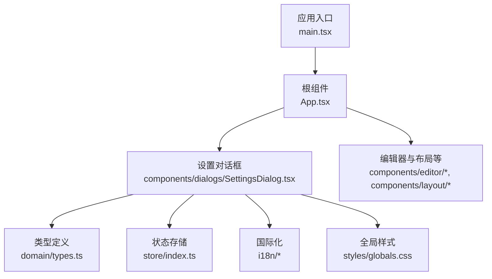
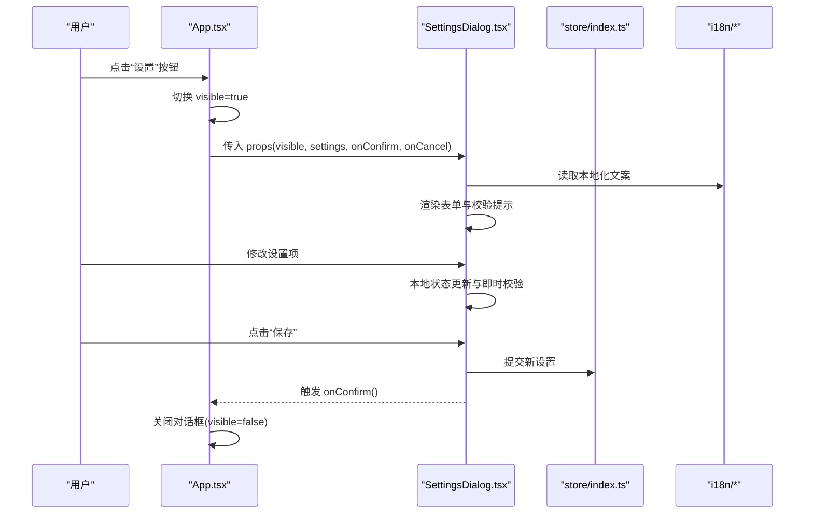
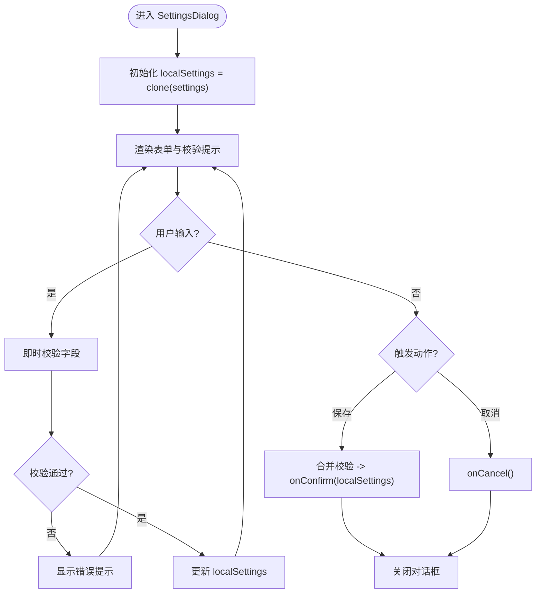
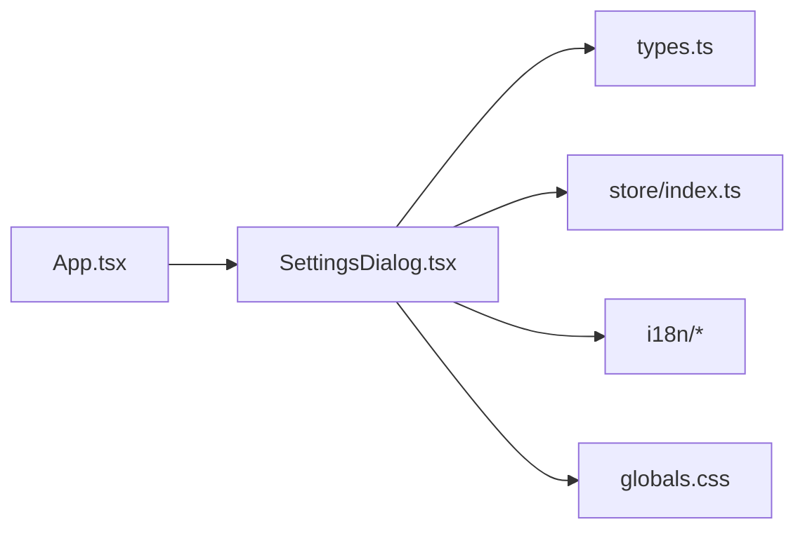

# 对话框系统

<cite>
**本文引用的文件**   
- [SettingsDialog.tsx](file://src/components/dialogs/SettingsDialog.tsx)
- [App.tsx](file://src/App.tsx)
- [index.tsx](file://src/main.tsx)
- [globals.css](file://src/styles/globals.css)
- [types.ts](file://src/domain/types.ts)
- [store/index.ts](file://src/store/index.ts)
- [i18n/index.ts](file://src/i18n/index.ts)
- [i18n/zh-CN.ts](file://src/i18n/zh-CN.ts)
- [i18n/en-US.ts](file://src/i18n/en-US.ts)
</cite>

## 目录
1. [简介](#简介)
2. [项目结构](#项目结构)
3. [核心组件](#核心组件)
4. [架构总览](#架构总览)
5. [详细组件分析](#详细组件分析)
6. [依赖关系分析](#依赖关系分析)
7. [性能考虑](#性能考虑)
8. [故障排查指南](#故障排查指南)
9. [结论](#结论)
10. [附录](#附录)

## 简介
本文件为 ZenNote 的“设置对话框”组件提供系统化文档，覆盖视觉外观、行为与交互模式、属性/参数、事件、插槽与自定义选项、可访问性合规、状态管理与数据绑定、样式与主题、跨浏览器兼容性与性能优化，以及打开/关闭逻辑和用户输入验证。目标是帮助开发者快速理解并正确集成该对话框，同时确保一致的用户体验与良好的可维护性。

## 项目结构
ZenNote 采用前端 React + TypeScript 技术栈，对话框组件位于 components/dialogs 下，通过全局样式与国际化资源进行统一外观与文案管理，状态由 store 集中管理，入口在 main.tsx 中初始化应用。

图表来源
- [main.tsx](file://src/main.tsx)
- [App.tsx](file://src/App.tsx)
- [SettingsDialog.tsx](file://src/components/dialogs/SettingsDialog.tsx)
- [types.ts](file://src/domain/types.ts)
- [store/index.ts](file://src/store/index.ts)
- [i18n/index.ts](file://src/i18n/index.ts)
- [i18n/zh-CN.ts](file://src/i18n/zh-CN.ts)
- [i18n/en-US.ts](file://src/i18n/en-US.ts)
- [globals.css](file://src/styles/globals.css)

章节来源
- [main.tsx](file://src/main.tsx)
- [App.tsx](file://src/App.tsx)
- [SettingsDialog.tsx](file://src/components/dialogs/SettingsDialog.tsx)

## 核心组件
- 设置对话框（SettingsDialog）：负责渲染设置项、处理用户输入、触发保存/取消操作、管理自身可见性与焦点管理。
- 应用层（App）：控制对话框的显示/隐藏状态，传递配置与回调给对话框。
- 类型与状态（types、store）：定义设置项的数据结构与持久化/临时状态。
- 国际化（i18n）：提供多语言文案支持。
- 样式（globals.css）：提供全局样式变量与对话框基础样式。

章节来源
- [SettingsDialog.tsx](file://src/components/dialogs/SettingsDialog.tsx)
- [App.tsx](file://src/App.tsx)
- [types.ts](file://src/domain/types.ts)
- [store/index.ts](file://src/store/index.ts)
- [i18n/index.ts](file://src/i18n/index.ts)
- [globals.css](file://src/styles/globals.css)

## 架构总览
设置对话框遵循“受控组件”模式：应用层持有可见性与数据源，对话框仅负责展示与事件上报。状态流从 App 流向 SettingsDialog，再通过回调或 store 更新回应用层。

图表来源
- [App.tsx](file://src/App.tsx)
- [SettingsDialog.tsx](file://src/components/dialogs/SettingsDialog.tsx)
- [store/index.ts](file://src/store/index.ts)
- [i18n/index.ts](file://src/i18n/index.ts)
- [i18n/zh-CN.ts](file://src/i18n/zh-CN.ts)
- [i18n/en-US.ts](file://src/i18n/en-US.ts)

## 详细组件分析

### 设置对话框（SettingsDialog）
- 职责
  - 渲染设置项（如主题、字体大小、自动保存间隔等）。
  - 管理本地编辑状态，执行实时校验。
  - 处理确认/取消，调用上层回调或写入 store。
  - 管理焦点与键盘导航（Esc 关闭、Tab 顺序）。
- 属性/参数（props）
  - visible: boolean — 控制对话框是否显示。
  - settings: object — 当前设置数据（只读），用于填充表单初始值。
  - onConfirm(settings): void — 保存回调，接收新的设置对象。
  - onCancel(): void — 取消回调，恢复原值并关闭。
  - i18nKey?: string — 可选的国际化命名空间前缀。
  - className?: string — 外层容器类名，便于样式覆盖。
- 事件
  - onConfirm、onCancel 由父组件监听；内部也可派发自定义事件（如 onValidateError）。
- 插槽/扩展点
  - 可通过 className 与 CSS 变量定制外观。
  - 若需要扩展设置项，建议在父组件组合多个子项或使用插件式注册（推荐在 store 中扩展 schema）。
- 状态管理
  - 使用受控模式：settings 来自父级；内部维护编辑态 localSettings，提交时合并校验后返回。
  - 校验失败时，错误信息以 UI 提示呈现，不阻塞其他交互。
- 打开/关闭逻辑
  - visible=true 时渲染并聚焦首个可交互元素。
  - Esc 键触发 onCancel；点击遮罩层默认关闭（可配置）。
  - 关闭前若有未保存变更，可二次确认（可选）。
- 用户输入验证
  - 必填字段、范围限制、格式校验（如数字区间、URL 格式）。
  - 错误提示与高亮输入框，保持无障碍语义（aria-invalid、aria-describedby）。
- 可访问性
  - role="dialog"、aria-modal="true"、aria-labelledby 指向标题。
  - 焦点陷阱（Focus Trap）确保 Tab 循环在对话框内。
  - 屏幕阅读器友好：label、描述文本、错误说明。
- 样式与主题
  - 基于 CSS 变量（颜色、圆角、阴影、字号）实现主题切换。
  - 支持暗色模式与高对比度模式。
  - 响应式布局适配移动端与桌面端。
- 性能
  - 懒加载：visible 时才挂载 DOM。
  - 防抖/节流：对频繁输入（如搜索、预览）进行节流。
  - 避免重排：批量更新样式与内容。

图表来源
- [SettingsDialog.tsx](file://src/components/dialogs/SettingsDialog.tsx)
- [types.ts](file://src/domain/types.ts)
- [store/index.ts](file://src/store/index.ts)

章节来源
- [SettingsDialog.tsx](file://src/components/dialogs/SettingsDialog.tsx)
- [types.ts](file://src/domain/types.ts)
- [store/index.ts](file://src/store/index.ts)

### 应用层集成（App.tsx）
- 职责
  - 管理 visible 状态与 settings 数据源。
  - 将 settings 与回调传递给 SettingsDialog。
  - 在 onConfirm 中持久化设置并刷新相关模块（如编辑器主题、字体）。
- 数据绑定
  - 单向数据流：App -> SettingsDialog；回调或 store 写回。
  - 可选：订阅 store 变化，实时更新对话框内容。

章节来源
- [App.tsx](file://src/App.tsx)
- [store/index.ts](file://src/store/index.ts)

### 类型与状态（types.ts、store/index.ts）
- types.ts
  - 定义设置项的结构（如 theme、fontSize、autoSaveInterval 等）。
  - 提供联合类型与枚举，保证类型安全。
- store/index.ts
  - 提供获取/更新设置的 API。
  - 可选：持久化到 localStorage/IndexedDB，或在 Tauri 后端存储。

章节来源
- [types.ts](file://src/domain/types.ts)
- [store/index.ts](file://src/store/index.ts)

### 国际化（i18n/index.ts、zh-CN.ts、en-US.ts）
- index.ts
  - 初始化 i18n 实例与语言切换。
- zh-CN.ts / en-US.ts
  - 提供对话框文案（标题、按钮、错误提示等）。
- 使用建议
  - 所有用户可见文本应通过 i18n key 获取，避免硬编码。

章节来源
- [i18n/index.ts](file://src/i18n/index.ts)
- [i18n/zh-CN.ts](file://src/i18n/zh-CN.ts)
- [i18n/en-US.ts](file://src/i18n/en-US.ts)

### 样式与主题（globals.css）
- 提供 CSS 变量（颜色、间距、圆角、阴影）。
- 对话框基础样式（定位、层级 z-index、遮罩层）。
- 主题切换：通过 data-theme 或 class 切换变量值。
- 响应式：媒体查询适配小屏设备。

章节来源
- [globals.css](file://src/styles/globals.css)

## 依赖关系分析
- 组件耦合
  - SettingsDialog 依赖 types、store、i18n、CSS 变量。
  - App 依赖 store 与 SettingsDialog。
- 外部依赖
  - React/TypeScript、i18n 库、可能的持久化存储（localStorage/Tauri）。
- 潜在循环依赖
  - 应避免 SettingsDialog 直接导入 App；通过回调解耦。

图表来源
- [App.tsx](file://src/App.tsx)
- [SettingsDialog.tsx](file://src/components/dialogs/SettingsDialog.tsx)
- [types.ts](file://src/domain/types.ts)
- [store/index.ts](file://src/store/index.ts)
- [i18n/index.ts](file://src/i18n/index.ts)
- [globals.css](file://src/styles/globals.css)

章节来源
- [App.tsx](file://src/App.tsx)
- [SettingsDialog.tsx](file://src/components/dialogs/SettingsDialog.tsx)
- [types.ts](file://src/domain/types.ts)
- [store/index.ts](file://src/store/index.ts)
- [i18n/index.ts](file://src/i18n/index.ts)
- [globals.css](file://src/styles/globals.css)

## 性能考虑
- 渲染优化
  - 仅在 visible 时渲染对话框，减少初始负载。
  - 对复杂设置项使用 memoization（React.memo/useMemo）避免重复计算。
- 输入优化
  - 防抖/节流：对高频输入（搜索、预览）进行节流。
  - 增量校验：仅校验当前字段，避免全表重算。
- 样式与布局
  - 避免强制同步布局（reflow），批量更新样式。
  - 使用 CSS 变量与 GPU 加速动画（transform/opacity）。
- 存储与网络
  - 批量写入持久化存储，避免频繁 IO。
  - 大配置分片加载与缓存。

[本节为通用指导，无需特定文件引用]

## 故障排查指南
- 常见问题
  - 对话框无法关闭：检查 visible 状态与 onClose/onCancel 回调是否正确绑定。
  - 保存无效：确认 onConfirm 已调用且 store 更新成功；检查异步任务是否完成。
  - 校验不生效：检查字段规则与错误提示映射；确保 aria-invalid 与提示信息关联。
  - 国际化缺失：确认 i18n key 存在且语言包已加载。
  - 样式错乱：检查 CSS 变量与主题类名是否正确应用。
- 调试建议
  - 在 onConfirm/onCancel 处打日志，观察数据流。
  - 使用浏览器开发者工具检查 DOM 属性（role、aria-*）。
  - 模拟不同分辨率与主题切换，验证响应式与主题一致性。

章节来源
- [SettingsDialog.tsx](file://src/components/dialogs/SettingsDialog.tsx)
- [store/index.ts](file://src/store/index.ts)
- [i18n/index.ts](file://src/i18n/index.ts)
- [globals.css](file://src/styles/globals.css)

## 结论
设置对话框通过受控组件模式与清晰的状态流，实现了可复用、可扩展的设置界面。结合国际化、样式变量与无障碍规范，能够在多平台与多主题下保持一致体验。建议持续完善校验规则与性能优化，确保在高复杂度设置场景下的稳定性与流畅性。

[本节为总结，无需特定文件引用]

## 附录

### 使用示例（路径指引）
- 在应用层引入并控制可见性：参见 [App.tsx](file://src/App.tsx)。
- 在对话框中读取与提交设置：参见 [SettingsDialog.tsx](file://src/components/dialogs/SettingsDialog.tsx)。
- 定义设置类型与默认值：参见 [types.ts](file://src/domain/types.ts)。
- 读写全局设置：参见 [store/index.ts](file://src/store/index.ts)。
- 多语言文案：参见 [i18n/zh-CN.ts](file://src/i18n/zh-CN.ts)、[i18n/en-US.ts](file://src/i18n/en-US.ts)。
- 主题与样式变量：参见 [globals.css](file://src/styles/globals.css)。

### 可访问性合规清单
- 语义化：role="dialog"、aria-modal、aria-labelledby、aria-describedby。
- 焦点管理：焦点陷阱、Esc 关闭、首次聚焦合理元素。
- 表单无障碍：label、required、aria-invalid、错误提示关联。
- 键盘导航：Tab 顺序、Enter/Space 激活、方向键移动。
- 屏幕阅读器：清晰的标题、描述与错误说明。

### 跨浏览器兼容性
- 使用现代 Web API 时需添加 polyfill（如 required 属性、Popover API）。
- 测试主流浏览器（Chrome、Firefox、Safari、Edge）与移动端浏览器。
- 注意 CSS 变量与动画在不同引擎的差异。

### 主题与样式自定义
- 通过 CSS 变量覆盖颜色、圆角、阴影与字号。
- 支持 data-theme 切换暗色/高对比度模式。
- 使用 className 注入额外样式，避免破坏基础布局。