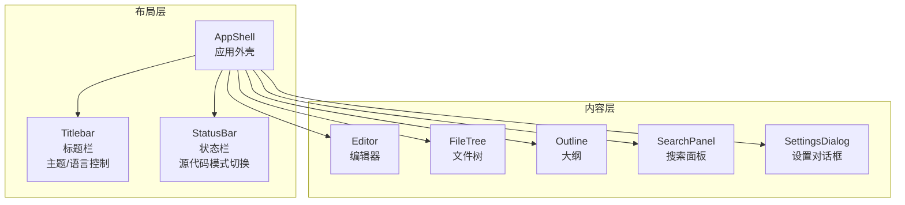
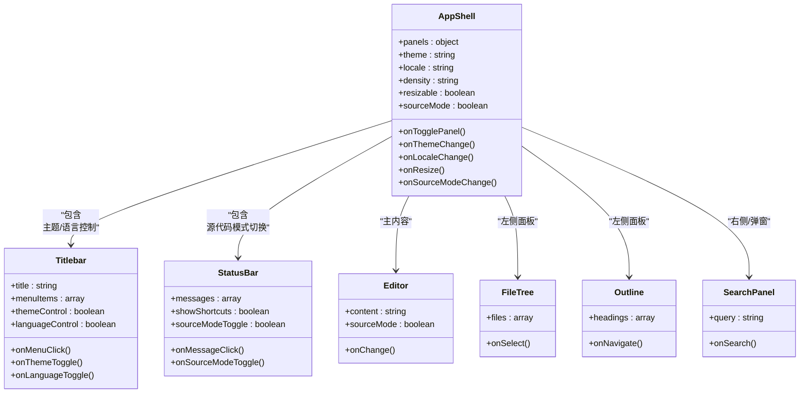
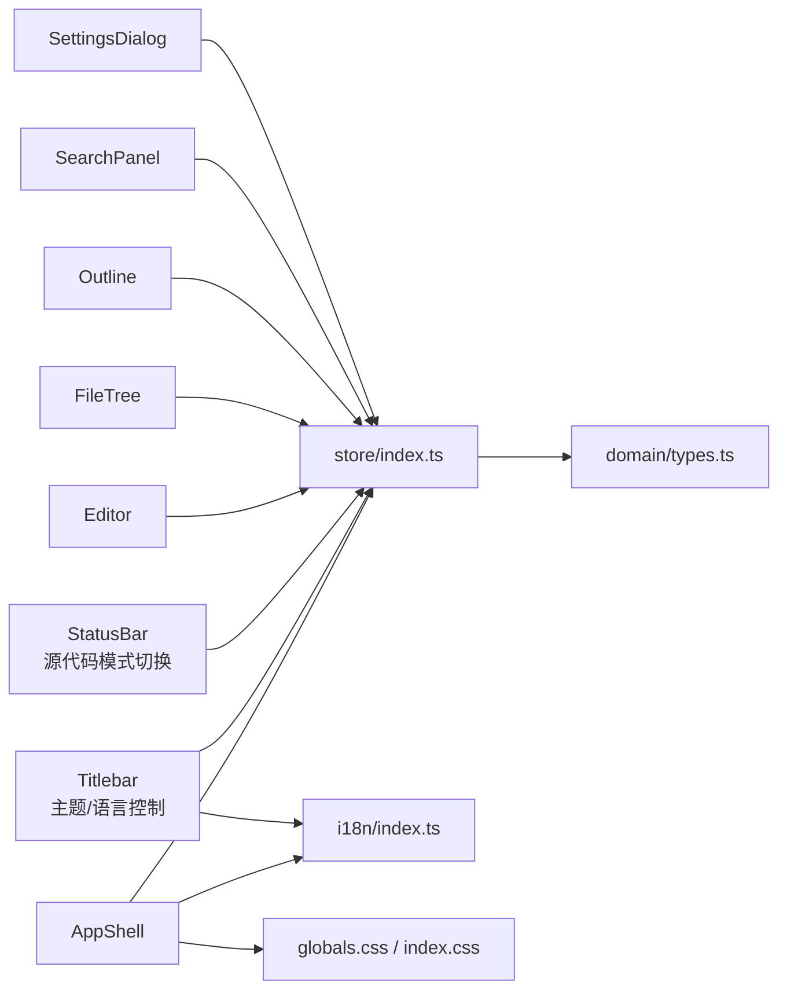

# 布局系统

<cite>
**本文引用的文件**   
- [AppShell.tsx](file://src/components/layout/AppShell.tsx)
- [StatusBar.tsx](file://src/components/layout/StatusBar.tsx)
- [Titlebar.tsx](file://src/components/layout/Titlebar.tsx)
- [Editor.tsx](file://src/components/editor/Editor.tsx)
- [FileTree.tsx](file://src/components/filetree/FileTree.tsx)
- [Outline.tsx](file://src/components/outline/Outline.tsx)
- [SearchPanel.tsx](file://src/components/search/SearchPanel.tsx)
- [SettingsDialog.tsx](file://src/components/dialogs/SettingsDialog.tsx)
- [types.ts](file://src/domain/types.ts)
- [store/index.ts](file://src/store/index.ts)
- [globals.css](file://src/styles/globals.css)
- [index.css](file://src/index.css)
- [App.tsx](file://src/App.tsx)
- [main.tsx](file://src/main.tsx)
- [i18n/index.ts](file://src/i18n/index.ts)
- [i18n/zh-CN.ts](file://src/i18n/zh-CN.ts)
- [i18n/en-US.ts](file://src/i18n/en-US.ts)
- [useMermaid.ts](file://src/hooks/useMermaid.ts)
- [package.json](file://package.json)
- [vite.config.ts](file://vite.config.ts)
</cite>

## 更新摘要
**所做更改**   
- 更新了标题栏组件，新增主题和国际化控制功能
- 更新了状态栏组件，新增源代码模式切换功能
- 重新组织了UI布局结构，将主题和语言切换控件从设置对话框移至标题栏
- 将源代码模式切换功能从设置对话框移至状态栏
- 优化了用户交互流程，提升了操作便捷性

## 目录
1. [简介](#简介)
2. [项目结构](#项目结构)
3. [核心组件](#核心组件)
4. [架构总览](#架构总览)
5. [详细组件分析](#详细组件分析)
6. [依赖关系分析](#依赖关系分析)
7. [性能考虑](#性能考虑)
8. [故障排查指南](#故障排查指南)
9. [结论](#结论)
10. [附录](#附录)

## 简介
本文件面向ZenNote的布局系统，聚焦应用程序外壳组件的视觉外观、行为与用户交互模式。文档涵盖属性/参数、事件、插槽与自定义选项；提供使用示例与演示指引；给出响应式设计与可访问性合规指导；记录组件状态、动画与过渡效果；说明样式自定义与主题支持；并覆盖跨浏览器兼容性与性能优化建议。同时总结组件组合模式以及与编辑器、文件树、大纲、搜索面板等UI元素的集成方式。

**更新** 本次更新重点反映了UI布局重构变更：主题和国际化控制已移至标题栏，源代码模式切换功能已移至状态栏，提供了更直观的用户操作体验。

## 项目结构
布局系统位于 src/components/layout 下，由三个主要外壳组件构成：应用外壳 AppShell、标题栏 Titlebar、状态栏 StatusBar。它们共同组织编辑区、侧边栏（文件树、大纲）、搜索面板与设置对话框，形成典型的三栏或双栏布局。



图表来源
- [AppShell.tsx](file://src/components/layout/AppShell.tsx)
- [Titlebar.tsx](file://src/components/layout/Titlebar.tsx)
- [StatusBar.tsx](file://src/components/layout/StatusBar.tsx)
- [Editor.tsx](file://src/components/editor/Editor.tsx)
- [FileTree.tsx](file://src/components/filetree/FileTree.tsx)
- [Outline.tsx](file://src/components/outline/Outline.tsx)
- [SearchPanel.tsx](file://src/components/search/SearchPanel.tsx)
- [SettingsDialog.tsx](file://src/components/dialogs/SettingsDialog.tsx)

章节来源
- [AppShell.tsx](file://src/components/layout/AppShell.tsx)
- [Titlebar.tsx](file://src/components/layout/Titlebar.tsx)
- [StatusBar.tsx](file://src/components/layout/StatusBar.tsx)

## 核心组件
- 应用外壳 AppShell
  - 职责：承载全局布局容器、栅格/分栏、拖拽调整大小、面板显隐、响应式断点、主题切换入口、国际化语言切换入口。
  - 关键属性/参数：面板可见性开关（如侧边栏、搜索面板）、主题模式（亮/暗）、语言代码、是否启用无边框窗口（Tauri）。
  - 事件：面板切换回调、主题变更回调、语言切换回调、窗口尺寸变化回调。
  - 插槽：主内容插槽（编辑器）、左侧插槽（文件树/大纲）、右侧插槽（可选）、底部插槽（状态栏）。
  - 自定义选项：CSS 变量注入（颜色、间距、圆角、阴影）、布局密度（紧凑/标准/宽松）、面板宽度比例。
  - 状态与动画：面板展开/收起动画、主题切换过渡、拖拽调整时的实时反馈。
  - 可访问性：键盘导航、焦点管理、ARIA 标签、对比度校验。
  - 性能：虚拟滚动（长列表）、懒加载（面板按需渲染）、防抖/节流（resize）。

- 标题栏 Titlebar
  - 职责：显示应用标题、菜单、工具按钮、窗口控制（最小化/最大化/关闭，取决于平台），**新增主题和国际化控制功能**。
  - 关键属性/参数：标题文本、菜单项集合、是否隐藏原生标题栏（Tauri）、是否启用拖拽区域、主题切换按钮、语言切换按钮。
  - 事件：菜单点击、窗口控制、拖拽开始/结束、主题切换、语言切换。
  - 插槽：左侧图标、中间标题、右侧工具区（包含主题和语言控制）。
  - 自定义选项：背景色、字体、高度、拖拽区域样式、控制按钮样式。
  - 可访问性：语义化标题、按钮 aria-label、键盘可达。

- 状态栏 StatusBar
  - 职责：展示当前光标位置、文档统计、同步状态、错误/提示消息、操作快捷键提示，**新增源代码模式切换功能**。
  - 关键属性/参数：消息数组、是否显示快捷键提示、是否显示统计信息、源代码模式切换按钮。
  - 事件：消息点击跳转、快捷键提示展开、源代码模式切换。
  - 插槽：左侧信息、中间占位、右侧工具（包含源代码模式切换）。
  - 自定义选项：高度、分隔线、颜色、动画、模式切换按钮样式。
  - 可访问性：live region 播报、屏幕阅读器友好。

章节来源
- [AppShell.tsx](file://src/components/layout/AppShell.tsx)
- [Titlebar.tsx](file://src/components/layout/Titlebar.tsx)
- [StatusBar.tsx](file://src/components/layout/StatusBar.tsx)

## 架构总览
布局系统采用"外壳 + 内容"的分层架构。外壳负责整体结构与交互编排，内容组件专注于各自领域功能。状态通过集中式 store 管理，I18n 提供多语言支持，样式通过 CSS 变量实现主题化。

```mermaid
sequenceDiagram
participant User as "用户"
participant Shell as "AppShell"
participant Title as "Titlebar<br/>主题/语言控制"
participant Status as "StatusBar<br/>源代码模式切换"
participant Store as "Store(状态)"
participant I18n as "I18n(国际化)"
participant Editor as "Editor"
participant Panel as "FileTree/Outline/Search"
User->>Shell : 打开应用
Shell->>Title : 渲染标题栏含主题/语言控制
Shell->>Status : 渲染状态栏含源代码模式切换
Shell->>Store : 读取主题/语言/面板状态
Store-->>Shell : 返回配置
Shell->>I18n : 初始化语言
I18n-->>Shell : 翻译资源
Shell->>Editor : 渲染编辑器
Shell->>Panel : 根据状态渲染侧边栏/搜索
User->>Title : 点击主题/语言控制
Title-->>Shell : 触发主题/语言切换事件
Shell->>Store : 更新主题/语言状态
Shell->>Editor : 应用新主题/语言
User->>Status : 点击源代码模式切换
Status-->>Shell : 触发源代码模式切换事件
Shell->>Editor : 切换源代码模式
```

图表来源
- [AppShell.tsx](file://src/components/layout/AppShell.tsx)
- [Titlebar.tsx](file://src/components/layout/Titlebar.tsx)
- [StatusBar.tsx](file://src/components/layout/StatusBar.tsx)
- [store/index.ts](file://src/store/index.ts)
- [i18n/index.ts](file://src/i18n/index.ts)
- [Editor.tsx](file://src/components/editor/Editor.tsx)
- [FileTree.tsx](file://src/components/filetree/FileTree.tsx)
- [Outline.tsx](file://src/components/outline/Outline.tsx)
- [SearchPanel.tsx](file://src/components/search/SearchPanel.tsx)

## 详细组件分析

### 应用外壳 AppShell
- 视觉与布局
  - 顶部标题栏（含主题和语言控制）、中部主内容区（编辑器+侧边栏）、底部状态栏（含源代码模式切换）。
  - 支持两栏/三栏布局，侧边栏可折叠，面板宽度可通过拖拽调整。
  - 响应式断点：移动端自动折叠侧边栏，仅保留编辑器与状态栏。
- 交互模式
  - 面板切换：点击侧边栏图标或快捷键切换文件树/大纲/搜索。
  - 拖拽调整：拖动分割线改变面板宽度，带吸附与回弹动画。
  - **主题切换：在标题栏直接切换亮/暗主题，平滑过渡。**
  - **语言切换：在标题栏直接切换中英文，即时生效。**
  - **源代码模式切换：在状态栏切换源代码视图，实时更新编辑器显示。**
- 属性/参数
  - panels: 面板可见性配置（fileTree, outline, search）
  - theme: 主题模式（light/dark/system）
  - locale: 语言代码（zh-CN/en-US）
  - density: 布局密度（compact/standard/spacious）
  - resizable: 是否允许拖拽调整面板宽度
  - sourceMode: 源代码模式开关
- 事件
  - onTogglePanel(panel, visible)
  - onThemeChange(theme)
  - onLocaleChange(locale)
  - onResize(widths)
  - onSourceModeChange(mode)
- 插槽
  - default: 主内容（编辑器）
  - left: 左侧面板（文件树/大纲）
  - right: 右侧面板（可选）
  - bottom: 状态栏
- 自定义与主题
  - 通过 CSS 变量覆盖颜色、间距、圆角、阴影、字体族。
  - 支持系统主题跟随与手动覆盖。
- 可访问性
  - 面板切换时更新 aria-expanded、aria-hidden。
  - 拖拽区域提供键盘操作（方向键微调宽度）。
  - 状态栏使用 live region 播报重要消息。
  - 主题和语言控制按钮具备完整的 ARIA 标签。
- 状态与动画
  - 面板显隐使用 transform 与 opacity 过渡。
  - **主题切换使用 color 与 background 过渡，带动画效果。**
  - **源代码模式切换使用淡入淡出效果。**
  - 拖拽过程中实时更新宽度，结束时持久化。
- 性能
  - 面板按需渲染，未激活面板延迟挂载。
  - 大列表使用虚拟滚动。
  - resize 事件防抖处理。



图表来源
- [AppShell.tsx](file://src/components/layout/AppShell.tsx)
- [Titlebar.tsx](file://src/components/layout/Titlebar.tsx)
- [StatusBar.tsx](file://src/components/layout/StatusBar.tsx)
- [Editor.tsx](file://src/components/editor/Editor.tsx)
- [FileTree.tsx](file://src/components/filetree/FileTree.tsx)
- [Outline.tsx](file://src/components/outline/Outline.tsx)
- [SearchPanel.tsx](file://src/components/search/SearchPanel.tsx)

章节来源
- [AppShell.tsx](file://src/components/layout/AppShell.tsx)

### 标题栏 Titlebar
- 视觉与行为
  - 固定高度，支持自定义背景与字体。
  - 左侧图标、中间标题、右侧工具按钮（**主题切换、语言切换、设置**）。
  - 在 Tauri 环境下可隐藏原生标题栏，启用自定义拖拽区域。
  - **新增主题切换按钮，支持亮/暗主题快速切换。**
  - **新增语言切换按钮，支持中英文即时切换。**
- 属性/参数
  - title: 标题文本
  - menuItems: 菜单项数组（label, action）
  - hideNative: 是否隐藏原生标题栏
  - draggable: 是否启用拖拽
  - theme: 当前主题状态
  - locale: 当前语言代码
- 事件
  - onMenuClick(item)
  - onWindowControl(action)
  - onDragStart(event)
  - **onThemeToggle(): 主题切换事件**
  - **onLanguageToggle(): 语言切换事件**
- 插槽
  - left: 图标/品牌
  - center: 标题
  - right: 工具按钮（**包含主题和语言控制**）
- 可访问性
  - 语义化 h1/h2 标题
  - 按钮 aria-label
  - 键盘可达与焦点顺序合理
  - **主题和语言控制按钮具备完整的无障碍支持**

章节来源
- [Titlebar.tsx](file://src/components/layout/Titlebar.tsx)

### 状态栏 StatusBar
- 视觉与行为
  - 底部横条，显示光标行/列、字符数、同步状态、错误/提示消息。
  - 支持快捷键提示面板与消息点击跳转。
  - **新增源代码模式切换按钮，支持在预览模式和源代码模式间快速切换。**
- 属性/参数
  - messages: 消息数组（text, type, onClick）
  - showShortcuts: 是否显示快捷键提示
  - showStats: 是否显示统计信息
  - sourceMode: 当前源代码模式状态
- 事件
  - onMessageClick(message)
  - onShortcutToggle(visible)
  - **onSourceModeToggle(): 源代码模式切换事件**
- 插槽
  - left: 左侧信息
  - center: 占位
  - right: 工具（**包含源代码模式切换**）
- 可访问性
  - role="status" 与 aria-live="polite"
  - 屏幕阅读器播报更新
  - **源代码模式切换按钮具备完整的无障碍支持**

章节来源
- [StatusBar.tsx](file://src/components/layout/StatusBar.tsx)

### 编辑器 Editor（与布局集成）
- 角色：作为 AppShell 的主内容插槽，接收 Markdown/富文本输入，支持表格上下文菜单、查找替换。
- 与布局交互：面板切换影响编辑器可用宽度；主题切换影响编辑器配色；语言切换影响 UI 文案；**源代码模式切换影响编辑器显示模式**。
- 性能：增量渲染、防抖保存、懒加载插件。

章节来源
- [Editor.tsx](file://src/components/editor/Editor.tsx)

### 文件树 FileTree（与布局集成）
- 角色：左侧面板之一，展示文件层级，支持选择、重命名、删除。
- 与布局交互：宽度可拖拽调整；折叠/展开状态持久化。
- 性能：虚拟滚动长列表；节点懒加载。

章节来源
- [FileTree.tsx](file://src/components/filetree/FileTree.tsx)

### 大纲 Outline（与布局集成）
- 角色：左侧面板之二，基于文档标题生成导航，点击跳转到对应段落。
- 与布局交互：随编辑器内容变化更新；高亮当前段落。
- 性能：增量更新标题列表；去抖滚动监听。

章节来源
- [Outline.tsx](file://src/components/outline/Outline.tsx)

### 搜索面板 SearchPanel（与布局集成）
- 角色：右侧面板或弹窗，支持全文检索、结果高亮、分页。
- 与布局交互：可独立于编辑器存在；支持快捷键快速打开。
- 性能：异步搜索、结果缓存、防抖输入。

章节来源
- [SearchPanel.tsx](file://src/components/search/SearchPanel.tsx)

### 设置对话框 SettingsDialog（与布局集成）
- 角色：模态对话框，提供主题、语言、布局密度、面板默认宽度等设置。
- 与布局交互：修改后即时应用到 AppShell 与子组件。
- **更新** 移除了主题和语言切换功能，这些功能已移至标题栏。
- 可访问性：焦点陷阱、ESC 关闭、遮罩点击关闭。

章节来源
- [SettingsDialog.tsx](file://src/components/dialogs/SettingsDialog.tsx)

## 依赖关系分析
- 状态管理：store/index.ts 集中管理主题、语言、面板可见性、布局密度、源代码模式等。
- 国际化：i18n/index.ts 与 zh-CN.ts/en-US.ts 提供多语言资源。
- 样式：globals.css 与 index.css 定义全局 CSS 变量与基础样式。
- 构建：package.json 与 vite.config.ts 配置开发/生产环境与插件。



图表来源
- [store/index.ts](file://src/store/index.ts)
- [i18n/index.ts](file://src/i18n/index.ts)
- [i18n/zh-CN.ts](file://src/i18n/zh-CN.ts)
- [i18n/en-US.ts](file://src/i18n/en-US.ts)
- [globals.css](file://src/styles/globals.css)
- [index.css](file://src/index.css)
- [types.ts](file://src/domain/types.ts)

章节来源
- [store/index.ts](file://src/store/index.ts)
- [i18n/index.ts](file://src/i18n/index.ts)
- [globals.css](file://src/styles/globals.css)
- [index.css](file://src/index.css)
- [types.ts](file://src/domain/types.ts)

## 性能考虑
- 渲染优化
  - 面板按需渲染与懒加载，减少初始包体积与首屏时间。
  - 长列表使用虚拟滚动，避免 DOM 节点过多。
  - 编辑器增量更新与防抖保存，降低频繁写入开销。
- 交互优化
  - resize 与滚动事件防抖/节流，避免主线程阻塞。
  - 拖拽调整面板宽度时使用 requestAnimationFrame 提升流畅度。
  - **主题切换和语言切换使用高效的 DOM 操作，避免不必要的重渲染。**
  - **源代码模式切换使用条件渲染，只切换必要的 UI 元素。**
- 主题与样式
  - 使用 CSS 变量与 GPU 加速的 transform/opacity 过渡，减少重排重绘。
  - 主题切换批量更新，避免多次强制同步布局。
- 内存与网络
  - 图片与媒体懒加载，按需请求。
  - 搜索结果缓存，避免重复查询。
- 可观测性
  - 关键路径埋点与性能指标上报（如 FCP、LCP、CLS）。

## 故障排查指南
- 面板无法切换
  - 检查 store 中面板状态是否正确更新。
  - 确认 AppShell 的 onTogglePanel 事件绑定。
- 主题切换无效
  - 检查 CSS 变量是否被正确覆盖。
  - 确认 i18n 资源加载成功。
  - **检查标题栏主题切换按钮的事件绑定。**
- 语言切换无效
  - **检查标题栏语言切换按钮的事件绑定。**
  - 确认 i18n 资源切换逻辑。
- 源代码模式切换无效
  - **检查状态栏源代码模式切换按钮的事件绑定。**
  - 确认编辑器源代码模式状态更新。
- 状态栏消息不播报
  - 检查 aria-live 与 role 属性。
  - 确认屏幕阅读器兼容性。
- 拖拽调整卡顿
  - 检查 resize 事件是否防抖。
  - 避免在拖拽过程中进行昂贵计算。
- 国际化文案缺失
  - 检查 i18n 文件中对应 key 是否存在。
  - 确认 locale 切换后重新加载资源。

章节来源
- [store/index.ts](file://src/store/index.ts)
- [i18n/index.ts](file://src/i18n/index.ts)
- [i18n/zh-CN.ts](file://src/i18n/zh-CN.ts)
- [i18n/en-US.ts](file://src/i18n/en-US.ts)
- [globals.css](file://src/styles/globals.css)
- [index.css](file://src/index.css)

## 结论
ZenNote 的布局系统以 AppShell 为核心，结合 Titlebar 与 StatusBar 构建完整的应用外壳。通过 store 与 i18n 实现状态与多语言管理，借助 CSS 变量与动画实现主题与过渡。组件间松耦合、职责清晰，易于扩展与维护。遵循响应式与可访问性原则，确保在不同设备与辅助技术下的良好体验。性能优化贯穿渲染、交互与样式层面，保障流畅的用户体验。

**更新** 本次重构显著提升了用户体验：主题和语言切换功能移至标题栏，使常用操作更加便捷；源代码模式切换移至状态栏，提供了更直观的编辑模式切换。这些改进使得界面布局更加合理，操作流程更加顺畅。

## 附录

### 使用示例与演示指引
- 基本用法
  - 在 AppShell 中传入 panels、theme、locale、density、sourceMode 等属性，即可快速搭建布局。
  - 将 Editor 作为默认插槽插入主内容区，FileTree/Outline 作为左侧插槽，SearchPanel 作为右侧或弹窗。
- 实时演示
  - 启动开发服务器后，打开浏览器访问本地地址，观察面板切换、主题切换、语言切换的效果。
  - **测试标题栏的主题和语言切换功能。**
  - **测试状态栏的源代码模式切换功能。**
  - 调整窗口尺寸验证响应式行为。
- 代码片段路径
  - 参考以下文件中的组件定义与使用方式：
    - [AppShell.tsx](file://src/components/layout/AppShell.tsx)
    - [Titlebar.tsx](file://src/components/layout/Titlebar.tsx)
    - [StatusBar.tsx](file://src/components/layout/StatusBar.tsx)
    - [Editor.tsx](file://src/components/editor/Editor.tsx)
    - [FileTree.tsx](file://src/components/filetree/FileTree.tsx)
    - [Outline.tsx](file://src/components/outline/Outline.tsx)
    - [SearchPanel.tsx](file://src/components/search/SearchPanel.tsx)
    - [SettingsDialog.tsx](file://src/components/dialogs/SettingsDialog.tsx)

### 响应式设计与可访问性合规
- 响应式
  - 移动端自动折叠侧边栏，仅保留编辑器与状态栏。
  - 面板宽度在小屏下限制最小值，避免遮挡内容。
  - **标题栏和状态栏的控制按钮在小屏下保持可用性。**
- 可访问性
  - 所有交互元素具备语义化标签与 ARIA 属性。
  - 键盘导航顺序合理，焦点可见。
  - 屏幕阅读器播报状态更新。
  - 色彩对比度符合 WCAG 标准。
  - **主题和语言切换按钮具备完整的无障碍支持。**
  - **源代码模式切换按钮支持键盘操作和屏幕阅读器。**

### 样式自定义与主题支持
- 通过 CSS 变量覆盖颜色、间距、圆角、阴影、字体族。
- 支持系统主题跟随与手动切换。
- 布局密度（紧凑/标准/宽松）影响组件内边距与行高。
- **标题栏和状态栏的控制按钮支持样式定制。**

### 跨浏览器兼容性与性能优化
- 浏览器兼容
  - 使用现代 Web API 并提供降级方案（如 CSS 变量 fallback）。
  - 测试主流浏览器（Chrome、Firefox、Safari、Edge）。
- 性能优化
  - 懒加载与虚拟滚动。
  - 事件防抖/节流。
  - 动画使用 GPU 加速。
  - 资源压缩与缓存策略。
  - **主题切换和语言切换使用优化的渲染策略。**

### 组件组合模式与与其他 UI 元素集成
- 组合模式
  - AppShell 作为容器，组合 Titlebar、StatusBar、Editor、FileTree、Outline、SearchPanel、SettingsDialog。
  - 通过插槽与属性传递数据与行为。
  - **标题栏集成主题和语言控制功能。**
  - **状态栏集成源代码模式切换功能。**
- 集成
  - 编辑器与大纲联动，点击大纲跳转到对应段落。
  - 搜索面板与编辑器联动，高亮匹配结果。
  - 设置对话框影响全局主题、语言与布局密度。
  - **标题栏控制直接影响编辑器的主题和语言显示。**
  - **状态栏的源代码模式切换直接影响编辑器的显示模式。**

章节来源
- [AppShell.tsx](file://src/components/layout/AppShell.tsx)
- [Titlebar.tsx](file://src/components/layout/Titlebar.tsx)
- [StatusBar.tsx](file://src/components/layout/StatusBar.tsx)
- [Editor.tsx](file://src/components/editor/Editor.tsx)
- [FileTree.tsx](file://src/components/filetree/FileTree.tsx)
- [Outline.tsx](file://src/components/outline/Outline.tsx)
- [SearchPanel.tsx](file://src/components/search/SearchPanel.tsx)
- [SettingsDialog.tsx](file://src/components/dialogs/SettingsDialog.tsx)
- [store/index.ts](file://src/store/index.ts)
- [i18n/index.ts](file://src/i18n/index.ts)
- [globals.css](file://src/styles/globals.css)
- [index.css](file://src/index.css)
- [package.json](file://package.json)
- [vite.config.ts](file://vite.config.ts)