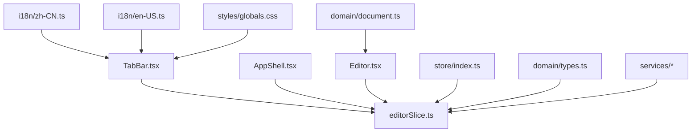
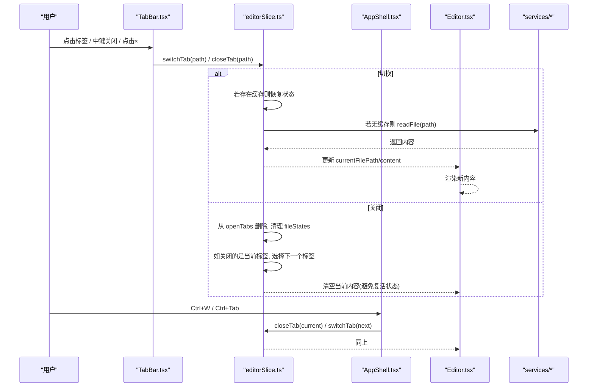
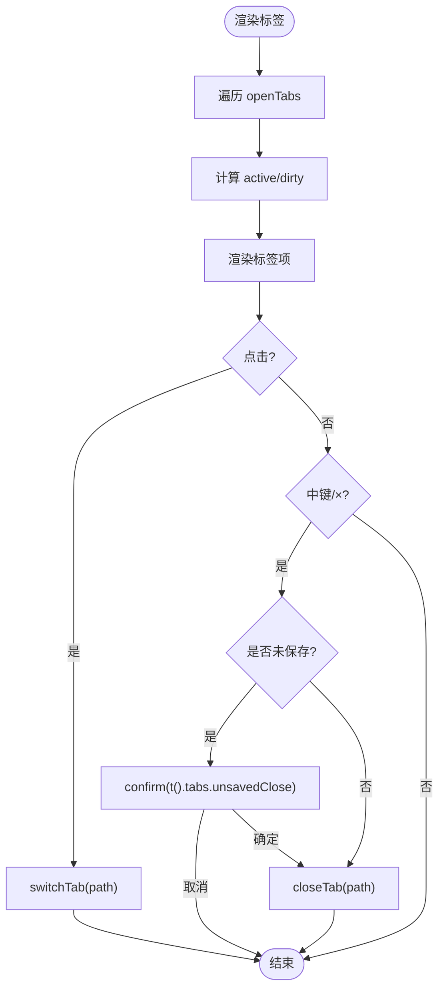
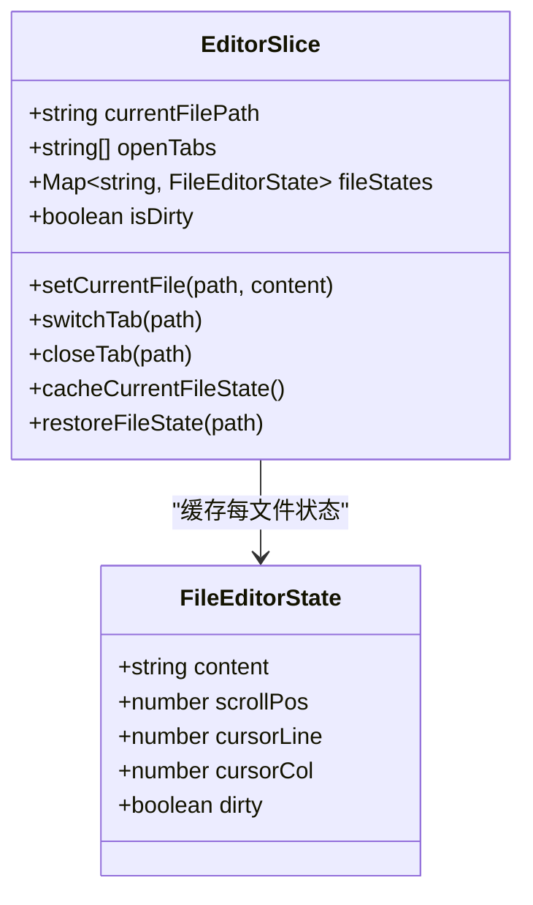
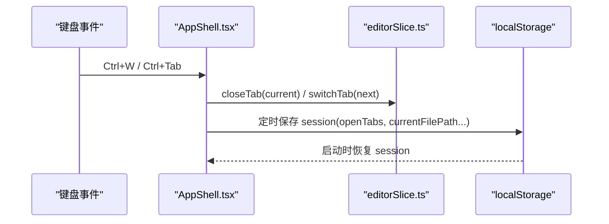
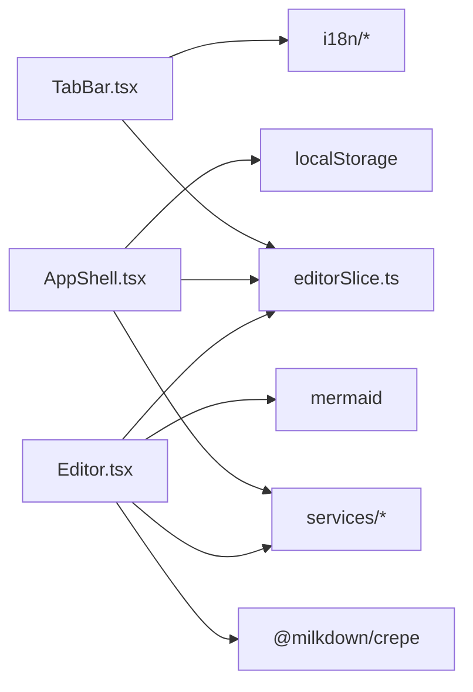

# 标签页系统

<cite>
**本文引用的文件**   
- [TabBar.tsx](file://src/components/layout/TabBar.tsx)
- [editorSlice.ts](file://src/store/slices/editorSlice.ts)
- [AppShell.tsx](file://src/components/layout/AppShell.tsx)
- [index.ts](file://src/store/index.ts)
- [types.ts](file://src/domain/types.ts)
- [document.ts](file://src/domain/document.ts)
- [Editor.tsx](file://src/components/editor/Editor.tsx)
- [zh-CN.ts](file://src/i18n/zh-CN.ts)
- [en-US.ts](file://src/i18n/en-US.ts)
- [globals.css](file://src/styles/globals.css)
</cite>

## 目录
1. [简介](#简介)
2. [项目结构](#项目结构)
3. [核心组件](#核心组件)
4. [架构总览](#架构总览)
5. [详细组件分析](#详细组件分析)
6. [依赖关系分析](#依赖关系分析)
7. [性能考量](#性能考量)
8. [故障排查指南](#故障排查指南)
9. [结论](#结论)

## 简介
本文件聚焦于 ZenNote 的“标签页系统”，即多文档并行编辑与切换能力。该系统基于 Zustand 状态管理，通过编辑器切片（editorSlice）维护当前文件、打开的标签列表、各文件的缓存状态以及切换/关闭逻辑；UI 层由 TabBar 提供 Typora 风格的标签栏交互，并在 AppShell 中集成全局快捷键与窗口状态持久化。整体设计强调：
- 每个标签对应一个已打开的文件路径
- 支持未保存变更提示与确认关闭
- 快速切换时恢复光标位置、滚动位置与内容
- 与编辑器、文件系统服务协同工作

## 项目结构
标签页系统涉及 UI、状态、领域模型与服务层四个层面：
- UI 层：TabBar（标签栏）、AppShell（布局与快捷键）、Editor（编辑器）
- 状态层：editorSlice（标签与编辑器状态）、store/index（组合根）
- 领域层：types.ts（FileEditorState 等类型）、document.ts（文档工具）
- 服务层：services（读/写文件、图片处理等）

图表来源
- [TabBar.tsx:1-64](file://src/components/layout/TabBar.tsx#L1-L64)
- [editorSlice.ts:1-112](file://src/store/slices/editorSlice.ts#L1-L112)
- [AppShell.tsx:1-371](file://src/components/layout/AppShell.tsx#L1-L371)
- [index.ts:1-38](file://src/store/index.ts#L1-L38)
- [types.ts:1-64](file://src/domain/types.ts#L1-L64)
- [document.ts:1-57](file://src/domain/document.ts#L1-L57)
- [zh-CN.ts:1-156](file://src/i18n/zh-CN.ts#L1-L156)
- [en-US.ts:1-155](file://src/i18n/en-US.ts#L1-L155)
- [globals.css:991-1005](file://src/styles/globals.css#L991-L1005)

章节来源
- [TabBar.tsx:1-64](file://src/components/layout/TabBar.tsx#L1-L64)
- [editorSlice.ts:1-112](file://src/store/slices/editorSlice.ts#L1-L112)
- [AppShell.tsx:1-371](file://src/components/layout/AppShell.tsx#L1-L371)
- [index.ts:1-38](file://src/store/index.ts#L1-L38)
- [types.ts:1-64](file://src/domain/types.ts#L1-L64)
- [document.ts:1-57](file://src/domain/document.ts#L1-L57)
- [Editor.tsx:1-800](file://src/components/editor/Editor.tsx#L1-L800)
- [zh-CN.ts:1-156](file://src/i18n/zh-CN.ts#L1-L156)
- [en-US.ts:1-155](file://src/i18n/en-US.ts#L1-L155)
- [globals.css:991-1005](file://src/styles/globals.css#L991-L1005)

## 核心组件
- 标签栏 UI：TabBar 渲染 openTabs，支持点击切换、中键或 × 关闭，未保存时显示圆点并二次确认
- 状态管理：editorSlice 维护 currentFilePath、openTabs、fileStates、isDirty 及切换/关闭方法
- 应用壳：AppShell 集成 TabBar，提供全局快捷键（Ctrl+W 关闭、Ctrl+Tab 切换），并持久化会话（包含 openTabs）
- 编辑器：Editor 订阅 content/currentFilePath，在切换时恢复状态并与 services 协作读写文件
- 领域类型：FileEditorState 定义每文件缓存的内容、滚动、光标与脏标记
- 国际化：tabs 文案用于关闭提示与标题
- 样式：globals.css 控制标签项外观、未保存圆点与关闭按钮显隐

章节来源
- [TabBar.tsx:1-64](file://src/components/layout/TabBar.tsx#L1-L64)
- [editorSlice.ts:1-112](file://src/store/slices/editorSlice.ts#L1-L112)
- [AppShell.tsx:1-371](file://src/components/layout/AppShell.tsx#L1-L371)
- [types.ts:33-41](file://src/domain/types.ts#L33-L41)
- [zh-CN.ts:70-73](file://src/i18n/zh-CN.ts#L70-L73)
- [en-US.ts:70-73](file://src/i18n/en-US.ts#L70-L73)
- [globals.css:991-1005](file://src/styles/globals.css#L991-L1005)

## 架构总览
标签页系统的数据流与控制流如下：
- UI 事件（点击/中键/×）触发 store 中的 switchTab/closeTab
- editorSlice 负责：
  - 切换：若存在缓存则直接恢复，否则异步读取文件后 setCurrentFile
  - 关闭：从 openTabs 移除，清理 fileStates，必要时切换到相邻标签
  - 缓存：切换前将当前文件状态写入 fileStates
- AppShell 监听键盘事件，统一调用 store 方法完成关闭与切换
- Editor 根据 currentFilePath 与 content 渲染，并通过 services 进行文件读写

图表来源
- [TabBar.tsx:1-64](file://src/components/layout/TabBar.tsx#L1-L64)
- [editorSlice.ts:1-112](file://src/store/slices/editorSlice.ts#L1-L112)
- [AppShell.tsx:1-371](file://src/components/layout/AppShell.tsx#L1-L371)
- [Editor.tsx:1-800](file://src/components/editor/Editor.tsx#L1-L800)

## 详细组件分析

### 标签栏组件 TabBar
- 功能要点
  - 渲染 openTabs，计算 active/dirty 状态
  - 点击切换：调用 switchTab
  - 中键或 × 关闭：dirty 时弹出确认，确认后调用 closeTab
  - 使用 noteName 展示文件名，i18n 文案用于提示
- 交互细节
  - onAuxClick 处理中键关闭
  - 阻止事件冒泡避免误触父级
- 视觉反馈
  - dirty 时显示圆点，hover 显示关闭按钮

图表来源
- [TabBar.tsx:1-64](file://src/components/layout/TabBar.tsx#L1-L64)
- [zh-CN.ts:70-73](file://src/i18n/zh-CN.ts#L70-L73)
- [en-US.ts:70-73](file://src/i18n/en-US.ts#L70-L73)

章节来源
- [TabBar.tsx:1-64](file://src/components/layout/TabBar.tsx#L1-L64)

### 编辑器状态切片 editorSlice
- 关键状态
  - currentFilePath：当前激活文件路径
  - openTabs：打开标签顺序数组
  - fileStates：Map<path, FileEditorState> 缓存每文件内容、滚动、光标与脏标记
  - isDirty：当前文件是否未保存
- 核心方法
  - setCurrentFile：切换前缓存旧状态，尝试恢复目标状态，追加到 openTabs
  - switchTab：优先使用缓存，否则异步 readFile
  - closeTab：删除路径、清理缓存，必要时切换到相邻标签
  - cacheCurrentFileState：将当前文件状态写入 fileStates
- 复杂度与性能
  - Map 查找 O(1)，数组过滤 O(n)
  - 切换时避免重复读取，减少 IO

图表来源
- [editorSlice.ts:1-112](file://src/store/slices/editorSlice.ts#L1-L112)
- [types.ts:33-41](file://src/domain/types.ts#L33-L41)

章节来源
- [editorSlice.ts:1-112](file://src/store/slices/editorSlice.ts#L1-L112)
- [types.ts:33-41](file://src/domain/types.ts#L33-L41)

### 应用壳 AppShell 与快捷键
- 集成 TabBar，渲染主界面
- 全局快捷键：
  - Ctrl+W：关闭当前标签（未保存时确认）
  - Ctrl+Tab / Ctrl+Shift+Tab：循环切换标签
  - Ctrl+O / Ctrl+Shift+O：打开文件或文件夹
  - Ctrl+,：设置面板
- 窗口状态持久化：
  - 定期保存 workspacePath、currentFilePath、openTabs、主题、字体、编辑器配置等
  - 启动时恢复 openTabs 与工作区

图表来源
- [AppShell.tsx:1-371](file://src/components/layout/AppShell.tsx#L1-L371)
- [editorSlice.ts:1-112](file://src/store/slices/editorSlice.ts#L1-L112)

章节来源
- [AppShell.tsx:1-371](file://src/components/layout/AppShell.tsx#L1-L371)

### 编辑器 Editor 与状态同步
- 订阅 currentFilePath、content、sourceMode 等
- 在 sourceMode 下销毁 Crepe 实例，回退到 textarea
- 非 sourceMode 初始化 Milkdown Crepe，注册自定义节点视图（HTML/Frontmatter/TOC）
- 与 services 协作：
  - 自动保存：useAutoSave 在 isDirty 且延迟后写入文件
  - 图片粘贴：source mode 下粘贴图片保存到笔记资源目录
- 切换行为：
  - setCurrentFile 被调用后，Editor 重新渲染新内容
  - 切换前 editorSlice 会缓存当前状态，确保切换后恢复光标与滚动

章节来源
- [Editor.tsx:1-800](file://src/components/editor/Editor.tsx#L1-L800)
- [AppShell.tsx:22-40](file://src/components/layout/AppShell.tsx#L22-L40)
- [editorSlice.ts:45-92](file://src/store/slices/editorSlice.ts#L45-L92)

### 领域类型与文档工具
- FileEditorState：定义每文件缓存字段（内容、滚动、光标、dirty）
- Heading/WordCount：文档解析与统计工具（与标签页无直接耦合，但为编辑器提供能力）

章节来源
- [types.ts:33-41](file://src/domain/types.ts#L33-L41)
- [document.ts:1-57](file://src/domain/document.ts#L1-L57)

### 国际化与样式
- i18n：tabs.closeTab、tabs.unsavedClose 用于关闭提示
- CSS：zn-tabbar、zn-tab、zn-tab-dirty、zn-tab-dot、zn-tab-x 控制标签外观与未保存指示

章节来源
- [zh-CN.ts:70-73](file://src/i18n/zh-CN.ts#L70-L73)
- [en-US.ts:70-73](file://src/i18n/en-US.ts#L70-L73)
- [globals.css:991-1005](file://src/styles/globals.css#L991-L1005)

## 依赖关系分析
- 组件依赖
  - TabBar 依赖 store/editorSlice 与 i18n
  - AppShell 依赖 store/editorSlice、services、i18n、localStorage
  - Editor 依赖 store/editorSlice、services、Milkdown/Crepe
- 状态依赖
  - editorSlice 依赖 services.readFile/writeFile
  - AppShell 的 useWindowPersistence 依赖 store 所有相关字段
- 潜在循环
  - 组件仅订阅 store，不反向依赖 store 实现，无循环依赖
- 外部依赖
  - @milkdown/crepe、@codemirror、mermaid、tauri 插件（对话框）

图表来源
- [TabBar.tsx:1-64](file://src/components/layout/TabBar.tsx#L1-L64)
- [editorSlice.ts:1-112](file://src/store/slices/editorSlice.ts#L1-L112)
- [AppShell.tsx:1-371](file://src/components/layout/AppShell.tsx#L1-L371)
- [Editor.tsx:1-800](file://src/components/editor/Editor.tsx#L1-L800)

章节来源
- [index.ts:1-38](file://src/store/index.ts#L1-L38)
- [editorSlice.ts:1-112](file://src/store/slices/editorSlice.ts#L1-L112)
- [AppShell.tsx:1-371](file://src/components/layout/AppShell.tsx#L1-L371)
- [Editor.tsx:1-800](file://src/components/editor/Editor.tsx#L1-L800)

## 性能考量
- 切换性能
  - 使用 Map 缓存每文件状态，切换时 O(1) 查找，避免重复 IO
  - 仅在首次切换时 readFile，后续直接从缓存恢复
- 渲染优化
  - TabBar 仅渲染 openTabs，数量可控
  - AppShell 懒加载 SearchPanel、SettingsDialog
- 自动保存
  - 防抖延迟 autoSaveDelay，避免频繁写入
- 内存占用
  - fileStates 随标签数增长，建议限制最大标签数或清理长时间未访问的缓存

[本节为通用指导，无需引用具体文件]

## 故障排查指南
- 标签无法切换
  - 检查 openTabs 是否包含目标路径
  - 查看 editorSlice.switchTab 是否成功回调 readFile
- 关闭标签丢失状态
  - 确认 closeTab 先清空 currentFilePath，再切换下一个标签
  - 检查 fileStates 是否正确删除对应 path
- 未保存提示不出现
  - 检查 isDirty 与 fileStates[path].dirty 是否正确设置
  - 确认 TabBar.dirtyOf 逻辑与 i18n 文案可用
- 快捷键无效
  - 检查 AppShell 的 onKeyDown 是否注册，mod 键判断是否正确
  - 确认浏览器/桌面环境对 Ctrl+W/Ctrl+Tab 的默认行为未被拦截
- 自动保存未生效
  - 检查 useAutoSave 的 isDirty/currentFilePath/autoSaveDelay 条件
  - 确认 writeFile 权限与路径正确

章节来源
- [editorSlice.ts:81-108](file://src/store/slices/editorSlice.ts#L81-L108)
- [TabBar.tsx:17-25](file://src/components/layout/TabBar.tsx#L17-L25)
- [AppShell.tsx:194-280](file://src/components/layout/AppShell.tsx#L194-L280)
- [AppShell.tsx:22-40](file://src/components/layout/AppShell.tsx#L22-L40)

## 结论
ZenNote 的标签页系统以 Zustand 为核心，结合清晰的领域类型与稳健的状态流转，实现了高效、直观的标签管理与切换体验。通过缓存策略、快捷键集成与本地持久化，系统在易用性与性能之间取得良好平衡。未来可考虑引入标签上限、缓存回收策略与更细粒度的错误边界，以进一步提升稳定性与可扩展性。