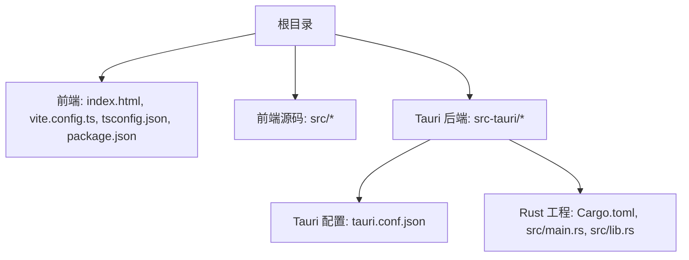
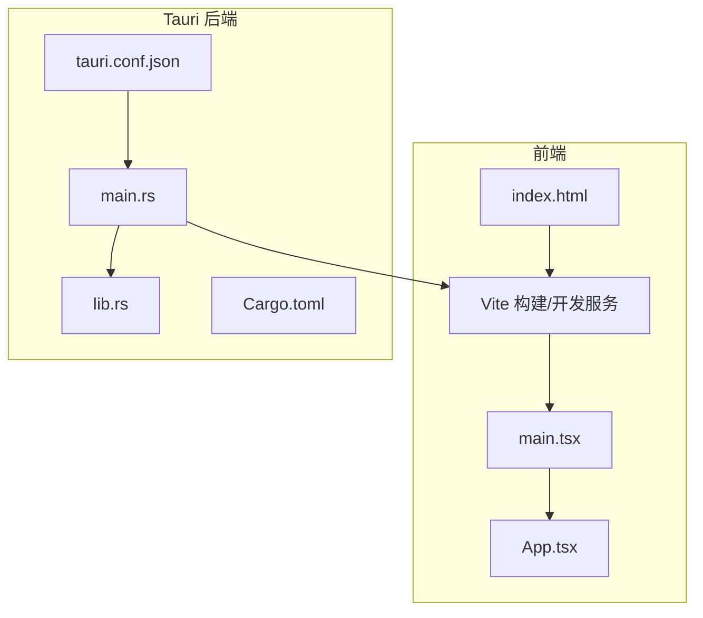
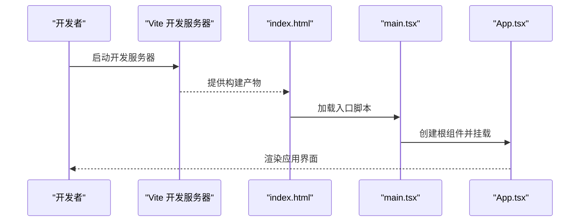
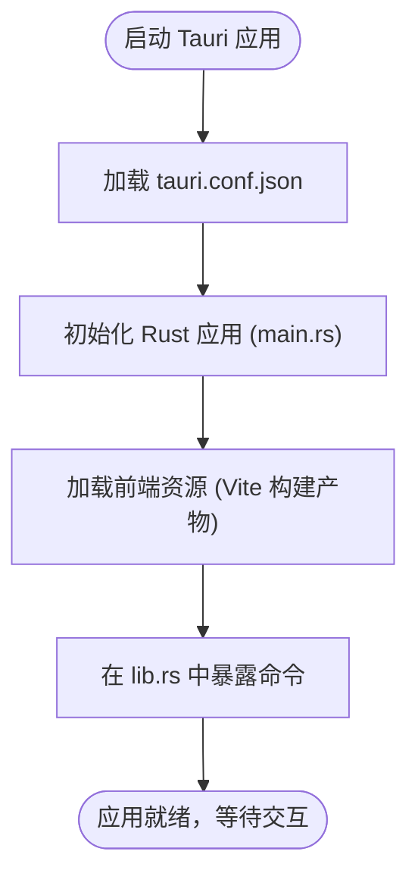
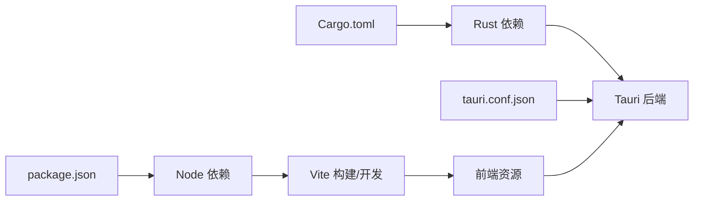

# 快速开始

<cite>
**本文引用的文件**   
- [README.md](file://README.md)
- [package.json](file://package.json)
- [vite.config.ts](file://vite.config.ts)
- [tsconfig.json](file://tsconfig.json)
- [index.html](file://index.html)
- [src/main.tsx](file://src/main.tsx)
- [src/App.tsx](file://src/App.tsx)
- [src-tauri/tauri.conf.json](file://src-tauri/tauri.conf.json)
- [src-tauri/Cargo.toml](file://src-tauri/Cargo.toml)
- [src-tauri/src/main.rs](file://src-tauri/src/main.rs)
- [src-tauri/src/lib.rs](file://src-tauri/src/lib.rs)
</cite>

## 目录
1. [简介](#简介)
2. [项目结构](#项目结构)
3. [核心组件](#核心组件)
4. [架构总览](#架构总览)
5. [详细组件分析](#详细组件分析)
6. [依赖关系分析](#依赖关系分析)
7. [性能注意事项](#性能注意事项)
8. [故障排除指南](#故障排除指南)
9. [结论](#结论)
10. [附录](#附录)

## 简介
本快速开始指南面向首次接触 ZenNote 的开发者与用户，目标是帮助你在最短时间内完成环境准备、依赖安装、构建与运行，并顺利进入开发状态。ZenNote 是一个基于 Tauri + Vite + React 的桌面端 Markdown 笔记应用，前端使用 TypeScript/React，后端由 Rust/Tauri 提供系统能力与原生集成。

## 项目结构
ZenNote 采用前后端分离的工程化结构：
- 前端工程位于根目录，包含 Vite 配置、TypeScript 配置、入口 HTML 与 React 源码。
- 后端工程位于 src-tauri 目录，包含 Tauri 配置、Rust 源文件与构建产物目录。

图表来源
- [package.json](file://package.json)
- [vite.config.ts](file://vite.config.ts)
- [tsconfig.json](file://tsconfig.json)
- [index.html](file://index.html)
- [src-tauri/tauri.conf.json](file://src-tauri/tauri.conf.json)
- [src-tauri/Cargo.toml](file://src-tauri/Cargo.toml)
- [src-tauri/src/main.rs](file://src-tauri/src/main.rs)
- [src-tauri/src/lib.rs](file://src-tauri/src/lib.rs)

章节来源
- [package.json](file://package.json)
- [vite.config.ts](file://vite.config.ts)
- [tsconfig.json](file://tsconfig.json)
- [index.html](file://index.html)
- [src-tauri/tauri.conf.json](file://src-tauri/tauri.conf.json)
- [src-tauri/Cargo.toml](file://src-tauri/Cargo.toml)
- [src-tauri/src/main.rs](file://src-tauri/src/main.rs)
- [src-tauri/src/lib.rs](file://src-tauri/src/lib.rs)

## 核心组件
- 前端入口与路由挂载
  - 入口 HTML 定义页面骨架与脚本加载位置。
  - React 入口 main.tsx 负责初始化应用与挂载到 DOM。
  - App.tsx 作为应用根组件，组织页面布局与功能模块。
- 构建与类型检查
  - Vite 负责开发与生产构建、资源打包与优化。
  - TypeScript 提供类型检查与编译配置。
- Tauri 后端
  - tauri.conf.json 描述窗口、菜单、权限与前端资源路径等。
  - Cargo.toml 声明 Rust 依赖与构建目标。
  - main.rs 与 lib.rs 实现 Tauri 应用生命周期与命令暴露。

章节来源
- [index.html](file://index.html)
- [src/main.tsx](file://src/main.tsx)
- [src/App.tsx](file://src/App.tsx)
- [vite.config.ts](file://vite.config.ts)
- [tsconfig.json](file://tsconfig.json)
- [src-tauri/tauri.conf.json](file://src-tauri/tauri.conf.json)
- [src-tauri/Cargo.toml](file://src-tauri/Cargo.toml)
- [src-tauri/src/main.rs](file://src-tauri/src/main.rs)
- [src-tauri/src/lib.rs](file://src-tauri/src/lib.rs)

## 架构总览
ZenNote 采用“前端 UI + 后端系统能力”的双进程架构：
- 前端通过 Vite 启动开发服务器或构建静态资源，渲染 React 界面。
- Tauri 后端加载前端资源，提供系统级 API（如文件系统、窗口管理）并通过命令与前端通信。

图表来源
- [index.html](file://index.html)
- [src/main.tsx](file://src/main.tsx)
- [src/App.tsx](file://src/App.tsx)
- [vite.config.ts](file://vite.config.ts)
- [src-tauri/tauri.conf.json](file://src-tauri/tauri.conf.json)
- [src-tauri/src/main.rs](file://src-tauri/src/main.rs)
- [src-tauri/src/lib.rs](file://src-tauri/src/lib.rs)
- [src-tauri/Cargo.toml](file://src-tauri/Cargo.toml)

## 详细组件分析

### 前端构建与运行
- 构建工具链
  - Vite 用于开发服务器与生产构建，支持热更新与资源优化。
  - TypeScript 提供类型检查与编译，配置文件位于 tsconfig.*.json。
- 入口流程
  - index.html 引入构建后的脚本。
  - main.tsx 初始化 React 应用并挂载到 DOM。
  - App.tsx 作为根组件承载业务逻辑与页面结构。

图表来源
- [index.html](file://index.html)
- [src/main.tsx](file://src/main.tsx)
- [src/App.tsx](file://src/App.tsx)
- [vite.config.ts](file://vite.config.ts)

章节来源
- [index.html](file://index.html)
- [src/main.tsx](file://src/main.tsx)
- [src/App.tsx](file://src/App.tsx)
- [vite.config.ts](file://vite.config.ts)
- [tsconfig.json](file://tsconfig.json)

### Tauri 后端配置与运行
- 配置项
  - tauri.conf.json 指定窗口大小、标题、前端资源路径、菜单与权限等。
- Rust 工程
  - Cargo.toml 声明依赖与构建目标。
  - main.rs 初始化 Tauri 应用生命周期。
  - lib.rs 暴露给前端的命令与逻辑。

图表来源
- [src-tauri/tauri.conf.json](file://src-tauri/tauri.conf.json)
- [src-tauri/src/main.rs](file://src-tauri/src/main.rs)
- [src-tauri/src/lib.rs](file://src-tauri/src/lib.rs)
- [src-tauri/Cargo.toml](file://src-tauri/Cargo.toml)

章节来源
- [src-tauri/tauri.conf.json](file://src-tauri/tauri.conf.json)
- [src-tauri/src/main.rs](file://src-tauri/src/main.rs)
- [src-tauri/src/lib.rs](file://src-tauri/src/lib.rs)
- [src-tauri/Cargo.toml](file://src-tauri/Cargo.toml)

## 依赖关系分析
- Node.js 生态
  - package.json 定义了项目依赖、脚本命令与版本约束。
  - 通过包管理器安装依赖后，可使用 Vite 启动开发服务器或执行构建。
- Rust 生态
  - Cargo.toml 声明 Rust 依赖与构建目标，Tauri CLI 会调用 Cargo 进行编译。
- 前后端耦合点
  - tauri.conf.json 中的前端资源路径指向 Vite 构建输出。
  - 前端通过 Tauri 命令调用后端能力，形成稳定的接口契约。

图表来源
- [package.json](file://package.json)
- [vite.config.ts](file://vite.config.ts)
- [src-tauri/tauri.conf.json](file://src-tauri/tauri.conf.json)
- [src-tauri/Cargo.toml](file://src-tauri/Cargo.toml)

章节来源
- [package.json](file://package.json)
- [src-tauri/Cargo.toml](file://src-tauri/Cargo.toml)
- [src-tauri/tauri.conf.json](file://src-tauri/tauri.conf.json)

## 性能注意事项
- 开发体验
  - 使用 Vite 开发服务器以获得更快的冷启动与热更新。
  - 合理拆分组件与按需加载，减少首屏体积。
- 构建优化
  - 生产构建启用代码分割与压缩，避免不必要的依赖。
  - 图片与字体等资源进行压缩与懒加载。
- Tauri 后端
  - 将耗时操作放入异步任务，避免阻塞主线程。
  - 合理使用缓存与增量更新策略。

[本节为通用指导，不直接分析具体文件]

## 故障排除指南
- Node.js 与包管理器
  - 若安装依赖失败，请确认 Node.js 版本满足要求，并尝试清理缓存后重试。
  - 网络问题可切换镜像源或使用代理。
- Vite 相关
  - 端口占用时修改端口或关闭占用进程。
  - 构建报错时检查 TypeScript 配置与依赖版本兼容性。
- Tauri 与 Rust
  - 缺少 Rust 工具链或编译器时会报编译错误，需安装对应工具链。
  - 权限不足导致无法访问文件或目录时，请以管理员权限运行或调整权限设置。
- 常见现象定位
  - 前端白屏：检查入口脚本是否加载成功、DOM 节点是否存在。
  - 后端命令未生效：确认 tauri.conf.json 中资源路径与命令暴露是否正确。

章节来源
- [package.json](file://package.json)
- [vite.config.ts](file://vite.config.ts)
- [tsconfig.json](file://tsconfig.json)
- [src-tauri/tauri.conf.json](file://src-tauri/tauri.conf.json)
- [src-tauri/Cargo.toml](file://src-tauri/Cargo.toml)

## 结论
通过以上步骤，你应能顺利完成 ZenNote 的环境搭建、依赖安装、构建与运行。建议初次运行后阅读 README 以了解更详细的用法与扩展方式。如遇问题，优先检查 Node.js/Rust 工具链版本与权限设置，再根据日志定位具体原因。

[本节为总结性内容，不直接分析具体文件]

## 附录
- 环境要求
  - 操作系统：主流桌面操作系统（Windows/macOS/Linux）。
  - Node.js：建议使用长期支持版本（LTS），并确保包管理器可用。
  - Rust：安装 rustup 与稳定版工具链，确保 cargo 可用。
- 安装与运行
  - 安装依赖：在项目根目录执行包管理器安装命令。
  - 启动开发：使用 Vite 启动开发服务器，便于快速迭代。
  - 构建与运行：使用 Tauri 命令进行构建与打包，生成桌面应用。
- 参考文档
  - README：项目说明与使用说明。
  - 文档目录：包含设计文档与渲染说明等。

章节来源
- [README.md](file://README.md)
- [package.json](file://package.json)
- [src-tauri/Cargo.toml](file://src-tauri/Cargo.toml)
- [src-tauri/tauri.conf.json](file://src-tauri/tauri.conf.json)