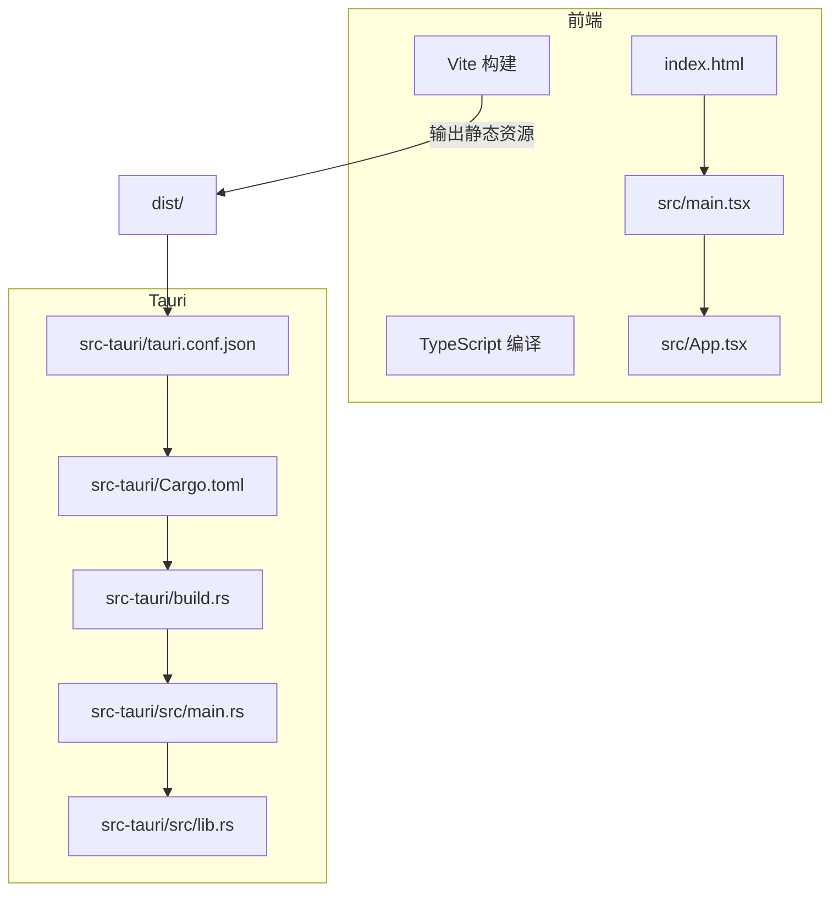
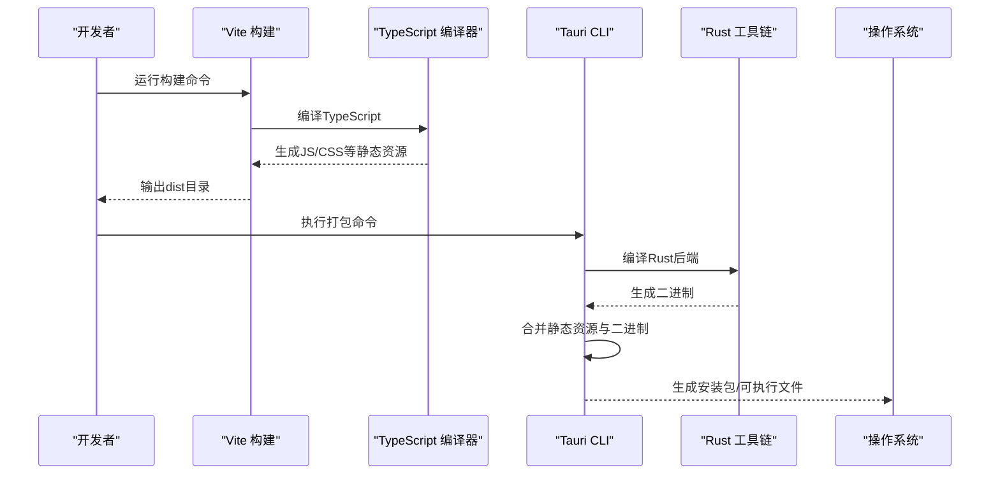
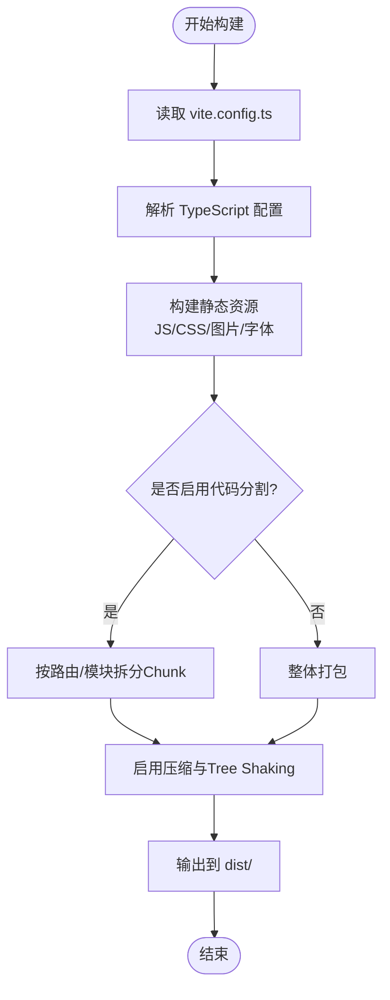
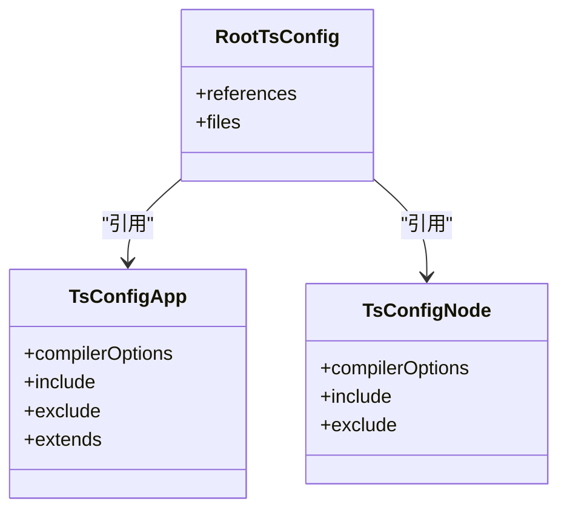
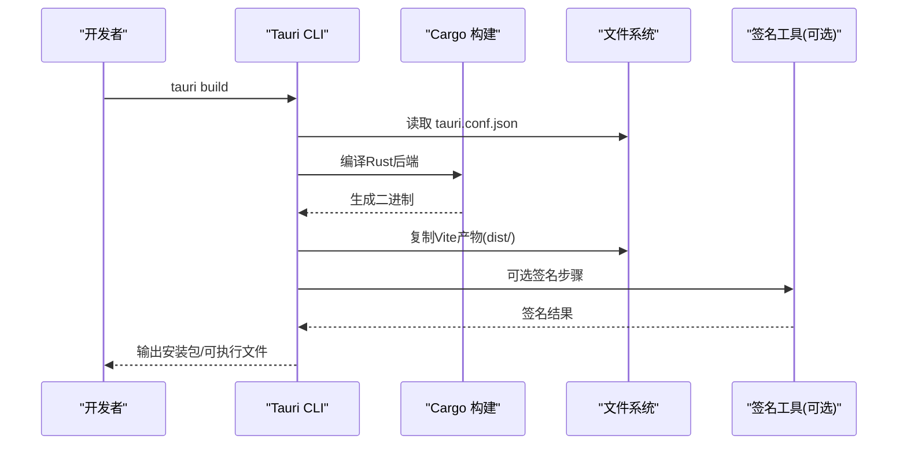
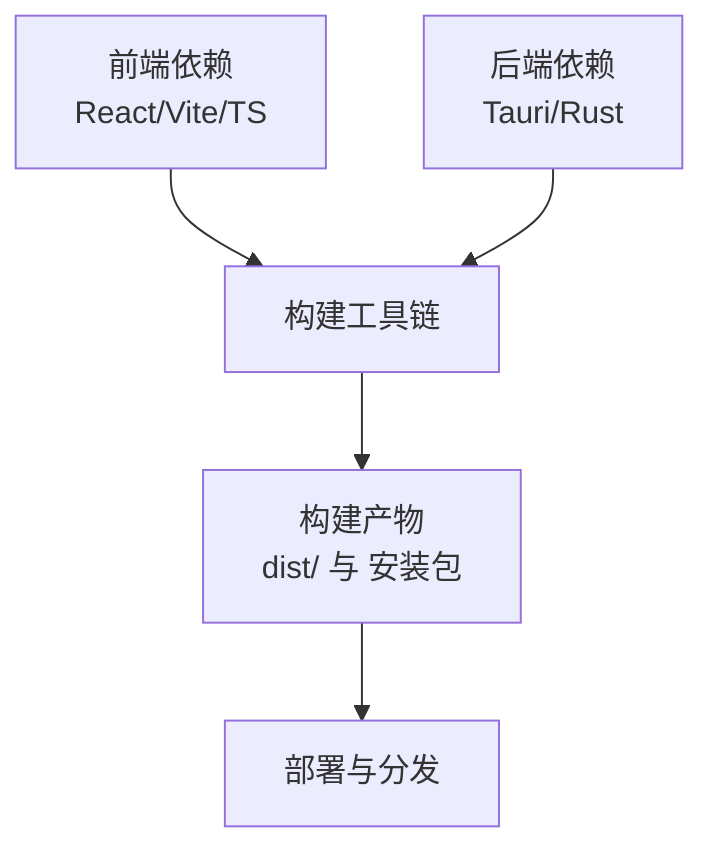

# 构建与部署

<cite>
**本文引用的文件**   
- [package.json](file://package.json)
- [vite.config.ts](file://vite.config.ts)
- [tsconfig.app.json](file://tsconfig.app.json)
- [tsconfig.node.json](file://tsconfig.node.json)
- [tsconfig.json](file://tsconfig.json)
- [index.html](file://index.html)
- [src/main.tsx](file://src/main.tsx)
- [src/App.tsx](file://src/App.tsx)
- [src-tauri/tauri.conf.json](file://src-tauri/tauri.conf.json)
- [src-tauri/Cargo.toml](file://src-tauri/Cargo.toml)
- [src-tauri/build.rs](file://src-tauri/build.rs)
- [src-tauri/src/main.rs](file://src-tauri/src/main.rs)
- [src-tauri/src/lib.rs](file://src-tauri/src/lib.rs)
</cite>

## 目录
1. [简介](#简介)
2. [项目结构](#项目结构)
3. [核心组件](#核心组件)
4. [架构总览](#架构总览)
5. [详细组件分析](#详细组件分析)
6. [依赖分析](#依赖分析)
7. [性能考虑](#性能考虑)
8. [故障排查指南](#故障排查指南)
9. [结论](#结论)
10. [附录](#附录)

## 简介
本指南面向ZenNote应用的构建与部署，覆盖Vite前端构建、TypeScript编译配置、Tauri打包流程，以及生产环境优化、资源压缩、代码分割策略。文档还包含跨平台打包命令、签名配置、安装包生成、CI/CD流水线示例与自动化部署方案，并给出版本管理、更新机制与发布流程建议，以及常见问题排查与性能优化建议。

## 项目结构
ZenNote采用“前端（Vite + React + TypeScript）+ 桌面壳（Tauri/Rust）”的混合架构：
- 前端工程位于仓库根目录，使用Vite进行开发与构建，TypeScript通过多配置文件拆分编译目标。
- Tauri后端位于src-tauri目录，负责原生能力封装与应用打包。
- 入口HTML在index.html，应用入口为src/main.tsx，顶层组件为src/App.tsx。

图表来源
- [index.html:1-200](file://index.html#L1-L200)
- [src/main.tsx:1-200](file://src/main.tsx#L1-L200)
- [src/App.tsx:1-200](file://src/App.tsx#L1-L200)
- [vite.config.ts:1-200](file://vite.config.ts#L1-L200)
- [src-tauri/tauri.conf.json:1-200](file://src-tauri/tauri.conf.json#L1-L200)
- [src-tauri/Cargo.toml:1-200](file://src-tauri/Cargo.toml#L1-L200)
- [src-tauri/build.rs:1-200](file://src-tauri/build.rs#L1-L200)
- [src-tauri/src/main.rs:1-200](file://src-tauri/src/main.rs#L1-L200)
- [src-tauri/src/lib.rs:1-200](file://src-tauri/src/lib.rs#L1-L200)

章节来源
- [package.json:1-200](file://package.json#L1-L200)
- [vite.config.ts:1-200](file://vite.config.ts#L1-L200)
- [tsconfig.app.json:1-200](file://tsconfig.app.json#L1-L200)
- [tsconfig.node.json:1-200](file://tsconfig.node.json#L1-L200)
- [tsconfig.json:1-200](file://tsconfig.json#L1-L200)
- [index.html:1-200](file://index.html#L1-L200)
- [src/main.tsx:1-200](file://src/main.tsx#L1-L200)
- [src/App.tsx:1-200](file://src/App.tsx#L1-L200)
- [src-tauri/tauri.conf.json:1-200](file://src-tauri/tauri.conf.json#L1-L200)
- [src-tauri/Cargo.toml:1-200](file://src-tauri/Cargo.toml#L1-L200)
- [src-tauri/build.rs:1-200](file://src-tauri/build.rs#L1-L200)
- [src-tauri/src/main.rs:1-200](file://src-tauri/src/main.rs#L1-L200)
- [src-tauri/src/lib.rs:1-200](file://src-tauri/src/lib.rs#L1-L200)

## 核心组件
- Vite构建系统：负责开发服务器、热更新、生产构建、资源处理与插件扩展。
- TypeScript编译：通过多配置文件区分应用与Node端编译目标，确保类型检查与模块解析正确。
- Tauri打包：将Vite产物作为Web视图内容，结合Rust后端生成跨平台安装包。

章节来源
- [package.json:1-200](file://package.json#L1-L200)
- [vite.config.ts:1-200](file://vite.config.ts#L1-L200)
- [tsconfig.app.json:1-200](file://tsconfig.app.json#L1-L200)
- [tsconfig.node.json:1-200](file://tsconfig.node.json#L1-L200)
- [tsconfig.json:1-200](file://tsconfig.json#L1-L200)
- [src-tauri/tauri.conf.json:1-200](file://src-tauri/tauri.conf.json#L1-L200)
- [src-tauri/Cargo.toml:1-200](file://src-tauri/Cargo.toml#L1-L200)

## 架构总览
下图展示了从源码到可执行安装包的完整构建链路：TypeScript编译与Vite构建产出静态资源，Tauri读取配置并调用Rust工具链完成打包。

图表来源
- [vite.config.ts:1-200](file://vite.config.ts#L1-L200)
- [tsconfig.app.json:1-200](file://tsconfig.app.json#L1-L200)
- [src-tauri/tauri.conf.json:1-200](file://src-tauri/tauri.conf.json#L1-L200)
- [src-tauri/Cargo.toml:1-200](file://src-tauri/Cargo.toml#L1-L200)

## 详细组件分析

### Vite构建配置
- 构建目标与环境变量：根据NODE_ENV切换开发与生产模式，设置基础路径、输出目录与资源命名策略。
- 插件体系：启用React、TypeScript、CSS预处理、图片与字体处理、按需加载与分包策略。
- 代理与开发服务器：配置本地API代理、端口与HTTPS（可选）。
- 生产优化：启用代码压缩、Tree Shaking、Chunk拆分、预加载与缓存策略。

图表来源
- [vite.config.ts:1-200](file://vite.config.ts#L1-L200)
- [tsconfig.app.json:1-200](file://tsconfig.app.json#L1-L200)

章节来源
- [vite.config.ts:1-200](file://vite.config.ts#L1-L200)
- [package.json:1-200](file://package.json#L1-L200)

### TypeScript编译设置
- 多配置文件：tsconfig.app.json用于浏览器端应用，tsconfig.node.json用于Node/Vite插件脚本。
- 模块与路径：启用ES模块、路径别名、严格类型检查与装饰器支持（如需要）。
- 输出与声明：控制编译输出目录、声明文件生成与源映射。

图表来源
- [tsconfig.app.json:1-200](file://tsconfig.app.json#L1-L200)
- [tsconfig.node.json:1-200](file://tsconfig.node.json#L1-L200)
- [tsconfig.json:1-200](file://tsconfig.json#L1-L200)

章节来源
- [tsconfig.app.json:1-200](file://tsconfig.app.json#L1-L200)
- [tsconfig.node.json:1-200](file://tsconfig.node.json#L1-L200)
- [tsconfig.json:1-200](file://tsconfig.json#L1-L200)

### Tauri打包流程
- 配置项：tauri.conf.json定义应用名称、版本、窗口大小、图标、权限与前端构建产物路径。
- Rust后端：Cargo.toml声明依赖与包信息；build.rs用于构建前处理；main.rs与lib.rs实现Tauri命令与逻辑。
- 打包产物：生成各平台的安装包或可执行文件，支持签名与更新通道配置。

图表来源
- [src-tauri/tauri.conf.json:1-200](file://src-tauri/tauri.conf.json#L1-L200)
- [src-tauri/Cargo.toml:1-200](file://src-tauri/Cargo.toml#L1-L200)
- [src-tauri/build.rs:1-200](file://src-tauri/build.rs#L1-L200)
- [src-tauri/src/main.rs:1-200](file://src-tauri/src/main.rs#L1-L200)
- [src-tauri/src/lib.rs:1-200](file://src-tauri/src/lib.rs#L1-L200)

章节来源
- [src-tauri/tauri.conf.json:1-200](file://src-tauri/tauri.conf.json#L1-L200)
- [src-tauri/Cargo.toml:1-200](file://src-tauri/Cargo.toml#L1-L200)
- [src-tauri/build.rs:1-200](file://src-tauri/build.rs#L1-L200)
- [src-tauri/src/main.rs:1-200](file://src-tauri/src/main.rs#L1-L200)
- [src-tauri/src/lib.rs:1-200](file://src-tauri/src/lib.rs#L1-L200)

### 生产环境优化配置
- 资源压缩：启用JS/CSS压缩、图片优化与字体子集化。
- 代码分割：按路由与第三方库拆分Chunk，提升首屏加载速度。
- 缓存策略：对静态资源添加哈希文件名，配合HTTP缓存头提高命中。
- Tree Shaking：移除未使用代码，减小包体积。
- 预加载与懒加载：关键资源预加载，非关键模块按需加载。

章节来源
- [vite.config.ts:1-200](file://vite.config.ts#L1-L200)
- [package.json:1-200](file://package.json#L1-L200)

### 不同平台的打包命令与签名配置
- Windows：使用Tauri CLI生成MSI或NSIS安装包，可配置代码签名证书与时间戳服务。
- macOS：生成DMG或App Store包，需配置开发者证书与公证流程。
- Linux：生成AppImage、deb或rpm包，可配置GPG签名。

章节来源
- [src-tauri/tauri.conf.json:1-200](file://src-tauri/tauri.conf.json#L1-L200)
- [package.json:1-200](file://package.json#L1-L200)

### CI/CD流水线配置示例与自动化部署
- 构建阶段：安装依赖、运行类型检查、执行Vite构建与Tauri打包。
- 测试阶段：运行单元测试与集成测试，收集覆盖率报告。
- 发布阶段：上传产物到对象存储或包管理器，生成更新元数据。
- 通知阶段：发送构建结果与发布通知到团队渠道。

章节来源
- [package.json:1-200](file://package.json#L1-L200)
- [src-tauri/Cargo.toml:1-200](file://src-tauri/Cargo.toml#L1-L200)

### 版本管理、更新机制与发布流程
- 版本管理：统一在package.json与tauri.conf.json中维护版本号，确保前后端一致。
- 更新机制：通过Tauri Updater或自定义服务端提供增量更新与全量更新。
- 发布流程：打标签、生成变更日志、上传安装包与更新元数据、灰度发布与回滚策略。

章节来源
- [package.json:1-200](file://package.json#L1-L200)
- [src-tauri/tauri.conf.json:1-200](file://src-tauri/tauri.conf.json#L1-L200)

## 依赖分析
- 前端依赖：React生态、Vite插件、TypeScript与样式库。
- 后端依赖：Tauri框架、Rust标准库与平台相关依赖。
- 构建依赖：Node.js、Rust工具链、平台SDK与签名工具。

图表来源
- [package.json:1-200](file://package.json#L1-L200)
- [src-tauri/Cargo.toml:1-200](file://src-tauri/Cargo.toml#L1-L200)

章节来源
- [package.json:1-200](file://package.json#L1-L200)
- [src-tauri/Cargo.toml:1-200](file://src-tauri/Cargo.toml#L1-L200)

## 性能考虑
- 首屏优化：减少主包体积，启用预加载与关键CSS内联。
- 内存占用：避免大对象常驻内存，合理使用Web Worker与缓存。
- I/O性能：批量读写文件，避免频繁同步操作。
- 渲染性能：减少重排与重绘，使用虚拟列表与防抖节流。

[本节为通用指导，不直接分析具体文件]

## 故障排查指南
- 构建失败：检查Node与Rust版本兼容性，清理缓存后重试。
- 类型错误：确认tsconfig引用关系与模块解析路径。
- 打包异常：验证tauri.conf.json路径与权限，检查签名证书有效性。
- 运行时崩溃：查看控制台日志与崩溃转储，定位问题模块。

章节来源
- [vite.config.ts:1-200](file://vite.config.ts#L1-L200)
- [tsconfig.app.json:1-200](file://tsconfig.app.json#L1-L200)
- [src-tauri/tauri.conf.json:1-200](file://src-tauri/tauri.conf.json#L1-L200)

## 结论
通过合理的Vite与TypeScript配置、规范的Tauri打包流程与完善的CI/CD流水线，ZenNote可实现高效、稳定、可维护的构建与部署。在生产环境中应重点关注性能优化与安全性加固，确保用户体验与交付质量。

[本节为总结性内容，不直接分析具体文件]

## 附录
- 常用命令清单：开发、构建、打包、测试与发布命令。
- 环境变量说明：开发与生产环境的差异配置。
- 安全最佳实践：密钥管理、代码签名与更新校验。

[本节为补充信息，不直接分析具体文件]