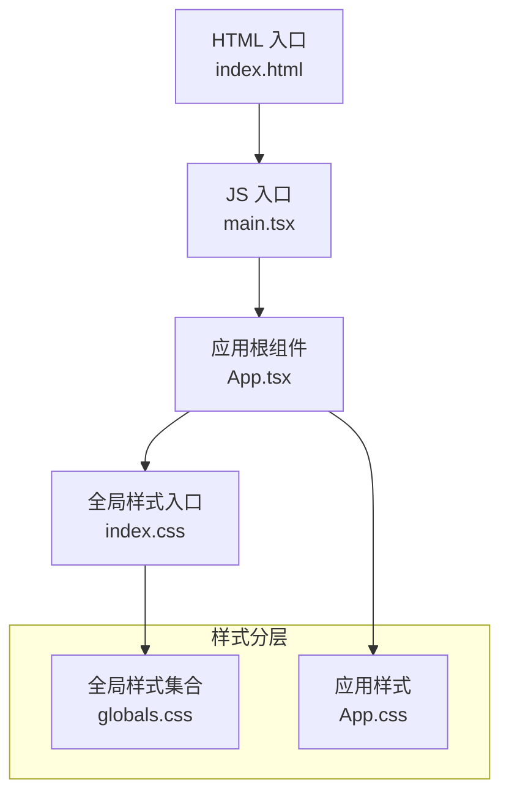
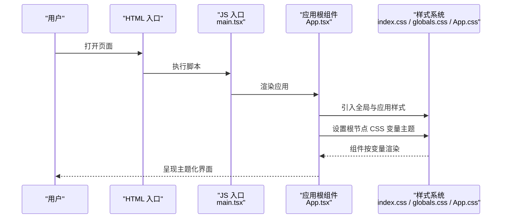
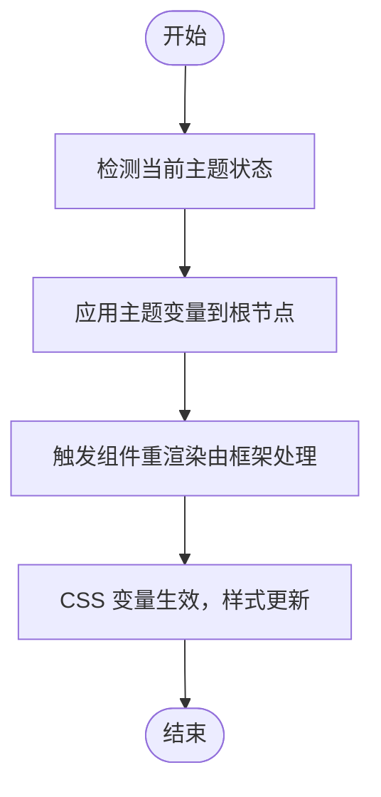
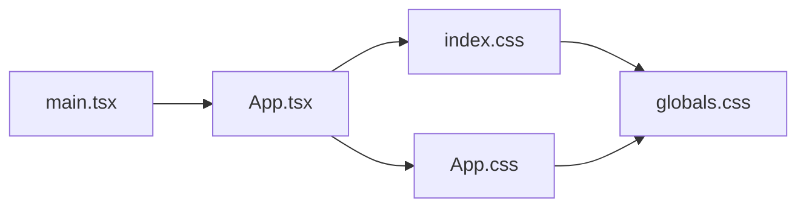

# 样式与主题

<cite>
**本文引用的文件**   
- [globals.css](file://src/styles/globals.css)
- [App.css](file://src/App.css)
- [index.css](file://src/index.css)
- [main.tsx](file://src/main.tsx)
- [App.tsx](file://src/App.tsx)
- [UI-DESIGN.md](file://docs/UI-DESIGN.md)
</cite>

## 目录
1. [简介](#简介)
2. [项目结构](#项目结构)
3. [核心组件](#核心组件)
4. [架构总览](#架构总览)
5. [详细组件分析](#详细组件分析)
6. [依赖分析](#依赖分析)
7. [性能考虑](#性能考虑)
8. [故障排查指南](#故障排查指南)
9. [结论](#结论)
10. [附录](#附录)

## 简介
本文件为 ZenNote 的样式与主题系统提供系统化文档，涵盖 CSS 架构组织、全局样式变量与主题定制机制、命名约定、组件样式隔离、响应式设计实现、主题切换原理、CSS 变量使用、样式性能优化、自定义主题创建指南、调试技巧以及跨浏览器兼容性与移动端适配方案。目标是帮助开发者快速理解并高效扩展样式体系。

## 项目结构
ZenNote 的样式采用“全局入口 + 应用级样式 + 组件级样式”的分层组织方式：
- 全局样式入口：用于引入基础样式、重置、全局变量与主题根节点定义
- 应用级样式：集中管理应用主题色板、布局与通用 UI 元素
- 组件级样式：各功能模块按需引入或内联样式，保证样式隔离与可维护性

图表来源
- [main.tsx:1-50](file://src/main.tsx#L1-L50)
- [App.tsx:1-50](file://src/App.tsx#L1-L50)
- [index.css:1-50](file://src/index.css#L1-L50)
- [globals.css:1-50](file://src/styles/globals.css#L1-L50)
- [App.css:1-50](file://src/App.css#L1-L50)

章节来源
- [main.tsx:1-50](file://src/main.tsx#L1-L50)
- [App.tsx:1-50](file://src/App.tsx#L1-L50)
- [index.css:1-50](file://src/index.css#L1-L50)
- [globals.css:1-50](file://src/styles/globals.css#L1-L50)
- [App.css:1-50](file://src/App.css#L1-L50)

## 核心组件
- 全局样式入口（index.css）
  - 负责引入全局样式集合与基础重置
  - 定义 CSS 变量作用域（如 :root），便于主题切换
- 全局样式集合（globals.css）
  - 集中定义颜色、字体、间距、阴影等设计令牌
  - 提供主题变量前缀与默认值
- 应用样式（App.css）
  - 管理应用级布局、容器、通用组件样式
  - 基于 CSS 变量进行主题化渲染

章节来源
- [index.css:1-50](file://src/index.css#L1-L50)
- [globals.css:1-50](file://src/styles/globals.css#L1-L50)
- [App.css:1-50](file://src/App.css#L1-L50)

## 架构总览
样式加载与主题切换的整体流程如下：
- HTML 入口加载 JS 入口
- JS 入口挂载 React 应用
- React 应用根组件引入全局与应用样式
- 通过 CSS 变量在根节点上声明主题键值对
- 组件通过 var() 引用变量，实现无侵入式主题切换

图表来源
- [main.tsx:1-50](file://src/main.tsx#L1-L50)
- [App.tsx:1-50](file://src/App.tsx#L1-L50)
- [index.css:1-50](file://src/index.css#L1-L50)
- [globals.css:1-50](file://src/styles/globals.css#L1-L50)
- [App.css:1-50](file://src/App.css#L1-L50)

## 详细组件分析

### 全局样式入口（index.css）
- 职责
  - 引入全局样式集合
  - 初始化基础样式与 CSS 变量作用域
- 关键点
  - 确保变量在 :root 中定义，供全应用访问
  - 避免在此文件中编写具体组件样式，保持职责单一

章节来源
- [index.css:1-50](file://src/index.css#L1-L50)

### 全局样式集合（globals.css）
- 职责
  - 集中定义设计令牌（颜色、字体、间距、圆角、阴影等）
  - 提供主题变量前缀与默认值
- 关键点
  - 使用语义化变量名（如 --color-primary、--font-base）
  - 将可变部分抽象为变量，不可变部分直接写死
  - 建议按模块分组注释，提升可读性

章节来源
- [globals.css:1-50](file://src/styles/globals.css#L1-L50)

### 应用样式（App.css）
- 职责
  - 管理应用级布局、容器、通用 UI 元素
  - 基于 CSS 变量进行主题化渲染
- 关键点
  - 使用 CSS 变量替代硬编码颜色/尺寸
  - 通过类名或属性选择器限定作用域，避免污染全局

章节来源
- [App.css:1-50](file://src/App.css#L1-L50)

### 入口与挂载（main.tsx、App.tsx）
- 职责
  - main.tsx：初始化应用、挂载根组件
  - App.tsx：引入样式、设置主题上下文（如根节点变量）
- 关键点
  - 在应用启动时设置默认主题变量
  - 提供切换主题的入口（如设置面板）更新根节点变量

章节来源
- [main.tsx:1-50](file://src/main.tsx#L1-L50)
- [App.tsx:1-50](file://src/App.tsx#L1-L50)

### 主题切换流程（概念图）

[此图为概念流程图，不映射具体源码，故不提供图表来源]

## 依赖分析
样式系统的依赖关系遵循“入口 → 应用 → 全局”的单向依赖：
- index.css 依赖 globals.css（引入集合）
- App.css 依赖 globals.css（引用变量）
- App.tsx 依赖 index.css 与 App.css（引入样式）
- main.tsx 依赖 App.tsx（挂载应用）

图表来源
- [main.tsx:1-50](file://src/main.tsx#L1-L50)
- [App.tsx:1-50](file://src/App.tsx#L1-L50)
- [index.css:1-50](file://src/index.css#L1-L50)
- [App.css:1-50](file://src/App.css#L1-L50)
- [globals.css:1-50](file://src/styles/globals.css#L1-L50)

章节来源
- [main.tsx:1-50](file://src/main.tsx#L1-L50)
- [App.tsx:1-50](file://src/App.tsx#L1-L50)
- [index.css:1-50](file://src/index.css#L1-L50)
- [App.css:1-50](file://src/App.css#L1-L50)
- [globals.css:1-50](file://src/styles/globals.css#L1-L50)

## 性能考虑
- 减少样式体积
  - 仅引入必要样式，避免重复定义
  - 使用 CSS 变量复用颜色与尺寸，降低冗余
- 提高渲染效率
  - 优先使用 CSS 变量而非 JavaScript 频繁操作 DOM
  - 避免过度嵌套与复杂选择器
- 优化加载顺序
  - 将关键样式前置，非关键样式延迟加载
- 避免重排重绘
  - 尽量使用 transform 与 opacity 做动画
  - 批量更新样式，减少多次写入

[本节为通用指导，不直接分析具体文件，故不提供章节来源]

## 故障排查指南
- 主题未生效
  - 检查根节点是否设置了正确的 CSS 变量
  - 确认样式引入顺序与优先级
- 变量冲突
  - 检查变量作用域与覆盖规则
  - 使用浏览器开发者工具查看计算后的变量值
- 样式不隔离
  - 检查组件样式是否被全局样式覆盖
  - 使用更具体的选择器或命名空间
- 移动端适配问题
  - 检查媒体查询断点与单位使用
  - 验证视口与缩放设置

章节来源
- [UI-DESIGN.md:1-50](file://docs/UI-DESIGN.md#L1-L50)

## 结论
ZenNote 的样式系统以 CSS 变量为核心，结合清晰的分层结构与命名约定，实现了灵活的主题定制与良好的可维护性。通过合理的架构设计与性能优化策略，能够在多端与多浏览器环境下保持一致的用户体验。建议持续完善设计令牌与主题规范，提升团队协作效率与样式一致性。

[本节为总结性内容，不直接分析具体文件，故不提供章节来源]

## 附录
- 命名约定建议
  - 变量命名：--theme-color-primary、--spacing-md、--font-size-base
  - 类名前缀：.zn-（组件）、.zn-layout-（布局）、.zn-theme-（主题）
- 自定义主题创建步骤
  - 在 globals.css 中新增主题变量组
  - 在应用根节点切换变量值
  - 验证组件渲染效果与对比度
- 调试技巧
  - 使用浏览器开发者工具的“样式”面板查看变量与继承
  - 临时覆盖变量定位问题
  - 使用控制台输出变量值辅助排查

[本节为通用指导，不直接分析具体文件，故不提供章节来源]