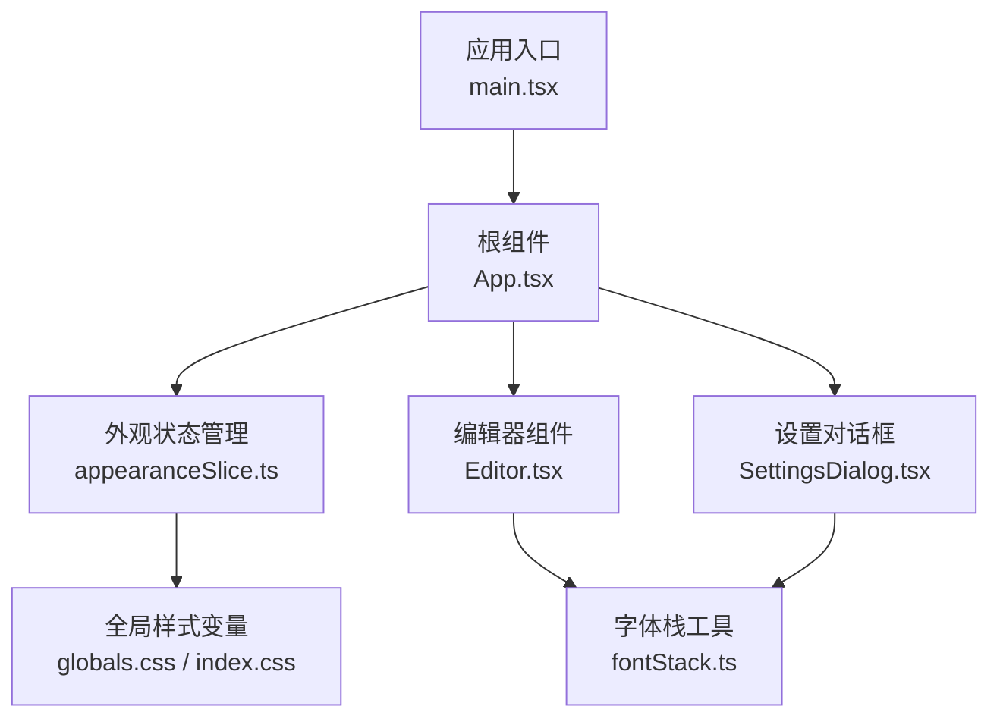
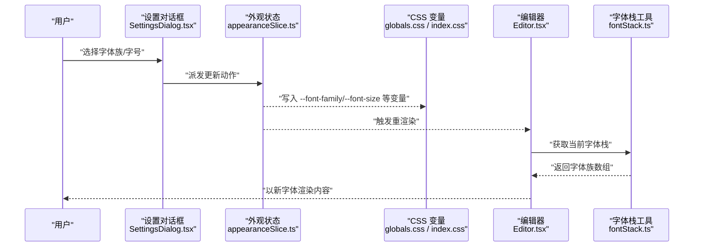
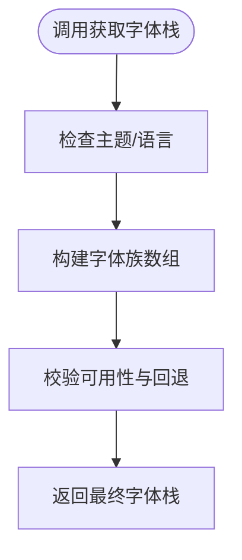
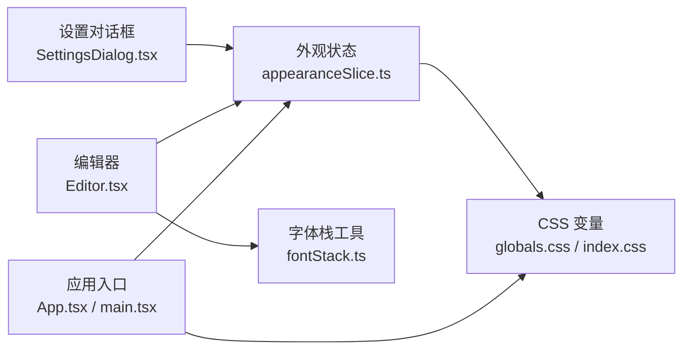

# 字体系统

<cite>
**本文引用的文件**   
- [fontStack.ts](file://src/lib/fontStack.ts)
- [appearanceSlice.ts](file://src/store/slices/appearanceSlice.ts)
- [globals.css](file://src/styles/globals.css)
- [index.css](file://src/index.css)
- [App.tsx](file://src/App.tsx)
- [main.tsx](file://src/main.tsx)
- [Editor.tsx](file://src/components/editor/Editor.tsx)
- [SettingsDialog.tsx](file://src/components/dialogs/SettingsDialog.tsx)
</cite>

## 目录
1. [简介](#简介)
2. [项目结构](#项目结构)
3. [核心组件](#核心组件)
4. [架构总览](#架构总览)
5. [详细组件分析](#详细组件分析)
6. [依赖分析](#依赖分析)
7. [性能考虑](#性能考虑)
8. [故障排查指南](#故障排查指南)
9. [结论](#结论)
10. [附录](#附录)

## 简介
本文件聚焦于 ZenNote 的“字体系统”，系统性梳理字体的来源、加载、选择与渲染策略，以及用户设置如何影响全局与编辑器内的字体表现。内容覆盖：
- 字体栈定义与回退机制
- 主题与外观状态对字体的影响
- CSS 变量与全局样式注入
- 编辑器内字体应用与动态更新
- 配置界面与持久化存储

## 项目结构
与字体系统直接相关的代码主要分布在以下位置：
- 字体栈与工具：src/lib/fontStack.ts
- 外观与主题状态：src/store/slices/appearanceSlice.ts
- 全局样式与 CSS 变量：src/styles/globals.css、src/index.css
- 应用入口与挂载点：src/main.tsx、src/App.tsx
- 编辑器与设置对话框：src/components/editor/Editor.tsx、src/components/dialogs/SettingsDialog.tsx

图表来源
- [main.tsx:1-50](file://src/main.tsx#L1-L50)
- [App.tsx:1-80](file://src/App.tsx#L1-L80)
- [appearanceSlice.ts:1-120](file://src/store/slices/appearanceSlice.ts#L1-L120)
- [globals.css:1-120](file://src/styles/globals.css#L1-L120)
- [index.css:1-80](file://src/index.css#L1-L80)
- [Editor.tsx:1-120](file://src/components/editor/Editor.tsx#L1-L120)
- [SettingsDialog.tsx:1-120](file://src/components/dialogs/SettingsDialog.tsx#L1-L120)
- [fontStack.ts:1-120](file://src/lib/fontStack.ts#L1-L120)

章节来源
- [fontStack.ts:1-120](file://src/lib/fontStack.ts#L1-L120)
- [appearanceSlice.ts:1-120](file://src/store/slices/appearanceSlice.ts#L1-L120)
- [globals.css:1-120](file://src/styles/globals.css#L1-L120)
- [index.css:1-80](file://src/index.css#L1-L80)
- [App.tsx:1-80](file://src/App.tsx#L1-L80)
- [main.tsx:1-50](file://src/main.tsx#L1-L50)
- [Editor.tsx:1-120](file://src/components/editor/Editor.tsx#L1-L120)
- [SettingsDialog.tsx:1-120](file://src/components/dialogs/SettingsDialog.tsx#L1-L120)

## 核心组件
- 字体栈工具（fontStack.ts）
  - 职责：集中维护字体族名称、默认值与回退顺序；提供获取当前字体栈的方法，便于在组件中统一使用。
  - 关键点：支持根据主题或用户偏好返回不同字体栈；保证跨平台一致性。
- 外观状态（appearanceSlice.ts）
  - 职责：管理主题、字号、行高、字体族等外观相关状态；暴露切换与持久化逻辑。
  - 关键点：与 Redux 集成，通过 action 更新并触发 UI 重渲染。
- 全局样式（globals.css、index.css）
  - 职责：定义 CSS 变量（如 --font-family、--font-size 等），为全应用提供一致的字体基线。
  - 关键点：变量由 JS 侧写入，确保运行时可动态调整。
- 编辑器（Editor.tsx）
  - 职责：将字体栈应用到编辑区域，处理输入时的字体继承与一致性。
  - 关键点：监听外观状态变化，动态更新编辑器样式。
- 设置对话框（SettingsDialog.tsx）
  - 职责：提供用户修改字体族、字号等外观设置的交互入口。
  - 关键点：保存设置到持久化存储，并触发状态更新。

章节来源
- [fontStack.ts:1-120](file://src/lib/fontStack.ts#L1-L120)
- [appearanceSlice.ts:1-120](file://src/store/slices/appearanceSlice.ts#L1-L120)
- [globals.css:1-120](file://src/styles/globals.css#L1-L120)
- [index.css:1-80](file://src/index.css#L1-L80)
- [Editor.tsx:1-120](file://src/components/editor/Editor.tsx#L1-L120)
- [SettingsDialog.tsx:1-120](file://src/components/dialogs/SettingsDialog.tsx#L1-L120)

## 架构总览
字体系统的整体流程如下：用户在设置对话框中选择字体族与字号，外观状态更新后，CSS 变量被写入，全局与编辑器样式随之刷新。

图表来源
- [SettingsDialog.tsx:1-120](file://src/components/dialogs/SettingsDialog.tsx#L1-L120)
- [appearanceSlice.ts:1-120](file://src/store/slices/appearanceSlice.ts#L1-L120)
- [globals.css:1-120](file://src/styles/globals.css#L1-L120)
- [index.css:1-80](file://src/index.css#L1-L80)
- [Editor.tsx:1-120](file://src/components/editor/Editor.tsx#L1-L120)
- [fontStack.ts:1-120](file://src/lib/fontStack.ts#L1-L120)

## 详细组件分析

### 字体栈工具（fontStack.ts）
- 设计要点
  - 集中式维护字体族列表，包含首选字体与多平台回退。
  - 提供函数返回当前环境下的最佳字体栈，避免硬编码。
  - 可扩展：按主题或语言切换不同字体栈。
- 复杂度与性能
  - 获取字体栈为 O(1) 操作，无额外开销。
  - 建议在组件层缓存结果，避免重复计算。
- 错误处理
  - 若指定字体不可用，回退到系统默认字体，保证可读性。

图表来源
- [fontStack.ts:1-120](file://src/lib/fontStack.ts#L1-L120)

章节来源
- [fontStack.ts:1-120](file://src/lib/fontStack.ts#L1-L120)

### 外观状态（appearanceSlice.ts）
- 设计要点
  - 管理字体族、字号、行高、主题等外观属性。
  - 通过 Redux slice 暴露 actions 与 reducers，支持同步与异步更新。
  - 与持久化存储集成，重启后恢复用户设置。
- 数据流
  - 设置对话框派发 action -> reducer 更新 state -> 订阅者（组件）重渲染 -> 写入 CSS 变量。
- 性能考量
  - 使用选择性订阅减少不必要的重渲染。
  - 批量更新外观属性以降低渲染次数。

章节来源
- [appearanceSlice.ts:1-120](file://src/store/slices/appearanceSlice.ts#L1-L120)

### 全局样式（globals.css、index.css）
- 设计要点
  - 定义 CSS 变量作为字体系统的“单一事实源”。
  - 通过 :root 或 body 层级注入，确保全局一致。
  - 编辑器与 UI 组件通过 var(--font-family)、var(--font-size) 引用。
- 动态更新
  - JS 侧在状态变更时更新 document.documentElement.style 或对应节点样式。
- 兼容性
  - 提供 fallback 值，确保旧浏览器或特殊环境下仍可正常显示。

章节来源
- [globals.css:1-120](file://src/styles/globals.css#L1-L120)
- [index.css:1-80](file://src/index.css#L1-L80)

### 编辑器（Editor.tsx）
- 设计要点
  - 从外观状态读取字体族与字号，应用到编辑器容器。
  - 监听状态变化，实现即时预览与切换。
  - 保持文本内容与样式的解耦，避免样式污染。
- 交互流程
  - 用户更改设置 -> 状态更新 -> 编辑器样式刷新 -> 内容重绘。
- 性能优化
  - 使用 requestAnimationFrame 或防抖减少频繁重排。
  - 仅更新必要节点，避免整树重渲染。

章节来源
- [Editor.tsx:1-120](file://src/components/editor/Editor.tsx#L1-L120)

### 设置对话框（SettingsDialog.tsx）
- 设计要点
  - 提供字体族下拉框、字号滑块等控件。
  - 实时预览效果，确认后立即生效。
  - 持久化存储用户选择，支持跨会话恢复。
- 数据绑定
  - 双向绑定到外观状态，确保 UI 与状态一致。
- 错误处理
  - 非法输入（如负数字号）进行拦截与提示。

章节来源
- [SettingsDialog.tsx:1-120](file://src/components/dialogs/SettingsDialog.tsx#L1-L120)

## 依赖分析
字体系统的关键依赖关系如下：
- 设置对话框依赖外观状态与持久化存储。
- 编辑器依赖外观状态与字体栈工具。
- 全局样式依赖 CSS 变量，由 JS 侧驱动更新。
- 应用入口负责初始化状态与样式注入。

图表来源
- [SettingsDialog.tsx:1-120](file://src/components/dialogs/SettingsDialog.tsx#L1-L120)
- [appearanceSlice.ts:1-120](file://src/store/slices/appearanceSlice.ts#L1-L120)
- [Editor.tsx:1-120](file://src/components/editor/Editor.tsx#L1-L120)
- [fontStack.ts:1-120](file://src/lib/fontStack.ts#L1-L120)
- [globals.css:1-120](file://src/styles/globals.css#L1-L120)
- [index.css:1-80](file://src/index.css#L1-L80)
- [App.tsx:1-80](file://src/App.tsx#L1-L80)
- [main.tsx:1-50](file://src/main.tsx#L1-L50)

章节来源
- [SettingsDialog.tsx:1-120](file://src/components/dialogs/SettingsDialog.tsx#L1-L120)
- [appearanceSlice.ts:1-120](file://src/store/slices/appearanceSlice.ts#L1-L120)
- [Editor.tsx:1-120](file://src/components/editor/Editor.tsx#L1-L120)
- [fontStack.ts:1-120](file://src/lib/fontStack.ts#L1-L120)
- [globals.css:1-120](file://src/styles/globals.css#L1-L120)
- [index.css:1-80](file://src/index.css#L1-L80)
- [App.tsx:1-80](file://src/App.tsx#L1-L80)
- [main.tsx:1-50](file://src/main.tsx#L1-L50)

## 性能考虑
- 字体加载
  - 优先使用系统字体，减少网络请求。
  - 如需外部字体，采用预加载与懒加载策略。
- 样式更新
  - 批量更新 CSS 变量，避免多次重排。
  - 使用 CSS 过渡平滑切换，提升用户体验。
- 渲染优化
  - 编辑器中使用虚拟滚动或增量更新，降低大文档渲染压力。
  - 避免在高频事件（如输入）中执行昂贵计算。

## 故障排查指南
- 字体未生效
  - 检查 CSS 变量是否正确写入。
  - 确认字体族名称与回退顺序合理。
  - 查看控制台是否有字体加载错误。
- 设置不持久化
  - 验证持久化存储是否可用（权限、存储空间）。
  - 检查状态同步逻辑是否完整。
- 编辑器显示异常
  - 确认编辑器容器样式未被覆盖。
  - 检查字体栈是否包含中文/英文字符集。
- 性能问题
  - 使用性能面板分析重排与重绘热点。
  - 优化状态订阅范围，减少不必要更新。

## 结论
ZenNote 的字体系统通过“字体栈工具 + 外观状态 + CSS 变量”的分层设计，实现了灵活、可配置且高性能的字体管理。用户设置可即时反映到全局与编辑器，同时具备良好的兼容性与扩展性。建议后续持续优化字体加载策略与渲染性能，以提升大型文档的编辑体验。

## 附录
- 术语表
  - 字体栈：一组按优先级排列的字体族名称，用于在不同平台与环境中选择合适的字体。
  - CSS 变量：可在运行时动态更新的样式变量，常用于主题与外观定制。
  - 外观状态：管理主题、字体、字号等视觉相关的全局状态。
- 参考路径
  - 字体栈工具：[fontStack.ts](file://src/lib/fontStack.ts)
  - 外观状态：[appearanceSlice.ts](file://src/store/slices/appearanceSlice.ts)
  - 全局样式：[globals.css](file://src/styles/globals.css)、[index.css](file://src/index.css)
  - 编辑器：[Editor.tsx](file://src/components/editor/Editor.tsx)
  - 设置对话框：[SettingsDialog.tsx](file://src/components/dialogs/SettingsDialog.tsx)
  - 应用入口：[App.tsx](file://src/App.tsx)、[main.tsx](file://src/main.tsx)