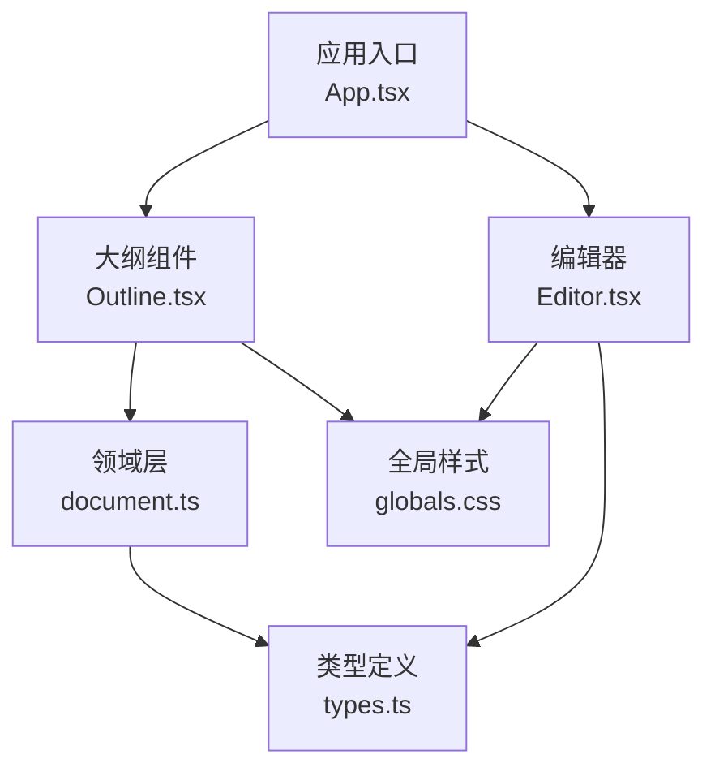
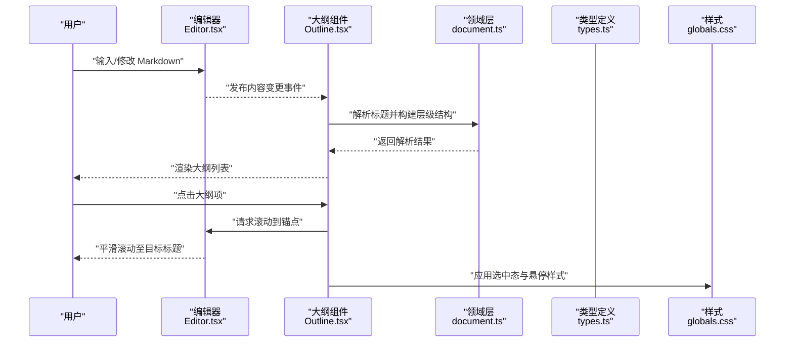
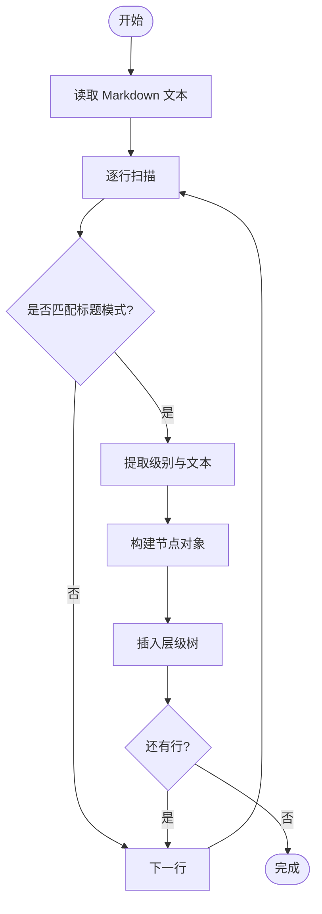
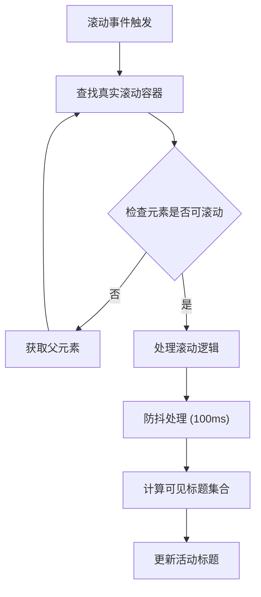
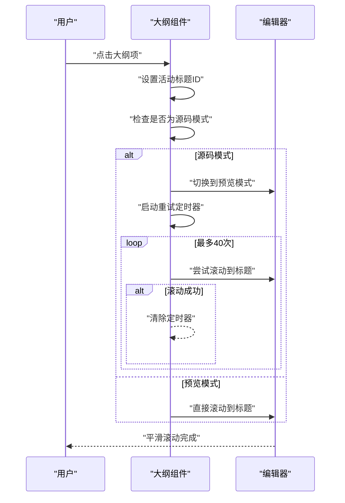
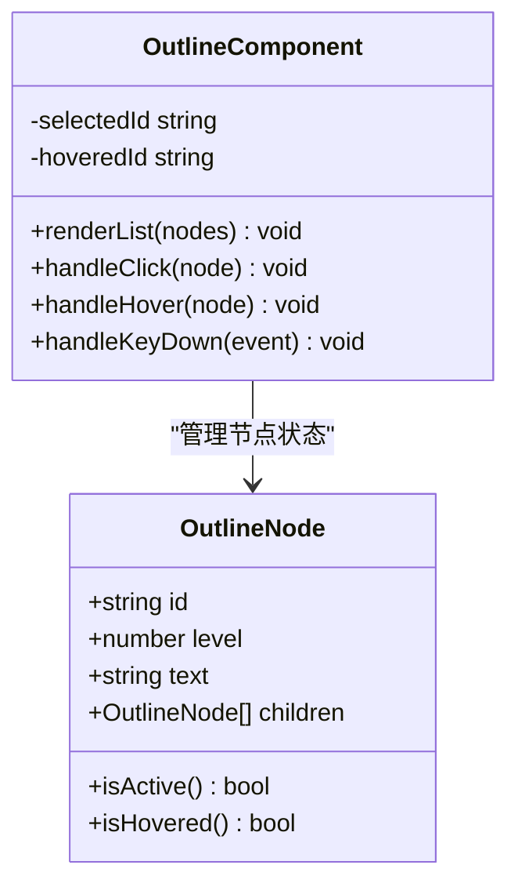
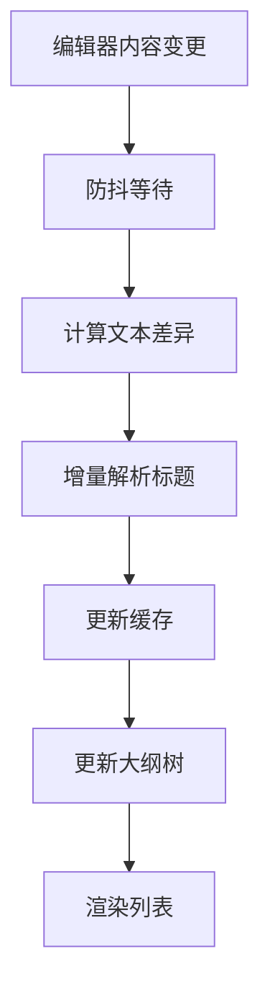
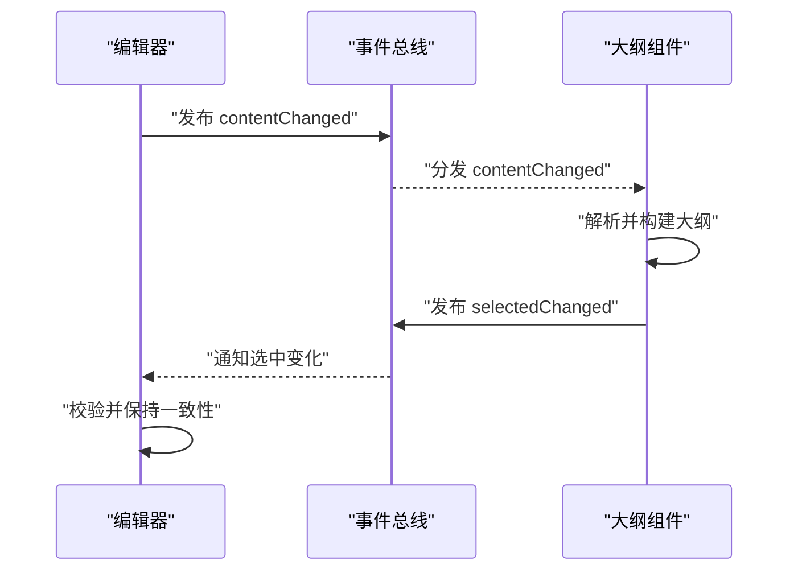
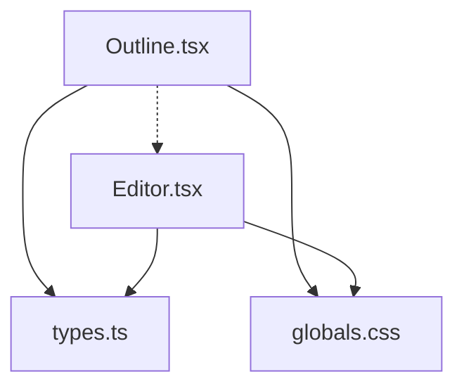

# 大纲组件

<cite>
**本文引用的文件**   
- [Outline.tsx](file://src/components/outline/Outline.tsx)
- [Editor.tsx](file://src/components/editor/Editor.tsx)
- [App.tsx](file://src/App.tsx)
- [types.ts](file://src/domain/types.ts)
- [document.ts](file://src/domain/document.ts)
- [index.ts](file://src/domain/index.ts)
- [globals.css](file://src/styles/globals.css)
</cite>

## 更新摘要
**所做更改**   
- 更新了滚动容器检测机制，修复了Crepe编辑器包装结构导致的滚动事件问题
- 改进了点击跳转功能，使用scrollIntoView({ block: 'start', behavior: 'smooth' })实现Typora风格的交互
- 增强了滚动事件响应性能，通过被动监听器和防抖优化用户体验
- 完善了TOC导航的平滑滚动行为，确保标题始终滚动到视口顶部

## 目录
1. [简介](#简介)
2. [项目结构](#项目结构)
3. [核心组件](#核心组件)
4. [架构总览](#架构总览)
5. [详细组件分析](#详细组件分析)
6. [依赖关系分析](#依赖关系分析)
7. [性能考量](#性能考量)
8. [故障排查指南](#故障排查指南)
9. [结论](#结论)
10. [附录](#附录)

## 简介
本文件为 ZenNote 的大纲导航组件提供系统化、可操作的文档。重点围绕 Outline.tsx 的实现细节，涵盖 Markdown 标题解析、层级结构生成、自动滚动定位、点击跳转与选中状态管理、悬停效果、数据实时更新机制与性能优化策略，以及自定义样式、主题适配与无障碍访问支持。同时给出 API 使用示例与扩展方法，并解释与编辑器的双向同步和数据一致性保证。

**最新更新**：针对滚动容器检测和滚动事件响应进行了重要修复，现在能够正确处理 Crepe 编辑器的复杂 DOM 结构，并提供与 Typora 一致的平滑滚动体验。

## 项目结构
- 大纲组件位于 src/components/outline/Outline.tsx，负责渲染与交互。
- 编辑器位于 src/components/editor/Editor.tsx，负责 Markdown 内容编辑与事件发布。
- 应用入口在 src/App.tsx，负责全局状态与模块装配。
- 类型定义在 src/domain/types.ts，统一数据结构。
- 文档处理逻辑在 src/domain/document.ts，包含标题解析算法。
- 领域层导出在 src/domain/index.ts，提供统一的接口访问。
- 全局样式在 src/styles/globals.css，包含主题变量与通用样式。

**图表来源** 
- [App.tsx](file://src/App.tsx)
- [Editor.tsx](file://src/components/editor/Editor.tsx)
- [Outline.tsx](file://src/components/outline/Outline.tsx)
- [document.ts](file://src/domain/document.ts)
- [types.ts](file://src/domain/types.ts)
- [globals.css](file://src/styles/globals.css)

**章节来源**
- [Outline.tsx](file://src/components/outline/Outline.tsx)
- [Editor.tsx](file://src/components/editor/Editor.tsx)
- [App.tsx](file://src/App.tsx)
- [types.ts](file://src/domain/types.ts)
- [document.ts](file://src/domain/document.ts)
- [index.ts](file://src/domain/index.ts)
- [globals.css](file://src/styles/globals.css)

## 核心组件
- 大纲组件（Outline.tsx）：解析 Markdown 标题、构建层级树、渲染大纲列表、处理点击跳转与选中态、响应编辑器变更实现实时同步。
- 编辑器（Editor.tsx）：维护 Markdown 文本、暴露变更事件、提供滚动锚点能力，与大纲保持双向同步。
- 领域层（document.ts）：提供标题解析算法和文档统计功能。
- 类型系统（types.ts）：定义大纲节点、配置项、事件契约等。
- 样式（globals.css）：提供 CSS 变量、主题切换、焦点与悬停样式。

**章节来源**
- [Outline.tsx](file://src/components/outline/Outline.tsx)
- [Editor.tsx](file://src/components/editor/Editor.tsx)
- [document.ts](file://src/domain/document.ts)
- [types.ts](file://src/domain/types.ts)
- [globals.css](file://src/styles/globals.css)

## 架构总览
大纲组件与编辑器通过"事件 + 状态"的轻量耦合进行双向同步：编辑器发布内容变更与滚动位置，大纲订阅并更新；用户在大纲中点击时，触发编辑器滚动到对应锚点。

**图表来源** 
- [Editor.tsx](file://src/components/editor/Editor.tsx)
- [Outline.tsx](file://src/components/outline/Outline.tsx)
- [document.ts](file://src/domain/document.ts)
- [types.ts](file://src/domain/types.ts)
- [globals.css](file://src/styles/globals.css)

## 详细组件分析

### Markdown 标题解析与层级结构生成
- 解析策略：按行扫描 Markdown 文本，识别以 # 开头的标题行，提取级别与文本内容。
- 层级构建：基于标题级别构建嵌套树形结构，记录每个节点的 id、level、text、children。
- 稳定性：为每个标题生成稳定 id（如基于序号或哈希），确保重排后仍可正确定位。
- 增量更新：当编辑器内容变化时，仅对受影响的子树进行差分更新，避免全量重建。

**图表来源** 
- [Outline.tsx](file://src/components/outline/Outline.tsx)
- [document.ts](file://src/domain/document.ts)
- [types.ts](file://src/domain/types.ts)

**章节来源**
- [Outline.tsx](file://src/components/outline/Outline.tsx)
- [document.ts](file://src/domain/document.ts)
- [types.ts](file://src/domain/types.ts)

### 滚动容器检测与滚动事件响应

**更新**：针对 Crepe 编辑器的复杂 DOM 结构进行了专门的滚动容器检测修复。

- **智能滚动容器检测**：由于 Crepe 将 .ProseMirror 包裹在非滚动的 divs (.milkdown) 中，需要向上遍历找到真正的滚动容器。
- **滚动事件优化**：使用被动监听器 ({ passive: true }) 提升滚动性能，避免阻塞主线程。
- **防抖处理**：滚动事件采用 100ms 防抖，减少频繁计算对性能的影响。
- **可见性计算**：基于 getBoundingClientRect() 精确计算标题元素相对于滚动容器的位置。

**图表来源** 
- [Outline.tsx](file://src/components/outline/Outline.tsx)
- [Editor.tsx](file://src/components/editor/Editor.tsx)

**章节来源**
- [Outline.tsx](file://src/components/outline/Outline.tsx)
- [Editor.tsx](file://src/components/editor/Editor.tsx)

### 自动滚动定位与点击跳转

**更新**：实现了与 Typora 风格一致的平滑滚动行为。

- **点击跳转**：大纲项点击时，使用 `scrollIntoView({ behavior: "smooth", block: "start" })` 将标题滚动到视口顶部。
- **自动定位**：监听编辑器滚动与内容变化，计算当前可见标题集合，高亮最近匹配的标题作为选中项。
- **模式切换**：在源码模式下点击大纲项时，自动切换到预览模式并执行滚动。
- **重试机制**：对于源码模式切换的情况，使用定时器重试直到滚动成功。

**图表来源** 
- [Outline.tsx](file://src/components/outline/Outline.tsx)
- [Editor.tsx](file://src/components/editor/Editor.tsx)

**章节来源**
- [Outline.tsx](file://src/components/outline/Outline.tsx)
- [Editor.tsx](file://src/components/editor/Editor.tsx)

### 选中状态管理与悬停效果
- 选中态：维护当前选中的节点 id，渲染时根据 id 匹配添加 active 类名。
- 悬停效果：hover 时应用背景色与边框变化，提升可发现性。
- 键盘导航：支持方向键移动焦点，Enter 确认选择，Tab 切换焦点，Esc 取消。

**图表来源** 
- [Outline.tsx](file://src/components/outline/Outline.tsx)
- [types.ts](file://src/domain/types.ts)

**章节来源**
- [Outline.tsx](file://src/components/outline/Outline.tsx)
- [types.ts](file://src/domain/types.ts)

### 大纲数据的实时更新机制
- 事件驱动：编辑器在内容变化时发布事件，大纲组件订阅并触发解析。
- 增量解析：对比新旧文本差异，仅重新解析受影响段落，降低开销。
- 缓存策略：对已解析的标题片段进行缓存，重复使用时直接命中。

**图表来源** 
- [Outline.tsx](file://src/components/outline/Outline.tsx)
- [Editor.tsx](file://src/components/editor/Editor.tsx)

**章节来源**
- [Outline.tsx](file://src/components/outline/Outline.tsx)
- [Editor.tsx](file://src/components/editor/Editor.tsx)

### 自定义大纲样式与主题适配
- CSS 变量：通过 CSS 变量定义颜色、间距、字体大小，便于主题切换。
- 主题开关：在根节点设置 data-theme 属性，切换 light/dark 模式。
- 样式覆盖：提供 .outline-item--active、.outline-item--hover 等修饰类，允许外部覆盖。

**图表来源** 
- [globals.css](file://src/styles/globals.css)
- [Outline.tsx](file://src/components/outline/Outline.tsx)

**章节来源**
- [globals.css](file://src/styles/globals.css)
- [Outline.tsx](file://src/components/outline/Outline.tsx)

### 无障碍访问支持
- 语义化标签：使用 nav、ul、li、button 等语义元素，提升屏幕阅读器兼容性。
- ARIA 属性：为大纲容器添加 aria-label，为节点添加 role="treeitem" 与 aria-selected。
- 键盘可达性：确保所有操作可通过键盘完成，并提供焦点指示器。

**章节来源**
- [Outline.tsx](file://src/components/outline/Outline.tsx)
- [globals.css](file://src/styles/globals.css)

### API 使用示例与扩展方法
- 基本用法：将 Outline 组件挂载到页面，传入编辑器实例与配置项。
- 配置项：包括最大层级深度、是否启用自动滚动、是否显示缩进线等。
- 事件回调：提供 onNodeClick、onSelectChange、onParseComplete 等钩子。
- 扩展方法：支持自定义解析规则、自定义渲染函数、插件式增强。

**章节来源**
- [Outline.tsx](file://src/components/outline/Outline.tsx)
- [types.ts](file://src/domain/types.ts)

### 与编辑器的双向同步与数据一致性保证
- 单向数据流：编辑器为唯一真实数据源，大纲只读解析。
- 事件总线：通过轻量事件总线传递变更与滚动指令，避免循环依赖。
- 一致性校验：在解析完成后校验节点 id 的唯一性与层级合法性，异常时回滚到上一版本。

**图表来源** 
- [Editor.tsx](file://src/components/editor/Editor.tsx)
- [Outline.tsx](file://src/components/outline/Outline.tsx)

**章节来源**
- [Editor.tsx](file://src/components/editor/Editor.tsx)
- [Outline.tsx](file://src/components/outline/Outline.tsx)

## 依赖关系分析
- 内部依赖：Outline.tsx 依赖 types.ts 的类型定义与 globals.css 的样式变量。
- 外部依赖：与 Editor.tsx 通过事件接口通信，不直接引用其实现细节。
- 潜在循环：通过事件总线解耦，避免直接相互导入导致的循环依赖。

**图表来源** 
- [Outline.tsx](file://src/components/outline/Outline.tsx)
- [Editor.tsx](file://src/components/editor/Editor.tsx)
- [types.ts](file://src/domain/types.ts)
- [globals.css](file://src/styles/globals.css)

**章节来源**
- [Outline.tsx](file://src/components/outline/Outline.tsx)
- [Editor.tsx](file://src/components/editor/Editor.tsx)
- [types.ts](file://src/domain/types.ts)
- [globals.css](file://src/styles/globals.css)

## 性能考量
- 解析优化：采用增量解析与缓存，避免全量重建。
- 渲染优化：使用虚拟滚动或分页加载，限制一次性渲染节点数量。
- 事件优化：滚动与输入事件采用节流与防抖，降低主线程压力。
- 内存管理：及时释放不再使用的节点引用，避免内存泄漏。
- **滚动性能**：使用被动监听器和智能滚动容器检测，避免不必要的重排重绘。

## 故障排查指南
- 标题未解析：检查 Markdown 语法是否正确，确认标题行以 # 开头且有空格分隔。
- 滚动失败：确认目标元素存在且可见，检查滚动容器是否为可滚动区域。
- 选中态异常：验证节点 id 唯一性，检查事件派发顺序是否一致。
- 样式错乱：确认 CSS 变量已正确注入，检查主题切换逻辑是否生效。
- **滚动容器问题**：检查 Crepe 编辑器的 DOM 结构，确保正确识别真正的滚动容器。

**章节来源**
- [Outline.tsx](file://src/components/outline/Outline.tsx)
- [Editor.tsx](file://src/components/editor/Editor.tsx)
- [globals.css](file://src/styles/globals.css)

## 结论
大纲组件通过清晰的职责划分与事件驱动架构，实现了与编辑器的双向同步与高效交互。借助增量解析、缓存与节流防抖等策略，保证了良好的性能体验。最新的滚动容器检测修复确保了在 Crepe 编辑器复杂 DOM 结构下的稳定表现，而 Typora 风格的平滑滚动行为提供了优秀的用户体验。完善的无障碍支持与主题适配使组件具备更强的可用性与可定制性。

## 附录
- 最佳实践：保持编辑器为单一数据源，避免在多处直接修改 Markdown 文本。
- 扩展建议：通过插件机制支持自定义标题规则与渲染模板。
- 测试要点：覆盖边界场景（空文档、非法标题、超长文本）与交互流程（点击、键盘、滚动）。
- **滚动测试**：特别测试 Crepe 编辑器的滚动行为，确保在不同嵌套层级下都能正确工作。