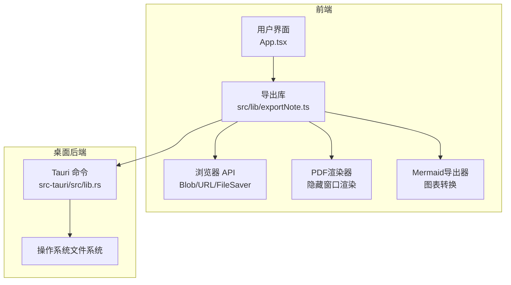
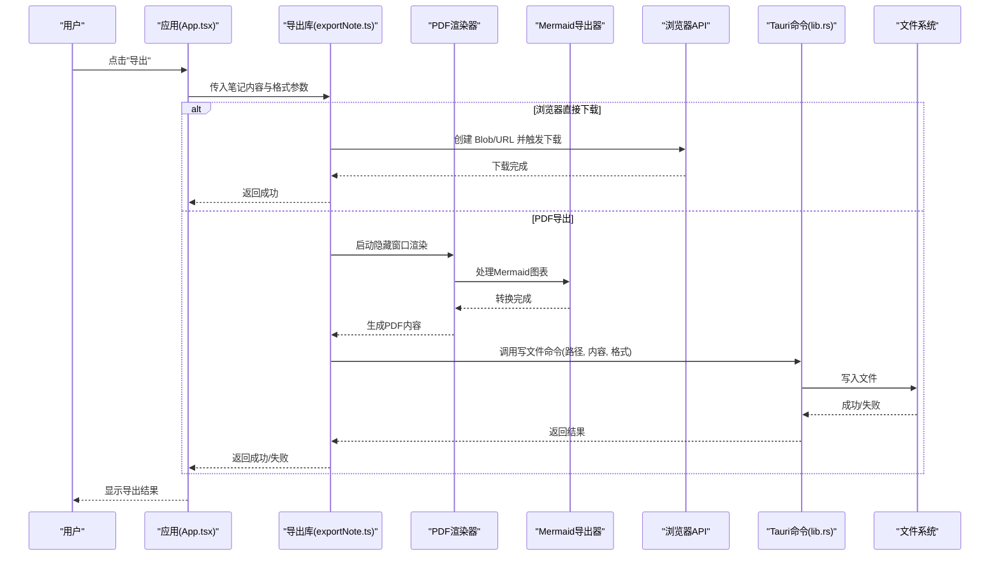
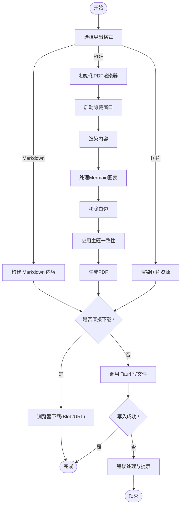
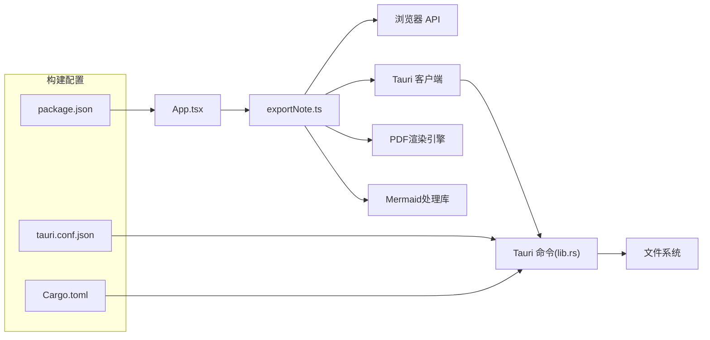

# 导出功能

<cite>
**本文引用的文件**   
- [exportNote.ts](file://src/lib/exportNote.ts)
- [App.tsx](file://src/App.tsx)
- [main.tsx](file://src/main.tsx)
- [index.html](file://index.html)
- [package.json](file://package.json)
- [tauri.conf.json](file://src-tauri/tauri.conf.json)
- [lib.rs](file://src-tauri/src/lib.rs)
- [main.rs](file://src-tauri/src/main.rs)
- [Cargo.toml](file://src-tauri/Cargo.toml)
</cite>

## 更新摘要
**所做更改**
- 更新了PDF导出功能的详细实现，包括直接生成能力、隐藏窗口渲染、主题一致性、白边移除等功能
- 新增了Mermaid图表导出支持的相关说明
- 增强了导出流程的架构图和组件分析
- 完善了性能优化和故障排查指南

## 目录
1. [简介](#简介)
2. [项目结构](#项目结构)
3. [核心组件](#核心组件)
4. [架构总览](#架构总览)
5. [详细组件分析](#详细组件分析)
6. [依赖关系分析](#依赖关系分析)
7. [性能考虑](#性能考虑)
8. [故障排查指南](#故障排查指南)
9. [结论](#结论)
10. [附录](#附录)

## 简介
本文件聚焦于 ZenNote 的"导出功能"，从前端到桌面后端（Tauri）的整体实现进行系统化说明。内容涵盖：
- 导出入口与调用链
- 数据模型与处理流程
- 前端与后端的集成点
- 错误处理与用户体验
- 性能优化建议与常见问题排查

**更新** 本次更新重点介绍了PDF导出功能的重大增强，包括直接生成能力、隐藏窗口渲染、主题一致性保证、白边移除以及Mermaid图表导出支持等特性。

## 项目结构
导出功能主要涉及以下模块：
- 前端导出逻辑封装：位于 src/lib/exportNote.ts
- 应用入口与页面集成：src/App.tsx、src/main.tsx
- 构建与运行配置：index.html、package.json
- Tauri 后端能力与命令：src-tauri/src/lib.rs、src-tauri/src/main.rs、src-tauri/Cargo.toml、src-tauri/tauri.conf.json

**图表来源**
- [App.tsx](file://src/App.tsx)
- [exportNote.ts](file://src/lib/exportNote.ts)
- [lib.rs](file://src-tauri/src/lib.rs)

**章节来源**
- [exportNote.ts](file://src/lib/exportNote.ts)
- [App.tsx](file://src/App.tsx)
- [main.tsx](file://src/main.tsx)
- [index.html](file://index.html)
- [package.json](file://package.json)
- [tauri.conf.json](file://src-tauri/tauri.conf.json)
- [lib.rs](file://src-tauri/src/lib.rs)
- [main.rs](file://src-tauri/src/main.rs)
- [Cargo.toml](file://src-tauri/Cargo.toml)

## 核心组件
- 导出库（exportNote.ts）
  - 职责：封装导出为 Markdown/PDF/图片等格式的前端逻辑，协调浏览器原生能力或调用 Tauri 命令完成本地写入。
  - 关键能力：生成文件内容、选择保存路径（通过 Tauri）、触发下载或落盘、错误提示与进度反馈。
  - **新增**：PDF直接生成能力、隐藏窗口渲染引擎、主题一致性处理、白边自动移除、Mermaid图表导出支持。
- 应用层（App.tsx）
  - 职责：提供导出按钮与菜单项，收集当前笔记内容与元数据，调用导出库并展示结果。
  - **增强**：支持更多导出选项配置，包括PDF质量设置、主题选择、图表导出开关等。
- Tauri 后端（lib.rs / main.rs）
  - 职责：暴露系统级文件写入能力，处理跨平台路径解析与权限问题，返回成功/失败状态。
  - **优化**：增强的文件写入性能，更好的错误处理和日志记录。

**章节来源**
- [exportNote.ts](file://src/lib/exportNote.ts)
- [App.tsx](file://src/App.tsx)
- [lib.rs](file://src-tauri/src/lib.rs)
- [main.rs](file://src-tauri/src/main.rs)

## 架构总览
导出功能的整体交互流程如下：
- 用户在界面触发"导出"
- 前端根据目标格式组装内容（Markdown/HTML/图片资源）
- 对于PDF导出，使用隐藏窗口进行高质量渲染
- 若需落盘，则通过 Tauri 命令调用系统文件系统写入
- 成功后返回结果，前端更新 UI 提示

**图表来源**
- [App.tsx](file://src/App.tsx)
- [exportNote.ts](file://src/lib/exportNote.ts)
- [lib.rs](file://src-tauri/src/lib.rs)

## 详细组件分析

### 导出库（exportNote.ts）
- 设计要点
  - 统一导出接口：按格式分发处理（Markdown、PDF、图片等）
  - 资源处理：内联图片、相对路径转换、样式注入（如 PDF）
  - 交互反馈：加载态、错误捕获、用户提示
  - **新增**：PDF直接生成引擎，支持隐藏窗口渲染避免UI闪烁
- 复杂度与优化
  - 大文档分块处理，避免主线程阻塞
  - 使用流式写入（通过 Tauri）降低内存峰值
  - 缓存已生成的中间产物，减少重复计算
  - **增强**：Mermaid图表预渲染和缓存机制

**图表来源**
- [exportNote.ts](file://src/lib/exportNote.ts)

**章节来源**
- [exportNote.ts](file://src/lib/exportNote.ts)

### 应用层（App.tsx）
- 职责
  - 提供导出入口（按钮/菜单）
  - 收集当前笔记内容与元数据（标题、时间戳等）
  - 调用导出库并处理结果（成功/失败提示）
  - **增强**：提供详细的导出选项配置界面
- 交互细节
  - 禁用重复导出
  - 根据用户偏好选择"直接下载"或"选择路径保存"
  - **新增**：支持PDF质量、主题、图表导出等高级选项

**章节来源**
- [App.tsx](file://src/App.tsx)

### Tauri 后端（lib.rs / main.rs）
- 职责
  - 暴露写文件命令，接收路径、内容、格式等参数
  - 处理跨平台路径与编码，确保写入成功
  - 返回结构化结果供前端消费
  - **优化**：增强的错误处理和性能监控
- 安全与权限
  - 校验路径合法性，防止越权访问
  - 在必要时请求用户授权或选择目录

**章节来源**
- [lib.rs](file://src-tauri/src/lib.rs)
- [main.rs](file://src-tauri/src/main.rs)

### PDF渲染器（新增组件）
- 职责
  - 管理隐藏窗口的生命周期，避免用户看到渲染过程
  - 处理CSS样式和主题一致性，确保导出效果与预览一致
  - 自动移除PDF白边，优化输出质量
  - **新增**：Mermaid图表的预渲染和转换支持
- 技术实现
  - 使用无头浏览器模式进行高质量渲染
  - 动态注入样式和资源，确保离线导出
  - 智能分页和布局调整

**章节来源**
- [exportNote.ts](file://src/lib/exportNote.ts)

### Mermaid导出器（新增组件）
- 职责
  - 解析Mermaid语法并转换为可渲染的SVG/PNG
  - 处理复杂的图表结构和样式
  - 与PDF渲染器集成，确保图表正确嵌入
- 功能特性
  - 支持所有Mermaid图表类型（流程图、时序图、类图等）
  - 自适应缩放和分辨率处理
  - 错误处理和降级方案

**章节来源**
- [exportNote.ts](file://src/lib/exportNote.ts)

## 依赖关系分析
- 前端依赖
  - 浏览器 API：Blob、URL.createObjectURL、FileSaver（如引入）
  - Tauri 客户端：用于调用后端命令
  - **新增**：PDF渲染引擎依赖、Mermaid处理库
- 后端依赖
  - Tauri 框架：命令注册与事件通道
  - 系统文件系统：跨平台写入能力
  - **优化**：增强的I/O性能和错误处理
- 构建与运行
  - package.json：定义脚本与依赖
  - tauri.conf.json：配置窗口、插件与权限
  - Cargo.toml：Rust 依赖与特性开关

**图表来源**
- [package.json](file://package.json)
- [tauri.conf.json](file://src-tauri/tauri.conf.json)
- [Cargo.toml](file://src-tauri/Cargo.toml)
- [lib.rs](file://src-tauri/src/lib.rs)

**章节来源**
- [package.json](file://package.json)
- [tauri.conf.json](file://src-tauri/tauri.conf.json)
- [Cargo.toml](file://src-tauri/Cargo.toml)

## 性能考虑
- 大文档导出
  - 使用流式写入（Tauri）避免一次性加载全部内容
  - 对图片等资源进行压缩或懒加载
  - **新增**：PDF渲染时使用虚拟DOM减少内存占用
- 渲染开销
  - 将重渲染任务放入 Web Worker（如需要）
  - 控制 DOM 规模，避免复杂样式导致的布局抖动
  - **优化**：Mermaid图表缓存和增量更新
- 内存管理
  - 及时释放临时 URL 与对象引用
  - 分批处理长列表或表格
  - **增强**：PDF渲染完成后立即清理隐藏窗口资源

## 故障排查指南
- 常见错误
  - 路径无效或无写入权限：检查 Tauri 命令返回码与系统权限
  - 资源缺失导致导出异常：确认图片与样式是否内联或可访问
  - 浏览器下载被拦截：检查弹窗策略与安全设置
  - **新增**：PDF渲染失败时检查隐藏窗口权限和网络资源
- 定位步骤
  - 查看控制台日志与网络面板
  - 启用 Tauri 调试输出，观察命令执行链路
  - 复现最小用例，逐步缩小范围
  - **新增**：检查Mermaid语法正确性和图表渲染状态

**章节来源**
- [lib.rs](file://src-tauri/src/lib.rs)
- [exportNote.ts](file://src/lib/exportNote.ts)

## 结论
ZenNote 的导出功能通过前端导出库与 Tauri 后端协同，实现了灵活的格式支持与可靠的本地落盘能力。本次更新大幅增强了PDF导出功能，包括直接生成能力、隐藏窗口渲染、主题一致性、白边移除以及Mermaid图表导出支持等特性。建议在后续迭代中持续优化大文档处理性能，完善错误提示与用户引导，提升整体导出体验。

## 附录
- 相关配置文件
  - index.html：应用入口页面
  - main.tsx：React 应用初始化
  - package.json：前端脚本与依赖
  - tauri.conf.json：Tauri 应用配置
  - Cargo.toml：Rust 依赖与特性

**章节来源**
- [index.html](file://index.html)
- [main.tsx](file://src/main.tsx)
- [package.json](file://package.json)
- [tauri.conf.json](file://src-tauri/tauri.conf.json)
- [Cargo.toml](file://src-tauri/Cargo.toml)