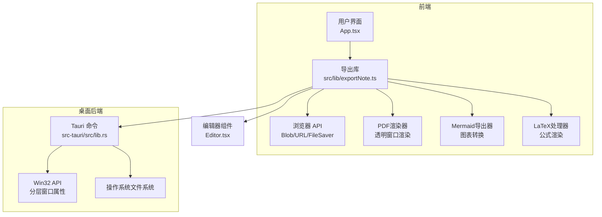
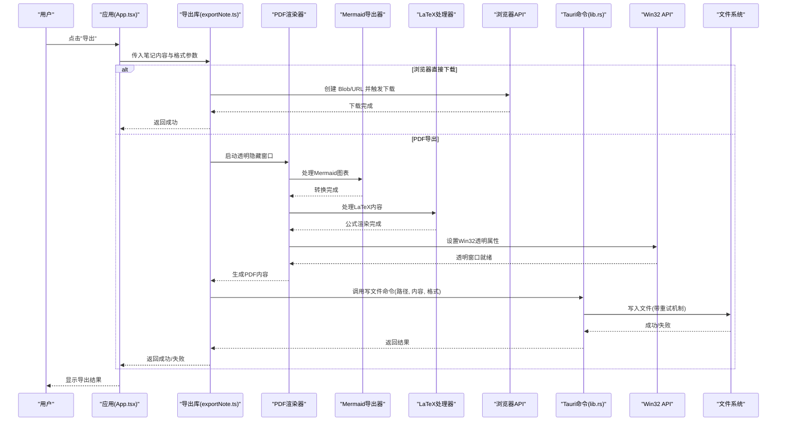
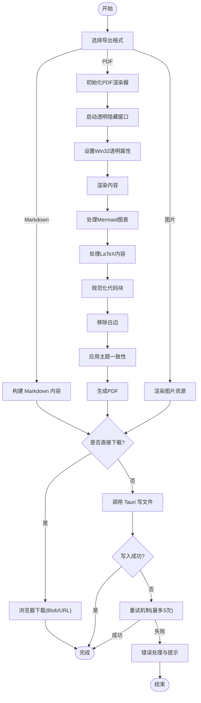
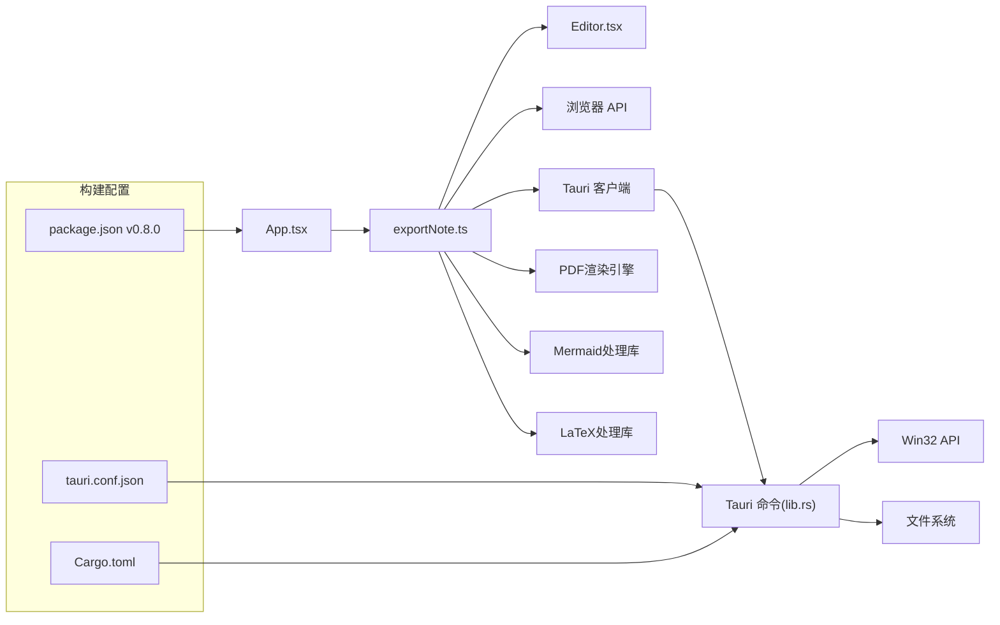

# 导出功能

<cite>
**本文引用的文件**   
- [exportNote.ts](file://src/lib/exportNote.ts)
- [Editor.tsx](file://src/components/editor/Editor.tsx)
- [globals.css](file://src/styles/globals.css)
- [package.json](file://package.json)
- [lib.rs](file://src-tauri/src/lib.rs)
</cite>

## 更新摘要
**所做更改**
- 增强了CSS选择器以支持新的`.zn-toc`和`.zn-fm`类，确保目录和YAML前置元数据的正确导出
- 改进了代码块规范化处理，优化Mermaid图表和LaTeX内容的导出质量
- 引入了LaTeX内容保留机制，确保数学公式在导出时保持渲染状态
- 更新了版本号为v0.8.0，反映了最新的导出系统增强

## 目录
1. [简介](#简介)
2. [项目结构](#项目结构)
3. [核心组件](#核心组件)
4. [架构总览](#架构总览)
5. [详细组件分析](#详细组件分析)
6. [依赖关系分析](#依赖关系分析)
7. [性能考虑](#性能考虑)
8. [故障排查指南](#故障排查指南)
9. [结论](#结论)
10. [附录](#附录)

## 简介
本文件聚焦于 ZenNote 的"导出功能"，从前端到桌面后端（Tauri）的整体实现进行系统化说明。内容涵盖：
- 导出入口与调用链
- 数据模型与处理流程
- 前端与后端的集成点
- 错误处理与用户体验
- 性能优化建议与常见问题排查

**重大更新** 本次v0.8.0更新重点介绍了导出系统的增强功能，包括LaTeX内容保留、CSS选择器更新支持新的UI组件、改进的代码块规范化处理，以及更稳定的Mermaid图表导出能力。

## 项目结构
导出功能主要涉及以下模块：
- 前端导出逻辑封装：位于 src/lib/exportNote.ts
- 编辑器组件集成：src/components/editor/Editor.tsx
- 样式定义：src/styles/globals.css
- 应用配置：package.json
- Tauri 后端能力与命令：src-tauri/src/lib.rs

**图表来源**
- [exportNote.ts](file://src/lib/exportNote.ts)
- [Editor.tsx](file://src/components/editor/Editor.tsx)
- [lib.rs](file://src-tauri/src/lib.rs)

**章节来源**
- [exportNote.ts](file://src/lib/exportNote.ts)
- [Editor.tsx](file://src/components/editor/Editor.tsx)
- [globals.css](file://src/styles/globals.css)
- [package.json](file://package.json)
- [lib.rs](file://src-tauri/src/lib.rs)

## 核心组件
- 导出库（exportNote.ts）
  - 职责：封装导出为 Markdown/PDF/图片等格式的前端逻辑，协调浏览器原生能力或调用 Tauri 命令完成本地写入。
  - 关键能力：生成文件内容、选择保存路径（通过 Tauri）、触发下载或落盘、错误提示与进度反馈。
  - **v0.8.0增强**：LaTeX内容保留机制、增强的CSS选择器支持、改进的代码块规范化、更稳定的Mermaid导出。
- 编辑器组件（Editor.tsx）
  - 职责：提供导出按钮与菜单项，收集当前笔记内容与元数据，调用导出库并展示结果。
  - **增强**：支持更多导出选项配置，包括PDF质量设置、主题选择、图表导出开关等。
- Tauri 后端（lib.rs）
  - 职责：暴露系统级文件写入能力，处理跨平台路径解析与权限问题，返回成功/失败状态。
  - **重大优化**：Win32透明窗口支持、增强的错误处理、重试机制、详细的调试日志记录。

**章节来源**
- [exportNote.ts](file://src/lib/exportNote.ts)
- [Editor.tsx](file://src/components/editor/Editor.tsx)
- [lib.rs](file://src-tauri/src/lib.rs)

## 架构总览
导出功能的整体交互流程如下：
- 用户在界面触发"导出"
- 前端根据目标格式组装内容（Markdown/HTML/图片资源）
- 对于PDF导出，使用透明隐藏窗口进行高质量渲染
- 若需落盘，则通过 Tauri 命令调用系统文件系统写入
- 成功后返回结果，前端更新 UI 提示

**图表来源**
- [exportNote.ts](file://src/lib/exportNote.ts)
- [lib.rs](file://src-tauri/src/lib.rs)

## 详细组件分析

### 导出库（exportNote.ts）
- 设计要点
  - 统一导出接口：按格式分发处理（Markdown、PDF、图片等）
  - 资源处理：内联图片、相对路径转换、样式注入（如 PDF）
  - 交互反馈：加载态、错误捕获、用户提示
  - **v0.8.0增强**：LaTeX内容保留机制、增强的CSS选择器支持、改进的代码块规范化处理
- 复杂度与优化
  - 大文档分块处理，避免主线程阻塞
  - 使用流式写入（通过 Tauri）降低内存峰值
  - 缓存已生成的中间产物，减少重复计算
  - **增强**：Mermaid图表预渲染和缓存机制，智能超时回退机制，LaTeX公式缓存

**图表来源**
- [exportNote.ts](file://src/lib/exportNote.ts)

**章节来源**
- [exportNote.ts](file://src/lib/exportNote.ts)

### 编辑器组件（Editor.tsx）
- 职责
  - 提供导出入口（按钮/菜单）
  - 收集当前笔记内容与元数据（标题、时间戳等）
  - 调用导出库并处理结果（成功/失败提示）
  - **增强**：提供详细的导出选项配置界面
- 交互细节
  - 禁用重复导出
  - 根据用户偏好选择"直接下载"或"选择路径保存"
  - **新增**：支持PDF质量、主题、图表导出等高级选项

**章节来源**
- [Editor.tsx](file://src/components/editor/Editor.tsx)

### Tauri 后端（lib.rs）
- 职责
  - 暴露写文件命令，接收路径、内容、格式等参数
  - 处理跨平台路径与编码，确保写入成功
  - 返回结构化结果供前端消费
  - **重大优化**：Win32透明窗口支持、增强的错误处理和性能监控、重试机制
- 安全与权限
  - 校验路径合法性，防止越权访问
  - 在必要时请求用户授权或选择目录
- **新增功能**
  - Win32分层窗口属性设置，实现完全透明的渲染窗口
  - 增强的调试日志记录，支持发布版本的问题诊断
  - 智能重试机制，提高PDF导出的成功率

**章节来源**
- [lib.rs](file://src-tauri/src/lib.rs)

### LaTeX内容处理器（新增功能）
- 职责
  - 检测并保留已渲染的LaTeX公式内容
  - 确保数学符号和公式在导出时保持正确的渲染状态
  - 处理KaTeX渲染的输出，避免转换为原始源代码
- 技术实现
  - 识别包含`.katex`类的预览元素
  - 提取渲染后的HTML内容而非原始LaTeX源码
  - 保持公式的样式和布局完整性

### CSS选择器增强（v0.8.0更新）
- 职责
  - 扩展CSS选择器正则表达式以支持新的UI组件类
  - 确保`.zn-toc`（目录）和`.zn-fm`（YAML前置元数据）的正确导出
  - 维护导出内容与编辑器的视觉一致性
- 技术实现
  - 更新KEEP_RE正则表达式，添加对新类名的匹配
  - 支持复杂的CSS选择器模式，包括后代选择器和属性选择器
  - 确保媒体查询和支持规则中的选择器也能被正确处理

**章节来源**
- [exportNote.ts](file://src/lib/exportNote.ts)
- [globals.css](file://src/styles/globals.css)

### Mermaid导出器（增强组件）
- 职责
  - 解析Mermaid语法并转换为可渲染的SVG/PNG
  - 处理复杂的图表结构和样式
  - 与PDF渲染器集成，确保图表正确嵌入
- 功能特性
  - 支持所有Mermaid图表类型（流程图、时序图、类图等）
  - 自适应缩放和分辨率处理
  - 错误处理和降级方案
  - **增强**：更好的错误处理和渲染稳定性，改进的代码块规范化

**章节来源**
- [exportNote.ts](file://src/lib/exportNote.ts)

### Win32透明窗口支持（新增功能）
- 职责
  - 使用Win32分层窗口属性设置窗口透明度
  - 确保渲染窗口对用户完全不可见
  - 处理窗口样式和扩展样式的设置
- 技术实现
  - 使用WS_EX_LAYERED属性启用alpha混合
  - 设置LWA_ALPHA为0实现完全透明
  - 配置WS_EX_TOOLWINDOW避免任务栏显示
  - 清除WS_EX_APPWINDOW防止任务栏按钮出现

**章节来源**
- [lib.rs](file://src-tauri/src/lib.rs)

## 依赖关系分析
- 前端依赖
  - 浏览器 API：Blob、URL.createObjectURL、FileSaver（如引入）
  - Tauri 客户端：用于调用后端命令
  - **新增**：PDF渲染引擎依赖、Mermaid处理库、Win32 API支持、LaTeX处理依赖
- 后端依赖
  - Tauri 框架：命令注册与事件通道
  - 系统文件系统：跨平台写入能力
  - **新增**：Win32 API支持、webview2_com库、windows crate
  - **优化**：增强的I/O性能和错误处理
- 构建与运行
  - package.json：定义脚本与依赖，版本更新至0.8.0
  - tauri.conf.json：配置窗口、插件与权限
  - Cargo.toml：Rust 依赖与特性开关

**图表来源**
- [package.json](file://package.json)
- [lib.rs](file://src-tauri/src/lib.rs)

**章节来源**
- [package.json](file://package.json)
- [lib.rs](file://src-tauri/src/lib.rs)

## 性能考虑
- 大文档导出
  - 使用流式写入（Tauri）避免一次性加载全部内容
  - 对图片等资源进行压缩或懒加载
  - **新增**：PDF渲染时使用虚拟DOM减少内存占用，LaTeX公式缓存机制
- 渲染开销
  - 将重渲染任务放入 Web Worker（如需要）
  - 控制 DOM 规模，避免复杂样式导致的布局抖动
  - **优化**：Mermaid图表缓存和增量更新，LaTeX渲染结果缓存
- 内存管理
  - 及时释放临时 URL 与对象引用
  - 分批处理长列表或表格
  - **增强**：PDF渲染完成后立即清理隐藏窗口资源，LaTeX渲染缓存清理
- **新增优化**
  - 透明窗口渲染减少UI闪烁和性能开销
  - 智能重试机制避免不必要的重复操作
  - 优化的错误处理减少异常路径的性能影响
  - CSS选择器优化，减少不必要的DOM遍历

## 故障排查指南
- 常见错误
  - 路径无效或无写入权限：检查 Tauri 命令返回码与系统权限
  - 资源缺失导致导出异常：确认图片与样式是否内联或可访问
  - 浏览器下载被拦截：检查弹窗策略与安全设置
  - **新增**：PDF渲染失败时检查透明窗口权限和网络资源，LaTeX渲染错误检查KaTeX依赖
- 定位步骤
  - 查看控制台日志与网络面板
  - 启用 Tauri 调试输出，观察命令执行链路
  - 复现最小用例，逐步缩小范围
  - **新增**：检查Mermaid语法正确性和图表渲染状态，验证LaTeX公式语法
- **新增调试功能**
  - 查看详细的应用程序日志文件（export-debug.log）
  - 检查Win32透明窗口设置的返回值
  - 监控PDF文件生成过程中的大小变化
  - 分析重试机制的执行情况
  - 验证CSS选择器匹配的新组件类

**章节来源**
- [lib.rs](file://src-tauri/src/lib.rs)
- [exportNote.ts](file://src/lib/exportNote.ts)

## 结论
ZenNote 的导出功能通过前端导出库与 Tauri 后端协同，实现了灵活的格式支持与可靠的本地落盘能力。v0.8.0版本的更新显著增强了导出系统的稳定性和功能性，包括LaTeX内容保留机制、增强的CSS选择器支持、改进的代码块规范化处理，以及更可靠的Mermaid图表导出能力。这些改进确保了导出内容与编辑器的视觉一致性，提升了用户体验。建议在后续迭代中持续优化大文档处理性能，完善错误提示与用户引导，进一步提升整体导出体验。

## 附录
- 相关配置文件
  - index.html：应用入口页面
  - main.tsx：React 应用初始化
  - package.json：前端脚本与依赖（v0.8.0）
  - tauri.conf.json：Tauri 应用配置
  - Cargo.toml：Rust 依赖与特性

**章节来源**
- [package.json](file://package.json)
- [lib.rs](file://src-tauri/src/lib.rs)