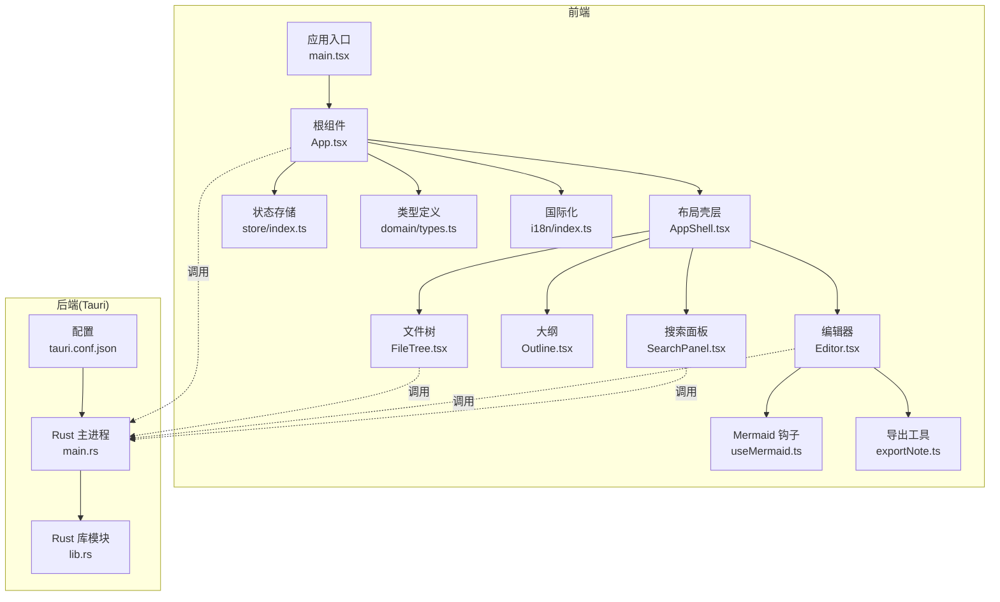
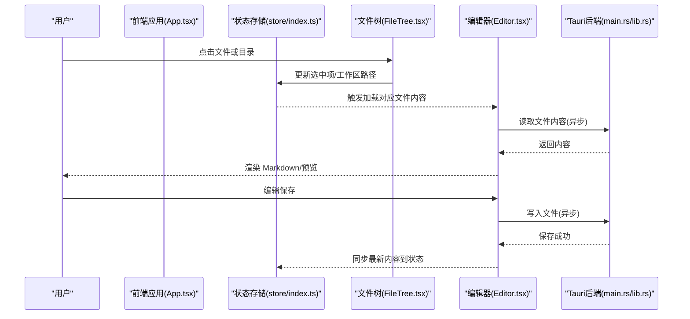
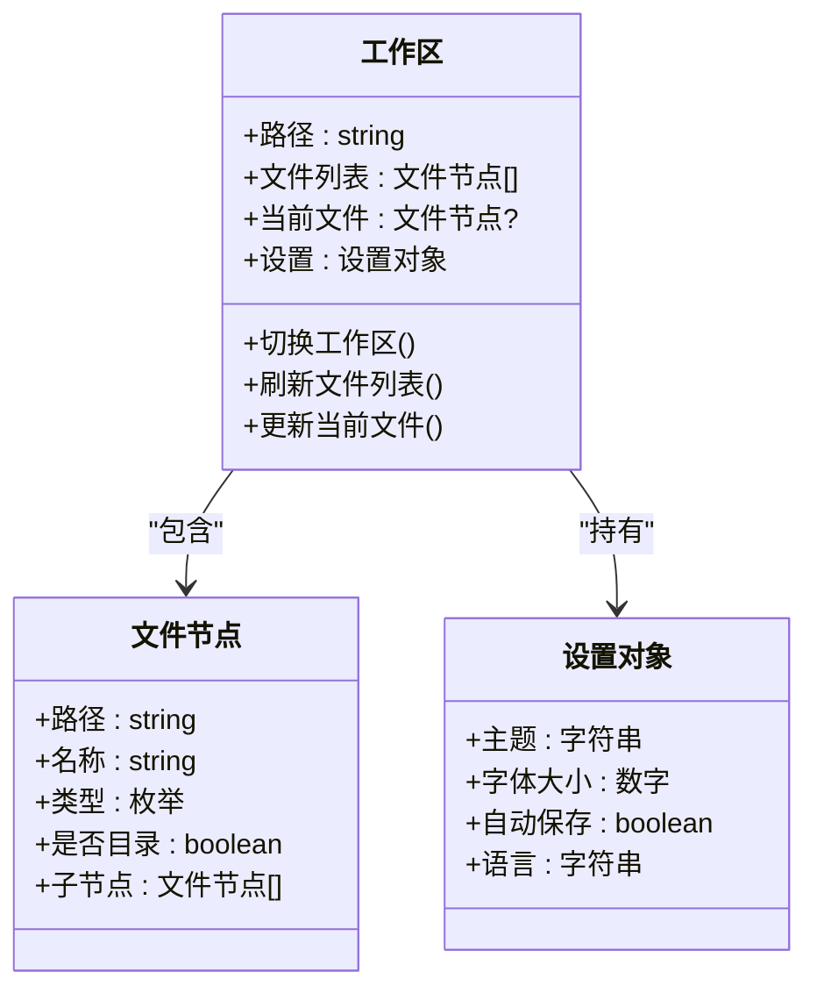
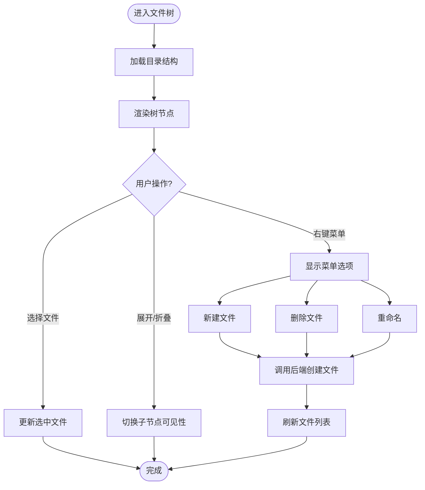
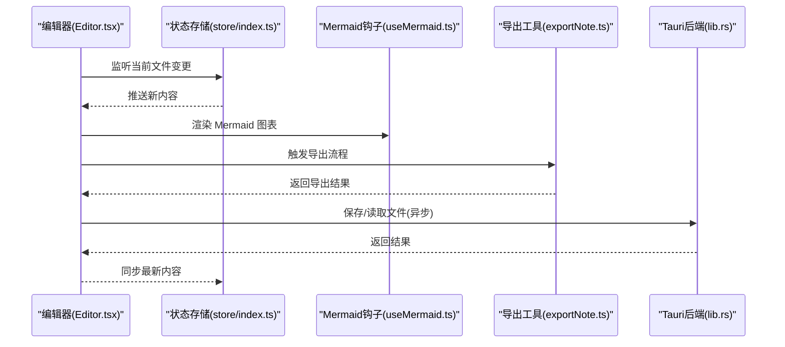
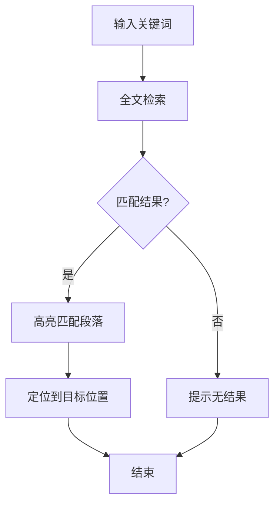
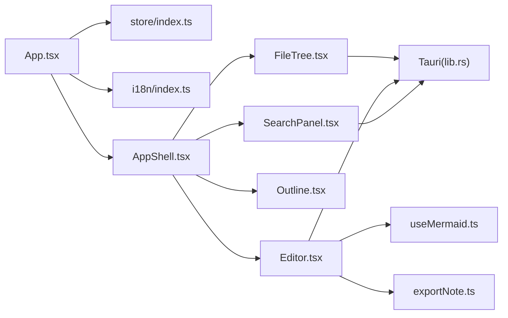

# 工作区管理

<cite>
**本文引用的文件**   
- [App.tsx](file://src/App.tsx)
- [main.tsx](file://src/main.tsx)
- [store/index.ts](file://src/store/index.ts)
- [domain/types.ts](file://src/domain/types.ts)
- [components/layout/AppShell.tsx](file://src/components/layout/AppShell.tsx)
- [components/filetree/FileTree.tsx](file://src/components/filetree/FileTree.tsx)
- [components/editor/Editor.tsx](file://src/components/editor/Editor.tsx)
- [components/outline/Outline.tsx](file://src/components/outline/Outline.tsx)
- [components/search/SearchPanel.tsx](file://src/components/search/SearchPanel.tsx)
- [hooks/useMermaid.ts](file://src/hooks/useMermaid.ts)
- [lib/exportNote.ts](file://src/lib/exportNote.ts)
- [i18n/index.ts](file://src/i18n/index.ts)
- [tauri.conf.json](file://src-tauri/tauri.conf.json)
- [src-tauri/src/main.rs](file://src-tauri/src/main.rs)
- [src-tauri/src/lib.rs](file://src-tauri/src/lib.rs)
</cite>

## 目录
1. [简介](#简介)
2. [项目结构](#项目结构)
3. [核心组件](#核心组件)
4. [架构总览](#架构总览)
5. [详细组件分析](#详细组件分析)
6. [依赖分析](#依赖分析)
7. [性能考虑](#性能考虑)
8. [故障排查指南](#故障排查指南)
9. [结论](#结论)
10. [附录](#附录)

## 简介
本文件围绕“工作区管理”主题，对 ZenNote 项目的代码结构与实现进行系统化梳理。重点涵盖：前端应用入口与状态管理、文件树与编辑器交互、大纲与搜索面板、导出能力、以及 Tauri 后端在跨平台桌面端中的角色。文档以循序渐进的方式呈现系统架构、数据流与关键处理逻辑，并辅以可视化图示帮助理解。

## 项目结构
ZenNote 采用典型的前后端分离的桌面应用结构：
- 前端（React + TypeScript）：负责 UI、状态、业务逻辑与用户交互。
- 后端（Tauri/Rust）：提供系统级能力（如文件系统访问、窗口管理等），通过命令接口暴露给前端。

图表来源 
- [main.tsx](file://src/main.tsx)
- [App.tsx](file://src/App.tsx)
- [components/layout/AppShell.tsx](file://src/components/layout/AppShell.tsx)
- [components/filetree/FileTree.tsx](file://src/components/filetree/FileTree.tsx)
- [components/editor/Editor.tsx](file://src/components/editor/Editor.tsx)
- [components/outline/Outline.tsx](file://src/components/outline/Outline.tsx)
- [components/search/SearchPanel.tsx](file://src/components/search/SearchPanel.tsx)
- [store/index.ts](file://src/store/index.ts)
- [domain/types.ts](file://src/domain/types.ts)
- [i18n/index.ts](file://src/i18n/index.ts)
- [hooks/useMermaid.ts](file://src/hooks/useMermaid.ts)
- [lib/exportNote.ts](file://src/lib/exportNote.ts)
- [src-tauri/src/main.rs](file://src-tauri/src/main.rs)
- [src-tauri/src/lib.rs](file://src-tauri/src/lib.rs)
- [src-tauri/tauri.conf.json](file://src-tauri/tauri.conf.json)

章节来源
- [main.tsx](file://src/main.tsx)
- [App.tsx](file://src/App.tsx)
- [tauri.conf.json](file://src-tauri/tauri.conf.json)

## 核心组件
- 应用入口与初始化：负责挂载 React 应用、初始化国际化与全局配置。
- 根组件 App：编排页面布局、路由与状态注入，协调各功能模块。
- 状态存储 store：集中管理工作区、文件列表、当前选中文件、编辑历史等。
- 类型定义 domain/types：统一数据结构契约，确保前后端一致。
- 文件树 FileTree：展示工作区目录结构，支持选择、展开/折叠、右键操作等。
- 编辑器 Editor：Markdown 编辑、预览、表格上下文菜单、查找替换等。
- 大纲 Outline：根据标题生成导航，快速跳转。
- 搜索面板 SearchPanel：全文检索、结果高亮与定位。
- Mermaid 钩子 useMermaid：渲染流程图/时序图等。
- 导出工具 exportNote：将笔记导出为多种格式。
- Tauri 后端 main.rs/lib.rs：暴露系统级命令（如读取/写入文件、打开目录等）。

章节来源
- [store/index.ts](file://src/store/index.ts)
- [domain/types.ts](file://src/domain/types.ts)
- [components/filetree/FileTree.tsx](file://src/components/filetree/FileTree.tsx)
- [components/editor/Editor.tsx](file://src/components/editor/Editor.tsx)
- [components/outline/Outline.tsx](file://src/components/outline/Outline.tsx)
- [components/search/SearchPanel.tsx](file://src/components/search/SearchPanel.tsx)
- [hooks/useMermaid.ts](file://src/hooks/useMermaid.ts)
- [lib/exportNote.ts](file://src/lib/exportNote.ts)
- [src-tauri/src/main.rs](file://src-tauri/src/main.rs)
- [src-tauri/src/lib.rs](file://src-tauri/src/lib.rs)

## 架构总览
整体采用“前端状态驱动 + 后端能力桥接”的模式：
- 前端通过 store 维护工作区状态，UI 组件订阅状态变化进行渲染。
- 需要系统级能力时，通过 Tauri 命令调用 Rust 后端，完成文件读写、路径解析等操作。
- 国际化 i18n 贯穿 UI 文案，保证多语言一致性。

图表来源 
- [App.tsx](file://src/App.tsx)
- [store/index.ts](file://src/store/index.ts)
- [components/filetree/FileTree.tsx](file://src/components/filetree/FileTree.tsx)
- [components/editor/Editor.tsx](file://src/components/editor/Editor.tsx)
- [src-tauri/src/main.rs](file://src-tauri/src/main.rs)
- [src-tauri/src/lib.rs](file://src-tauri/src/lib.rs)

## 详细组件分析

### 状态管理与类型契约
- 类型定义集中在 domain/types.ts，用于约束工作区、文件节点、编辑器状态等数据结构。
- store/index.ts 提供统一的读写接口，封装工作区切换、文件列表刷新、当前文件变更等逻辑。

图表来源 
- [domain/types.ts](file://src/domain/types.ts)
- [store/index.ts](file://src/store/index.ts)

章节来源
- [domain/types.ts](file://src/domain/types.ts)
- [store/index.ts](file://src/store/index.ts)

### 文件树组件
- 负责展示工作区的目录树，支持展开/折叠、选择文件、右键菜单（新建、删除、重命名等）。
- 与 store 联动，更新选中项与工作区路径；必要时调用 Tauri 后端执行文件系统操作。

图表来源 
- [components/filetree/FileTree.tsx](file://src/components/filetree/FileTree.tsx)
- [store/index.ts](file://src/store/index.ts)
- [src-tauri/src/lib.rs](file://src-tauri/src/lib.rs)

章节来源
- [components/filetree/FileTree.tsx](file://src/components/filetree/FileTree.tsx)
- [store/index.ts](file://src/store/index.ts)

### 编辑器组件
- 提供 Markdown 编辑与预览，集成表格上下文菜单、查找替换栏。
- 通过 useMermaid 钩子渲染 Mermaid 图表；通过 exportNote 导出笔记。
- 与 store 协作，保持内容与选中文件的同步。

图表来源 
- [components/editor/Editor.tsx](file://src/components/editor/Editor.tsx)
- [hooks/useMermaid.ts](file://src/hooks/useMermaid.ts)
- [lib/exportNote.ts](file://src/lib/exportNote.ts)
- [store/index.ts](file://src/store/index.ts)
- [src-tauri/src/lib.rs](file://src-tauri/src/lib.rs)

章节来源
- [components/editor/Editor.tsx](file://src/components/editor/Editor.tsx)
- [hooks/useMermaid.ts](file://src/hooks/useMermaid.ts)
- [lib/exportNote.ts](file://src/lib/exportNote.ts)
- [store/index.ts](file://src/store/index.ts)

### 大纲与搜索面板
- 大纲 Outline：基于标题层级生成导航，点击跳转到对应位置。
- 搜索面板 SearchPanel：全文检索，支持高亮与定位，提升大文档浏览效率。

图表来源 
- [components/outline/Outline.tsx](file://src/components/outline/Outline.tsx)
- [components/search/SearchPanel.tsx](file://src/components/search/SearchPanel.tsx)

章节来源
- [components/outline/Outline.tsx](file://src/components/outline/Outline.tsx)
- [components/search/SearchPanel.tsx](file://src/components/search/SearchPanel.tsx)

### 国际化与配置
- i18n/index.ts 统一管理多语言文案，供 UI 组件按需引用。
- tauri.conf.json 配置 Tauri 应用行为（如窗口、权限、插件等）。

章节来源
- [i18n/index.ts](file://src/i18n/index.ts)
- [src-tauri/tauri.conf.json](file://src-tauri/tauri.conf.json)

## 依赖分析
- 前端内部依赖：
  - App.tsx 依赖 store、i18n、各 UI 组件。
  - Editor 依赖 useMermaid、exportNote、store。
  - FileTree、Outline、SearchPanel 均依赖 store 与类型定义。
- 前后端依赖：
  - 前端通过 Tauri 命令调用 Rust 后端，完成文件系统操作。
  - 后端通过 lib.rs 暴露命令，main.rs 作为进程入口。

图表来源 
- [App.tsx](file://src/App.tsx)
- [store/index.ts](file://src/store/index.ts)
- [i18n/index.ts](file://src/i18n/index.ts)
- [components/layout/AppShell.tsx](file://src/components/layout/AppShell.tsx)
- [components/filetree/FileTree.tsx](file://src/components/filetree/FileTree.tsx)
- [components/editor/Editor.tsx](file://src/components/editor/Editor.tsx)
- [components/outline/Outline.tsx](file://src/components/outline/Outline.tsx)
- [components/search/SearchPanel.tsx](file://src/components/search/SearchPanel.tsx)
- [hooks/useMermaid.ts](file://src/hooks/useMermaid.ts)
- [lib/exportNote.ts](file://src/lib/exportNote.ts)
- [src-tauri/src/lib.rs](file://src-tauri/src/lib.rs)

章节来源
- [App.tsx](file://src/App.tsx)
- [store/index.ts](file://src/store/index.ts)
- [src-tauri/src/lib.rs](file://src-tauri/src/lib.rs)

## 性能考虑
- 懒加载与分页：文件树与搜索结果建议按需加载，避免一次性渲染大量节点。
- 增量更新：编辑器内容变更应使用最小化 diff 更新，减少重渲染。
- 缓存策略：对常用文件内容或 Mermaid 渲染结果进行缓存，降低重复计算。
- 异步 IO：所有文件读写操作必须异步执行，避免阻塞 UI 线程。
- 资源优化：图片与媒体资源按需加载，压缩与延迟加载以提升首屏速度。

[本节为通用指导，不直接分析具体文件]

## 故障排查指南
- 工作区无法切换：检查 store 中路径是否正确，确认 Tauri 后端权限配置。
- 文件读取失败：验证路径合法性与权限，查看后端日志输出。
- 编辑器未同步：确认 store 订阅机制是否正常，检查事件派发与接收。
- Mermaid 渲染异常：检查语法与依赖加载，确认 useMermaid 钩子初始化。
- 导出失败：确认导出格式支持与目标路径可写性。

章节来源
- [store/index.ts](file://src/store/index.ts)
- [src-tauri/src/lib.rs](file://src-tauri/src/lib.rs)
- [hooks/useMermaid.ts](file://src/hooks/useMermaid.ts)
- [lib/exportNote.ts](file://src/lib/exportNote.ts)

## 结论
ZenNote 的工作区管理以清晰的前端状态驱动为核心，结合 Tauri 后端提供的系统能力，实现了稳定的文件浏览、编辑、导航与导出功能。通过模块化设计与类型契约，保证了代码的可维护性与扩展性。建议在后续迭代中持续优化性能与用户体验，完善错误处理与日志记录。

[本节为总结性内容，不直接分析具体文件]

## 附录
- 术语表：
  - 工作区：一个包含多个笔记文件的目录集合。
  - 文件节点：表示文件或目录的结构化数据。
  - 大纲：基于标题生成的导航索引。
  - 导出：将笔记内容转换为其他格式（如 PDF、HTML 等）。
- 参考链接：
  - Tauri 官方文档：用于了解后端命令与权限配置。
  - Markdown 规范：用于理解编辑器支持的语法。

[本节为补充信息，不直接分析具体文件]