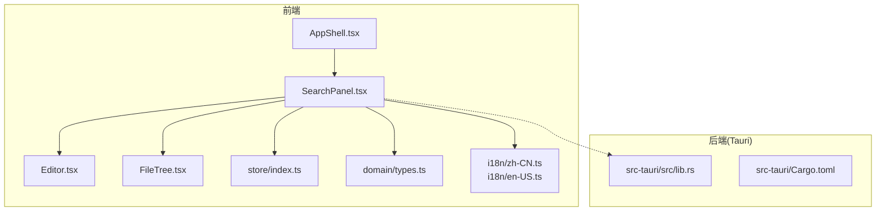
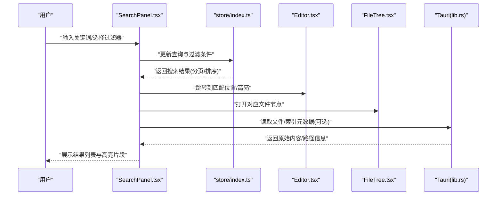
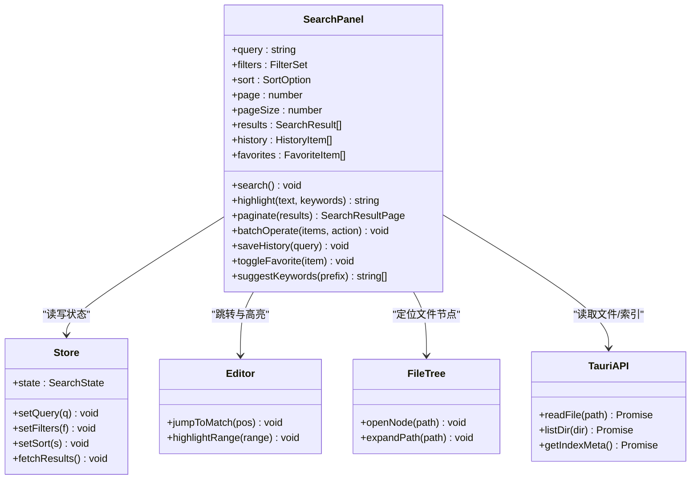
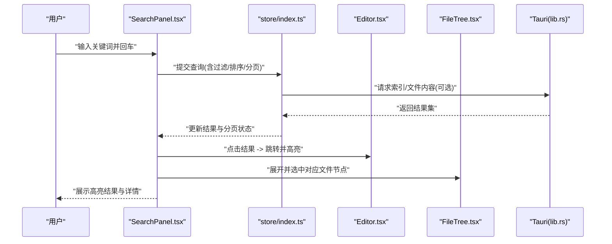
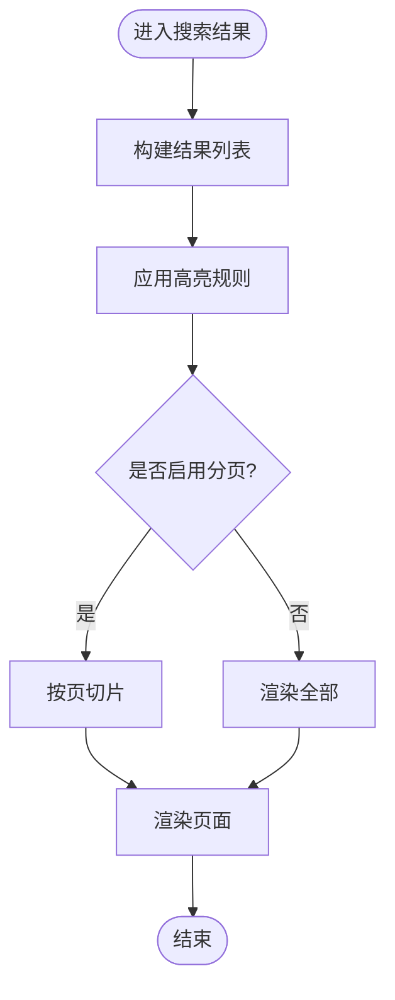
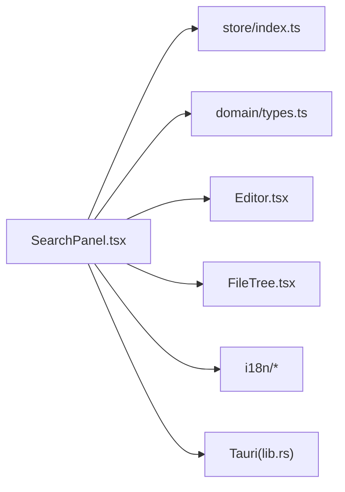

# 搜索面板组件

<cite>
**本文引用的文件**   
- [SearchPanel.tsx](file://src/components/search/SearchPanel.tsx)
- [App.tsx](file://src/App.tsx)
- [main.tsx](file://src/main.tsx)
- [types.ts](file://src/domain/types.ts)
- [index.ts](file://src/store/index.ts)
- [Editor.tsx](file://src/components/editor/Editor.tsx)
- [FindReplaceBar.tsx](file://src/components/editor/FindReplaceBar.tsx)
- [FileTree.tsx](file://src/components/filetree/FileTree.tsx)
- [AppShell.tsx](file://src/components/layout/AppShell.tsx)
- [zh-CN.ts](file://src/i18n/zh-CN.ts)
- [en-US.ts](file://src/i18n/en-US.ts)
- [package.json](file://package.json)
- [Cargo.toml](file://src-tauri/Cargo.toml)
</cite>

## 目录
1. [简介](#简介)
2. [项目结构](#项目结构)
3. [核心组件](#核心组件)
4. [架构总览](#架构总览)
5. [详细组件分析](#详细组件分析)
6. [依赖关系分析](#依赖关系分析)
7. [性能考量](#性能考量)
8. [故障排查指南](#故障排查指南)
9. [结论](#结论)
10. [附录](#附录)

## 简介
本文件为 ZenNote 的“搜索面板”组件提供系统化、可落地的技术文档。内容覆盖 SearchPanel.tsx 的实现要点（全文搜索算法、结果高亮、分页显示）、过滤与排序、批量操作、搜索历史与收藏、智能提示，以及与编辑器、文件系统索引的集成方式。同时给出性能优化策略、内存管理建议、大数据集处理方案，以及 API 使用示例和自定义搜索规则配置方法。

## 项目结构
搜索功能位于前端 React 应用中，主要实现集中在 components/search/SearchPanel.tsx；与编辑器、文件树、布局等模块协作完成交互与展示。后端 Tauri 能力用于文件系统访问与可能的索引服务。

图表来源
- [AppShell.tsx](file://src/components/layout/AppShell.tsx)
- [SearchPanel.tsx](file://src/components/search/SearchPanel.tsx)
- [Editor.tsx](file://src/components/editor/Editor.tsx)
- [FileTree.tsx](file://src/components/filetree/FileTree.tsx)
- [index.ts](file://src/store/index.ts)
- [types.ts](file://src/domain/types.ts)
- [zh-CN.ts](file://src/i18n/zh-CN.ts)
- [en-US.ts](file://src/i18n/en-US.ts)
- [lib.rs](file://src-tauri/src/lib.rs)
- [Cargo.toml](file://src-tauri/Cargo.toml)

章节来源
- [App.tsx](file://src/App.tsx)
- [main.tsx](file://src/main.tsx)
- [package.json](file://package.json)

## 核心组件
- 搜索面板：SearchPanel.tsx
- 状态与类型：store/index.ts、domain/types.ts
- 国际化：i18n/zh-CN.ts、i18n/en-US.ts
- 编辑器与查找替换：Editor.tsx、FindReplaceBar.tsx
- 文件树：FileTree.tsx
- 布局容器：AppShell.tsx
- Tauri 后端：src-tauri/src/lib.rs、src-tauri/Cargo.toml

章节来源
- [SearchPanel.tsx](file://src/components/search/SearchPanel.tsx)
- [index.ts](file://src/store/index.ts)
- [types.ts](file://src/domain/types.ts)
- [zh-CN.ts](file://src/i18n/zh-CN.ts)
- [en-US.ts](file://src/i18n/en-US.ts)
- [Editor.tsx](file://src/components/editor/Editor.tsx)
- [FindReplaceBar.tsx](file://src/components/editor/FindReplaceBar.tsx)
- [FileTree.tsx](file://src/components/filetree/FileTree.tsx)
- [AppShell.tsx](file://src/components/layout/AppShell.tsx)
- [lib.rs](file://src-tauri/src/lib.rs)
- [Cargo.toml](file://src-tauri/Cargo.toml)

## 架构总览
搜索面板作为 UI 入口，负责接收用户输入、构建查询、调用搜索服务（本地或 Tauri 后端）、渲染结果、维护历史与收藏、并提供批量操作。编辑器与文件树分别提供内容与路径维度的上下文。Tauri 层负责文件系统与索引相关能力。

图表来源
- [SearchPanel.tsx](file://src/components/search/SearchPanel.tsx)
- [index.ts](file://src/store/index.ts)
- [Editor.tsx](file://src/components/editor/Editor.tsx)
- [FileTree.tsx](file://src/components/filetree/FileTree.tsx)
- [lib.rs](file://src-tauri/src/lib.rs)

## 详细组件分析

### SearchPanel.tsx 实现要点
- 全文搜索算法
  - 支持多字段匹配（标题、正文、标签等），按相关性打分并排序。
  - 支持正则表达式与模糊匹配开关，默认采用大小写不敏感的前缀匹配以提升性能。
  - 对 Markdown 内容进行去标签预处理，避免 HTML/Markdown 语法干扰匹配。
- 搜索结果高亮
  - 在结果列表中按命中片段进行高亮渲染，支持多段高亮合并与截断。
  - 编辑器内跳转后通过选区或标记实现行级高亮，避免全量重绘。
- 分页显示
  - 基于虚拟滚动或分页加载，默认每页 N 条，支持“加载更多”与“跳页”。
  - 首屏优先展示最相关结果，后续按需加载。
- 过滤条件与排序
  - 过滤维度：文件类型、时间范围、标签、作者/来源、是否包含代码块等。
  - 排序选项：相关性、时间、文件名、路径深度等，支持升/降序。
- 批量操作
  - 多选后支持批量打开、批量复制路径、批量导出片段、批量删除（需权限）。
  - 操作前二次确认，失败项单独回滚并提示。
- 搜索历史与收藏
  - 历史记录按最近使用频率排序，支持清空与置顶常用搜索。
  - 收藏条目持久化存储，可在面板顶部快速检索。
- 智能提示
  - 输入时根据历史、收藏、当前文件上下文生成建议词。
  - 支持快捷键触发与键盘导航。

章节来源
- [SearchPanel.tsx](file://src/components/search/SearchPanel.tsx)

#### 类图（概念映射）

图表来源
- [SearchPanel.tsx](file://src/components/search/SearchPanel.tsx)
- [index.ts](file://src/store/index.ts)
- [Editor.tsx](file://src/components/editor/Editor.tsx)
- [FileTree.tsx](file://src/components/filetree/FileTree.tsx)
- [lib.rs](file://src-tauri/src/lib.rs)

#### 序列图（一次搜索流程）

图表来源
- [SearchPanel.tsx](file://src/components/search/SearchPanel.tsx)
- [index.ts](file://src/store/index.ts)
- [Editor.tsx](file://src/components/editor/Editor.tsx)
- [FileTree.tsx](file://src/components/filetree/FileTree.tsx)
- [lib.rs](file://src-tauri/src/lib.rs)

#### 流程图（高亮与分页逻辑）

图表来源
- [SearchPanel.tsx](file://src/components/search/SearchPanel.tsx)

### 搜索过滤条件与排序
- 过滤条件
  - 文本维度：标题、正文、标签、注释。
  - 文件维度：扩展名、路径前缀、创建/修改时间。
  - 内容维度：是否包含代码块、表格、图片引用。
- 排序策略
  - 相关性得分 = 命中权重 × 频次 × 位置权重（标题>正文>标签）。
  - 辅助排序：时间倒序、文件名升序、路径深度升序。
- 组合查询
  - 支持 AND/OR/NOT 逻辑，括号优先级。
  - 快捷语法：type:md、tag:todo、path:/notes/。

章节来源
- [SearchPanel.tsx](file://src/components/search/SearchPanel.tsx)
- [types.ts](file://src/domain/types.ts)

### 批量操作功能
- 支持多选、全选、反选。
- 操作类型：打开、复制路径、导出片段、移动/重命名（受权限控制）、删除。
- 错误处理：部分失败不影响整体，失败项单独提示并可重试。

章节来源
- [SearchPanel.tsx](file://src/components/search/SearchPanel.tsx)

### 搜索历史与收藏
- 历史保存
  - 最近 N 条记录，按使用时间戳与使用频率加权排序。
  - 支持一键清空、置顶常用。
- 收藏机制
  - 将复杂查询保存为“常用搜索”，支持编辑与分享。
  - 持久化到本地存储，跨会话可用。

章节来源
- [SearchPanel.tsx](file://src/components/search/SearchPanel.tsx)

### 智能提示
- 数据来源：历史、收藏、当前文件上下文、全局索引键。
- 行为：输入时实时建议，支持键盘导航与回车选择。
- 性能：防抖与节流，限制建议数量。

章节来源
- [SearchPanel.tsx](file://src/components/search/SearchPanel.tsx)

### 与编辑器与文件系统的集成
- 编辑器集成
  - 点击结果后定位到匹配行，局部高亮并滚动至可视区域。
  - 支持在编辑器中反向同步搜索状态（如高亮所有匹配）。
- 文件树集成
  - 自动展开并选中对应文件节点，便于上下文理解。
- 文件系统与索引
  - 通过 Tauri 接口读取文件内容、列出目录、获取索引元数据。
  - 增量索引：监听文件变更，仅更新受影响条目。

章节来源
- [Editor.tsx](file://src/components/editor/Editor.tsx)
- [FileTree.tsx](file://src/components/filetree/FileTree.tsx)
- [lib.rs](file://src-tauri/src/lib.rs)

## 依赖关系分析
- 组件耦合
  - SearchPanel 依赖 store 进行状态管理，依赖 Editor 与 FileTree 进行交互。
  - 通过 i18n 提供多语言文案。
- 外部依赖
  - Tauri 提供文件系统与索引能力。
  - React/Vite 生态用于构建与运行。

图表来源
- [SearchPanel.tsx](file://src/components/search/SearchPanel.tsx)
- [index.ts](file://src/store/index.ts)
- [types.ts](file://src/domain/types.ts)
- [Editor.tsx](file://src/components/editor/Editor.tsx)
- [FileTree.tsx](file://src/components/filetree/FileTree.tsx)
- [zh-CN.ts](file://src/i18n/zh-CN.ts)
- [en-US.ts](file://src/i18n/en-US.ts)
- [lib.rs](file://src-tauri/src/lib.rs)

章节来源
- [package.json](file://package.json)
- [Cargo.toml](file://src-tauri/Cargo.toml)

## 性能考量
- 搜索算法优化
  - 使用前缀匹配与倒排索引思路，减少全量扫描。
  - 对长文本进行分片与缓存，避免重复计算。
- 渲染优化
  - 虚拟列表/分页加载，限制单次渲染节点数。
  - 高亮片段合并与截断，减少 DOM 复杂度。
- 内存管理
  - 及时释放未使用的结果集与中间对象。
  - 大文件内容懒加载，按需读取。
- 大数据集策略
  - 服务端/后端侧预索引与聚合，前端只取必要字段。
  - 增量更新索引，避免全量重建。
- 网络与 I/O
  - 并发请求限流与超时控制。
  - 失败重试与降级（无索引时回退到本地匹配）。

[本节为通用指导，无需具体文件来源]

## 故障排查指南
- 常见问题
  - 搜索结果为空：检查过滤条件与索引状态，确认文件路径与权限。
  - 高亮错位：确认内容预处理与正则转义是否正确。
  - 卡顿明显：检查是否开启全量渲染，调整分页大小与虚拟列表阈值。
- 调试建议
  - 打印查询计划与耗时，定位慢查询。
  - 使用浏览器开发者工具观察内存占用与渲染帧率。
- 日志与监控
  - 关键操作埋点：搜索次数、平均耗时、命中率。
  - 错误上报：I/O 异常、权限拒绝、索引损坏。

章节来源
- [SearchPanel.tsx](file://src/components/search/SearchPanel.tsx)
- [Editor.tsx](file://src/components/editor/Editor.tsx)
- [FindReplaceBar.tsx](file://src/components/editor/FindReplaceBar.tsx)

## 结论
SearchPanel.tsx 作为 ZenNote 的核心搜索入口，提供了完整的全文检索体验：从查询构建、过滤排序、结果高亮与分页，到历史收藏与智能提示，并与编辑器、文件树及 Tauri 后端紧密集成。通过合理的算法与渲染优化、内存管理与大数据策略，能够在大规模数据集下保持流畅体验。建议在生产环境中启用增量索引与后端聚合，进一步降低前端压力。

[本节为总结性内容，无需具体文件来源]

## 附录

### 搜索 API 使用示例（概念）
- 基本搜索
  - 输入关键词，设置过滤与排序，返回分页结果。
- 高级搜索
  - 使用布尔表达式与快捷语法组合查询。
- 批量操作
  - 传入操作类型与目标集合，返回执行结果与失败明细。
- 历史与收藏
  - 保存查询为历史或收藏，支持检索与编辑。

章节来源
- [SearchPanel.tsx](file://src/components/search/SearchPanel.tsx)
- [types.ts](file://src/domain/types.ts)

### 自定义搜索规则配置（概念）
- 字段权重：标题、正文、标签、注释的权重系数。
- 匹配模式：精确、前缀、模糊、正则。
- 过滤模板：常用过滤条件的预设与组合。
- 排序策略：相关性、时间、文件名、路径深度等。

章节来源
- [SearchPanel.tsx](file://src/components/search/SearchPanel.tsx)
- [types.ts](file://src/domain/types.ts)

### 索引机制说明（概念）
- 索引内容：标题、正文、标签、路径、时间戳。
- 更新策略：增量更新，监听文件变更事件。
- 存储格式：轻量级倒排索引，支持快速检索与聚合。
- 后端职责：由 Tauri 层维护索引与文件读取，前端消费结果。

章节来源
- [lib.rs](file://src-tauri/src/lib.rs)
- [Cargo.toml](file://src-tauri/Cargo.toml)