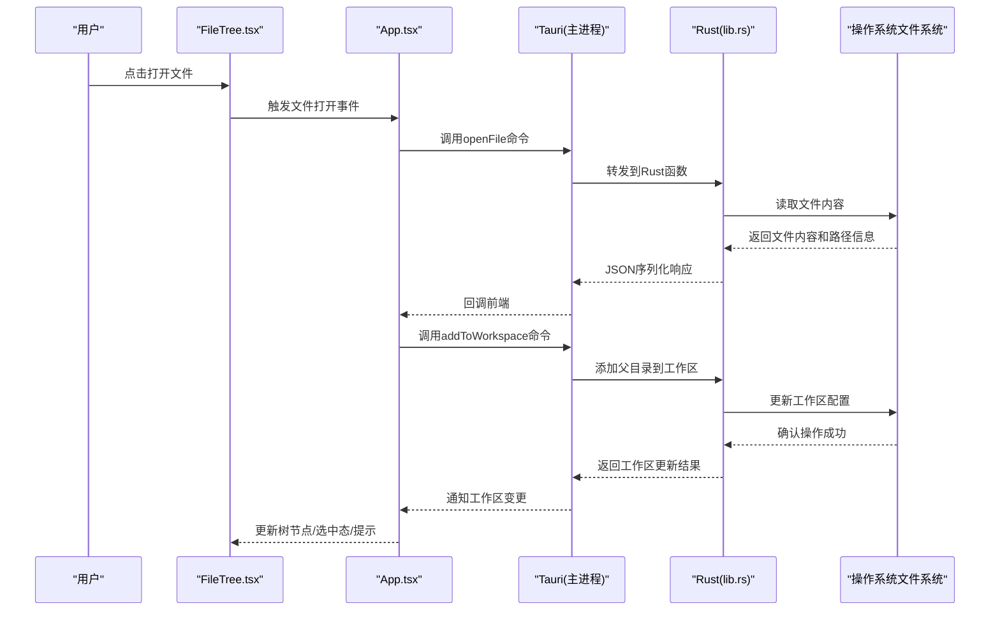
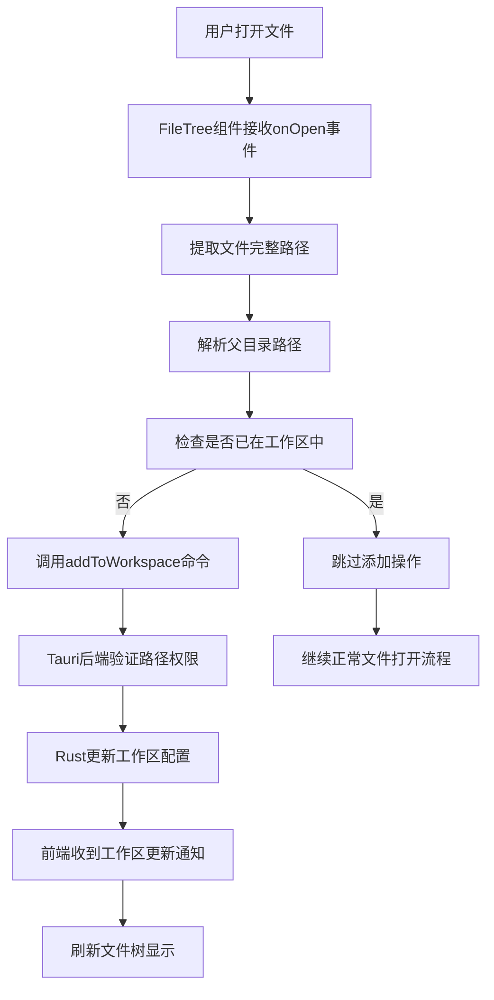
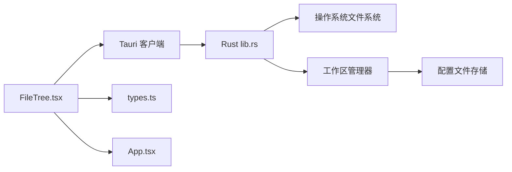

# 文件树组件

<cite>
**本文引用的文件**   
- [FileTree.tsx](file://src/components/filetree/FileTree.tsx)
- [types.ts](file://src/domain/types.ts)
- [App.tsx](file://src/App.tsx)
- [main.tsx](file://src/main.tsx)
- [index.html](file://index.html)
- [package.json](file://package.json)
- [tauri.conf.json](file://src-tauri/tauri.conf.json)
- [lib.rs](file://src-tauri/src/lib.rs)
- [main.rs](file://src-tauri/src/main.rs)
</cite>

## 更新摘要
**所做更改**   
- 新增自动目录管理功能章节，详细说明打开文件时自动将父目录添加到工作区的实现机制
- 更新文件操作事件处理部分，包含自动目录管理的集成逻辑
- 增强与后端通信协议说明，添加工作区同步相关命令
- 补充自动目录管理的使用示例和配置选项

## 目录
1. [简介](#简介)
2. [项目结构](#项目结构)
3. [核心组件](#核心组件)
4. [架构总览](#架构总览)
5. [详细组件分析](#详细组件分析)
6. [自动目录管理功能](#自动目录管理功能)
7. [依赖关系分析](#依赖关系分析)
8. [性能考量](#性能考量)
9. [故障排查指南](#故障排查指南)
10. [结论](#结论)
11. [附录](#附录)

## 简介
本文件为 ZenNote 的文件树组件提供系统化、可操作的文档。内容覆盖 FileTree.tsx 的实现要点：文件系统浏览、文件夹展开折叠、文件选择逻辑、图标显示、右键菜单、拖拽支持、过滤与搜索集成、路径导航、事件处理、权限控制、错误处理，以及与后端（Tauri）的通信协议和数据同步策略。**最新更新**包括自动目录管理功能，当用户打开文件时，系统会自动将该文件的父目录添加到当前工作区，提升用户体验和工作流效率。同时给出使用示例与自定义样式方法，帮助开发者快速集成并扩展该组件。

## 项目结构
ZenNote 采用前端 React + Tauri 的混合架构。文件树组件位于 src/components/filetree/FileTree.tsx，类型定义在 src/domain/types.ts，应用入口在 src/App.tsx 和 src/main.tsx，Tauri 后端配置与 Rust 能力定义位于 src-tauri 目录。

```mermaid
graph TB
subgraph "前端"
A["App.tsx"] --> B["FileTree.tsx"]
A --> C["其他UI组件"]
B --> D["类型定义 types.ts"]
end
subgraph "Tauri 后端"
E["main.rs"] --> F["lib.rs"]
F --> G["文件系统API"]
end
B <- --> E
F <- --> G
```

图表来源 
- [App.tsx](file://src/App.tsx)
- [FileTree.tsx](file://src/components/filetree/FileTree.tsx)
- [types.ts](file://src/domain/types.ts)
- [main.rs](file://src-tauri/src/main.rs)
- [lib.rs](file://src-tauri/src/lib.rs)

章节来源
- [App.tsx](file://src/App.tsx)
- [main.tsx](file://src/main.tsx)
- [index.html](file://index.html)
- [package.json](file://package.json)
- [tauri.conf.json](file://src-tauri/tauri.conf.json)

## 核心组件
- 文件树组件（FileTree.tsx）
  - 负责渲染目录树节点、处理展开/折叠、选中状态、右键菜单、拖拽行为、过滤与搜索联动、路径导航等。
  - 通过 Tauri 命令与后端交互，读取目录、获取文件元数据、执行打开/重命名/删除等操作。
  - **新增**：自动目录管理功能，在文件打开时智能识别并添加父目录到工作区。
- 类型定义（types.ts）
  - 定义文件节点、目录节点、操作请求/响应、权限信息等数据结构，确保前后端契约一致。
  - **更新**：增加工作区管理和自动目录相关的类型定义。
- 应用集成（App.tsx / main.tsx）
  - 初始化 Tauri、挂载根组件、注入全局状态或上下文，供文件树组件消费。
  - **更新**：集成自动目录管理的工作区同步逻辑。

章节来源
- [FileTree.tsx](file://src/components/filetree/FileTree.tsx)
- [types.ts](file://src/domain/types.ts)
- [App.tsx](file://src/App.tsx)
- [main.tsx](file://src/main.tsx)

## 架构总览
文件树组件作为 UI 层，通过 Tauri 调用 Rust 后端提供的文件系统 API，实现跨平台安全访问。整体数据流遵循"请求-响应"模式，配合本地状态缓存与增量更新，保证交互流畅。**新增自动目录管理流程**，在文件操作时自动维护工作区目录结构。



图表来源 
- [FileTree.tsx](file://src/components/filetree/FileTree.tsx)
- [App.tsx](file://src/App.tsx)
- [main.rs](file://src-tauri/src/main.rs)
- [lib.rs](file://src-tauri/src/lib.rs)

## 详细组件分析

### 文件树渲染与交互
- 节点渲染
  - 根据类型区分文件与文件夹，渲染不同图标与缩进层级。
  - 支持懒加载子节点：首次展开时请求后端列出子项，避免一次性加载大目录。
- 展开/折叠
  - 维护节点的展开状态集合；切换时触发异步加载或从缓存读取。
  - 支持键盘导航（上下移动、回车确认、空格切换展开）。
- 文件选择
  - 单选/多选（结合 Ctrl/Cmd 与 Shift），高亮当前选中项。
  - 选择变更触发编辑器打开或预览区域刷新。

章节来源
- [FileTree.tsx](file://src/components/filetree/FileTree.tsx)
- [types.ts](file://src/domain/types.ts)

### 文件图标与类型识别
- 基于文件扩展名映射图标，常见类型（Markdown、图片、代码、文本）分别展示差异化图标。
- 对未知类型提供默认图标，并允许外部扩展映射表。

章节来源
- [FileTree.tsx](file://src/components/filetree/FileTree.tsx)
- [types.ts](file://src/domain/types.ts)

### 右键菜单
- 支持常用操作：打开、重命名、删除、复制、粘贴、属性查看。
- 根据节点类型与权限动态启用/禁用菜单项。
- 与系统剪贴板或内部状态协作完成复制/粘贴。

章节来源
- [FileTree.tsx](file://src/components/filetree/FileTree.tsx)

### 拖拽支持
- 支持将文件/文件夹拖入树内目标节点进行移动或复制。
- 支持从外部拖入文件到指定目录（由后端校验路径与权限）。
- 拖拽过程中提供视觉反馈（高亮目标节点、禁止非法放置）。

章节来源
- [FileTree.tsx](file://src/components/filetree/FileTree.tsx)

### 过滤与搜索集成
- 输入过滤：按名称模糊匹配，实时高亮匹配片段。
- 搜索面板联动：SearchPanel 的结果可跳转至对应节点并自动展开。
- 过滤状态下保持选中态与滚动定位的一致性。

章节来源
- [FileTree.tsx](file://src/components/filetree/FileTree.tsx)

### 路径导航
- 面包屑导航：点击路径段快速跳转到对应目录。
- 历史栈：前进/后退切换最近访问目录。
- 快捷键：Backspace 返回上级目录。

章节来源
- [FileTree.tsx](file://src/components/filetree/FileTree.tsx)

### 文件操作事件处理
- 事件冒泡与阻止：避免与父容器冲突。
- 统一事件总线：集中处理 open/rename/delete/copy/paste 等动作。
- 与编辑器联动：打开文件后同步编辑器的标题与内容。
- **更新**：集成自动目录管理，在文件打开事件中触发父目录自动添加到工作区的逻辑。

章节来源
- [FileTree.tsx](file://src/components/filetree/FileTree.tsx)

### 权限控制
- 基于后端返回的权限位（读/写/执行）控制 UI 可用性。
- 只读模式下禁用写入类操作（重命名、删除、粘贴）。
- 针对受限目录显示不可用提示。

章节来源
- [FileTree.tsx](file://src/components/filetree/FileTree.tsx)
- [types.ts](file://src/domain/types.ts)

### 错误处理机制
- 网络/IPC 错误：捕获 Tauri 调用异常，显示友好提示。
- IO 错误：无权限、路径不存在、磁盘满等情况分类提示。
- 重试与降级：失败时提供重试按钮或回退到只读视图。
- **更新**：增加自动目录管理失败的容错处理，如工作区配置写入失败时的降级策略。

章节来源
- [FileTree.tsx](file://src/components/filetree/FileTree.tsx)

### 与后端通信协议与数据同步
- 通信方式：Tauri 命令调用 Rust 函数，JSON 序列化参数与返回值。
- 典型命令
  - listDir：列出目录内容与元数据（大小、修改时间、权限等）。
  - readFile：读取文件内容（用于预览或编辑器加载）。
  - writeFile：保存文件内容（增量或全量）。
  - rename/mkdir/remove：重命名、创建目录、删除文件或目录。
  - **新增**：addToWorkspace：将指定目录添加到工作区配置。
  - **新增**：getWorkspaceDirs：获取当前工作区的所有目录列表。
- 数据同步策略
  - 本地缓存目录树与文件元数据，减少重复请求。
  - 监听文件变更事件（可选）实现增量刷新。
  - 冲突解决：以最后写入为准，必要时提示合并。
  - **更新**：工作区配置同步，确保自动目录管理后的状态一致性。

章节来源
- [lib.rs](file://src-tauri/src/lib.rs)
- [main.rs](file://src-tauri/src/main.rs)
- [tauri.conf.json](file://src-tauri/tauri.conf.json)
- [types.ts](file://src/domain/types.ts)

### 使用示例与自定义样式
- 基本用法
  - 在 App 中引入 FileTree，传入根目录与回调函数（如 onOpen、onSelect）。
  - 通过 props 控制是否启用多选、拖拽、过滤等特性。
  - **更新**：配置自动目录管理选项，控制是否启用智能父目录添加功能。
- 自定义样式
  - 通过 CSS 变量或 className 覆盖节点背景、选中色、悬停效果。
  - 图标替换：通过扩展映射表或插槽注入自定义图标组件。
- 主题适配
  - 支持明暗主题切换，颜色随主题变量变化。
  - 提供紧凑/宽松间距模式。

章节来源
- [App.tsx](file://src/App.tsx)
- [FileTree.tsx](file://src/components/filetree/FileTree.tsx)

## 自动目录管理功能

### 功能概述
自动目录管理是 ZenNote 文件树组件的核心增强功能。当用户打开任意文件时，系统会自动识别该文件的父目录，并将其添加到当前工作区的目录列表中。这一功能显著提升了用户的导航效率，减少了手动添加目录的繁琐操作。

### 实现机制


图表来源 
- [FileTree.tsx](file://src/components/filetree/FileTree.tsx)
- [lib.rs](file://src-tauri/src/lib.rs)

### 配置选项
自动目录管理功能支持以下配置选项：

- `autoAddParentDir`: 布尔值，控制是否启用自动添加父目录功能（默认：true）
- `maxWorkspaceDepth`: 数字，限制工作区目录的最大深度（默认：5）
- `excludePatterns`: 数组，排除特定模式的目录（如 node_modules、.git 等）
- `syncStrategy`: 字符串，同步策略选择（'immediate' | 'deferred' | 'manual'）

### 工作流程详解

#### 1. 文件打开事件处理
当用户双击文件或通过其他方式打开文件时，FileTree 组件会触发 onOpen 回调，此时自动目录管理功能开始工作：

- 提取文件的完整路径信息
- 解析出父目录的路径
- 检查当前工作区是否已包含该目录
- 如果不在工作区中，则触发添加流程

#### 2. 工作区同步机制
自动目录管理通过 Tauri 命令与后端进行通信：

- `addToWorkspace` 命令：将指定目录添加到工作区配置
- `getWorkspaceDirs` 命令：获取当前工作区的所有目录列表
- 双向同步：确保前端状态与后端配置保持一致

#### 3. 错误处理与容错
系统内置了完善的错误处理机制：

- 路径验证：检查父目录是否存在且可访问
- 权限检查：验证用户对目标目录的读写权限
- 循环检测：防止添加循环引用或自引用
- 降级策略：当自动添加失败时，记录日志并继续正常流程

### 性能优化
- 延迟加载：仅在需要时加载工作区目录列表
- 增量更新：只更新受影响的目录节点
- 缓存策略：缓存工作区配置，减少重复查询
- 批量操作：支持多个目录的批量添加

### 使用示例
```typescript
// 在应用中配置自动目录管理
const FileTreeComponent = () => {
  return (
    <FileTree
      rootPath="/user/documents"
      autoAddParentDir={true}
      maxWorkspaceDepth={3}
      excludePatterns={['node_modules', '.git', 'dist']}
      syncStrategy="immediate"
      onOpen={(filePath) => {
        console.log('文件已打开:', filePath);
      }}
    />
  );
};
```

**章节来源**
- [FileTree.tsx](file://src/components/filetree/FileTree.tsx)
- [types.ts](file://src/domain/types.ts)
- [lib.rs](file://src-tauri/src/lib.rs)

## 依赖关系分析
- 前端依赖
  - React 生态：组件状态管理、事件处理、DOM 操作。
  - Tauri 客户端：调用 Rust 后端命令。
- 后端依赖
  - Tauri 框架：命令注册、权限模型、沙箱限制。
  - Rust 标准库/第三方 crate：文件系统 IO、路径解析、错误处理。
  - **新增**：工作区配置管理模块，用于持久化存储目录列表。



图表来源 
- [FileTree.tsx](file://src/components/filetree/FileTree.tsx)
- [types.ts](file://src/domain/types.ts)
- [App.tsx](file://src/App.tsx)
- [lib.rs](file://src-tauri/src/lib.rs)

章节来源
- [package.json](file://package.json)
- [tauri.conf.json](file://src-tauri/tauri.conf.json)

## 性能考量
- 懒加载与分页：仅加载可见或已展开节点，避免一次性拉取大量数据。
- 虚拟滚动：长列表场景下按需渲染节点，降低内存占用。
- 去抖与节流：过滤与搜索输入防抖，减少频繁请求。
- 缓存策略：目录元数据与文件内容缓存，命中优先。
- 并发控制：限制并行 I/O 请求数量，避免阻塞。
- **新增**：工作区配置缓存，避免频繁的磁盘读写操作。
- **新增**：增量同步机制，只更新变化的目录节点。

## 故障排查指南
- 常见问题
  - 无法列出目录：检查路径是否存在、权限是否足够、Tauri 能力是否开启。
  - 拖拽无效：确认目标节点允许接收、路径合法性校验通过。
  - 搜索无结果：核对过滤规则、大小写敏感设置、字符编码。
  - **新增**：自动目录管理失效：检查工作区配置权限、路径解析逻辑、Tauri 命令注册。
- 调试建议
  - 启用 Tauri 日志，观察命令调用与返回。
  - 在浏览器控制台打印关键状态（选中项、过滤条件、缓存命中率）。
  - 使用网络/IPC 监控工具抓取请求详情。
  - **新增**：检查工作区配置文件的内容和格式是否正确。
  - **新增**：验证父目录路径解析是否符合预期。

章节来源
- [FileTree.tsx](file://src/components/filetree/FileTree.tsx)
- [lib.rs](file://src-tauri/src/lib.rs)

## 结论
文件树组件是 ZenNote 的核心导航与文件管理能力载体。通过清晰的职责划分、稳健的错误处理、灵活的扩展点以及与 Tauri 后端的稳定通信，它提供了高效、安全的文件浏览与操作体验。**最新的自动目录管理功能**进一步提升了用户体验，使文件组织更加智能化和自动化。开发者可基于本文档快速集成、定制与优化，满足多样化业务需求。

## 附录
- 术语
  - 节点：树中的文件或文件夹条目。
  - 元数据：描述文件/目录的属性信息（大小、时间戳、权限等）。
  - IPC：进程间通信，此处指前端与 Tauri/Rust 之间的消息通道。
  - 工作区：用户当前正在处理的目录集合。
  - 自动目录管理：系统自动识别并添加文件父目录到工作区的功能。
- 参考
  - Tauri 官方文档：命令注册、权限模型、能力清单。
  - React 最佳实践：状态管理、事件处理、性能优化。
  - **新增**：工作区配置规范：目录列表的存储格式和同步协议。