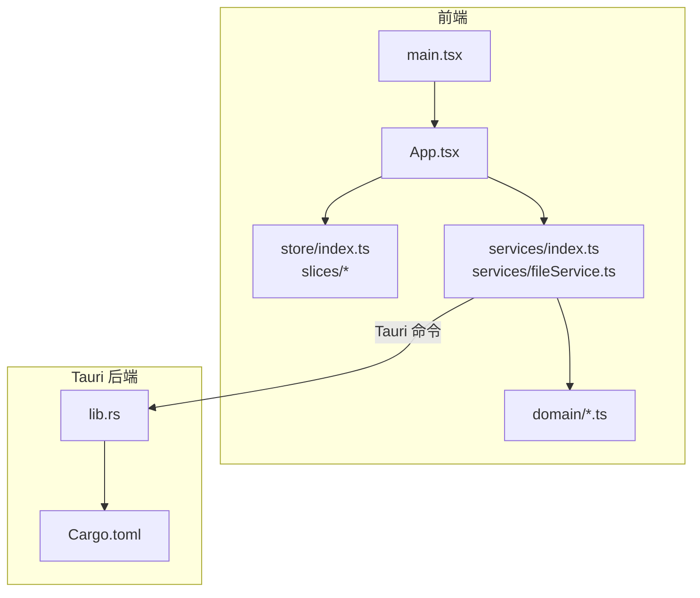
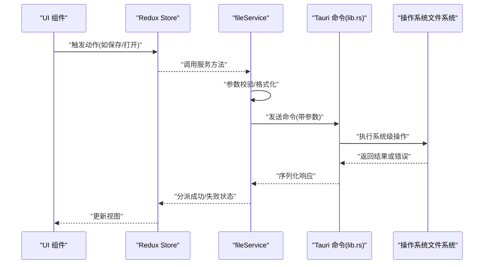
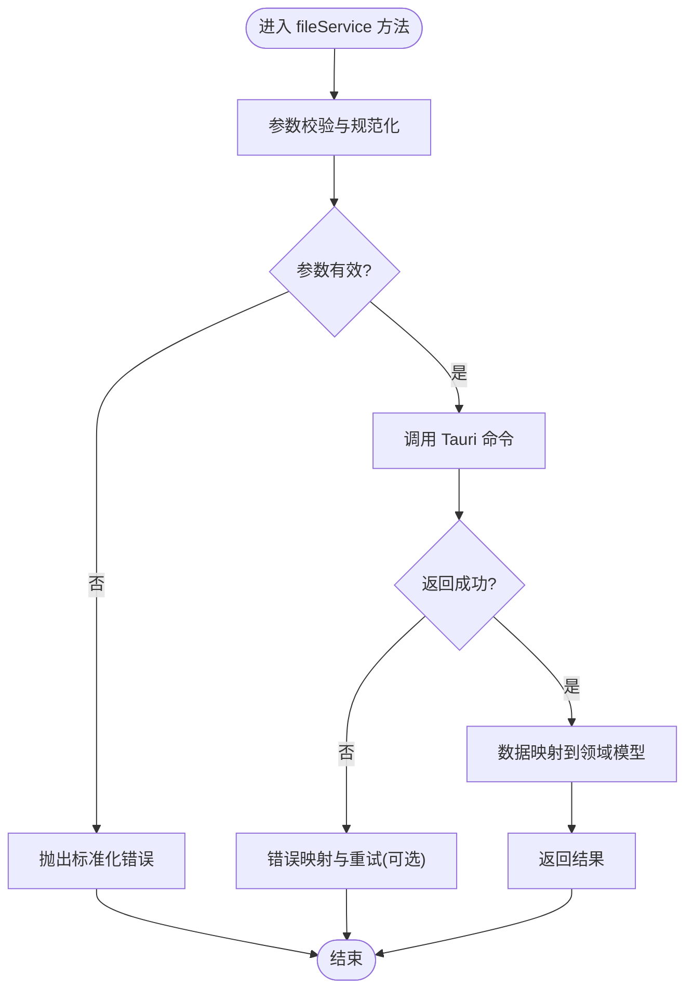
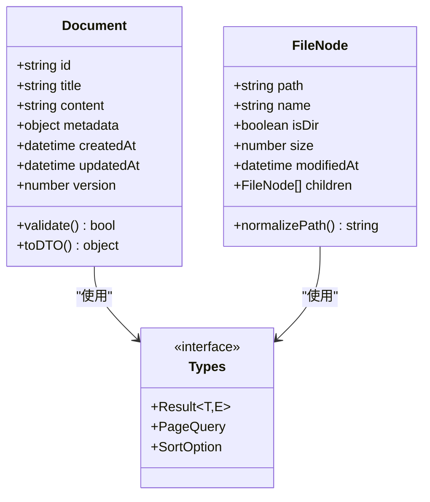
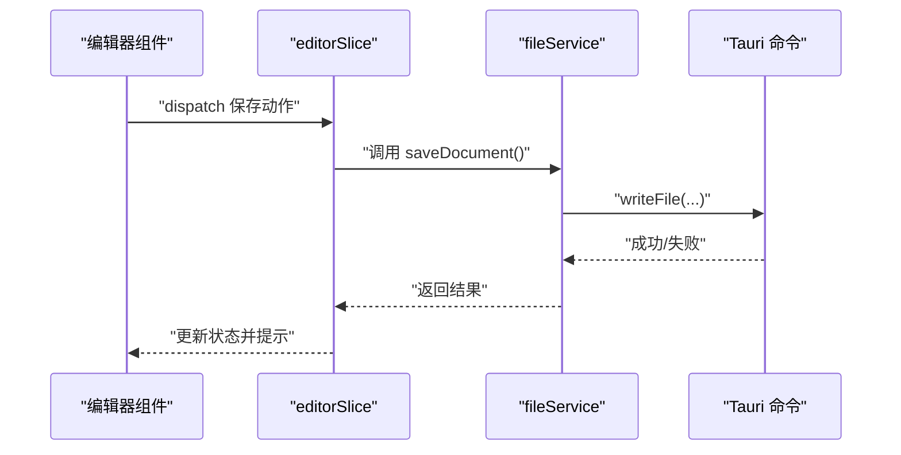
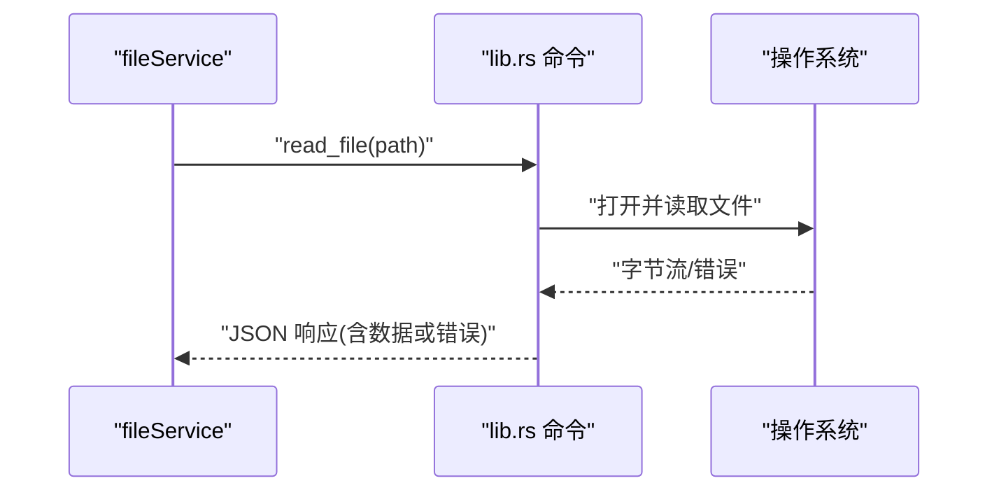
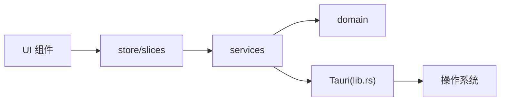

# 服务层架构

<cite>
**本文档引用的文件**   
- [src/services/fileService.ts](file://src/services/fileService.ts)
- [src/services/index.ts](file://src/services/index.ts)
- [src/domain/document.ts](file://src/domain/document.ts)
- [src/domain/filesystem.ts](file://src/domain/filesystem.ts)
- [src/domain/types.ts](file://src/domain/types.ts)
- [src/store/index.ts](file://src/store/index.ts)
- [src/store/slices/editorSlice.ts](file://src/store/slices/editorSlice.ts)
- [src/store/slices/fileTreeSlice.ts](file://src/store/slices/fileTreeSlice.ts)
- [src/main.tsx](file://src/main.tsx)
- [src/App.tsx](file://src/App.tsx)
- [src-tauri/src/lib.rs](file://src-tauri/src/lib.rs)
- [src-tauri/Cargo.toml](file://src-tauri/Cargo.toml)
</cite>

## 目录
1. [简介](#简介)
2. [项目结构](#项目结构)
3. [核心组件](#核心组件)
4. [架构总览](#架构总览)
5. [详细组件分析](#详细组件分析)
6. [依赖分析](#依赖分析)
7. [性能考虑](#性能考虑)
8. [故障排查指南](#故障排查指南)
9. [结论](#结论)
10. [附录](#附录)

## 简介
本文件聚焦于 ZenNote 的服务层架构，围绕前端服务模块、领域模型与 Tauri 后端能力进行系统性说明。文档从整体架构出发，逐步深入到服务接口、数据流、状态管理与跨进程通信，帮助读者快速理解“前端服务 → 领域模型 → Tauri 后端”的分层协作方式，并提供可操作的排错建议与优化方向。

## 项目结构
ZenNote 采用典型的前端 + Tauri 后端的双端结构：
- 前端（React/TypeScript）：通过 src/services 暴露统一的服务接口，使用 store 管理 UI 状态，domain 定义领域模型与类型。
- 后端（Rust/Tauri）：在 src-tauri 中实现文件系统、持久化等系统级能力，并通过命令暴露给前端调用。

图表来源
- [src/App.tsx](file://src/App.tsx)
- [src/main.tsx](file://src/main.tsx)
- [src/store/index.ts](file://src/store/index.ts)
- [src/services/index.ts](file://src/services/index.ts)
- [src/services/fileService.ts](file://src/services/fileService.ts)
- [src/domain/document.ts](file://src/domain/document.ts)
- [src/domain/filesystem.ts](file://src/domain/filesystem.ts)
- [src/domain/types.ts](file://src/domain/types.ts)
- [src-tauri/src/lib.rs](file://src-tauri/src/lib.rs)
- [src-tauri/Cargo.toml](file://src-tauri/Cargo.toml)

章节来源
- [src/services/index.ts](file://src/services/index.ts)
- [src/services/fileService.ts](file://src/services/fileService.ts)
- [src/domain/types.ts](file://src/domain/types.ts)
- [src-tauri/src/lib.rs](file://src-tauri/src/lib.rs)

## 核心组件
- 服务层（services）
  - fileService.ts：封装文件读写、路径解析、格式转换等能力，向上提供统一的 Promise API，向下通过 Tauri 命令与后端交互。
  - index.ts：聚合导出服务入口，便于上层按需引入。
- 领域模型（domain）
  - document.ts：文档实体、元数据、版本与变更历史等抽象。
  - filesystem.ts：文件系统抽象（路径、目录、文件列表、权限等）。
  - types.ts：全局类型定义，贯穿前后端契约。
- 状态管理（store）
  - slices/editorSlice.ts：编辑器相关状态（内容、光标、选中、撤销栈等）。
  - slices/fileTreeSlice.ts：文件树状态（展开、选中、加载态等）。
  - index.ts：Store 装配与中间件配置。
- Tauri 后端（src-tauri）
  - lib.rs：注册 Tauri 命令，实现文件系统操作、序列化/反序列化、错误处理等。
  - Cargo.toml：后端依赖声明与构建配置。

章节来源
- [src/services/fileService.ts](file://src/services/fileService.ts)
- [src/services/index.ts](file://src/services/index.ts)
- [src/domain/document.ts](file://src/domain/document.ts)
- [src/domain/filesystem.ts](file://src/domain/filesystem.ts)
- [src/domain/types.ts](file://src/domain/types.ts)
- [src/store/index.ts](file://src/store/index.ts)
- [src/store/slices/editorSlice.ts](file://src/store/slices/editorSlice.ts)
- [src/store/slices/fileTreeSlice.ts](file://src/store/slices/fileTreeSlice.ts)
- [src-tauri/src/lib.rs](file://src-tauri/src/lib.rs)
- [src-tauri/Cargo.toml](file://src-tauri/Cargo.toml)

## 架构总览
服务层作为前端与后端的桥梁，遵循“薄服务、厚领域、强后端”的原则：
- 前端服务层仅做参数校验、结果映射与错误包装，不承载复杂业务逻辑。
- 领域模型集中表达文档与文件系统的概念与不变式。
- Tauri 后端负责系统级 I/O、安全策略与性能敏感操作。

图表来源
- [src/services/fileService.ts](file://src/services/fileService.ts)
- [src-tauri/src/lib.rs](file://src-tauri/src/lib.rs)
- [src/store/index.ts](file://src/store/index.ts)

## 详细组件分析

### 文件服务（fileService）
职责
- 对外暴露统一的文件操作 API（读取、写入、列出目录、移动/复制、删除等）。
- 对输入进行基础校验与规范化（路径、编码、扩展名）。
- 将 Tauri 命令的原始响应转换为领域友好的数据结构。
- 统一错误处理与重试策略（可选）。

关键流程
- 读取文件：参数校验 → 调用 Tauri 读取 → 解码/解析 → 返回文档对象。
- 保存文件：参数校验 → 序列化 → 调用 Tauri 写入 → 更新本地缓存/状态。
- 列出目录：参数校验 → 调用 Tauri 枚举 → 过滤/排序 → 返回文件树节点。

图表来源
- [src/services/fileService.ts](file://src/services/fileService.ts)

章节来源
- [src/services/fileService.ts](file://src/services/fileService.ts)
- [src/services/index.ts](file://src/services/index.ts)

### 领域模型（document / filesystem / types）
- document.ts：定义文档实体（标题、内容、元数据、时间戳、版本等），以及文档集合与变更语义。
- filesystem.ts：抽象路径、目录项、权限、大小、修改时间等文件系统概念。
- types.ts：统一类型（如 Result<T, E>、分页、排序、搜索条件等），确保前后端契约一致。

图表来源
- [src/domain/document.ts](file://src/domain/document.ts)
- [src/domain/filesystem.ts](file://src/domain/filesystem.ts)
- [src/domain/types.ts](file://src/domain/types.ts)

章节来源
- [src/domain/document.ts](file://src/domain/document.ts)
- [src/domain/filesystem.ts](file://src/domain/filesystem.ts)
- [src/domain/types.ts](file://src/domain/types.ts)

### 状态管理（store）
- editorSlice.ts：维护编辑器内容、选择范围、撤销/重做栈、拼写检查开关等。
- fileTreeSlice.ts：维护文件树展开状态、当前选中文件、加载与错误状态。
- index.ts：组合 reducers、应用中间件（如日志、持久化）、导出 Store。

图表来源
- [src/store/slices/editorSlice.ts](file://src/store/slices/editorSlice.ts)
- [src/services/fileService.ts](file://src/services/fileService.ts)
- [src-tauri/src/lib.rs](file://src-tauri/src/lib.rs)

章节来源
- [src/store/index.ts](file://src/store/index.ts)
- [src/store/slices/editorSlice.ts](file://src/store/slices/editorSlice.ts)
- [src/store/slices/fileTreeSlice.ts](file://src/store/slices/fileTreeSlice.ts)

### Tauri 后端（lib.rs）
职责
- 注册命令（如 read_file、write_file、list_dir 等）。
- 处理参数反序列化、权限校验、路径安全（防越界）。
- 调用 Rust 标准库或 crates 完成 I/O，返回 JSON 或二进制。
- 统一错误码与消息，便于前端映射。

图表来源
- [src-tauri/src/lib.rs](file://src-tauri/src/lib.rs)

章节来源
- [src-tauri/src/lib.rs](file://src-tauri/src/lib.rs)
- [src-tauri/Cargo.toml](file://src-tauri/Cargo.toml)

## 依赖分析
- 前端服务层依赖领域模型类型，保证数据一致性。
- 前端状态切片依赖服务层提供的 Promise API，避免直接耦合 Tauri。
- Tauri 后端独立于前端，通过命令契约交互，降低耦合度。
- 可能的循环依赖：应避免 services 直接引用 store，保持单向依赖：UI → store → services → Tauri。

图表来源
- [src/store/slices/editorSlice.ts](file://src/store/slices/editorSlice.ts)
- [src/store/slices/fileTreeSlice.ts](file://src/store/slices/fileTreeSlice.ts)
- [src/services/index.ts](file://src/services/index.ts)
- [src/services/fileService.ts](file://src/services/fileService.ts)
- [src/domain/types.ts](file://src/domain/types.ts)
- [src-tauri/src/lib.rs](file://src-tauri/src/lib.rs)

章节来源
- [src/services/index.ts](file://src/services/index.ts)
- [src/services/fileService.ts](file://src/services/fileService.ts)
- [src/domain/types.ts](file://src/domain/types.ts)
- [src-tauri/src/lib.rs](file://src-tauri/src/lib.rs)

## 性能考虑
- 批量操作：合并多次小 I/O 为一次批量命令，减少跨进程开销。
- 懒加载与分页：大目录枚举时采用分页与增量更新。
- 缓存策略：对频繁读取的元数据（目录结构、文件属性）进行内存缓存与失效控制。
- 异步与并发：合理设置并发上限，避免阻塞主线程；对耗时任务使用后台队列。
- 序列化成本：尽量传输最小必要字段，必要时使用二进制协议。

[本节为通用指导，无需特定文件来源]

## 故障排查指南
常见问题与定位步骤
- 文件读取失败
  - 检查路径是否合法、是否存在、是否有读权限。
  - 查看 Tauri 命令返回的错误码与消息，确认是否为系统级异常。
- 保存失败
  - 校验目标路径可写性、磁盘空间、文件名合法性。
  - 检查序列化格式是否与后端期望一致。
- 状态不同步
  - 确认 store 是否正确分发成功/失败动作。
  - 检查服务层返回值映射是否覆盖所有分支。
- 性能问题
  - 使用浏览器开发者工具观察网络/命令调用耗时。
  - 统计重复 I/O 次数，评估是否可缓存或批量化。

章节来源
- [src/services/fileService.ts](file://src/services/fileService.ts)
- [src-tauri/src/lib.rs](file://src-tauri/src/lib.rs)
- [src/store/slices/editorSlice.ts](file://src/store/slices/editorSlice.ts)

## 结论
ZenNote 的服务层以“清晰分层、弱耦合、强契约”为核心设计原则，通过 services 统一对外能力，domain 沉淀领域知识，Tauri 承担系统级 I/O。该架构易于扩展与维护，适合在桌面端应用中稳定运行。后续可在批量 I/O、缓存与错误恢复方面持续优化，以提升用户体验与系统可靠性。

[本节为总结性内容，无需特定文件来源]

## 附录
- 术语表
  - 服务层：封装外部能力（I/O、网络、系统调用）的统一接口层。
  - 领域模型：表达业务概念与规则的数据结构与行为。
  - Tauri：基于 Rust 的跨平台桌面应用框架，提供安全的系统能力访问。
- 参考文件
  - 服务入口与实现：[src/services/index.ts](file://src/services/index.ts)、[src/services/fileService.ts](file://src/services/fileService.ts)
  - 领域模型：[src/domain/document.ts](file://src/domain/document.ts)、[src/domain/filesystem.ts](file://src/domain/filesystem.ts)、[src/domain/types.ts](file://src/domain/types.ts)
  - 状态管理：[src/store/index.ts](file://src/store/index.ts)、[src/store/slices/editorSlice.ts](file://src/store/slices/editorSlice.ts)、[src/store/slices/fileTreeSlice.ts](file://src/store/slices/fileTreeSlice.ts)
  - Tauri 后端：[src-tauri/src/lib.rs](file://src-tauri/src/lib.rs)、[src-tauri/Cargo.toml](file://src-tauri/Cargo.toml)