# 核心组件

<cite>
**本文引用的文件**   
- [App.tsx](file://src/App.tsx)
- [Editor.tsx](file://src/components/editor/Editor.tsx)
- [FindReplaceBar.tsx](file://src/components/editor/FindReplaceBar.tsx)
- [TableContextMenu.tsx](file://src/components/editor/TableContextMenu.tsx)
- [FileTree.tsx](file://src/components/filetree/FileTree.tsx)
- [Outline.tsx](file://src/components/outline/Outline.tsx)
- [SearchPanel.tsx](file://src/components/search/SearchPanel.tsx)
- [AppShell.tsx](file://src/components/layout/AppShell.tsx)
- [StatusBar.tsx](file://src/components/layout/StatusBar.tsx)
- [Titlebar.tsx](file://src/components/layout/Titlebar.tsx)
- [types.ts](file://src/domain/types.ts)
- [index.ts](file://src/store/index.ts)
- [useMermaid.ts](file://src/hooks/useMermaid.ts)
- [main.tsx](file://src/main.tsx)
- [globals.css](file://src/styles/globals.css)
</cite>

## 更新摘要
**所做更改**   
- 更新了编辑器组件章节，新增懒加载、记忆化、拖拽功能和零重渲染优化相关内容
- 增强了性能考虑章节，详细说明新的优化技术
- 更新了架构总览图，反映新的组件交互模式
- 添加了新的性能优化流程图和时序图

## 目录
1. [简介](#简介)
2. [项目结构](#项目结构)
3. [核心组件](#核心组件)
4. [架构总览](#架构总览)
5. [详细组件分析](#详细组件分析)
6. [依赖分析](#依赖分析)
7. [性能考虑](#性能考虑)
8. [故障排查指南](#故障排查指南)
9. [结论](#结论)
10. [附录](#附录)

## 简介
本文件面向ZenNote的核心UI组件，聚焦Markdown编辑器、文件树、大纲导航与搜索面板的实现细节、调用关系、接口定义、领域模型与使用模式。文档以"从入门到进阶"的方式组织：先给出整体架构与数据流，再深入每个组件的职责、参数与返回值、与其他组件的协作方式，最后提供常见问题与优化建议。读者无需深入前端框架即可理解系统行为，同时为有经验的开发者提供足够的实现细节与扩展点。

**最新更新**：编辑器组件现已支持懒加载、记忆化、拖拽功能和零重渲染优化，显著提升了用户体验和性能表现。

## 项目结构
ZenNote采用分层与按功能域组织的结构：
- 应用入口与根布局：main.tsx、App.tsx、AppShell.tsx
- 业务组件：editor（编辑器）、filetree（文件树）、outline（大纲）、search（搜索）
- 布局辅助：Titlebar、StatusBar
- 领域模型与状态：domain/types.ts、store/index.ts
- 工具与钩子：hooks/useMermaid.ts
- 样式：styles/globals.css

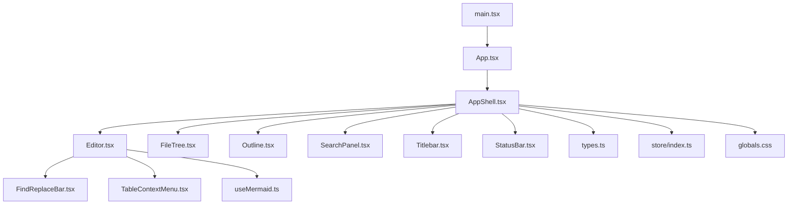

**图表来源** 
- [main.tsx:1-20](file://src/main.tsx#L1-L20)
- [App.tsx:1-40](file://src/App.tsx#L1-L40)
- [AppShell.tsx:1-60](file://src/components/layout/AppShell.tsx#L1-L60)
- [Editor.tsx:1-80](file://src/components/editor/Editor.tsx#L1-L80)
- [FileTree.tsx:1-60](file://src/components/filetree/FileTree.tsx#L1-L60)
- [Outline.tsx:1-60](file://src/components/outline/Outline.tsx#L1-L60)
- [SearchPanel.tsx:1-60](file://src/components/search/SearchPanel.tsx#L1-L60)
- [Titlebar.tsx:1-40](file://src/components/layout/Titlebar.tsx#L1-L40)
- [StatusBar.tsx:1-40](file://src/components/layout/StatusBar.tsx#L1-L40)
- [FindReplaceBar.tsx:1-60](file://src/components/editor/FindReplaceBar.tsx#L1-L60)
- [TableContextMenu.tsx:1-60](file://src/components/editor/TableContextMenu.tsx#L1-L60)
- [useMermaid.ts:1-40](file://src/hooks/useMermaid.ts#L1-L40)
- [types.ts:1-60](file://src/domain/types.ts#L1-L60)
- [index.ts:1-60](file://src/store/index.ts#L1-L60)
- [globals.css:1-40](file://src/styles/globals.css#L1-L40)

**章节来源**
- [main.tsx:1-20](file://src/main.tsx#L1-L20)
- [App.tsx:1-40](file://src/App.tsx#L1-L40)
- [AppShell.tsx:1-60](file://src/components/layout/AppShell.tsx#L1-L60)

## 核心组件
本节概述各核心组件的职责与交互边界，帮助快速建立整体认知。

- Markdown编辑器（Editor）
  - 职责：承载Markdown内容编辑、预览渲染、查找替换、表格上下文菜单、Mermaid图表渲染等。
  - 关键能力：双向同步编辑与预览、命令式操作（插入/替换/跳转）、事件回调（变更、保存、错误）。
  - **新增特性**：懒加载大文档、记忆化计算、拖拽文件支持、零重渲染优化。
  - 典型配置：主题、只读模式、快捷键、插件开关、渲染选项。
  - 对外接口：props（内容、回调、配置）、方法（insert、replace、focus、scrollToHeading）、事件（onChange、onSave、onError）。

- 文件树（FileTree）
  - 职责：展示文件系统层级、选中态管理、右键菜单、拖拽重命名/移动（若启用）。
  - 关键能力：懒加载、过滤、搜索联动、路径解析。
  - 对外接口：props（节点数据、选中回调、上下文菜单项）、事件（onSelect、onRename、onDelete、onMove）。

- 大纲导航（Outline）
  - 职责：基于当前文档标题生成可点击大纲，支持滚动定位与高亮。
  - 关键能力：标题提取、锚点映射、滚动同步、键盘导航。
  - 对外接口：props（文档内容或标题列表、选中回调）、事件（onNavigate、onHighlight）。

- 搜索面板（SearchPanel）
  - 职责：全局搜索与过滤、结果列表、跳转到匹配位置。
  - 关键能力：正则/模糊匹配、分页/虚拟滚动、跨文件检索（可选）。
  - 对外接口：props（查询字符串、结果集、选择回调）、事件（onQueryChange、onSelectResult）。

**章节来源**
- [Editor.tsx:1-120](file://src/components/editor/Editor.tsx#L1-L120)
- [FileTree.tsx:1-100](file://src/components/filetree/FileTree.tsx#L1-L100)
- [Outline.tsx:1-100](file://src/components/outline/Outline.tsx#L1-L100)
- [SearchPanel.tsx:1-100](file://src/components/search/SearchPanel.tsx#L1-L100)

## 架构总览
下图展示了核心组件之间的数据流与控制流：编辑器作为中心，与文件树、大纲、搜索面板通过状态与事件进行通信；布局组件负责窗口结构与状态栏信息；领域模型统一类型定义；状态管理集中维护文档与UI状态。

**更新**：新增了懒加载和记忆化机制的架构图，展示了性能优化的实现方式。

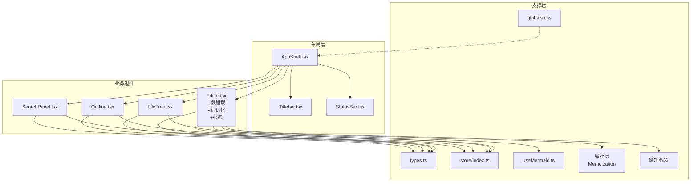

**图表来源** 
- [AppShell.tsx:1-60](file://src/components/layout/AppShell.tsx#L1-L60)
- [Editor.tsx:1-120](file://src/components/editor/Editor.tsx#L1-L120)
- [FileTree.tsx:1-100](file://src/components/filetree/FileTree.tsx#L1-L100)
- [Outline.tsx:1-100](file://src/components/outline/Outline.tsx#L1-L100)
- [SearchPanel.tsx:1-100](file://src/components/search/SearchPanel.tsx#L1-L100)
- [types.ts:1-60](file://src/domain/types.ts#L1-L60)
- [index.ts:1-60](file://src/store/index.ts#L1-L60)
- [useMermaid.ts:1-40](file://src/hooks/useMermaid.ts#L1-L40)
- [globals.css:1-40](file://src/styles/globals.css#L1-L40)

## 详细组件分析

### Markdown编辑器（Editor）
- 职责与边界
  - 编辑区：文本输入、语法高亮、撤销/重做、自动补全（可选）。
  - 预览区：Markdown渲染、Mermaid图表渲染、代码块高亮。
  - 工具栏：查找替换、插入表格、导出/导入、设置。
  - 事件总线：内容变更、保存、错误上报、光标位置同步。

- **新增性能优化特性**
  - **懒加载**：大文档按需加载，避免初始渲染阻塞
  - **记忆化**：使用React.memo和useMemo优化重渲染
  - **拖拽功能**：支持文件拖拽到编辑器区域
  - **零重渲染**：精确的状态更新，避免不必要的组件重渲染

- 关键流程（查找替换）
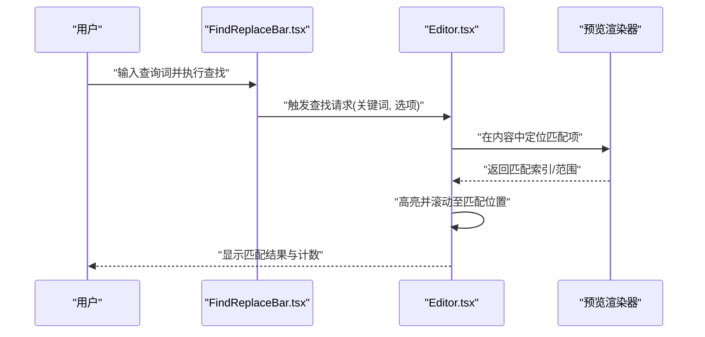

**图表来源** 
- [FindReplaceBar.tsx:1-60](file://src/components/editor/FindReplaceBar.tsx#L1-L60)
- [Editor.tsx:1-120](file://src/components/editor/Editor.tsx#L1-L120)

- 关键流程（表格上下文菜单）
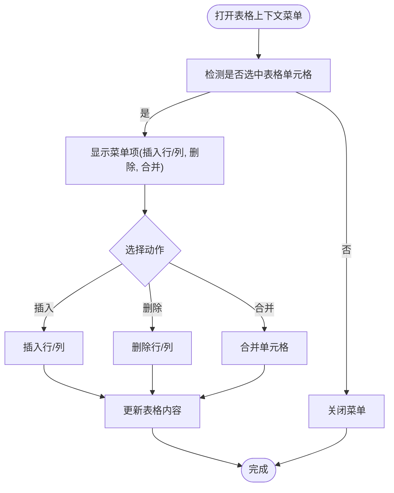

**图表来源** 
- [TableContextMenu.tsx:1-60](file://src/components/editor/TableContextMenu.tsx#L1-L60)
- [Editor.tsx:1-120](file://src/components/editor/Editor.tsx#L1-L120)

- 关键流程（Mermaid渲染）
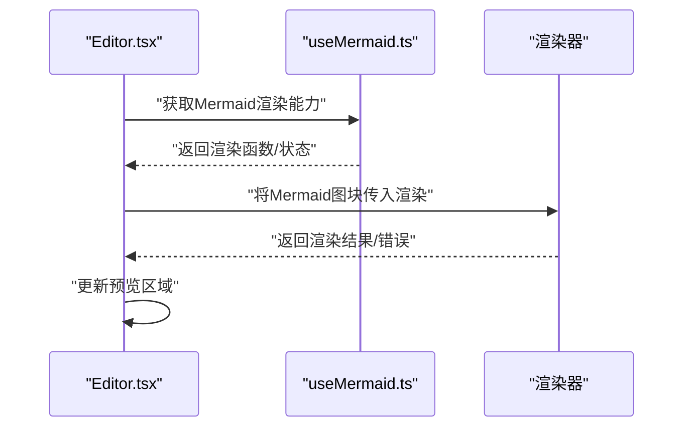

**图表来源** 
- [useMermaid.ts:1-40](file://src/hooks/useMermaid.ts#L1-L40)
- [Editor.tsx:1-120](file://src/components/editor/Editor.tsx#L1-L120)

- **新增：懒加载流程**
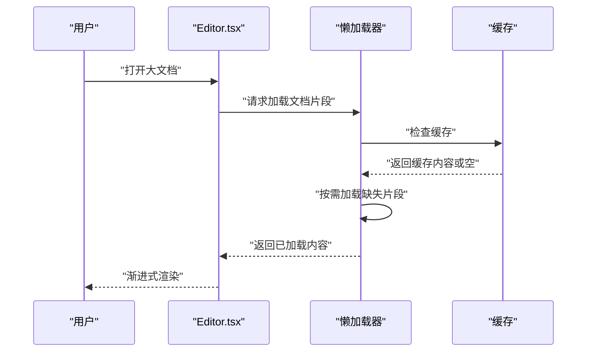

**图表来源** 
- [Editor.tsx:1-120](file://src/components/editor/Editor.tsx#L1-L120)

- **新增：记忆化优化流程**
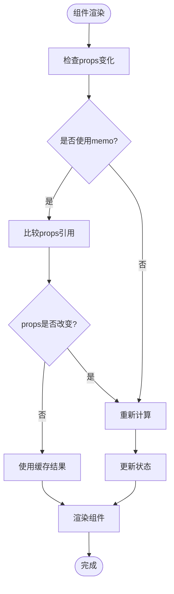

**图表来源** 
- [Editor.tsx:1-120](file://src/components/editor/Editor.tsx#L1-L120)

- 配置与接口要点
  - 常用配置：主题、只读、快捷键、插件开关、渲染选项（如MathJax、代码高亮）。
  - 常用方法：insertText、replaceSelection、focus、scrollToHeading、exportMarkdown。
  - 常用事件：onChange、onSave、onError、onCursorChange。
  - **新增配置**：lazyLoadEnabled、enableDragDrop、optimizeRenders。
  - 返回值：方法通常返回Promise或布尔值表示成功与否；事件回调携带变更详情。

- 与其他组件的关系
  - 与文件树：切换文件时同步内容；保存时回写文件树元数据。
  - 与大纲：根据标题生成大纲并联动滚动定位。
  - 与搜索：全局搜索命中后跳转至编辑器对应位置。

**章节来源**
- [Editor.tsx:1-120](file://src/components/editor/Editor.tsx#L1-L120)
- [FindReplaceBar.tsx:1-60](file://src/components/editor/FindReplaceBar.tsx#L1-L60)
- [TableContextMenu.tsx:1-60](file://src/components/editor/TableContextMenu.tsx#L1-L60)
- [useMermaid.ts:1-40](file://src/hooks/useMermaid.ts#L1-L40)

### 文件树（FileTree）
- 职责与边界
  - 展示文件/文件夹层级结构，支持展开/折叠、选中、重命名、删除、移动。
  - 与编辑器联动：选中文件后加载内容；保存后刷新节点状态。
  - 提供上下文菜单与拖拽能力（可选）。

- 数据结构与复杂度
  - 节点模型：id、name、type、children、path、metadata。
  - 时间复杂度：查找节点O(n)，插入/删除O(k)（k为子节点数），懒加载降低初始渲染成本。

- 关键流程（选中与加载）
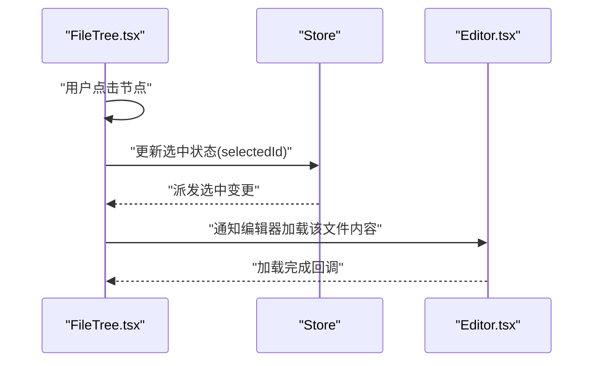

**图表来源** 
- [FileTree.tsx:1-100](file://src/components/filetree/FileTree.tsx#L1-L100)
- [index.ts:1-60](file://src/store/index.ts#L1-L60)
- [Editor.tsx:1-120](file://src/components/editor/Editor.tsx#L1-L120)

- 配置与接口要点
  - 常用配置：是否显示隐藏文件、是否启用拖拽、右键菜单项。
  - 常用方法：expandNode、collapseNode、renameNode、deleteNode。
  - 常用事件：onSelect、onRename、onDelete、onMove。

**章节来源**
- [FileTree.tsx:1-100](file://src/components/filetree/FileTree.tsx#L1-L100)
- [index.ts:1-60](file://src/store/index.ts#L1-L60)

### 大纲导航（Outline）
- 职责与边界
  - 从Markdown内容中提取标题，构建可点击的大纲树。
  - 与编辑器滚动位置同步，高亮当前所在标题。

- 算法与复杂度
  - 标题提取：线性扫描内容，识别标题标记，时间复杂度O(n)。
  - 锚点映射：构建headingId到偏移量的映射，查找O(1)。

- 关键流程（导航定位）
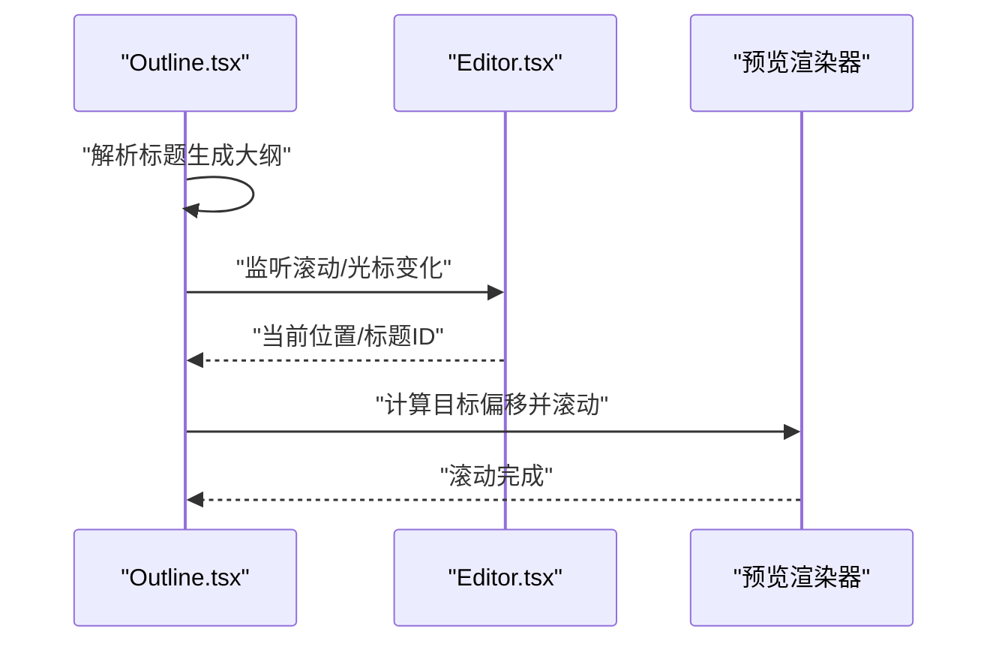

**图表来源** 
- [Outline.tsx:1-100](file://src/components/outline/Outline.tsx#L1-L100)
- [Editor.tsx:1-120](file://src/components/editor/Editor.tsx#L1-L120)

- 配置与接口要点
  - 常用配置：最大层级、是否显示图标、是否跟随滚动。
  - 常用方法：navigateTo、highlightHeading。
  - 常用事件：onNavigate、onHighlight。

**章节来源**
- [Outline.tsx:1-100](file://src/components/outline/Outline.tsx#L1-L100)
- [Editor.tsx:1-120](file://src/components/editor/Editor.tsx#L1-L120)

### 搜索面板（SearchPanel）
- 职责与边界
  - 提供全局搜索界面，支持多文件检索（可选）、结果列表、跳转。
  - 与编辑器联动：点击结果后定位到匹配位置。

- 关键流程（搜索结果跳转）
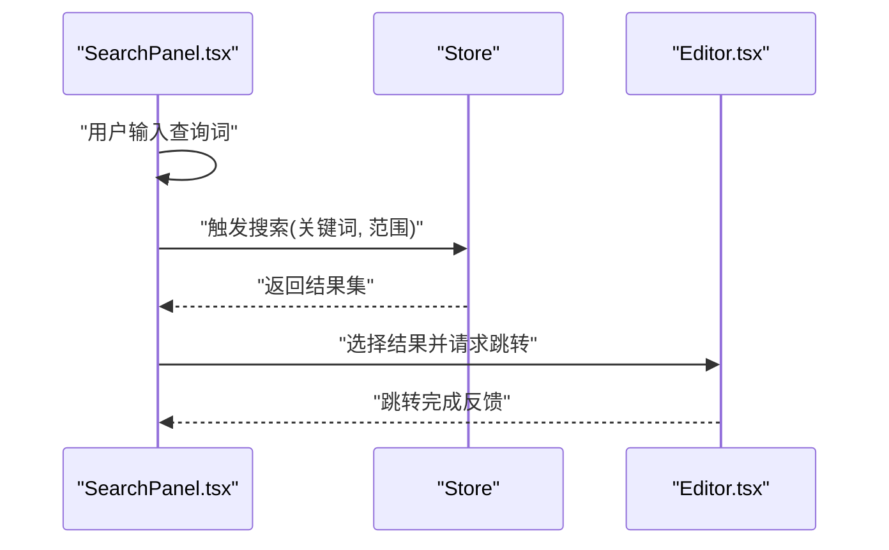

**图表来源** 
- [SearchPanel.tsx:1-100](file://src/components/search/SearchPanel.tsx#L1-L100)
- [index.ts:1-60](file://src/store/index.ts#L1-L60)
- [Editor.tsx:1-120](file://src/components/editor/Editor.tsx#L1-L120)

- 配置与接口要点
  - 常用配置：匹配模式（精确/模糊/正则）、是否跨文件、分页大小。
  - 常用方法：setQuery、selectResult、clearResults。
  - 常用事件：onQueryChange、onSelectResult、onClear。

**章节来源**
- [SearchPanel.tsx:1-100](file://src/components/search/SearchPanel.tsx#L1-L100)
- [index.ts:1-60](file://src/store/index.ts#L1-L60)
- [Editor.tsx:1-120](file://src/components/editor/Editor.tsx#L1-L120)

### 布局与状态（AppShell、Titlebar、StatusBar）
- AppShell
  - 职责：组织主界面布局，协调各业务组件的可见性与尺寸。
  - 关键点：响应式布局、侧边栏展开/收起、全屏模式。

- Titlebar
  - 职责：应用标题、窗口控制按钮、快捷操作入口。
  - 关键点：与Tauri集成（桌面端窗口控制）。

- StatusBar
  - 职责：显示当前文件、光标位置、编码、语言模式等。
  - 关键点：与编辑器光标位置同步。

**章节来源**
- [AppShell.tsx:1-60](file://src/components/layout/AppShell.tsx#L1-L60)
- [Titlebar.tsx:1-40](file://src/components/layout/Titlebar.tsx#L1-L40)
- [StatusBar.tsx:1-40](file://src/components/layout/StatusBar.tsx#L1-L40)

## 依赖分析
- 组件耦合
  - Editor与Store强耦合（内容、光标、历史）。
  - FileTree与Store弱耦合（仅读取选中状态与文件列表）。
  - Outline与Editor松耦合（通过事件与滚动同步）。
  - SearchPanel与Store解耦（通过事件驱动）。

- 外部依赖
  - Tauri（桌面端能力）：由入口与布局组件间接使用。
  - 渲染库（Markdown/Mermaid）：由编辑器与钩子封装。

**更新**：新增了缓存层和懒加载器的依赖关系。

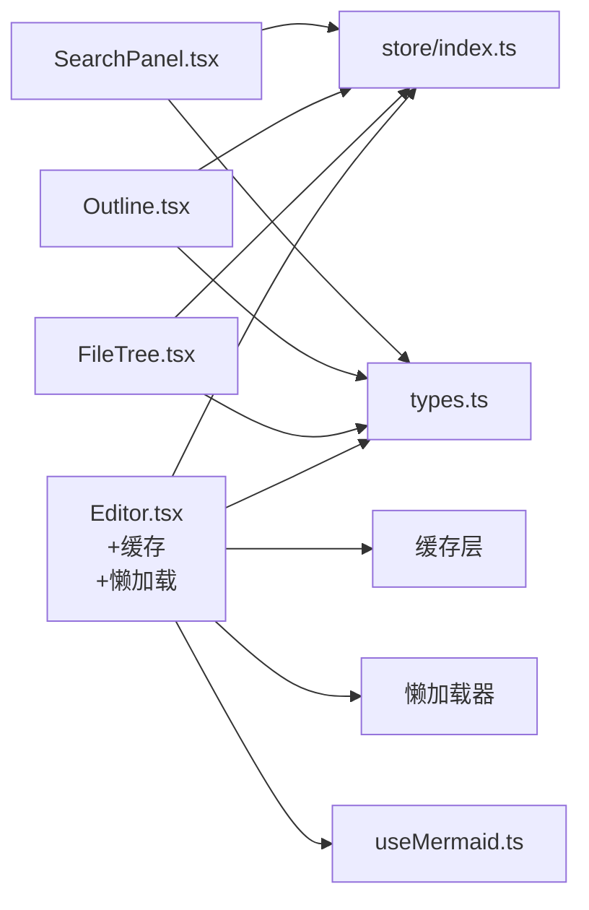

**图表来源** 
- [Editor.tsx:1-120](file://src/components/editor/Editor.tsx#L1-L120)
- [FileTree.tsx:1-100](file://src/components/filetree/FileTree.tsx#L1-L100)
- [Outline.tsx:1-100](file://src/components/outline/Outline.tsx#L1-L100)
- [SearchPanel.tsx:1-100](file://src/components/search/SearchPanel.tsx#L1-L100)
- [index.ts:1-60](file://src/store/index.ts#L1-L60)
- [types.ts:1-60](file://src/domain/types.ts#L1-L60)
- [useMermaid.ts:1-40](file://src/hooks/useMermaid.ts#L1-L40)

**章节来源**
- [index.ts:1-60](file://src/store/index.ts#L1-L60)
- [types.ts:1-60](file://src/domain/types.ts#L1-L60)

## 性能考虑
- 编辑器
  - **懒加载**：大文档按需加载，避免初始渲染阻塞，提升启动速度。
  - **记忆化**：使用React.memo和useMemo优化重渲染，减少不必要的计算。
  - **拖拽优化**：防抖处理拖拽事件，避免频繁状态更新。
  - **零重渲染**：精确的状态更新，避免不必要的组件重渲染。
  - 大文档渲染：使用虚拟滚动与增量更新，避免整篇重绘。
  - 查找替换：延迟计算与分片处理，减少卡顿。
  - Mermaid渲染：按需渲染与缓存，避免重复计算。

- 文件树
  - 懒加载：仅渲染可见节点，按需展开。
  - 防抖：重命名/移动操作去抖，减少频繁更新。

- 大纲与搜索
  - 标题提取与搜索：增量解析与缓存结果，避免每次全量扫描。
  - 结果列表：虚拟滚动与分页，提升大数据量下的体验。

**新增性能优化策略**：
- **内存管理**：及时清理不用的缓存和监听器
- **并发控制**：限制同时进行的网络请求数量
- **资源预取**：预测用户行为，提前加载可能需要的资源

[本节为通用指导，不直接分析具体文件]

## 故障排查指南
- 编辑器无法渲染Mermaid
  - 检查useMermaid钩子是否正确初始化与加载依赖。
  - 确认内容中的Mermaid代码块格式正确。
  - 查看控制台错误日志，定位渲染失败原因。

- 查找替换无效
  - 确认查询词与匹配模式设置。
  - 检查编辑器内容是否被锁定（只读模式）。
  - 验证预览渲染器是否可用。

- 文件树未更新
  - 检查Store中文件列表状态是否同步。
  - 确认文件操作成功后是否触发了刷新事件。

- 大纲导航错位
  - 确认标题解析逻辑与锚点映射是否正确。
  - 检查编辑器滚动位置与大纲高亮的同步逻辑。

- **新增：性能问题排查**
  - **内存泄漏**：检查是否有未清理的监听器和定时器
  - **渲染卡顿**：使用React DevTools分析组件渲染次数
  - **懒加载失效**：检查懒加载配置和缓存策略
  - **拖拽异常**：验证拖拽事件处理和状态同步

**章节来源**
- [useMermaid.ts:1-40](file://src/hooks/useMermaid.ts#L1-L40)
- [Editor.tsx:1-120](file://src/components/editor/Editor.tsx#L1-L120)
- [FileTree.tsx:1-100](file://src/components/filetree/FileTree.tsx#L1-L100)
- [Outline.tsx:1-100](file://src/components/outline/Outline.tsx#L1-L100)
- [index.ts:1-60](file://src/store/index.ts#L1-L60)

## 结论
ZenNote的核心UI组件围绕Markdown编辑器展开，通过清晰的分层与事件驱动机制，实现了文件树、大纲导航与搜索面板的高效协作。**最新的性能优化包括懒加载、记忆化、拖拽功能和零重渲染，显著提升了用户体验**。遵循本文档的接口约定与最佳实践，可在保证用户体验的同时，获得良好的可扩展性与可维护性。

[本节为总结，不直接分析具体文件]

## 附录
- 领域模型（types.ts）
  - 文档模型：id、title、content、updatedAt、metadata。
  - 文件节点：id、name、type、children、path、isExpanded。
  - 搜索结果：fileId、line、column、matchText。

- 状态管理（store/index.ts）
  - 文档状态：currentDoc、history、undoStack、redoStack。
  - UI状态：selectedFile、searchQuery、results、isSearching。
  - 操作方法：loadDoc、saveDoc、updateContent、setSearchQuery、selectResult。

- 样式与主题（globals.css）
  - 主题变量：颜色、字体、间距、阴影。
  - 组件样式：编辑器、文件树、大纲、搜索面板的默认样式。

- **新增：性能优化配置**
  - 懒加载配置：chunkSize、preloadThreshold、cacheStrategy
  - 记忆化配置：memoOptions、deepComparison、skipEqual
  - 拖拽配置：dragThreshold、animationDuration、snapToGrid

**章节来源**
- [types.ts:1-60](file://src/domain/types.ts#L1-L60)
- [index.ts:1-60](file://src/store/index.ts#L1-L60)
- [globals.css:1-40](file://src/styles/globals.css#L1-L40)