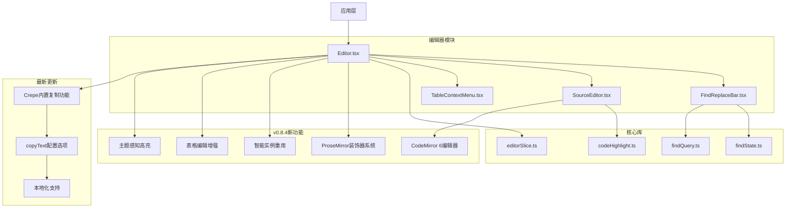
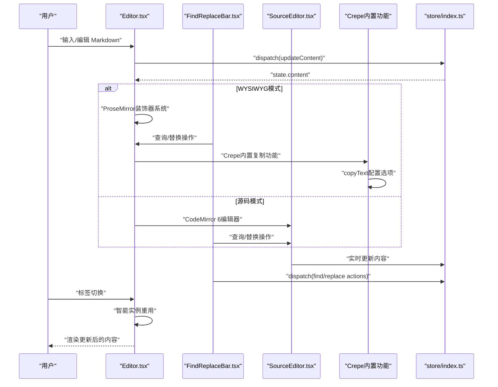
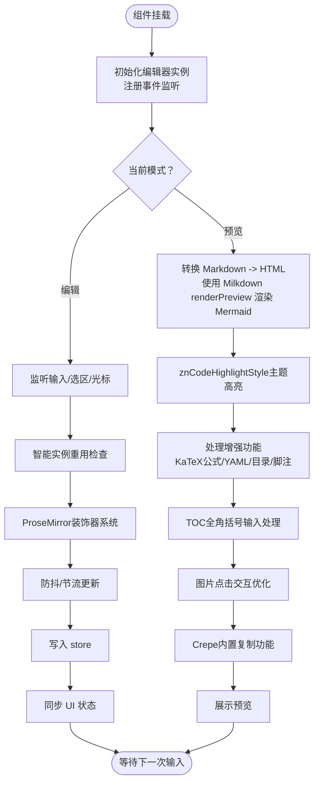
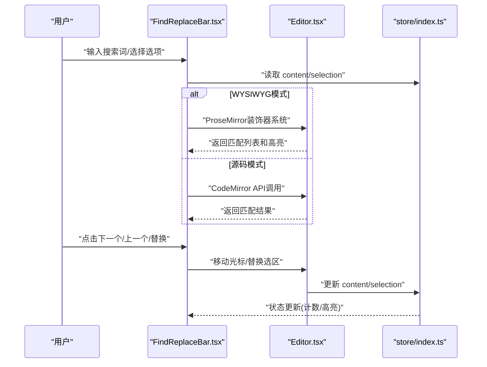
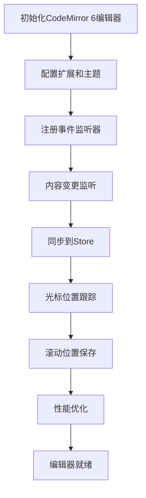
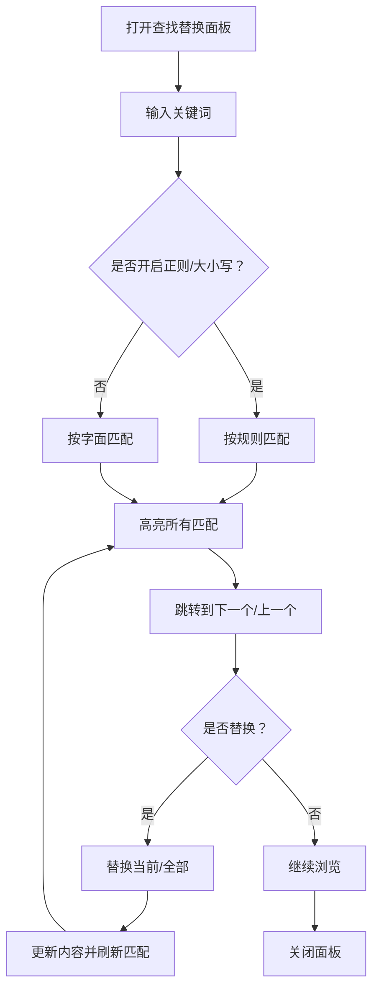
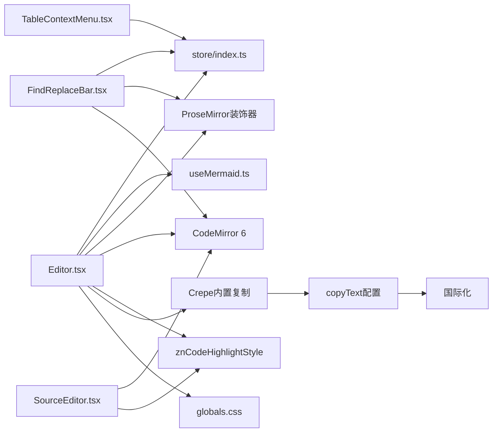

# 编辑器组件

<cite>
**本文引用的文件**   
- [Editor.tsx](file://src/components/editor/Editor.tsx)
- [FindReplaceBar.tsx](file://src/components/editor/FindReplaceBar.tsx)
- [SourceEditor.tsx](file://src/components/editor/SourceEditor.tsx)
- [TableContextMenu.tsx](file://src/components/editor/TableContextMenu.tsx)
- [findState.ts](file://src/components/editor/findState.ts)
- [codeHighlight.ts](file://src/components/editor/codeHighlight.ts)
- [findQuery.ts](file://src/lib/findQuery.ts)
- [editorSlice.ts](file://src/store/slices/editorSlice.ts)
- [zh-CN.ts](file://src/i18n/zh-CN.ts)
- [en-US.ts](file://src/i18n/en-US.ts)
</cite>

## 更新摘要
**所做更改**   
- **重大重构** 查找替换系统完全基于ProseMirror装饰器系统重新实现，支持WYSIWYG和源码模式双后端
- **新增组件** SourceEditor组件基于CodeMirror 6构建，提供完整的Markdown语法高亮和编辑功能
- **智能实例重用** 编辑器在标签切换时复用现有实例而非重建，显著提升性能
- **增强表格编辑** 改进表格上下文菜单操作和单元格处理逻辑
- **主题感知高亮** 统一的znCodeHighlightStyle支持明暗主题无缝切换
- **代码块复制功能重构** 移除了自定义复制按钮实现，现在使用Crepe内置功能并通过copyText配置选项支持本地化

## 目录
1. [简介](#简介)
2. [项目结构](#项目结构)
3. [核心组件](#核心组件)
4. [架构总览](#架构总览)
5. [详细组件分析](#详细组件分析)
6. [依赖关系分析](#依赖关系分析)
7. [性能考虑](#性能考虑)
8. [故障排查指南](#故障排查指南)
9. [结论](#结论)
10. [附录](#附录)

## 简介
本文件为 ZenNote 的 Markdown 编辑器组件提供系统化、可操作的文档。重点覆盖：
- Editor.tsx 的实现细节：Markdown 渲染、语法高亮、实时预览、HTML块渲染
- FindReplaceBar 查找替换栏的功能与集成方式，支持ProseMirror装饰器和CodeMirror双后端
- SourceEditor 新组件：基于CodeMirror 6的源码编辑器，提供完整的Markdown语法高亮
- TableContextMenu 表格上下文菜单的交互逻辑与自定义操作
- 编辑器配置项、快捷键绑定、事件处理机制
- 与状态管理的集成方式及性能优化策略
- **v0.8.4重大更新**：查找替换系统重构、SourceEditor组件、智能实例重用和增强的表格编辑能力
- **最新更新**：代码块复制功能已重构为使用Crepe内置功能，移除了自定义复制按钮实现和相关CSS样式，现在通过copyText配置选项支持本地化

## 项目结构
编辑器相关代码位于 src/components/editor 下，包含四个关键子组件：
- Editor.tsx：主编辑器容器，负责 Markdown 渲染、预览模式切换、事件与快捷键、与 store 的状态同步、HTML块渲染、源码模式大纲导航、Typora风格HTML块编辑、图片对齐功能、KaTeX数学公式渲染、YAML frontmatter支持、自动目录生成、脚注交叉引用导航
- FindReplaceBar.tsx：查找替换工具栏，支持搜索、高亮匹配、替换、大小写敏感等，支持ProseMirror和CodeMirror双后端
- SourceEditor.tsx：新的源码编辑器组件，基于CodeMirror 6提供完整的Markdown语法高亮和编辑功能
- TableContextMenu.tsx：表格右键菜单，支持插入行列、删除、合并单元格等常用操作

**图表来源**
- [Editor.tsx](file://src/components/editor/Editor.tsx)
- [FindReplaceBar.tsx](file://src/components/editor/FindReplaceBar.tsx)
- [SourceEditor.tsx](file://src/components/editor/SourceEditor.tsx)
- [TableContextMenu.tsx](file://src/components/editor/TableContextMenu.tsx)
- [findState.ts](file://src/components/editor/findState.ts)
- [codeHighlight.ts](file://src/components/editor/codeHighlight.ts)
- [findQuery.ts](file://src/lib/findQuery.ts)
- [editorSlice.ts](file://src/store/slices/editorSlice.ts)

## 核心组件
- Editor.tsx
  - 职责：承载 Markdown 编辑与预览；管理光标位置、选区、内容变更；对接 store 持久化；挂载快捷键与事件；集成 Mermaid 渲染与样式、智能实例重用、主题感知高亮、TOC输入增强、图片交互优化
  - 关键点：双向预览、增量更新、防抖/节流、错误边界、国际化文案、Mermaid图表交互、ProseMirror装饰器系统、CodeMirror 6集成、智能实例重用、znCodeHighlightStyle主题感知高亮、全角括号TOC支持、优化的图片点击交互、**Crepe内置代码块复制功能**
- FindReplaceBar.tsx
  - 职责：提供查找/替换 UI；维护搜索词、匹配索引、大小写敏感、正则开关；执行查找/替换/全部替换；与编辑器选区联动
  - 关键点：ProseMirror装饰器系统、CodeMirror双后端、匹配高亮、滚动定位、无障碍提示、键盘导航
- SourceEditor.tsx
  - 职责：基于CodeMirror 6的源码编辑器；提供Markdown语法高亮、行号显示、撤销重做、大文档处理
  - 关键点：CodeMirror 6集成、主题感知高亮、实时更新、内存优化、图片粘贴处理
- TableContextMenu.tsx
  - 职责：在表格节点上弹出上下文菜单；提供插入/删除行/列、合并/拆分单元格等操作；触发后刷新视图并回写 store
  - 关键点：坐标定位、DOM 选择器、撤销/重做栈、选中态恢复

**章节来源**
- [Editor.tsx](file://src/components/editor/Editor.tsx)
- [FindReplaceBar.tsx](file://src/components/editor/FindReplaceBar.tsx)
- [SourceEditor.tsx](file://src/components/editor/SourceEditor.tsx)
- [TableContextMenu.tsx](file://src/components/editor/TableContextMenu.tsx)

## 架构总览
编辑器采用"组件 + Store"的单向数据流设计，v0.8.4版本引入了更强大的架构：
- 用户输入通过 Editor 捕获并转换为 store 中的 Markdown 文本
- FindReplaceBar 支持ProseMirror装饰器和CodeMirror双后端，确保两种模式下的一致性
- SourceEditor 基于CodeMirror 6提供完整的源码编辑体验
- TableContextMenu 作为无状态或轻状态 UI，调用 store 提供的动作方法
- 智能实例重用机制在标签切换时避免重复创建编辑器实例
- 全局样式由统一的znCodeHighlightStyle管理主题感知高亮
- **v0.8.4新增** ProseMirror装饰器系统用于查找替换的高亮显示
- **v0.8.4新增** CodeMirror 6集成提供现代化的源码编辑体验
- **v0.8.4新增** 智能实例重用机制提升性能
- **最新更新** Crepe内置代码块复制功能通过copyText配置选项实现本地化

**图表来源**
- [Editor.tsx](file://src/components/editor/Editor.tsx)
- [FindReplaceBar.tsx](file://src/components/editor/FindReplaceBar.tsx)
- [SourceEditor.tsx](file://src/components/editor/SourceEditor.tsx)
- [store/index.ts](file://src/store/index.ts)

## 详细组件分析

### Editor.tsx 组件分析
- Markdown 渲染与预览
  - 编辑模式：基于底层编辑器实例进行文本输入与语法高亮
  - 预览模式：将 Markdown 转为 HTML，并在需要时渲染 Mermaid 图表
  - 实时同步：对 content 变更进行防抖/节流，避免频繁重渲染
- 快捷键绑定
  - 全局快捷键：保存、切换预览、查找替换、插入表格等
  - 局部快捷键：在表格上下文中启用行列操作
- 事件处理
  - onChange/onSelect/onCursorChange：驱动 store 更新与 UI 反馈
  - onMount/onUnmount：初始化与销毁资源（如 Mermaid 渲染、事件监听）
- 配置选项
  - 主题、语言、自动保存间隔、是否启用 Mermaid、是否显示行号等
- 错误处理
  - 捕获 Markdown 解析异常，降级到纯文本预览
  - 记录日志并提示用户
- **v0.8.4新增** ProseMirror装饰器系统
  - 使用DecorationSet实现查找替换的高亮显示
  - 支持当前匹配项的特殊样式标识
  - 与ProseMirror状态管理深度集成
- **v0.8.4新增** 智能实例重用机制
  - 标签切换时复用现有Crepe实例而非重建
  - 通过replaceAll操作快速切换文档内容
  - 保持插件状态和撤销历史的一致性
- **v0.8.4新增** znCodeHighlightStyle主题感知语法高亮
  - 定义完整的CodeMirror语法高亮样式映射
  - 支持GitHub Light（浅色模式）和One Dark（深色模式）配色方案
  - 使用CSS变量实现主题切换，无需重新计算样式
- **v0.8.4新增** 增强的TOC输入规则
  - 支持全角括号【】和［］的识别和转换
  - 正则表达式/^[\[【［]\s*toc\s*[\]】］]$/i匹配多种括号格式
  - 统一的输入规则和自动转换插件确保兼容性
- **v0.8.4新增** 优化的图片点击交互
  - 改进图片点击事件处理逻辑
  - 优化对齐工具栏的定位和显示
  - 隐藏Crepe默认的caption按钮和输入框
  - 提供更直观的Typora风格图片交互体验
- **最新更新** Crepe内置代码块复制功能
  - 移除了自定义复制按钮实现和相关CSS样式
  - 通过copyText配置选项支持本地化
  - 使用t().editor.copyCode获取国际化文案
  - 避免了与Crepe默认复制按钮的重叠问题

**已更新** v0.8.4版本的重大更新显著提升了编辑器的性能和用户体验，特别是查找替换系统的重构、智能实例重用和主题感知高亮方面的改进。**最新更新**代码块复制功能的重构进一步简化了代码结构，提高了可维护性。

**图表来源**
- [Editor.tsx](file://src/components/editor/Editor.tsx)
- [store/index.ts](file://src/store/index.ts)

**章节来源**
- [Editor.tsx:187-199](file://src/components/editor/Editor.tsx#L187-L199)
- [Editor.tsx:22-33](file://src/components/editor/Editor.tsx#L22-L33)
- [Editor.tsx:871-881](file://src/components/editor/Editor.tsx#L871-L881)
- [Editor.tsx:1314-1340](file://src/components/editor/Editor.tsx#L1314-L1340)
- [Editor.tsx:1444-1464](file://src/components/editor/Editor.tsx#L1444-L1464)
- [Editor.tsx:538-540](file://src/components/editor/Editor.tsx#L538-L540)

### FindReplaceBar.tsx 组件分析
- 功能特性
  - 支持关键词查找、高亮匹配、跳转下一个/上一个
  - 支持替换单个/全部替换，保留格式
  - 大小写敏感、正则表达式开关
- 与编辑器集成
  - 通过 store 获取当前内容与选区，计算匹配范围
  - 使用编辑器 API 移动光标与选区，保持焦点稳定
- 交互细节
  - ESC 关闭面板；Enter 跳转到下一个匹配；Tab 在输入框间切换
  - 结果计数与状态提示（找到 X 处/未找到）
- **v0.8.4新增** ProseMirror装饰器系统支持
  - 在WYSIWYG模式下使用ProseMirror的DecorationSet进行高亮显示
  - 通过znFindKey插件键管理查找状态
  - 支持当前匹配项的特殊样式标识
- **v0.8.4新增** CodeMirror双后端支持
  - 在源码模式下直接使用CodeMirror的API进行查找替换
  - 统一的接口抽象，屏蔽底层实现差异
  - 支持实时匹配计数和状态同步

**图表来源**
- [FindReplaceBar.tsx](file://src/components/editor/FindReplaceBar.tsx)
- [Editor.tsx](file://src/components/editor/Editor.tsx)
- [store/index.ts](file://src/store/index.ts)

**章节来源**
- [FindReplaceBar.tsx](file://src/components/editor/FindReplaceBar.tsx)
- [Editor.tsx](file://src/components/editor/Editor.tsx)
- [store/index.ts](file://src/store/index.ts)

### SourceEditor.tsx 组件分析
- 功能特性
  - 基于CodeMirror 6的现代源码编辑器
  - 完整的Markdown语法高亮支持
  - 行号显示、活动行高亮、选择绘制
  - 撤销重做、缩进处理、换行设置
- 与Store集成
  - 实时更新内容到store，支持自动保存
  - 外部变更检测，避免循环更新
  - 光标位置和滚动位置的精确同步
- 性能优化
  - 大文档高效处理
  - 内存管理和资源清理
  - 懒加载和按需渲染
- **v0.8.4新增** 主题感知语法高亮
  - 使用znCodeHighlightStyle统一高亮样式
  - 支持明暗主题无缝切换
  - 与WYSIWYG模式的代码块高亮保持一致

**图表来源**
- [SourceEditor.tsx](file://src/components/editor/SourceEditor.tsx)
- [store/index.ts](file://src/store/index.ts)

**章节来源**
- [SourceEditor.tsx](file://src/components/editor/SourceEditor.tsx)
- [store/index.ts](file://src/store/index.ts)

### TableContextMenu.tsx 组件分析
- 交互逻辑
  - 右键表格节点时，根据鼠标坐标定位菜单
  - 提供插入/删除行/列、合并/拆分单元格、对齐等命令
- 数据与状态
  - 从 store 中读取表格结构与选区信息
  - 执行操作后生成新的表格结构，触发 store 更新
- 用户体验
  - 操作后自动恢复光标/选区
  - 支持撤销/重做（通过 store 的 undo/redo）
- **v0.8.4新增** 增强的表格操作
  - 改进了表格命令的执行逻辑
  - 更好的错误处理和异常恢复
  - 支持更多表格操作类型

**图表来源**
- [TableContextMenu.tsx](file://src/components/editor/TableContextMenu.tsx)
- [store/index.ts](file://src/store/index.ts)

**章节来源**
- [TableContextMenu.tsx](file://src/components/editor/TableContextMenu.tsx)
- [store/index.ts](file://src/store/index.ts)

### 概念性概览
以下流程图展示了"查找替换"的通用流程，便于理解整体交互，不直接映射具体源码：

## 依赖关系分析
- 组件耦合
  - Editor 依赖 store 进行状态读写，依赖 useMermaid 进行图表渲染
  - FindReplaceBar 与 TableContextMenu 均依赖 store 的动作与状态
  - **v0.8.4新增** ProseMirror装饰器系统用于查找替换的高亮显示
  - **v0.8.4新增** CodeMirror 6集成提供源码编辑功能
  - **v0.8.4新增** znCodeHighlightStyle统一管理主题感知高亮
  - **最新更新** Crepe内置复制功能通过copyText配置选项集成
- 外部依赖
  - Markdown 渲染库（用于预览）
  - 编辑器内核（用于编辑与语法高亮）
  - Mermaid（用于流程图/时序图渲染）
  - KaTeX（用于数学公式渲染）
  - remark-frontmatter（用于YAML frontmatter解析）
  - 全局样式（CSS）

**图表来源**
- [Editor.tsx](file://src/components/editor/Editor.tsx)
- [FindReplaceBar.tsx](file://src/components/editor/FindReplaceBar.tsx)
- [SourceEditor.tsx](file://src/components/editor/SourceEditor.tsx)
- [TableContextMenu.tsx](file://src/components/editor/TableContextMenu.tsx)
- [store/index.ts](file://src/store/index.ts)
- [useMermaid.ts](file://src/hooks/useMermaid.ts)
- [globals.css](file://src/styles/globals.css)

**章节来源**
- [Editor.tsx](file://src/components/editor/Editor.tsx)
- [FindReplaceBar.tsx](file://src/components/editor/FindReplaceBar.tsx)
- [SourceEditor.tsx](file://src/components/editor/SourceEditor.tsx)
- [TableContextMenu.tsx](file://src/components/editor/TableContextMenu.tsx)
- [store/index.ts](file://src/store/index.ts)
- [useMermaid.ts](file://src/hooks/useMermaid.ts)
- [globals.css](file://src/styles/globals.css)

## 性能考虑
- 渲染优化
  - 预览模式下的 Markdown 转 HTML 使用缓存与懒加载
  - Mermaid 渲染仅在可见区域或切换预览时触发，使用 Milkdown 原生 renderPreview 提升性能
  - **v0.8.4新增** ProseMirror装饰器系统避免不必要的DOM操作
  - **v0.8.4新增** CodeMirror 6的高效文本模型处理大文档
- 输入优化
  - 对 onChange 进行防抖/节流，减少 store 更新频率
  - 大文档分块渲染，避免主线程阻塞
  - **v0.8.4新增** 智能实例重用避免重复创建编辑器实例
- 内存管理
  - 组件卸载时清理事件监听与定时器
  - 释放 Mermaid 实例与 DOM 引用
  - **v0.8.4新增** CodeMirror 6的内存优化和垃圾回收
- 样式与主题
  - 通过 CSS 变量控制主题，避免重复计算
  - **v0.8.4新增** znCodeHighlightStyle统一主题管理，支持明暗主题无缝切换
- **v0.8.4新增** 性能监控和优化
  - 跟踪查找替换操作的性能
  - 优化实例重用机制的效率
  - 改进CodeMirror 6的渲染性能
- **最新更新** 代码块复制功能优化
  - 移除自定义复制按钮减少了DOM操作和内存占用
  - 使用Crepe内置功能提高了复制性能
  - 通过配置选项避免了重复实现

**已更新** v0.8.4版本的性能优化主要体现在查找替换系统的重构、智能实例重用、CodeMirror 6集成和主题感知高亮方面，显著提升了编辑器的响应速度和稳定性。**最新更新**代码块复制功能的重构进一步优化了性能和代码简洁性。

## 故障排查指南
- 常见问题
  - 预览空白：检查 Markdown 解析错误与 Mermaid 初始化
  - 查找无结果：确认正则/大小写设置与内容编码
  - 表格操作无效：确认选区是否为表格节点
  - Mermaid 渲染异常：检查 Milkdown renderPreview 函数调用是否正确
  - **v0.8.4新增** ProseMirror装饰器问题：检查znFindKey插件状态和DecorationSet创建
  - **v0.8.4新增** CodeMirror 6初始化失败：检查扩展配置和主题设置
  - **v0.8.4新增** 实例重用失败：检查tryReuse()函数的异常处理和回退逻辑
  - **v0.8.4新增** 主题高亮异常：检查znCodeHighlightStyle的配置和CSS变量
  - **最新更新** 代码块复制功能问题：检查copyText配置和本地化设置
- 调试建议
  - 在 store 中打印关键 action 与 state 快照
  - 使用浏览器开发者工具观察 DOM 与事件冒泡
  - 对长文档启用分段渲染与性能监控
  - 监控 Mermaid 渲染过程中的内存使用情况
  - **v0.8.4新增** 检查ProseMirror装饰器的创建和销毁过程
  - **v0.8.4新增** 验证CodeMirror 6扩展的正确加载
  - **v0.8.4新增** 调试智能实例重用的失败场景
  - **v0.8.4新增** 监控znCodeHighlightStyle的主题变量应用
  - **最新更新** 检查Crepe内置复制功能的配置和本地化
- **v0.8.4新增** 版本相关问题
  - 查找替换高亮不显示：检查ProseMirror装饰器系统和znFindKey插件
  - 源码模式编辑异常：验证CodeMirror 6配置和扩展加载
  - 标签切换性能问题：检查实例重用机制和tryReuse()函数
  - 主题切换高亮错乱：验证znCodeHighlightStyle的CSS变量应用
- **最新更新** 代码块复制相关问题
  - 复制按钮不显示：检查Crepe内置功能是否正确启用
  - 复制文案不正确：验证copyText配置和本地化设置
  - 复制功能冲突：确认没有自定义复制按钮重叠

**已更新** v0.8.4版本的故障排查重点关注查找替换系统、CodeMirror 6集成、智能实例重用和主题感知高亮相关的技术问题。**最新更新**代码块复制功能的故障排查重点关注Crepe内置功能的配置和本地化设置。

**章节来源**
- [store/index.ts](file://src/store/index.ts)
- [Editor.tsx](file://src/components/editor/Editor.tsx)
- [FindReplaceBar.tsx](file://src/components/editor/FindReplaceBar.tsx)
- [SourceEditor.tsx](file://src/components/editor/SourceEditor.tsx)
- [TableContextMenu.tsx](file://src/components/editor/TableContextMenu.tsx)

## 结论
ZenNote 的编辑器组件以清晰的职责划分与单向数据流为核心，结合防抖/节流、按需渲染与良好的错误处理，提供了稳定高效的 Markdown 编辑体验。**v0.8.4版本的重大更新**通过ProseMirror装饰器系统、SourceEditor组件、智能实例重用和znCodeHighlightStyle主题感知高亮，显著提升了编辑器的性能和用户体验。**最新更新**代码块复制功能的重构进一步简化了代码结构，提高了可维护性和性能。这些改进实现了真正的双后端查找替换、现代化的源码编辑体验、高效的实例重用机制、统一的主题管理和简化的复制功能。通过这些改进，用户可以享受更流畅的编辑体验、更准确的查找替换功能、更强大的源码编辑能力、更美观的代码高亮效果和更简洁的复制功能。

## 附录
- 编辑器配置项（示例字段）
  - theme: 主题名称
  - language: 界面语言
  - autoSaveInterval: 自动保存间隔（毫秒）
  - enableMermaid: 是否启用 Mermaid
  - showLineNumbers: 是否显示行号
  - **v0.8.4新增** enableProseMirrorDecorations: 是否启用ProseMirror装饰器系统
  - **v0.8.4新增** enableCodeMirror6: 是否启用CodeMirror 6源码编辑器
  - **v0.8.4新增** enableInstanceReuse: 是否启用智能实例重用
  - **v0.8.4新增** enableThemeAwareHighlight: 是否启用主题感知高亮
  - **最新更新** copyText: 代码块复制按钮文案（支持本地化）
- 快捷键绑定（示例）
  - Ctrl+S: 保存
  - Ctrl+F: 打开查找替换
  - Ctrl+P: 切换预览
  - Ctrl+T: 插入表格
  - **v0.8.4新增** Ctrl+Shift+F: 高级查找选项
  - **v0.8.4新增** Alt+Z: 切换源码模式
- 事件处理（示例）
  - onChange: 内容变更回调
  - onSelect: 选区变化回调
  - onCursorChange: 光标位置变化回调
  - onMount/onUnmount: 生命周期回调
  - **v0.8.4新增** onInstanceReused: 实例重用完成回调
  - **v0.8.4新增** onThemeChanged: 主题切换完成回调
  - **v0.8.4新增** onDecoratorUpdated: 装饰器更新回调
- **v0.8.4新增** 功能特性详解
  - ProseMirror装饰器系统：使用DecorationSet实现查找替换的高亮显示
  - SourceEditor组件：基于CodeMirror 6的现代化源码编辑器
  - 智能实例重用：标签切换时复用现有编辑器实例
  - znCodeHighlightStyle：主题感知的统一语法高亮样式
  - 双后端查找替换：支持ProseMirror和CodeMirror两种后端
- **最新更新** 代码块复制功能详解
  - Crepe内置复制功能：使用Crepe框架自带的代码块复制按钮
  - copyText配置选项：通过配置选项支持多语言本地化
  - 移除自定义实现：删除了重复的复制按钮和CSS样式
  - 避免功能冲突：防止与Crepe默认复制按钮重叠
- 扩展示例（以路径引用代替代码）
  - 新增快捷键：参考 [Editor.tsx](file://src/components/editor/Editor.tsx) 中的快捷键注册位置
  - 自定义渲染器：参考 [useMermaid.ts](file://src/hooks/useMermaid.ts) 的渲染封装模式
  - 表格操作扩展：参考 [TableContextMenu.tsx](file://src/components/editor/TableContextMenu.tsx) 的命令派发方式
  - 状态管理集成：参考 [store/index.ts](file://src/store/index.ts) 的 action/reducer 模式
  - **v0.8.4新增** ProseMirror装饰器扩展：参考 findState.ts 中的znFindKey插件实现
  - **v0.8.4新增** CodeMirror 6扩展：参考 SourceEditor.tsx 中的扩展配置
  - **v0.8.4新增** 实例重用扩展：参考 Editor.tsx 中的tryReuse()函数
  - **v0.8.4新增** 主题高亮扩展：参考 codeHighlight.ts 中的znCodeHighlightStyle配置
  - **最新更新** 复制功能扩展：参考 Editor.tsx 中的copyText配置使用

**已更新** v0.8.4版本的更新涵盖了查找替换系统重构、SourceEditor组件、智能实例重用和主题感知高亮等多个方面，显著提升了编辑器的功能完整性和用户体验。**最新更新**代码块复制功能的重构进一步简化了代码结构，提高了可维护性。

**章节来源**
- [Editor.tsx](file://src/components/editor/Editor.tsx)
- [FindReplaceBar.tsx](file://src/components/editor/FindReplaceBar.tsx)
- [SourceEditor.tsx](file://src/components/editor/SourceEditor.tsx)
- [TableContextMenu.tsx](file://src/components/editor/TableContextMenu.tsx)
- [findState.ts](file://src/components/editor/findState.ts)
- [codeHighlight.ts](file://src/components/editor/codeHighlight.ts)
- [findQuery.ts](file://src/lib/findQuery.ts)
- [editorSlice.ts](file://src/store/slices/editorSlice.ts)
- [zh-CN.ts](file://src/i18n/zh-CN.ts)
- [en-US.ts](file://src/i18n/en-US.ts)