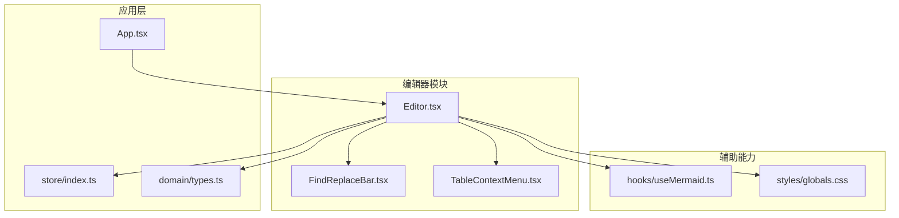
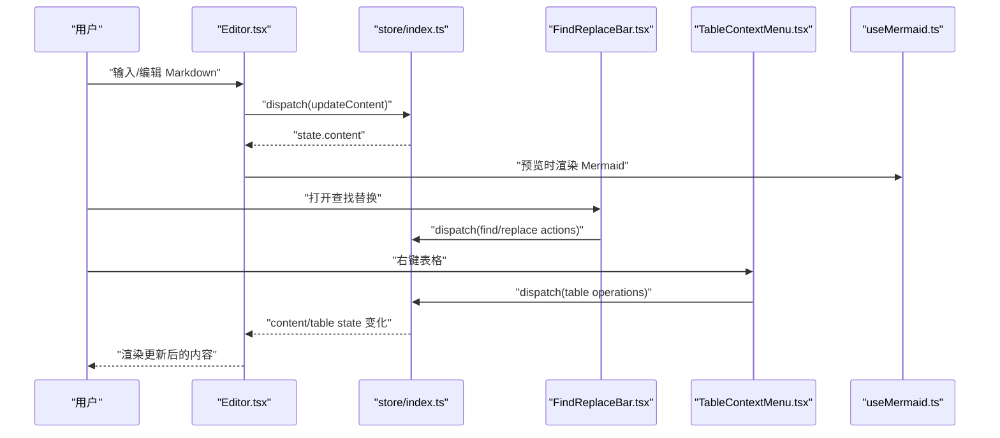
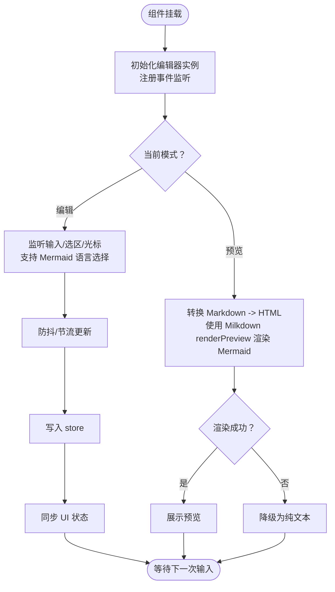
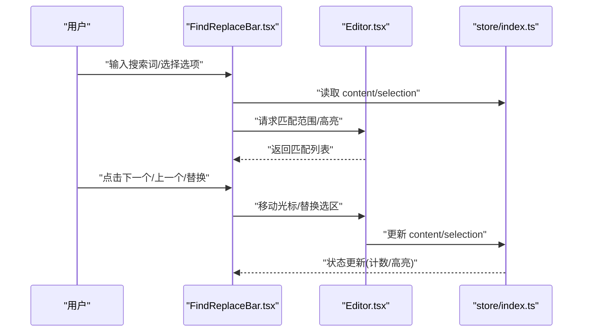
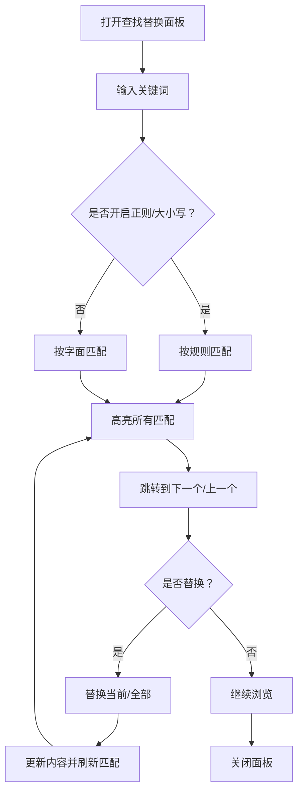
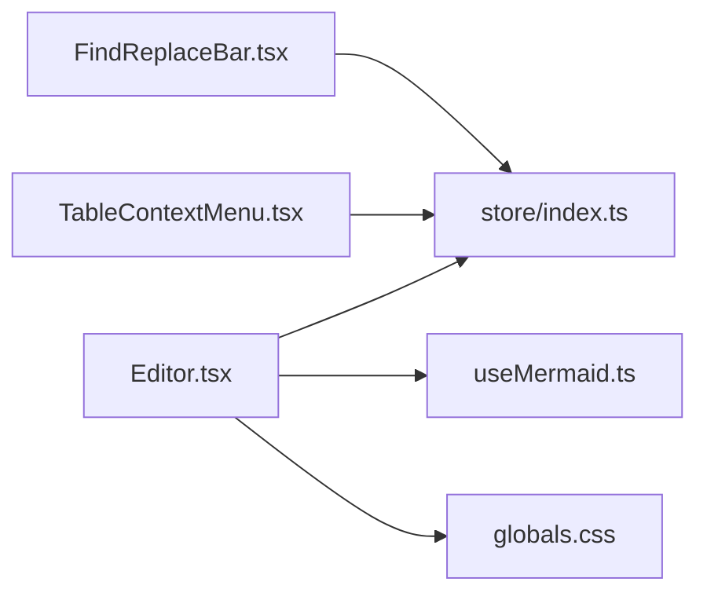

# 编辑器组件

<cite>
**本文引用的文件**   
- [Editor.tsx](file://src/components/editor/Editor.tsx)
- [FindReplaceBar.tsx](file://src/components/editor/FindReplaceBar.tsx)
- [TableContextMenu.tsx](file://src/components/editor/TableContextMenu.tsx)
- [App.tsx](file://src/App.tsx)
- [store/index.ts](file://src/store/index.ts)
- [types.ts](file://src/domain/types.ts)
- [useMermaid.ts](file://src/hooks/useMermaid.ts)
- [globals.css](file://src/styles/globals.css)
</cite>

## 更新摘要
**所做更改**   
- 新增了 Mermaid 图表语言支持到代码块语言选择器，用户现在可以在代码块中选择 mermaid 作为语言选项来创建流程图、序列图、甘特图等可视化图表
- 更新了 Mermaid 渲染机制，从自定义 SVG 处理切换到 Milkdown 的原生 renderPreview 函数
- 解决了内容累积死循环和 ProseMirror 解析冲突问题
- 优化了预览模式下的渲染性能和稳定性

## 目录
1. [简介](#简介)
2. [项目结构](#项目结构)
3. [核心组件](#核心组件)
4. [架构总览](#架构总览)
5. [详细组件分析](#详细组件分析)
6. [依赖关系分析](#依赖关系分析)
7. [性能考虑](#性能考虑)
8. [故障排查指南](#故障排查指南)
9. [结论](#结论)
10. [附录](#附录)

## 简介
本文件为 ZenNote 的 Markdown 编辑器组件提供系统化、可操作的文档。重点覆盖：
- Editor.tsx 的实现细节：Markdown 渲染、语法高亮、实时预览
- FindReplaceBar 查找替换栏的功能与集成方式
- TableContextMenu 表格上下文菜单的交互逻辑与自定义操作
- 编辑器配置项、快捷键绑定、事件处理机制
- 扩展编辑器的具体示例（以路径引用代替代码片段）
- 与状态管理的集成方式及性能优化策略
- **新增** Mermaid 图表语言支持功能，允许用户在代码块中直接选择 mermaid 语言选项

## 项目结构
编辑器相关代码位于 src/components/editor 下，包含三个关键子组件：
- Editor.tsx：主编辑器容器，负责 Markdown 渲染、预览模式切换、事件与快捷键、与 store 的状态同步
- FindReplaceBar.tsx：查找替换工具栏，支持搜索、高亮匹配、替换、大小写敏感等
- TableContextMenu.tsx：表格右键菜单，支持插入行列、删除、合并单元格等常用操作

图表来源
- [Editor.tsx](file://src/components/editor/Editor.tsx)
- [FindReplaceBar.tsx](file://src/components/editor/FindReplaceBar.tsx)
- [TableContextMenu.tsx](file://src/components/editor/TableContextMenu.tsx)
- [App.tsx](file://src/App.tsx)
- [store/index.ts](file://src/store/index.ts)
- [types.ts](file://src/domain/types.ts)
- [useMermaid.ts](file://src/hooks/useMermaid.ts)
- [globals.css](file://src/styles/globals.css)

章节来源
- [Editor.tsx](file://src/components/editor/Editor.tsx)
- [FindReplaceBar.tsx](file://src/components/editor/FindReplaceBar.tsx)
- [TableContextMenu.tsx](file://src/components/editor/TableContextMenu.tsx)
- [App.tsx](file://src/App.tsx)
- [store/index.ts](file://src/store/index.ts)
- [types.ts](file://src/domain/types.ts)
- [useMermaid.ts](file://src/hooks/useMermaid.ts)
- [globals.css](file://src/styles/globals.css)

## 核心组件
- Editor.tsx
  - 职责：承载 Markdown 编辑与预览；管理光标位置、选区、内容变更；对接 store 持久化；挂载快捷键与事件；集成 Mermaid 渲染与样式
  - 关键点：双向预览、增量更新、防抖/节流、错误边界、国际化文案
- FindReplaceBar.tsx
  - 职责：提供查找/替换 UI；维护搜索词、匹配索引、大小写敏感、正则开关；执行查找/替换/全部替换；与编辑器选区联动
  - 关键点：匹配高亮、滚动定位、无障碍提示、键盘导航
- TableContextMenu.tsx
  - 职责：在表格节点上弹出上下文菜单；提供插入/删除行/列、合并/拆分单元格等操作；触发后刷新视图并回写 store
  - 关键点：坐标定位、DOM 选择器、撤销/重做栈、选中态恢复

章节来源
- [Editor.tsx](file://src/components/editor/Editor.tsx)
- [FindReplaceBar.tsx](file://src/components/editor/FindReplaceBar.tsx)
- [TableContextMenu.tsx](file://src/components/editor/TableContextMenu.tsx)

## 架构总览
编辑器采用"组件 + Store"的单向数据流设计：
- 用户输入通过 Editor 捕获并转换为 store 中的 Markdown 文本
- FindReplaceBar 与 TableContextMenu 作为无状态或轻状态 UI，调用 store 提供的动作方法
- useMermaid 钩子在预览模式下按需渲染 Mermaid 图表
- 全局样式由 globals.css 统一注入

图表来源
- [Editor.tsx](file://src/components/editor/Editor.tsx)
- [FindReplaceBar.tsx](file://src/components/editor/FindReplaceBar.tsx)
- [TableContextMenu.tsx](file://src/components/editor/TableContextMenu.tsx)
- [store/index.ts](file://src/store/index.ts)
- [useMermaid.ts](file://src/hooks/useMermaid.ts)

## 详细组件分析

### Editor.tsx 组件分析
- Markdown 渲染与预览
  - 编辑模式：基于底层编辑器实例进行文本输入与语法高亮
  - 预览模式：将 Markdown 转为 HTML，并在需要时渲染 Mermaid 图表
  - 实时同步：对 content 变更进行防抖/节流，避免频繁重渲染
- 快捷键绑定
  - 全局快捷键：保存、切换预览、查找替换、插入表格等
  - 局部快捷键：在表格上下文中启用行列操作
- 事件处理
  - onChange/onSelect/onCursorChange：驱动 store 更新与 UI 反馈
  - onMount/onUnmount：初始化与销毁资源（如 Mermaid 渲染、事件监听）
- 配置选项
  - 主题、语言、自动保存间隔、是否启用 Mermaid、是否显示行号等
- 错误处理
  - 捕获 Markdown 解析异常，降级到纯文本预览
  - 记录日志并提示用户

**已更新** Mermaid 渲染机制已从自定义 SVG 处理切换到 Milkdown 的原生 renderPreview 函数，解决了内容累积死循环和 ProseMirror 解析冲突问题，提升了渲染稳定性和性能。同时新增了代码块语言选择器中的 Mermaid 语言支持，用户现在可以直接选择 mermaid 作为代码块语言来创建各种可视化图表。

图表来源
- [Editor.tsx](file://src/components/editor/Editor.tsx)
- [store/index.ts](file://src/store/index.ts)
- [useMermaid.ts](file://src/hooks/useMermaid.ts)

章节来源
- [Editor.tsx](file://src/components/editor/Editor.tsx)
- [store/index.ts](file://src/store/index.ts)
- [useMermaid.ts](file://src/hooks/useMermaid.ts)

### FindReplaceBar.tsx 组件分析
- 功能特性
  - 支持关键词查找、高亮匹配、跳转下一个/上一个
  - 支持替换单个/全部替换，保留格式
  - 大小写敏感、正则表达式开关
- 与编辑器集成
  - 通过 store 获取当前内容与选区，计算匹配范围
  - 使用编辑器 API 移动光标与选区，保持焦点稳定
- 交互细节
  - ESC 关闭面板；Enter 跳转到下一个匹配；Tab 在输入框间切换
  - 结果计数与状态提示（找到 X 处/未找到）

图表来源
- [FindReplaceBar.tsx](file://src/components/editor/FindReplaceBar.tsx)
- [Editor.tsx](file://src/components/editor/Editor.tsx)
- [store/index.ts](file://src/store/index.ts)

章节来源
- [FindReplaceBar.tsx](file://src/components/editor/FindReplaceBar.tsx)
- [Editor.tsx](file://src/components/editor/Editor.tsx)
- [store/index.ts](file://src/store/index.ts)

### TableContextMenu.tsx 组件分析
- 交互逻辑
  - 右键表格节点时，根据鼠标坐标定位菜单
  - 提供插入/删除行/列、合并/拆分单元格、对齐等命令
- 数据与状态
  - 从 store 中读取表格结构与选区信息
  - 执行操作后生成新的表格结构，触发 store 更新
- 用户体验
  - 操作后自动恢复光标/选区
  - 支持撤销/重做（通过 store 的 undo/redo）

图表来源
- [TableContextMenu.tsx](file://src/components/editor/TableContextMenu.tsx)
- [store/index.ts](file://src/store/index.ts)

章节来源
- [TableContextMenu.tsx](file://src/components/editor/TableContextMenu.tsx)
- [store/index.ts](file://src/store/index.ts)

### 概念性概览
以下流程图展示了"查找替换"的通用流程，便于理解整体交互，不直接映射具体源码：

[本图为概念性说明，无需列出图表来源]

## 依赖关系分析
- 组件耦合
  - Editor 依赖 store 进行状态读写，依赖 useMermaid 进行图表渲染
  - FindReplaceBar 与 TableContextMenu 均依赖 store 的动作与状态
- 外部依赖
  - Markdown 渲染库（用于预览）
  - 编辑器内核（用于编辑与语法高亮）
  - Mermaid（用于流程图/时序图渲染）
  - 全局样式（CSS）

图表来源
- [Editor.tsx](file://src/components/editor/Editor.tsx)
- [FindReplaceBar.tsx](file://src/components/editor/FindReplaceBar.tsx)
- [TableContextMenu.tsx](file://src/components/editor/TableContextMenu.tsx)
- [store/index.ts](file://src/store/index.ts)
- [useMermaid.ts](file://src/hooks/useMermaid.ts)
- [globals.css](file://src/styles/globals.css)

章节来源
- [Editor.tsx](file://src/components/editor/Editor.tsx)
- [FindReplaceBar.tsx](file://src/components/editor/FindReplaceBar.tsx)
- [TableContextMenu.tsx](file://src/components/editor/TableContextMenu.tsx)
- [store/index.ts](file://src/store/index.ts)
- [useMermaid.ts](file://src/hooks/useMermaid.ts)
- [globals.css](file://src/styles/globals.css)

## 性能考虑
- 渲染优化
  - 预览模式下的 Markdown 转 HTML 使用缓存与懒加载
  - Mermaid 渲染仅在可见区域或切换预览时触发，使用 Milkdown 原生 renderPreview 提升性能
- 输入优化
  - 对 onChange 进行防抖/节流，减少 store 更新频率
  - 大文档分块渲染，避免主线程阻塞
- 内存管理
  - 组件卸载时清理事件监听与定时器
  - 释放 Mermaid 实例与 DOM 引用
- 样式与主题
  - 通过 CSS 变量控制主题，避免重复计算

**已更新** 通过切换到 Milkdown 的原生 renderPreview 函数，显著改善了 Mermaid 图表渲染的性能和稳定性，避免了之前的内容累积死循环问题。新增的代码块语言选择器中的 Mermaid 支持也经过优化，确保在选择 mermaid 语言时能够正确识别和渲染。

[本节为通用指导，无需列出章节来源]

## 故障排查指南
- 常见问题
  - 预览空白：检查 Markdown 解析错误与 Mermaid 初始化
  - 查找无结果：确认正则/大小写设置与内容编码
  - 表格操作无效：确认选区是否为表格节点
  - Mermaid 渲染异常：检查 Milkdown renderPreview 函数调用是否正确
- 调试建议
  - 在 store 中打印关键 action 与 state 快照
  - 使用浏览器开发者工具观察 DOM 与事件冒泡
  - 对长文档启用分段渲染与性能监控
  - 监控 Mermaid 渲染过程中的内存使用情况
- **新增** Mermaid 语言选择相关问题
  - 代码块语言选择器中无法找到 mermaid 选项：检查语言列表配置是否正确
  - 选择 mermaid 后无法渲染：确认代码块语法是否正确，检查 Mermaid 语法
  - 渲染性能问题：查看是否有大量复杂的 Mermaid 图表导致渲染缓慢

**已更新** 新增了 Mermaid 渲染相关的故障排查指导，重点关注 Milkdown renderPreview 函数的正确性和性能表现，以及新增的 Mermaid 语言选择功能的常见问题解决方案。

章节来源
- [store/index.ts](file://src/store/index.ts)
- [Editor.tsx](file://src/components/editor/Editor.tsx)
- [FindReplaceBar.tsx](file://src/components/editor/FindReplaceBar.tsx)
- [TableContextMenu.tsx](file://src/components/editor/TableContextMenu.tsx)

## 结论
ZenNote 的编辑器组件以清晰的职责划分与单向数据流为核心，结合防抖/节流、按需渲染与良好的错误处理，提供了稳定高效的 Markdown 编辑体验。通过切换到 Milkdown 的原生 renderPreview 函数，Mermaid 图表渲染的稳定性和性能得到了显著提升，解决了之前存在的死循环和解析冲突问题。**新增的 Mermaid 图表语言支持功能**让用户能够在代码块中直接选择 mermaid 语言来创建各种可视化图表，包括流程图、序列图、甘特图等，进一步增强了编辑器的可视化能力。通过扩展 store 动作与 Editor 的事件钩子，可以便捷地增强功能，如新增快捷键、插件式渲染器或更丰富的表格操作。

[本节为总结性内容，无需列出章节来源]

## 附录
- 编辑器配置项（示例字段）
  - theme: 主题名称
  - language: 界面语言
  - autoSaveInterval: 自动保存间隔（毫秒）
  - enableMermaid: 是否启用 Mermaid
  - showLineNumbers: 是否显示行号
- 快捷键绑定（示例）
  - Ctrl+S: 保存
  - Ctrl+F: 打开查找替换
  - Ctrl+P: 切换预览
  - Ctrl+T: 插入表格
- 事件处理（示例）
  - onChange: 内容变更回调
  - onSelect: 选区变化回调
  - onCursorChange: 光标位置变化回调
  - onMount/onUnmount: 生命周期回调
- **新增** Mermaid 语言支持
  - 代码块语言选择器现已支持 mermaid 选项
  - 支持的图表类型：流程图、序列图、甘特图、类图等
  - 语法要求：遵循标准 Mermaid 语法规范
- 扩展示例（以路径引用代替代码）
  - 新增快捷键：参考 [Editor.tsx](file://src/components/editor/Editor.tsx) 中的快捷键注册位置
  - 自定义渲染器：参考 [useMermaid.ts](file://src/hooks/useMermaid.ts) 的渲染封装模式
  - 表格操作扩展：参考 [TableContextMenu.tsx](file://src/components/editor/TableContextMenu.tsx) 的命令派发方式
  - 状态管理集成：参考 [store/index.ts](file://src/store/index.ts) 的 action/reducer 模式

**已更新** 新增了关于 Milkdown renderPreview 函数使用的扩展示例指导和 Mermaid 语言支持的相关配置说明。

章节来源
- [Editor.tsx](file://src/components/editor/Editor.tsx)
- [FindReplaceBar.tsx](file://src/components/editor/FindReplaceBar.tsx)
- [TableContextMenu.tsx](file://src/components/editor/TableContextMenu.tsx)
- [store/index.ts](file://src/store/index.ts)
- [useMermaid.ts](file://src/hooks/useMermaid.ts)
- [types.ts](file://src/domain/types.ts)
- [globals.css](file://src/styles/globals.css)