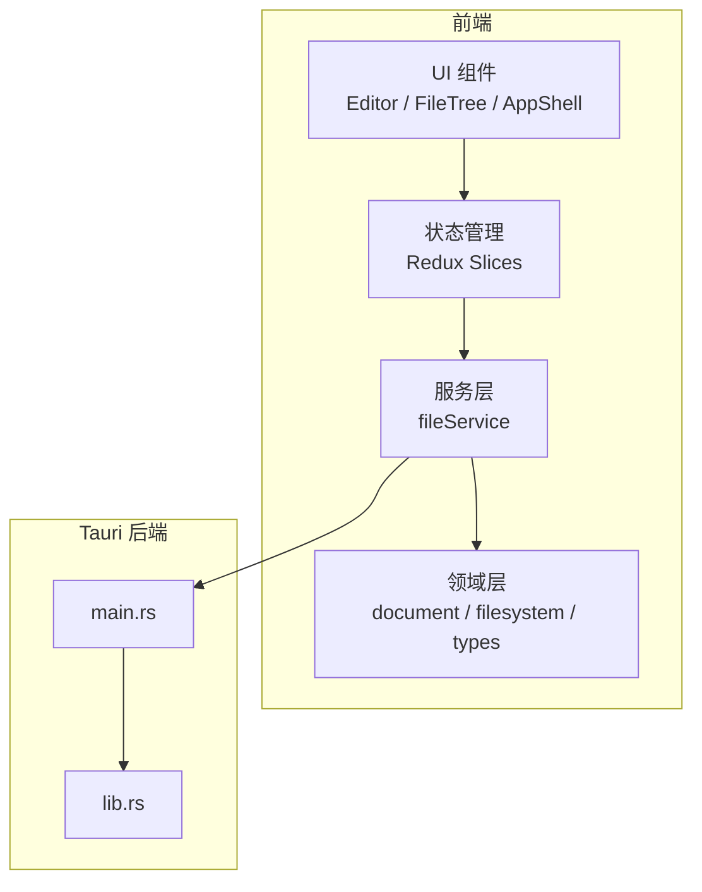
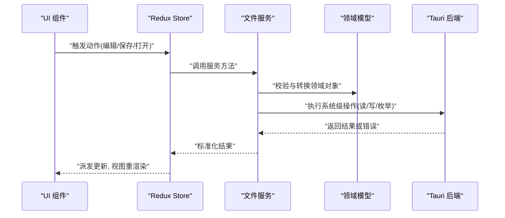
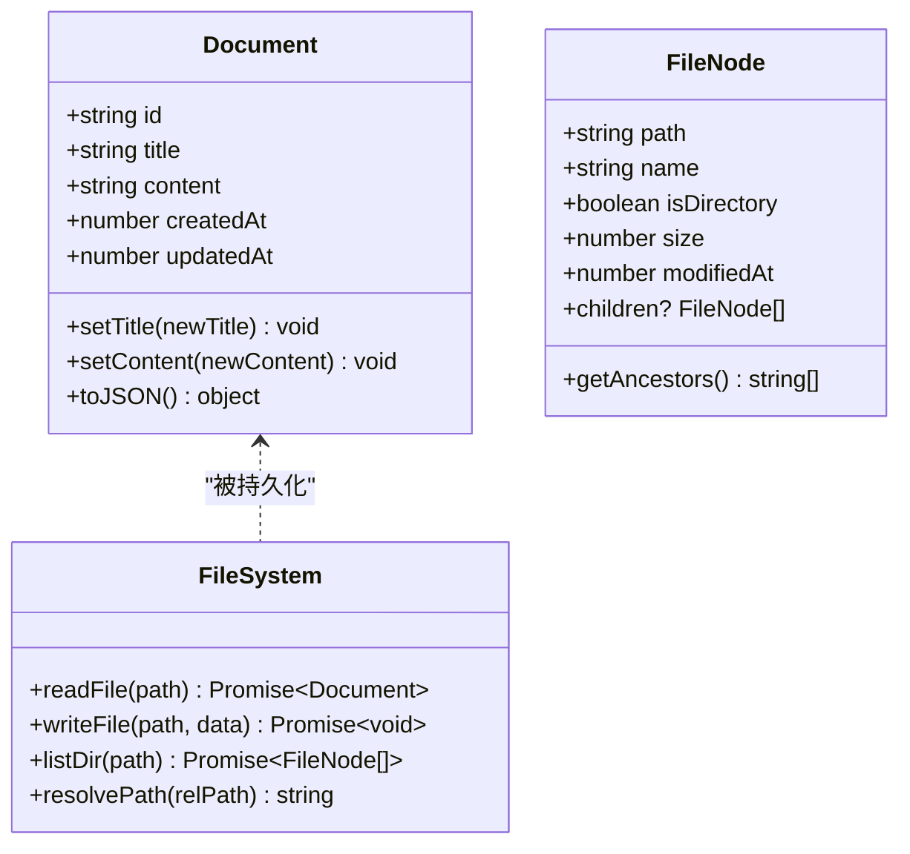
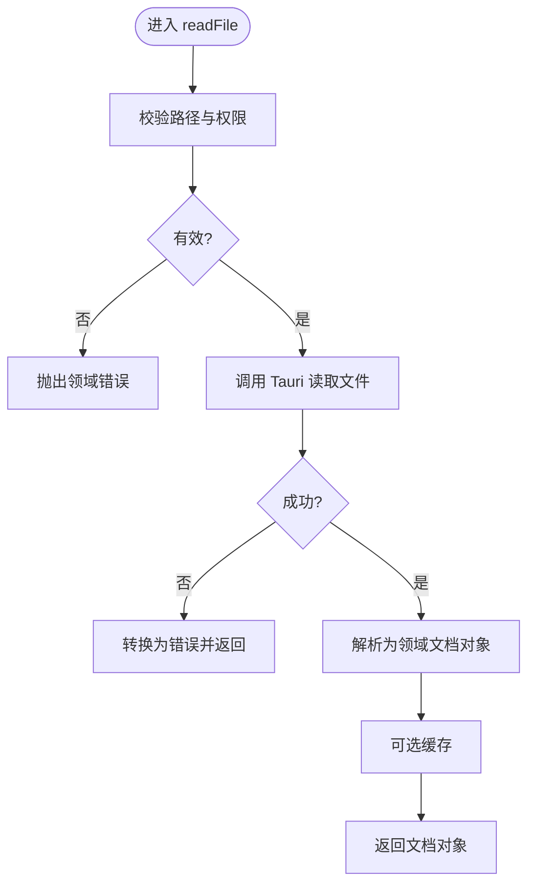
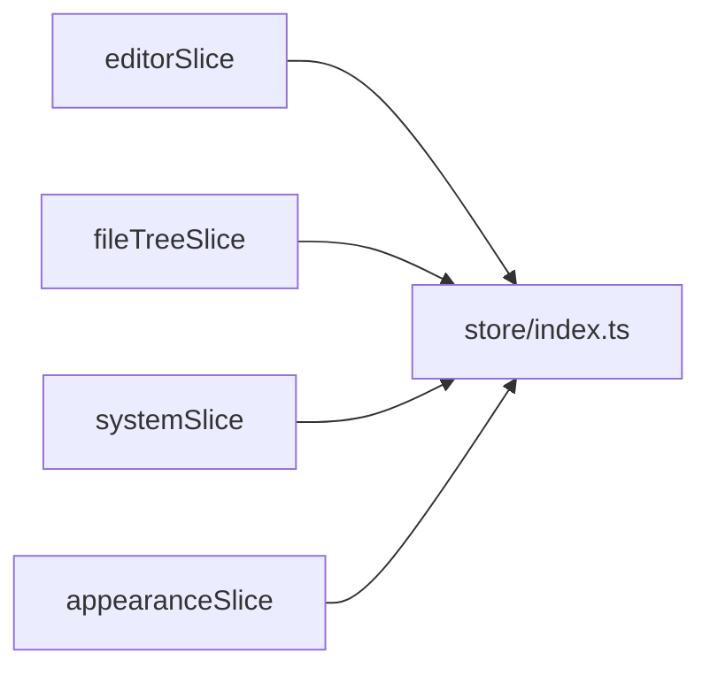
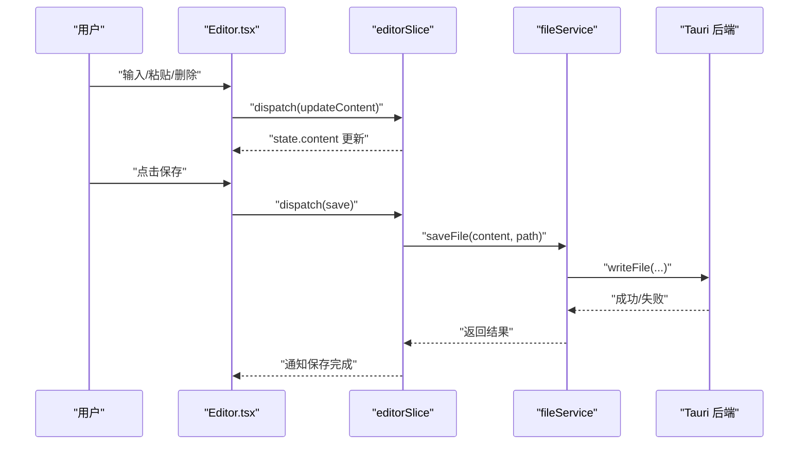
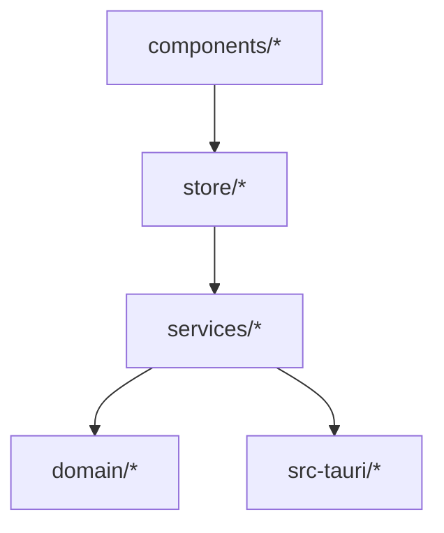

# 领域层架构

<cite>
**本文引用的文件**   
- [src/domain/document.ts](file://src/domain/document.ts)
- [src/domain/filesystem.ts](file://src/domain/filesystem.ts)
- [src/domain/index.ts](file://src/domain/index.ts)
- [src/domain/types.ts](file://src/domain/types.ts)
- [src/services/fileService.ts](file://src/services/fileService.ts)
- [src/services/index.ts](file://src/services/index.ts)
- [src/store/slices/editorSlice.ts](file://src/store/slices/editorSlice.ts)
- [src/store/slices/fileTreeSlice.ts](file://src/store/slices/fileTreeSlice.ts)
- [src/store/slices/systemSlice.ts](file://src/store/slices/systemSlice.ts)
- [src/store/slices/appearanceSlice.ts](file://src/store/slices/appearanceSlice.ts)
- [src/store/index.ts](file://src/store/index.ts)
- [src/components/editor/Editor.tsx](file://src/components/editor/Editor.tsx)
- [src/components/filetree/FileTree.tsx](file://src/components/filetree/FileTree.tsx)
- [src/components/layout/AppShell.tsx](file://src/components/layout/AppShell.tsx)
- [src/main.tsx](file://src/main.tsx)
- [src-tauri/src/lib.rs](file://src-tauri/src/lib.rs)
- [src-tauri/src/main.rs](file://src-tauri/src/main.rs)
</cite>

## 目录
1. [简介](#简介)
2. [项目结构](#项目结构)
3. [核心组件](#核心组件)
4. [架构总览](#架构总览)
5. [详细组件分析](#详细组件分析)
6. [依赖分析](#依赖分析)
7. [性能考虑](#性能考虑)
8. [故障排查指南](#故障排查指南)
9. [结论](#结论)
10. [附录](#附录)

## 简介
本文件聚焦于 ZenNote 的“领域层架构”，围绕文档、文件系统与状态管理三大核心展开，解释前端领域模型如何与服务层、UI 层以及 Tauri 后端交互。目标是帮助读者在不深入代码细节的情况下，理解数据流、职责边界与扩展点。

## 项目结构
- 领域层位于 src/domain，定义文档与文件系统的类型与抽象，作为跨层契约。
- 服务层位于 src/services，封装对操作系统文件系统的访问（通过 Tauri），向上提供稳定的 API。
- 状态层位于 src/store，使用 Redux Toolkit 切片组织应用状态，驱动 UI 更新。
- UI 层位于 src/components，负责渲染与用户交互，消费 store 并调用 services。
- 后端位于 src-tauri，暴露 Rust 能力给前端，处理磁盘 I/O、权限等系统级操作。

图表来源
- [src/components/editor/Editor.tsx](file://src/components/editor/Editor.tsx)
- [src/components/filetree/FileTree.tsx](file://src/components/filetree/FileTree.tsx)
- [src/components/layout/AppShell.tsx](file://src/components/layout/AppShell.tsx)
- [src/store/index.ts](file://src/store/index.ts)
- [src/services/fileService.ts](file://src/services/fileService.ts)
- [src/domain/index.ts](file://src/domain/index.ts)
- [src-tauri/src/main.rs](file://src-tauri/src/main.rs)
- [src-tauri/src/lib.rs](file://src-tauri/src/lib.rs)

章节来源
- [src/domain/index.ts](file://src/domain/index.ts)
- [src/services/index.ts](file://src/services/index.ts)
- [src/store/index.ts](file://src/store/index.ts)
- [src/main.tsx](file://src/main.tsx)

## 核心组件
- 领域模型：文档与文件系统的类型定义与不变式约束，确保上层逻辑一致性与可测试性。
- 服务接口：统一文件读写、路径解析、元数据获取等操作，屏蔽平台差异。
- 状态切片：编辑器内容、文件树、系统信息与外观设置等状态的分片化管理。
- UI 组件：编辑器、文件树、布局壳等，将领域模型映射为视图并响应用户操作。

章节来源
- [src/domain/types.ts](file://src/domain/types.ts)
- [src/domain/document.ts](file://src/domain/document.ts)
- [src/domain/filesystem.ts](file://src/domain/filesystem.ts)
- [src/services/fileService.ts](file://src/services/fileService.ts)
- [src/store/slices/editorSlice.ts](file://src/store/slices/editorSlice.ts)
- [src/store/slices/fileTreeSlice.ts](file://src/store/slices/fileTreeSlice.ts)
- [src/store/slices/systemSlice.ts](file://src/store/slices/systemSlice.ts)
- [src/store/slices/appearanceSlice.ts](file://src/store/slices/appearanceSlice.ts)

## 架构总览
下图展示从 UI 到领域再到后端的请求-响应流程，强调职责分离与数据流向。

图表来源
- [src/components/editor/Editor.tsx](file://src/components/editor/Editor.tsx)
- [src/store/slices/editorSlice.ts](file://src/store/slices/editorSlice.ts)
- [src/services/fileService.ts](file://src/services/fileService.ts)
- [src/domain/document.ts](file://src/domain/document.ts)
- [src-tauri/src/lib.rs](file://src-tauri/src/lib.rs)

## 详细组件分析

### 领域模型：文档与文件系统
- 文档模型：定义文档标识、标题、内容、时间戳、标签等字段，并提供创建、更新、序列化等不变式。
- 文件系统模型：定义文件节点、目录结构、路径规范、元数据（大小、修改时间）及遍历规则。
- 类型聚合：在 index.ts 中集中导出，供服务层与 UI 层引用，保证类型一致性。

图表来源
- [src/domain/document.ts](file://src/domain/document.ts)
- [src/domain/filesystem.ts](file://src/domain/filesystem.ts)
- [src/domain/types.ts](file://src/domain/types.ts)

章节来源
- [src/domain/document.ts](file://src/domain/document.ts)
- [src/domain/filesystem.ts](file://src/domain/filesystem.ts)
- [src/domain/types.ts](file://src/domain/types.ts)
- [src/domain/index.ts](file://src/domain/index.ts)

### 服务层：文件服务
- 职责：封装 Tauri 调用，实现文件的读取、写入、目录枚举与路径解析；对领域模型进行校验与转换。
- 错误处理：捕获系统异常，转换为领域友好的错误类型，便于上层统一处理。
- 缓存策略：可选地对目录列表与文件内容进行短期缓存，减少重复 I/O。

图表来源
- [src/services/fileService.ts](file://src/services/fileService.ts)
- [src/domain/document.ts](file://src/domain/document.ts)
- [src-tauri/src/lib.rs](file://src-tauri/src/lib.rs)

章节来源
- [src/services/fileService.ts](file://src/services/fileService.ts)
- [src/services/index.ts](file://src/services/index.ts)

### 状态层：Redux 切片
- editorSlice：管理编辑器内容、光标位置、撤销栈、查找替换状态等。
- fileTreeSlice：维护文件树结构、选中项、展开/折叠状态。
- systemSlice：记录系统信息、窗口尺寸、主题模式等全局状态。
- appearanceSlice：管理字体、颜色、字号等外观配置。

图表来源
- [src/store/slices/editorSlice.ts](file://src/store/slices/editorSlice.ts)
- [src/store/slices/fileTreeSlice.ts](file://src/store/slices/fileTreeSlice.ts)
- [src/store/slices/systemSlice.ts](file://src/store/slices/systemSlice.ts)
- [src/store/slices/appearanceSlice.ts](file://src/store/slices/appearanceSlice.ts)
- [src/store/index.ts](file://src/store/index.ts)

章节来源
- [src/store/slices/editorSlice.ts](file://src/store/slices/editorSlice.ts)
- [src/store/slices/fileTreeSlice.ts](file://src/store/slices/fileTreeSlice.ts)
- [src/store/slices/systemSlice.ts](file://src/store/slices/systemSlice.ts)
- [src/store/slices/appearanceSlice.ts](file://src/store/slices/appearanceSlice.ts)
- [src/store/index.ts](file://src/store/index.ts)

### UI 层：编辑器与文件树
- Editor.tsx：绑定编辑器内容与 store，监听输入事件，触发保存与搜索替换。
- FileTree.tsx：渲染目录树，处理选择、展开/折叠、右键菜单与拖拽。
- AppShell.tsx：组合顶部栏、侧边栏、状态栏与主区域，协调各子组件生命周期。

图表来源
- [src/components/editor/Editor.tsx](file://src/components/editor/Editor.tsx)
- [src/store/slices/editorSlice.ts](file://src/store/slices/editorSlice.ts)
- [src/services/fileService.ts](file://src/services/fileService.ts)
- [src-tauri/src/lib.rs](file://src-tauri/src/lib.rs)

章节来源
- [src/components/editor/Editor.tsx](file://src/components/editor/Editor.tsx)
- [src/components/filetree/FileTree.tsx](file://src/components/filetree/FileTree.tsx)
- [src/components/layout/AppShell.tsx](file://src/components/layout/AppShell.tsx)

## 依赖分析
- 领域层不依赖服务层与 UI 层，保持纯类型与不变式，利于单元测试。
- 服务层依赖领域层类型，但不反向依赖 UI；通过 Tauri 与后端通信。
- UI 层依赖 store 与 services，避免直接访问系统能力。
- store 切片之间低耦合，通过 actions 与 reducers 解耦。

图表来源
- [src/domain/index.ts](file://src/domain/index.ts)
- [src/services/index.ts](file://src/services/index.ts)
- [src/store/index.ts](file://src/store/index.ts)
- [src-tauri/src/main.rs](file://src-tauri/src/main.rs)

章节来源
- [src/domain/index.ts](file://src/domain/index.ts)
- [src/services/index.ts](file://src/services/index.ts)
- [src/store/index.ts](file://src/store/index.ts)

## 性能考虑
- 大文件读取：在服务层引入分页或懒加载，避免一次性载入全部内容。
- 目录枚举：对频繁访问的目录做内存缓存，设置过期策略与失效条件。
- 编辑器状态：使用增量更新与防抖合并，减少不必要的重渲染。
- 后端 I/O：批量写入与事务提交，降低系统调用次数。

[本节为通用指导，无需特定文件来源]

## 故障排查指南
- 文件权限错误：检查 Tauri 能力声明与系统权限，确认路径存在且可读。
- 路径解析异常：验证相对路径与绝对路径转换逻辑，注意不同平台的分隔符。
- 状态不一致：核对 actions 与 reducers 的幂等性，确保副作用仅在必要时触发。
- 崩溃与异常：在后端捕获未处理异常，向前端返回结构化错误信息以便定位。

章节来源
- [src-tauri/src/lib.rs](file://src-tauri/src/lib.rs)
- [src/services/fileService.ts](file://src/services/fileService.ts)
- [src/store/slices/editorSlice.ts](file://src/store/slices/editorSlice.ts)

## 结论
ZenNote 的领域层以清晰的类型与不变式为核心，通过服务层桥接系统与 UI，借助 Redux 切片管理状态，形成高内聚、低耦合的架构。该设计便于扩展与维护，适合在多平台环境下稳定运行。

[本节为总结性内容，无需特定文件来源]

## 附录
- 入口与初始化：main.tsx 启动应用，挂载根组件与 store。
- Tauri 能力：default.json 声明所需权限，确保文件 I/O 安全可用。

章节来源
- [src/main.tsx](file://src/main.tsx)
- [src-tauri/capabilities/default.json](file://src-tauri/capabilities/default.json)