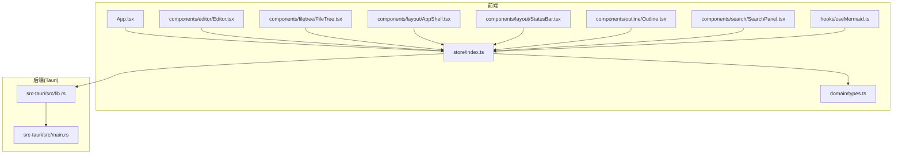
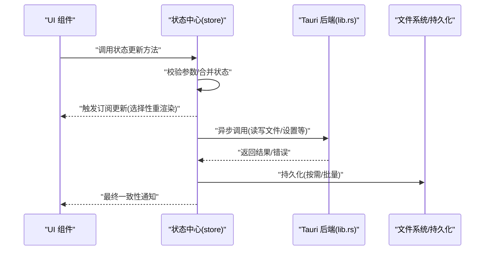
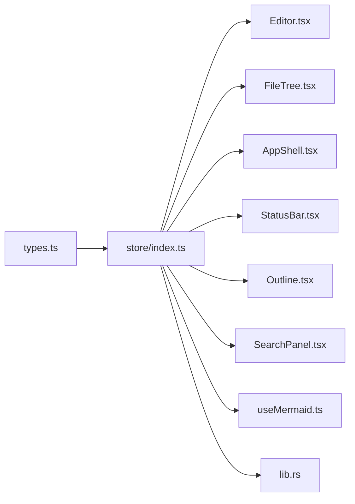

# 状态管理

<cite>
**本文引用的文件**   
- [src/store/index.ts](file://src/store/index.ts)
- [src/domain/types.ts](file://src/domain/types.ts)
- [src/App.tsx](file://src/App.tsx)
- [src/main.tsx](file://src/main.tsx)
- [src/components/editor/Editor.tsx](file://src/components/editor/Editor.tsx)
- [src/components/filetree/FileTree.tsx](file://src/components/filetree/FileTree.tsx)
- [src/components/layout/AppShell.tsx](file://src/components/layout/AppShell.tsx)
- [src/components/layout/StatusBar.tsx](file://src/components/layout/StatusBar.tsx)
- [src/components/outline/Outline.tsx](file://src/components/outline/Outline.tsx)
- [src/components/search/SearchPanel.tsx](file://src/components/search/SearchPanel.tsx)
- [src/hooks/useMermaid.ts](file://src/hooks/useMermaid.ts)
- [src-tauri/src/lib.rs](file://src-tauri/src/lib.rs)
- [src-tauri/src/main.rs](file://src-tauri/src/main.rs)
- [package.json](file://package.json)
</cite>

## 目录
1. [简介](#简介)
2. [项目结构](#项目结构)
3. [核心组件](#核心组件)
4. [架构总览](#架构总览)
5. [详细组件分析](#详细组件分析)
6. [依赖关系分析](#依赖关系分析)
7. [性能考虑](#性能考虑)
8. [故障排查指南](#故障排查指南)
9. [结论](#结论)
10. [附录](#附录)

## 简介
本文件为 ZenNote 的状态管理综合文档，聚焦于：
- 状态存储架构与数据流模式
- 数据类型定义与版本迁移策略
- 状态更新模式、持久化与缓存机制
- 组件间通信与订阅分发
- 调试与监控最佳实践
- 使用状态管理 API 的正确方式（以路径引用代替代码片段）

## 项目结构
ZenNote 采用前端 React + Tauri 的混合架构。状态管理主要位于前端 store 层，通过 hooks 暴露给 UI 组件；Tauri 侧提供原生能力（如文件系统、窗口等），由前端通过异步调用访问。

图表来源
- [src/App.tsx](file://src/App.tsx)
- [src/store/index.ts](file://src/store/index.ts)
- [src/domain/types.ts](file://src/domain/types.ts)
- [src/components/editor/Editor.tsx](file://src/components/editor/Editor.tsx)
- [src/components/filetree/FileTree.tsx](file://src/components/filetree/FileTree.tsx)
- [src/components/layout/AppShell.tsx](file://src/components/layout/AppShell.tsx)
- [src/components/layout/StatusBar.tsx](file://src/components/layout/StatusBar.tsx)
- [src/components/outline/Outline.tsx](file://src/components/outline/Outline.tsx)
- [src/components/search/SearchPanel.tsx](file://src/components/search/SearchPanel.tsx)
- [src/hooks/useMermaid.ts](file://src/hooks/useMermaid.ts)
- [src-tauri/src/main.rs](file://src-tauri/src/main.rs)
- [src-tauri/src/lib.rs](file://src-tauri/src/lib.rs)

章节来源
- [src/store/index.ts](file://src/store/index.ts)
- [src/domain/types.ts](file://src/domain/types.ts)
- [src/App.tsx](file://src/App.tsx)
- [src/main.tsx](file://src/main.tsx)

## 核心组件
- 状态定义与类型
  - 所有领域模型、配置项、UI 状态均集中在 domain/types.ts，确保类型一致与可演进性。
- 状态中心与更新器
  - store/index.ts 集中维护全局状态、变更方法与事件订阅分发。建议将“读”和“写”分离，避免直接修改状态。
- 组件接入
  - 各业务组件通过 hooks 或上下文消费状态，仅触发更新方法，不直接操作内部数据结构。

章节来源
- [src/domain/types.ts](file://src/domain/types.ts)
- [src/store/index.ts](file://src/store/index.ts)

## 架构总览
下图展示从 UI 到状态中心再到 Tauri 后端的完整数据流。

图表来源
- [src/store/index.ts](file://src/store/index.ts)
- [src-tauri/src/lib.rs](file://src-tauri/src/lib.rs)

## 详细组件分析

### 状态中心（store/index.ts）
- 职责
  - 维护全局状态对象
  - 提供不可变更新方法
  - 管理订阅与增量更新
  - 协调持久化与缓存
- 设计要点
  - 单一数据源，避免分散状态
  - 明确区分“读取态”和“写入态”，减少竞态
  - 对耗时操作进行节流/防抖与批处理
- 关键流程
  - 初始化：加载默认配置与本地缓存
  - 更新：参数校验 -> 生成新状态 -> 通知订阅者 -> 可选持久化
  - 回滚：失败时恢复快照或回退到上次有效状态

章节来源
- [src/store/index.ts](file://src/store/index.ts)

### 类型系统（domain/types.ts）
- 职责
  - 定义应用域模型、配置、UI 状态、枚举与联合类型
  - 作为状态中心的契约，约束输入输出
- 设计要点
  - 使用严格类型与可选字段，避免空指针
  - 为版本迁移预留字段与兼容逻辑
  - 对外暴露只读视图类型，隐藏内部实现细节

章节来源
- [src/domain/types.ts](file://src/domain/types.ts)

### 编辑器（components/editor/Editor.tsx）
- 职责
  - 编辑内容、查找替换、表格上下文菜单
  - 与状态中心同步光标、选区、历史、搜索面板可见性等
- 数据流
  - 用户输入 -> 防抖 -> 生成增量更新 -> 状态中心合并 -> 持久化
  - 搜索/大纲联动：状态中心广播变化，相关组件订阅更新

章节来源
- [src/components/editor/Editor.tsx](file://src/components/editor/Editor.tsx)
- [src/store/index.ts](file://src/store/index.ts)

### 文件树（components/filetree/FileTree.tsx）
- 职责
  - 展示文件/文件夹结构，支持展开/折叠、选择、右键操作
- 数据流
  - 打开/切换文件 -> 请求后端读取 -> 状态中心更新当前文件与树节点 -> UI 刷新

章节来源
- [src/components/filetree/FileTree.tsx](file://src/components/filetree/FileTree.tsx)
- [src/store/index.ts](file://src/store/index.ts)
- [src-tauri/src/lib.rs](file://src-tauri/src/lib.rs)

### 布局与状态栏（components/layout/AppShell.tsx, StatusBar.tsx）
- 职责
  - 应用外壳、主题、窗口控制、底部状态信息
- 数据流
  - 主题、语言、窗口尺寸等状态由 store 管理，组件仅订阅显示所需切片

章节来源
- [src/components/layout/AppShell.tsx](file://src/components/layout/AppShell.tsx)
- [src/components/layout/StatusBar.tsx](file://src/components/layout/StatusBar.tsx)
- [src/store/index.ts](file://src/store/index.ts)

### 大纲（components/outline/Outline.tsx）
- 职责
  - 根据文档标题生成大纲，点击跳转定位
- 数据流
  - 监听编辑器内容变化，解析标题层级，更新大纲状态

章节来源
- [src/components/outline/Outline.tsx](file://src/components/outline/Outline.tsx)
- [src/store/index.ts](file://src/store/index.ts)

### 搜索面板（components/search/SearchPanel.tsx）
- 职责
  - 全文检索、高亮匹配、结果导航
- 数据流
  - 输入关键词 -> 防抖 -> 计算匹配 -> 更新搜索结果与高亮位置

章节来源
- [src/components/search/SearchPanel.tsx](file://src/components/search/SearchPanel.tsx)
- [src/store/index.ts](file://src/store/index.ts)

### Mermaid 渲染钩子（hooks/useMermaid.ts）
- 职责
  - 懒加载 Mermaid 库，渲染流程图/时序图等
- 数据流
  - 监听状态中的图表内容，按需加载并渲染，避免首屏阻塞

章节来源
- [src/hooks/useMermaid.ts](file://src/hooks/useMermaid.ts)
- [src/store/index.ts](file://src/store/index.ts)

### Tauri 后端（src-tauri/src/lib.rs, src-tauri/src/main.rs）
- 职责
  - 暴露文件系统、配置、窗口等能力给前端
  - 处理 I/O 与平台差异
- 数据流
  - 前端调用 -> 后端执行 -> 返回结果/错误 -> 前端状态中心统一处理

章节来源
- [src-tauri/src/lib.rs](file://src-tauri/src/lib.rs)
- [src-tauri/src/main.rs](file://src-tauri/src/main.rs)
- [src/store/index.ts](file://src/store/index.ts)

## 依赖关系分析
- 组件对 store 的依赖是单向的：组件只订阅与调用，不反向修改内部结构
- store 对 types 的依赖是强耦合的类型契约
- store 对 Tauri 的依赖是异步桥接，用于持久化与系统能力
- 外部包依赖由 package.json 管理，避免在业务代码中硬编码

图表来源
- [src/domain/types.ts](file://src/domain/types.ts)
- [src/store/index.ts](file://src/store/index.ts)
- [src/components/editor/Editor.tsx](file://src/components/editor/Editor.tsx)
- [src/components/filetree/FileTree.tsx](file://src/components/filetree/FileTree.tsx)
- [src/components/layout/AppShell.tsx](file://src/components/layout/AppShell.tsx)
- [src/components/layout/StatusBar.tsx](file://src/components/layout/StatusBar.tsx)
- [src/components/outline/Outline.tsx](file://src/components/outline/Outline.tsx)
- [src/components/search/SearchPanel.tsx](file://src/components/search/SearchPanel.tsx)
- [src/hooks/useMermaid.ts](file://src/hooks/useMermaid.ts)
- [src-tauri/src/lib.rs](file://src-tauri/src/lib.rs)

章节来源
- [package.json](file://package.json)

## 性能考虑
- 状态粒度与订阅范围
  - 按组件需求订阅最小状态切片，避免全量重渲染
- 更新频率控制
  - 编辑器输入使用防抖/节流，批量合并多次变更
- 懒加载与按需渲染
  - Mermaid、搜索索引等重型资源按需加载
- 持久化策略
  - 写放大控制：合并写入、延迟落盘、失败重试
- 内存与缓存
  - 大文本分块缓存，过期清理，避免泄漏

[本节为通用指导，无需特定文件来源]

## 故障排查指南
- 常见问题定位
  - 状态未更新：检查是否调用了正确的更新方法，是否存在直接赋值
  - 重复渲染：检查订阅范围是否过大，是否缺少 key 或比较函数
  - 持久化失败：查看 Tauri 错误码与权限，确认路径与格式
- 调试技巧
  - 在 store 中增加日志与时间戳，记录每次变更前后快照
  - 使用浏览器开发者工具观察网络与 I/O 调用
  - 对关键路径添加单元测试与集成测试
- 回滚与恢复
  - 保存关键操作的快照，失败时自动回滚
  - 提供“撤销/重做”栈，提升用户体验

章节来源
- [src/store/index.ts](file://src/store/index.ts)
- [src-tauri/src/lib.rs](file://src-tauri/src/lib.rs)

## 结论
ZenNote 的状态管理以单一数据源为核心，结合严格的类型系统与清晰的更新模式，实现了可预测的数据流与良好的扩展性。通过合理的持久化与缓存策略，兼顾了性能与可靠性。遵循本文的最佳实践，可在保持代码简洁的同时，获得稳定的用户体验。

[本节为总结性内容，无需特定文件来源]

## 附录

### 状态持久化策略
- 策略选择
  - 小配置：内存+本地缓存，定时落盘
  - 大文档：增量写入，压缩与分片
- 一致性保障
  - 幂等写入、事务式提交、失败回滚
- 版本兼容
  - 迁移脚本与降级策略

章节来源
- [src/store/index.ts](file://src/store/index.ts)
- [src-tauri/src/lib.rs](file://src-tauri/src/lib.rs)

### 缓存机制
- 多级缓存
  - 内存缓存（最近使用）、磁盘缓存（过期清理）、远端缓存（离线可用）
- 失效策略
  - LRU、TTL、基于事件的主动失效

章节来源
- [src/store/index.ts](file://src/store/index.ts)

### 状态迁移与版本管理
- 版本号约定
  - 在类型与配置中声明 version，迁移时递增
- 迁移流程
  - 读取旧版本 -> 转换 -> 写入新版本 -> 校验一致性
- 兼容性
  - 向前兼容新增字段，向后兼容删除字段

章节来源
- [src/domain/types.ts](file://src/domain/types.ts)
- [src/store/index.ts](file://src/store/index.ts)

### 状态调试与监控最佳实践
- 日志规范
  - 结构化日志，包含时间、模块、动作、前/后快照摘要
- 指标采集
  - 更新耗时、失败率、缓存命中率
- 可视化
  - 状态变更时间线、组件重渲染统计

章节来源
- [src/store/index.ts](file://src/store/index.ts)

### 正确使用状态管理 API（示例路径）
- 初始化与注入
  - 参考入口文件：[src/main.tsx](file://src/main.tsx)、[src/App.tsx](file://src/App.tsx)
- 订阅状态
  - 在组件中订阅所需切片，避免订阅整个 store
- 触发更新
  - 调用 store 提供的更新方法，不要直接修改内部状态
- 异步与持久化
  - 通过 store 封装的方法发起 Tauri 调用，统一错误处理与重试

章节来源
- [src/main.tsx](file://src/main.tsx)
- [src/App.tsx](file://src/App.tsx)
- [src/store/index.ts](file://src/store/index.ts)