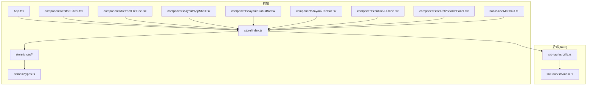
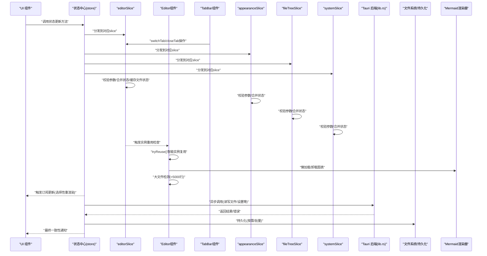
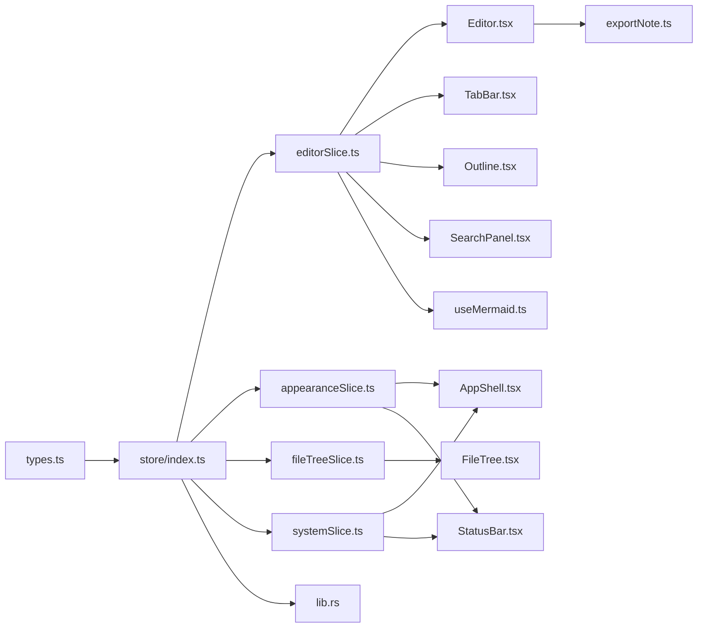

# 状态管理

<cite>
**本文引用的文件**   
- [src/store/index.ts](file://src/store/index.ts)
- [src/store/slices/editorSlice.ts](file://src/store/slices/editorSlice.ts)
- [src/store/slices/appearanceSlice.ts](file://src/store/slices/appearanceSlice.ts)
- [src/store/slices/fileTreeSlice.ts](file://src/store/slices/fileTreeSlice.ts)
- [src/store/slices/systemSlice.ts](file://src/store/slices/systemSlice.ts)
- [src/domain/types.ts](file://src/domain/types.ts)
- [src/components/editor/Editor.tsx](file://src/components/editor/Editor.tsx)
- [src/hooks/useMermaid.ts](file://src/hooks/useMermaid.ts)
- [src/lib/exportNote.ts](file://src/lib/exportNote.ts)
</cite>

## 更新摘要
**所做更改**   
- 新增智能编辑器实例重用机制，显著提升标签切换性能
- 实现大文件（>5000行）处理建议和用户体验优化
- 引入Mermaid图表懒加载和离屏卸载机制，优化内存使用
- 完善每文件滚动位置持久化，支持精确的状态恢复
- 增强文件状态缓存系统，包含内容、光标位置和修改状态

## 目录
1. [简介](#简介)
2. [项目结构](#项目结构)
3. [核心组件](#核心组件)
4. [架构总览](#架构总览)
5. [详细组件分析](#详细组件分析)
6. [依赖关系分析](#依赖关系分析)
7. [性能考虑](#性能考虑)
8. [故障排查指南](#故障排查指南)
9. [结论](#结论)
10. [附录](#附录)

## 简介
本文件为 ZenNote 的状态管理综合文档，聚焦于：
- 基于slice的模块化状态存储架构与数据流模式
- 数据类型定义与版本迁移策略
- 状态更新模式、持久化与缓存机制
- 组件间通信与订阅分发
- 调试与监控最佳实践
- 使用状态管理 API 的正确方式（以路径引用代替代码片段）

**更新** v0.8.0版本引入了智能编辑器实例重用、大文件处理优化、Mermaid图表内存管理和增强的滚动位置持久化功能，显著提升了多文件编辑体验和性能表现。

## 项目结构
ZenNote 采用前端 React + Tauri 的混合架构。状态管理现在采用模块化的slice架构，每个业务领域都有独立的state切片；通过hooks暴露给UI组件；Tauri侧提供原生能力（如文件系统、窗口等），由前端通过异步调用访问。

**图表来源**
- [src/store/index.ts](file://src/store/index.ts)
- [src/store/slices/editorSlice.ts](file://src/store/slices/editorSlice.ts)
- [src/store/slices/appearanceSlice.ts](file://src/store/slices/appearanceSlice.ts)
- [src/store/slices/fileTreeSlice.ts](file://src/store/slices/fileTreeSlice.ts)
- [src/store/slices/systemSlice.ts](file://src/store/slices/systemSlice.ts)
- [src/domain/types.ts](file://src/domain/types.ts)
- [src/components/editor/Editor.tsx](file://src/components/editor/Editor.tsx)
- [src/hooks/useMermaid.ts](file://src/hooks/useMermaid.ts)

## 核心组件
- **状态切片架构**
  - editorSlice：编辑器相关状态（内容、光标、历史、搜索、标签页管理、文件状态缓存）
  - appearanceSlice：外观相关状态（主题、字体、语言等）
  - fileTreeSlice：文件树相关状态（文件结构、选中项、展开状态等）
  - systemSlice：系统级状态（应用配置、窗口状态、国际化等）
- **类型系统与契约**
  - 所有领域模型、配置项、UI状态均集中在domain/types.ts，确保类型一致与可演进性
- **状态中心协调器**
  - store/index.ts集中管理各slice的初始化、组合与事件分发
- **组件接入层**
  - 各业务组件通过hooks或上下文消费状态，仅触发更新方法，不直接操作内部数据结构

**更新** v0.8.0版本中editorSlice大幅扩展，新增了完整的标签页管理功能、智能实例重用机制、大文件处理建议和增强的文件状态缓存系统。

**章节来源**
- [src/store/slices/editorSlice.ts](file://src/store/slices/editorSlice.ts)
- [src/store/slices/appearanceSlice.ts](file://src/store/slices/appearanceSlice.ts)
- [src/store/slices/fileTreeSlice.ts](file://src/store/slices/fileTreeSlice.ts)
- [src/store/slices/systemSlice.ts](file://src/store/slices/systemSlice.ts)
- [src/domain/types.ts](file://src/domain/types.ts)
- [src/store/index.ts](file://src/store/index.ts)

## 架构总览
下图展示从 UI 到模块化状态中心再到 Tauri 后端的完整数据流，特别突出了智能实例重用和大文件处理的流程。

**图表来源**
- [src/store/index.ts](file://src/store/index.ts)
- [src/store/slices/editorSlice.ts](file://src/store/slices/editorSlice.ts)
- [src/store/slices/appearanceSlice.ts](file://src/store/slices/appearanceSlice.ts)
- [src/store/slices/fileTreeSlice.ts](file://src/store/slices/fileTreeSlice.ts)
- [src/store/slices/systemSlice.ts](file://src/store/slices/systemSlice.ts)
- [src/components/editor/Editor.tsx](file://src/components/editor/Editor.tsx)
- [src/hooks/useMermaid.ts](file://src/hooks/useMermaid.ts)
- [src-tauri/src/lib.rs](file://src-tauri/src/lib.rs)

## 详细组件分析

### 状态中心（store/index.ts）
- **职责**
  - 协调各slice的初始化和生命周期管理
  - 提供统一的API接口供组件调用
  - 管理跨slice的事件订阅分发
  - 协调持久化与缓存策略
- **设计要点**
  - 单一数据源，避免分散状态
  - 明确区分"读取态"和"写入态"，减少竞态
  - 对耗时操作进行节流/防抖与批处理
  - 支持slice的动态加载和卸载
- **关键流程**
  - 初始化：加载默认配置与各slice状态
  - 更新：参数校验 -> slice分发 -> 生成新状态 -> 通知订阅者 -> 可选持久化
  - 回滚：失败时恢复快照或回退到上次有效状态

**更新** 重构后的状态中心主要负责slice协调和事件分发，不再直接管理具体业务状态。

**章节来源**
- [src/store/index.ts](file://src/store/index.ts)

### 编辑器切片（store/slices/editorSlice.ts）
- **职责**
  - 管理编辑器相关内容状态（文档内容、光标位置、选区、历史记录等）
  - 标签页管理功能（openTabs数组、文件状态缓存、标签切换逻辑）
  - 智能实例重用机制，避免重复创建编辑器实例
  - 大文件处理和性能优化
  - 处理编辑相关的业务逻辑和状态转换
  - 协调搜索、大纲、表格等功能的状态同步
- **设计要点**
  - 增量更新策略，避免全量重渲染
  - 撤销/重做栈管理
  - 与文件树的联动状态管理
  - 文件状态缓存机制，支持快速标签切换
  - 智能实例重用，提升标签切换性能
- **关键流程**
  - 内容变更：用户输入 -> 防抖处理 -> 增量更新 -> 历史保存
  - 标签切换：switchTab -> 检查缓存 -> 恢复状态或读取文件 -> 更新openTabs
  - 关闭标签：closeTab -> 清理状态 -> 自动切换到相邻标签
  - 功能联动：搜索、大纲、表格等操作的状态同步
  - 实例重用：tryReuse() -> 替换文档内容 -> 重建EditorState -> 恢复滚动位置

**更新** v0.8.0版本中editorSlice大幅扩展，新增了完整的标签页管理功能、智能实例重用机制、大文件处理建议和增强的文件状态缓存系统。

**章节来源**
- [src/store/slices/editorSlice.ts](file://src/store/slices/editorSlice.ts)

### 编辑器组件（components/editor/Editor.tsx）
- **职责**
  - 编辑内容、查找替换、表格上下文菜单
  - 与editorSlice同步光标、选区、历史、搜索面板可见性等
  - 智能实例重用机制，避免重复创建编辑器
  - 大文件检测和用户体验优化
  - Mermaid图表懒加载和内存管理
  - 滚动位置的精确持久化和恢复
- **数据流**
  - 用户输入 -> 防抖 -> 生成增量更新 -> editorSlice处理 -> 持久化
  - 搜索/大纲联动：editorSlice广播变化，相关组件订阅更新
  - 实例重用：tryReuse() -> replaceAll() -> updateState() -> 恢复滚动位置
  - 大文件处理：检测行数 > 5000 -> 显示提示信息
  - Mermaid优化：IntersectionObserver -> 离屏卸载 -> 入屏重新挂载

**更新** 编辑器组件现在实现了智能实例重用机制，显著提升标签切换性能，同时集成了大文件处理和Mermaid图表内存优化功能。

**章节来源**
- [src/components/editor/Editor.tsx](file://src/components/editor/Editor.tsx)
- [src/store/slices/editorSlice.ts](file://src/store/slices/editorSlice.ts)

### 外观切片（store/slices/appearanceSlice.ts）
- **职责**
  - 管理应用外观相关状态（主题、字体、颜色方案等）
  - 处理用户界面个性化设置
  - 协调多语言和本地化配置
- **设计要点**
  - 主题切换的平滑过渡
  - 配置的持久化存储
  - 响应式布局适配
- **关键流程**
  - 主题切换：用户选择 -> 验证配置 -> 应用主题 -> 持久化保存
  - 字体调整：动态字体大小计算和样式应用

**更新** 外观相关状态独立管理，支持热重载和实时预览。

**章节来源**
- [src/store/slices/appearanceSlice.ts](file://src/store/slices/appearanceSlice.ts)

### 文件树切片（store/slices/fileTreeSlice.ts）
- **职责**
  - 管理文件系统的树形结构状态
  - 处理文件的展开/折叠、选择、右键操作
  - 协调文件操作与编辑器状态的同步
- **设计要点**
  - 懒加载大文件结构
  - 文件操作的并发控制
  - 与后端文件系统的状态同步
- **关键流程**
  - 文件操作：用户操作 -> 状态更新 -> 后端同步 -> UI刷新
  - 结构变化：文件增删改 -> 树结构重建 -> 状态同步

**更新** 文件树相关逻辑完全独立，便于扩展文件操作功能。

**章节来源**
- [src/store/slices/fileTreeSlice.ts](file://src/store/slices/fileTreeSlice.ts)

### 系统切片（store/slices/systemSlice.ts）
- **职责**
  - 管理应用级系统状态（窗口状态、应用配置、国际化等）
  - 处理应用生命周期事件
  - 协调各slice之间的系统级交互
- **设计要点**
  - 应用配置的版本兼容性
  - 国际化资源的动态加载
  - 窗口状态的全局管理
- **关键流程**
  - 配置更新：用户设置 -> 验证 -> 应用配置 -> 持久化
  - 生命周期：应用启动 -> 初始化各slice -> 恢复状态

**更新** 系统级状态统一管理，确保应用的一致性和稳定性。

**章节来源**
- [src/store/slices/systemSlice.ts](file://src/store/slices/systemSlice.ts)

### 类型系统（domain/types.ts）
- **职责**
  - 定义应用域模型、配置、UI状态、枚举与联合类型
  - 作为各slice的契约，约束输入输出
- **设计要点**
  - 使用严格类型与可选字段，避免空指针
  - 为版本迁移预留字段与兼容逻辑
  - 对外暴露只读视图类型，隐藏内部实现细节
- **新增** FileEditorState接口用于文件状态缓存，支持标签切换时的快速恢复

**更新** FileEditorState接口增强了滚动位置、光标位置和修改状态的持久化能力。

**章节来源**
- [src/domain/types.ts](file://src/domain/types.ts)

### Mermaid渲染钩子（hooks/useMermaid.ts）
- **职责**
  - 懒加载 Mermaid 库，渲染流程图/时序图等
  - 主题和字体配置的动态管理
  - 内存优化的图表渲染
- **数据流**
  - 监听editorSlice中的图表内容，按需加载并渲染，避免首屏阻塞
  - 主题变化时重新初始化Mermaid配置
  - 字体变化时更新图表字体设置

**更新** Mermaid渲染钩子现在订阅editorSlice中的图表状态，实现了更好的状态管理和内存优化。

**章节来源**
- [src/hooks/useMermaid.ts](file://src/hooks/useMermaid.ts)
- [src/store/slices/editorSlice.ts](file://src/store/slices/editorSlice.ts)

### 导出功能（lib/exportNote.ts）
- **职责**
  - 笔记导出功能的实现
  - Mermaid图表的延迟渲染确保
  - 离线环境下的图表处理
- **数据流**
  - 导出时检查未渲染的Mermaid图表
  - 在分离的DOM克隆上执行渲染
  - 确保导出的笔记包含完整的图表内容

**更新** 导出功能现在包含Mermaid图表的延迟渲染机制，确保导出的笔记完整性。

**章节来源**
- [src/lib/exportNote.ts](file://src/lib/exportNote.ts)

## 依赖关系分析
- 组件对各slice的依赖是单向的：组件只订阅与调用，不反向修改内部结构
- 各slice之间通过store/index.ts进行协调，避免直接耦合
- store对types的依赖是强耦合的类型契约
- store对Tauri的依赖是异步桥接，用于持久化与系统能力
- 外部包依赖由package.json管理，避免在业务代码中硬编码

**图表来源**
- [src/domain/types.ts](file://src/domain/types.ts)
- [src/store/index.ts](file://src/store/index.ts)
- [src/store/slices/editorSlice.ts](file://src/store/slices/editorSlice.ts)
- [src/store/slices/appearanceSlice.ts](file://src/store/slices/appearanceSlice.ts)
- [src/store/slices/fileTreeSlice.ts](file://src/store/slices/fileTreeSlice.ts)
- [src/store/slices/systemSlice.ts](file://src/store/slices/systemSlice.ts)
- [src/components/editor/Editor.tsx](file://src/components/editor/Editor.tsx)
- [src/hooks/useMermaid.ts](file://src/hooks/useMermaid.ts)
- [src/lib/exportNote.ts](file://src/lib/exportNote.ts)

## 性能考虑
- **状态粒度与订阅范围**
  - 按组件需求订阅最小状态切片，避免全量重渲染
  - 每个slice独立管理自己的状态，减少不必要的更新
- **更新频率控制**
  - 编辑器输入使用防抖/节流，批量合并多次变更
  - slice级别的增量更新，避免全局状态重新计算
- **懒加载与按需渲染**
  - Mermaid、搜索索引等重型资源按需加载
  - 文件树的懒加载和大文件分块处理
  - **新增** Mermaid图表的IntersectionObserver懒加载和离屏卸载
- **持久化策略**
  - 写放大控制：合并写入、延迟落盘、失败重试
  - 各slice独立的持久化策略
- **内存与缓存**
  - 大文本分块缓存，过期清理，避免泄漏
  - slice级别的缓存管理
  - **新增** 智能编辑器实例重用，避免重复创建昂贵的编辑器实例
- **标签页性能优化**
  - 文件状态缓存机制，避免重复读取文件
  - Map结构存储文件状态，O(1)时间复杂度查找
  - 智能缓存清理，关闭标签时释放内存
  - **新增** 大文件（>5000行）检测和用户体验优化
  - **新增** Mermaid图表的内存优化，离屏时卸载SVG节点

**更新** v0.8.0版本中新增的智能实例重用、大文件处理和Mermaid内存优化机制显著提升了整体性能表现。

## 故障排查指南
- **常见问题定位**
  - 状态未更新：检查是否调用了正确的slice更新方法，是否存在直接赋值
  - 重复渲染：检查订阅范围是否过大，是否缺少 key 或比较函数
  - 持久化失败：查看 Tauri 错误码与权限，确认路径与格式
  - Slice间通信问题：检查store/index.ts中的事件分发是否正确
  - 标签页问题：检查openTabs数组状态、文件状态缓存Map、标签切换逻辑
  - **新增** 实例重用问题：检查tryReuse()异常处理、编辑器销毁逻辑
  - **新增** 大文件处理问题：检查行数检测逻辑、用户提示显示
  - **新增** Mermaid内存问题：检查IntersectionObserver配置、SVG节点管理
- **调试技巧**
  - 在各slice中增加日志与时间戳，记录每次变更前后快照
  - 使用浏览器开发者工具观察网络与 I/O 调用
  - 对关键路径添加单元测试与集成测试
  - 使用Redux DevTools等工具监控各slice状态
  - **新增** 监控实例重用成功率和失败率
  - **新增** 跟踪大文件处理的用户体验指标
  - **新增** 监控Mermaid图表的内存使用情况
- **回滚与恢复**
  - 保存关键操作的快照，失败时自动回滚
  - 提供"撤销/重做"栈，提升用户体验
  - 各slice独立的错误处理和恢复机制
  - **新增** 实例重用失败时的降级处理机制

**更新** v0.8.0版本中新增的功能需要特别注意实例重用、大文件处理和Mermaid内存管理的故障排查。

## 结论
ZenNote 的状态管理经过重构后，采用了基于slice的模块化架构，以单一数据源为核心，结合严格的类型系统与清晰的更新模式，实现了可预测的数据流与良好的扩展性。通过将状态划分为editorSlice、appearanceSlice、fileTreeSlice和systemSlice四个独立的管理单元，显著提升了代码的可维护性和应用性能。v0.8.0版本新增的智能实例重用、大文件处理优化、Mermaid图表内存管理和增强的滚动位置持久化功能，进一步增强了多文件编辑体验，通过高效的文件状态缓存机制优化了标签切换性能。通过合理的持久化与缓存策略，兼顾了性能与可靠性。遵循本文的最佳实践，可在保持代码简洁的同时，获得稳定的用户体验。

**更新** v0.8.0版本的智能实例重用、大文件处理和Mermaid内存优化功能使ZenNote具备了更强的性能和用户体验，为用户提供了更加流畅的编辑体验。

## 附录

### 状态持久化策略
- **策略选择**
  - 小配置：内存+本地缓存，定时落盘
  - 大文档：增量写入，压缩与分片
  - 各slice独立的持久化策略
- **一致性保障**
  - 幂等写入、事务式提交、失败回滚
  - 跨slice操作的原子性保证
- **版本兼容**
  - 迁移脚本与降级策略
  - 各slice的版本独立管理

**更新** 每个slice现在可以独立管理其持久化策略，提高了灵活性和可维护性。

**章节来源**
- [src/store/index.ts](file://src/store/index.ts)
- [src/store/slices/editorSlice.ts](file://src/store/slices/editorSlice.ts)
- [src/store/slices/appearanceSlice.ts](file://src/store/slices/appearanceSlice.ts)
- [src/store/slices/fileTreeSlice.ts](file://src/store/slices/fileTreeSlice.ts)
- [src/store/slices/systemSlice.ts](file://src/store/slices/systemSlice.ts)

### 缓存机制
- **多级缓存**
  - 内存缓存（最近使用）、磁盘缓存（过期清理）、远端缓存（离线可用）
  - 各slice独立的缓存策略
- **失效策略**
  - LRU、TTL、基于事件的主动失效
  - 跨slice的缓存一致性保证
- **标签页缓存优化**
  - 文件状态缓存Map，存储每个标签页的内容、滚动位置、光标位置等
  - 智能缓存清理，关闭标签时自动释放内存
  - 避免重复的文件I/O操作，提升标签切换性能
  - **新增** 智能实例重用缓存，避免重复创建编辑器实例
  - **新增** Mermaid图表的懒加载缓存，按需渲染和卸载

**更新** v0.8.0版本中新增的智能实例重用和Mermaid图表缓存机制显著提升了性能表现。

**章节来源**
- [src/store/index.ts](file://src/store/index.ts)
- [src/store/slices/editorSlice.ts](file://src/store/slices/editorSlice.ts)
- [src/store/slices/fileTreeSlice.ts](file://src/store/slices/fileTreeSlice.ts)
- [src/components/editor/Editor.tsx](file://src/components/editor/Editor.tsx)
- [src/hooks/useMermaid.ts](file://src/hooks/useMermaid.ts)

### 状态迁移与版本管理
- **版本号约定**
  - 在类型与配置中声明 version，迁移时递增
  - 各slice的版本独立管理
- **迁移流程**
  - 读取旧版本 -> 转换 -> 写入新版本 -> 校验一致性
  - 支持渐进式迁移和回滚
- **兼容性**
  - 向前兼容新增字段，向后兼容删除字段
  - 各slice的兼容性独立处理

**更新** 模块化架构使得状态迁移更加灵活，可以逐个slice进行迁移而不会影响其他部分。

**章节来源**
- [src/domain/types.ts](file://src/domain/types.ts)
- [src/store/index.ts](file://src/store/index.ts)
- [src/store/slices/editorSlice.ts](file://src/store/slices/editorSlice.ts)
- [src/store/slices/appearanceSlice.ts](file://src/store/slices/appearanceSlice.ts)
- [src/store/slices/fileTreeSlice.ts](file://src/store/slices/fileTreeSlice.ts)
- [src/store/slices/systemSlice.ts](file://src/store/slices/systemSlice.ts)

### 状态调试与监控最佳实践
- **日志规范**
  - 结构化日志，包含时间、模块、动作、前/后快照摘要
  - 各slice独立的日志记录
- **指标采集**
  - 更新耗时、失败率、缓存命中率
  - 各slice的性能指标监控
  - **新增** 实例重用成功率、大文件处理统计、Mermaid内存使用监控
- **可视化**
  - 状态变更时间线、组件重渲染统计
  - 各slice的状态变化追踪
  - **新增** 性能监控仪表板，展示关键性能指标

**更新** 模块化架构提供了更好的调试体验，可以单独监控和分析每个slice的行为，同时新增了针对新功能的监控能力。

**章节来源**
- [src/store/index.ts](file://src/store/index.ts)
- [src/store/slices/editorSlice.ts](file://src/store/slices/editorSlice.ts)
- [src/store/slices/appearanceSlice.ts](file://src/store/slices/appearanceSlice.ts)
- [src/store/slices/fileTreeSlice.ts](file://src/store/slices/fileTreeSlice.ts)
- [src/store/slices/systemSlice.ts](file://src/store/slices/systemSlice.ts)

### 正确使用状态管理 API（示例路径）
- **初始化与注入**
  - 参考入口文件：[src/main.tsx](file://src/main.tsx)、[src/App.tsx](file://src/App.tsx)
  - 各slice的独立初始化
- **订阅状态**
  - 在组件中订阅所需切片，避免订阅整个 store
  - 使用自定义hooks简化状态订阅
- **触发更新**
  - 调用 store 提供的更新方法，不要直接修改内部状态
  - 各slice的更新方法封装
- **异步与持久化**
  - 通过 store 封装的方法发起 Tauri 调用，统一错误处理与重试
  - 各slice独立的异步处理逻辑
- **标签页操作**
  - 使用switchTab方法进行标签切换
  - 使用closeTab方法关闭标签页
  - 通过openTabs数组获取当前打开的标签列表
  - **新增** 利用智能实例重用机制，享受更快的标签切换体验
  - **新增** 大文件处理建议，提升用户体验

**更新** v0.8.0版本中新增的智能实例重用、大文件处理和Mermaid内存优化功能为开发者提供了更好的性能优化选项。

**章节来源**
- [src/store/index.ts](file://src/store/index.ts)
- [src/store/slices/editorSlice.ts](file://src/store/slices/editorSlice.ts)
- [src/store/slices/appearanceSlice.ts](file://src/store/slices/appearanceSlice.ts)
- [src/store/slices/fileTreeSlice.ts](file://src/store/slices/fileTreeSlice.ts)
- [src/store/slices/systemSlice.ts](file://src/store/slices/systemSlice.ts)
- [src/components/editor/Editor.tsx](file://src/components/editor/Editor.tsx)
- [src/hooks/useMermaid.ts](file://src/hooks/useMermaid.ts)