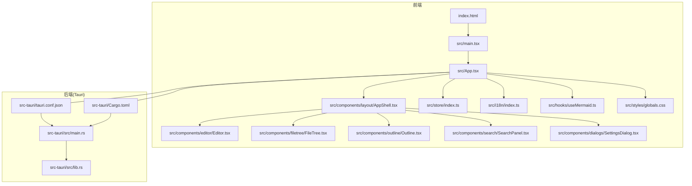
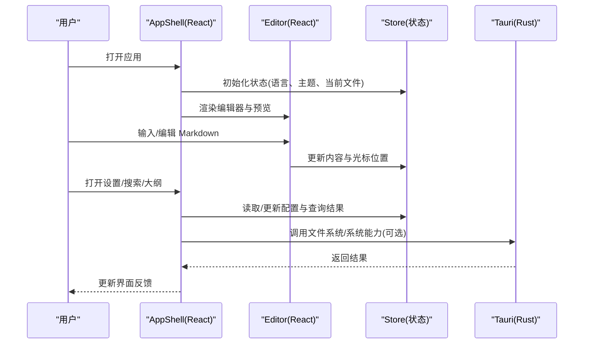
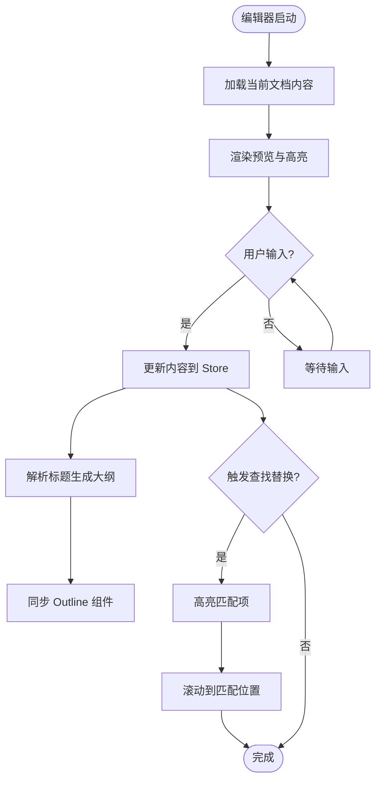
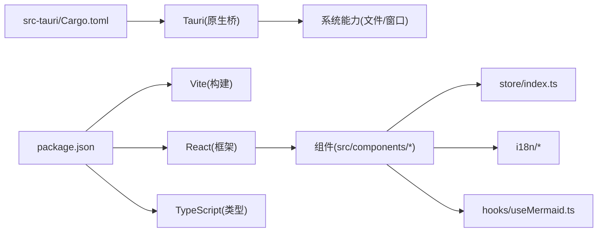

# 项目概览

<cite>
**本文引用的文件**   
- [README.md](file://README.md)
- [package.json](file://package.json)
- [vite.config.ts](file://vite.config.ts)
- [tsconfig.json](file://tsconfig.json)
- [index.html](file://index.html)
- [src/main.tsx](file://src/main.tsx)
- [src/App.tsx](file://src/App.tsx)
- [src/domain/types.ts](file://src/domain/types.ts)
- [src/store/index.ts](file://src/store/index.ts)
- [src/hooks/useMermaid.ts](file://src/hooks/useMermaid.ts)
- [src/i18n/index.ts](file://src/i18n/index.ts)
- [src/i18n/zh-CN.ts](file://src/i18n/zh-CN.ts)
- [src/i18n/en-US.ts](file://src/i18n/en-US.ts)
- [src/styles/globals.css](file://src/styles/globals.css)
- [src/components/layout/AppShell.tsx](file://src/components/layout/AppShell.tsx)
- [src/components/layout/Titlebar.tsx](file://src/components/layout/Titlebar.tsx)
- [src/components/layout/StatusBar.tsx](file://src/components/layout/StatusBar.tsx)
- [src/components/editor/Editor.tsx](file://src/components/editor/Editor.tsx)
- [src/components/editor/FindReplaceBar.tsx](file://src/components/editor/FindReplaceBar.tsx)
- [src/components/editor/TableContextMenu.tsx](file://src/components/editor/TableContextMenu.tsx)
- [src/components/filetree/FileTree.tsx](file://src/components/filetree/FileTree.tsx)
- [src/components/outline/Outline.tsx](file://src/components/outline/Outline.tsx)
- [src/components/search/SearchPanel.tsx](file://src/components/search/SearchPanel.tsx)
- [src/components/dialogs/SettingsDialog.tsx](file://src/components/dialogs/SettingsDialog.tsx)
- [src-tauri/Cargo.toml](file://src-tauri/Cargo.toml)
- [src-tauri/tauri.conf.json](file://src-tauri/tauri.conf.json)
- [src-tauri/src/main.rs](file://src-tauri/src/main.rs)
- [src-tauri/src/lib.rs](file://src-tauri/src/lib.rs)
- [docs/PRD.md](file://docs/PRD.md)
- [docs/UI-DESIGN.md](file://docs/UI-DESIGN.md)
- [docs/MARKDOWN-RENDERING.md](file://docs/MARKDOWN-RENDERING.md)
</cite>

## 目录
1. [简介](#简介)
2. [项目结构](#项目结构)
3. [核心组件](#核心组件)
4. [架构总览](#架构总览)
5. [详细组件分析](#详细组件分析)
6. [依赖关系分析](#依赖关系分析)
7. [性能考量](#性能考量)
8. [故障排查指南](#故障排查指南)
9. [结论](#结论)
10. [附录](#附录)

## 简介
ZenNote 是一款基于 React + Tauri + TypeScript 的桌面端 Markdown 笔记应用。其核心目标是提供高效、专注且可扩展的写作体验，通过“所见即所得”的编辑器与强大的文件管理、大纲导航、搜索与设置能力，帮助创作者快速组织与检索知识。

主要功能特性包括：
- Markdown 编辑器：支持实时预览、表格上下文菜单、查找替换等编辑增强。
- 文件树管理：侧边栏展示本地文件结构，支持快速定位与切换文档。
- 大纲导航：根据标题自动生成可点击的大纲，提升长文导航效率。
- 搜索面板：全局搜索内容，快速定位关键词与所在段落。
- 设置对话框：集中管理应用偏好与行为配置。
- 国际化：中英文界面切换，满足多语言用户。
- 图表渲染：集成 Mermaid 图表渲染能力，丰富可视化表达。

设计理念与用户体验目标：
- 以“写作为中心”的界面布局，减少干扰，提高专注度。
- 通过文件树与大纲联动，形成“从宏观到微观”的导航路径。
- 将常用操作（查找替换、设置）置于易达位置，降低学习成本。
- 保持跨平台一致的交互体验，借助 Tauri 实现原生性能与系统级能力。

使用场景示例：
- 撰写技术文档时，利用大纲快速跳转章节，使用查找替换批量修正术语。
- 在会议记录中插入 Mermaid 流程图，直观呈现流程或架构图。
- 通过文件树按主题归档笔记，配合搜索面板快速召回历史内容。
- 在设置中调整主题、字体大小与快捷键，适配个人工作流。

[本节不直接分析具体文件]

## 项目结构
项目采用前后端分离的桌面应用架构：前端为 React + Vite + TypeScript，后端为 Tauri Rust 服务。UI 组件按功能域划分，状态管理与国际化独立模块，样式统一入口。

**图示来源** 
- [index.html:1-50](file://index.html#L1-L50)
- [src/main.tsx:1-50](file://src/main.tsx#L1-L50)
- [src/App.tsx:1-120](file://src/App.tsx#L1-L120)
- [src/components/layout/AppShell.tsx:1-120](file://src/components/layout/AppShell.tsx#L1-L120)
- [src-tauri/tauri.conf.json:1-120](file://src-tauri/tauri.conf.json#L1-L120)
- [src-tauri/Cargo.toml:1-80](file://src-tauri/Cargo.toml#L1-L80)

**章节来源**
- [index.html:1-50](file://index.html#L1-L50)
- [src/main.tsx:1-50](file://src/main.tsx#L1-L50)
- [src/App.tsx:1-120](file://src/App.tsx#L1-L120)
- [src-tauri/tauri.conf.json:1-120](file://src-tauri/tauri.conf.json#L1-L120)
- [src-tauri/Cargo.toml:1-80](file://src-tauri/Cargo.toml#L1-L80)

## 核心组件
- 应用外壳 AppShell：承载主布局与子区域（编辑器、文件树、大纲、搜索、设置）。
- 编辑器 Editor：Markdown 编辑与预览的核心，集成查找替换与表格上下文菜单。
- 文件树 FileTree：展示本地文件结构，支持选择与同步当前文档。
- 大纲 Outline：解析标题生成导航节点，点击跳转到对应段落。
- 搜索 SearchPanel：全文检索，高亮匹配项并跳转。
- 设置 SettingsDialog：集中管理用户偏好与运行时配置。
- 状态 store：集中管理应用状态（如当前文件、搜索词、设置项）。
- 国际化 i18n：中英文资源与切换逻辑。
- Mermaid Hook：按需加载与渲染图表。

**章节来源**
- [src/components/layout/AppShell.tsx:1-120](file://src/components/layout/AppShell.tsx#L1-L120)
- [src/components/editor/Editor.tsx:1-150](file://src/components/editor/Editor.tsx#L1-L150)
- [src/components/editor/FindReplaceBar.tsx:1-120](file://src/components/editor/FindReplaceBar.tsx#L1-L120)
- [src/components/editor/TableContextMenu.tsx:1-100](file://src/components/editor/TableContextMenu.tsx#L1-L100)
- [src/components/filetree/FileTree.tsx:1-120](file://src/components/filetree/FileTree.tsx#L1-L120)
- [src/components/outline/Outline.tsx:1-120](file://src/components/outline/Outline.tsx#L1-L120)
- [src/components/search/SearchPanel.tsx:1-150](file://src/components/search/SearchPanel.tsx#L1-L150)
- [src/components/dialogs/SettingsDialog.tsx:1-120](file://src/components/dialogs/SettingsDialog.tsx#L1-L120)
- [src/store/index.ts:1-120](file://src/store/index.ts#L1-L120)
- [src/i18n/index.ts:1-80](file://src/i18n/index.ts#L1-L80)
- [src/hooks/useMermaid.ts:1-100](file://src/hooks/useMermaid.ts#L1-L100)

## 架构总览
ZenNote 采用“前端 UI + 后端 Tauri”的双进程模式。前端负责渲染与交互，Tauri 提供系统能力与原生扩展。Vite 作为构建工具，TypeScript 保证类型安全，React 组件化组织 UI。

**图示来源** 
- [src/components/layout/AppShell.tsx:1-120](file://src/components/layout/AppShell.tsx#L1-L120)
- [src/components/editor/Editor.tsx:1-150](file://src/components/editor/Editor.tsx#L1-L150)
- [src/store/index.ts:1-120](file://src/store/index.ts#L1-L120)
- [src-tauri/src/main.rs:1-120](file://src-tauri/src/main.rs#L1-L120)
- [src-tauri/src/lib.rs:1-120](file://src-tauri/src/lib.rs#L1-L120)

**章节来源**
- [src-tauri/src/main.rs:1-120](file://src-tauri/src/main.rs#L1-L120)
- [src-tauri/src/lib.rs:1-120](file://src-tauri/src/lib.rs#L1-L120)
- [src-tauri/tauri.conf.json:1-120](file://src-tauri/tauri.conf.json#L1-L120)

## 详细组件分析

### 应用外壳 AppShell
职责：
- 定义主布局区域（标题栏、状态栏、侧边栏、主编辑区）。
- 协调子组件的生命周期与通信（如文件树与编辑器的同步）。
- 承载全局快捷键与窗口控制。

交互要点：
- 标题栏显示文档标题与窗口操作。
- 状态栏显示光标位置、字数统计等信息。
- 侧边栏包含文件树、大纲、搜索与设置入口。

**章节来源**
- [src/components/layout/AppShell.tsx:1-120](file://src/components/layout/AppShell.tsx#L1-L120)
- [src/components/layout/Titlebar.tsx:1-100](file://src/components/layout/Titlebar.tsx#L1-L100)
- [src/components/layout/StatusBar.tsx:1-100](file://src/components/layout/StatusBar.tsx#L1-L100)

### 编辑器 Editor
职责：
- 渲染 Markdown 文本与预览。
- 处理输入事件、撤销重做、语法高亮（由上层库实现）。
- 集成查找替换与表格上下文菜单。

关键流程：
- 监听输入变更，更新 store 中的文档内容。
- 解析标题生成大纲数据供 Outline 使用。
- 响应查找替换请求，高亮匹配并滚动至可见区域。

**图示来源** 
- [src/components/editor/Editor.tsx:1-150](file://src/components/editor/Editor.tsx#L1-L150)
- [src/components/editor/FindReplaceBar.tsx:1-120](file://src/components/editor/FindReplaceBar.tsx#L1-L120)
- [src/components/outline/Outline.tsx:1-120](file://src/components/outline/Outline.tsx#L1-L120)

**章节来源**
- [src/components/editor/Editor.tsx:1-150](file://src/components/editor/Editor.tsx#L1-L150)
- [src/components/editor/FindReplaceBar.tsx:1-120](file://src/components/editor/FindReplaceBar.tsx#L1-L120)
- [src/components/editor/TableContextMenu.tsx:1-100](file://src/components/editor/TableContextMenu.tsx#L1-L100)

### 文件树 FileTree
职责：
- 展示本地文件与文件夹结构。
- 支持展开/折叠、选中与双击打开。
- 与编辑器同步当前文档路径。

交互要点：
- 选择文件后，Editor 加载对应内容。
- 右键菜单支持新建、删除、重命名（结合 Tauri 文件系统能力）。

**章节来源**
- [src/components/filetree/FileTree.tsx:1-120](file://src/components/filetree/FileTree.tsx#L1-L120)

### 大纲 Outline
职责：
- 解析 Markdown 标题生成层级大纲。
- 点击节点跳转到对应段落。
- 与编辑器内容变化保持同步。

**章节来源**
- [src/components/outline/Outline.tsx:1-120](file://src/components/outline/Outline.tsx#L1-L120)

### 搜索 SearchPanel
职责：
- 提供全文检索，支持正则与大小写敏感选项。
- 高亮匹配结果并支持跳转到匹配位置。
- 显示匹配数量与分页浏览。

**章节来源**
- [src/components/search/SearchPanel.tsx:1-150](file://src/components/search/SearchPanel.tsx#L1-L150)

### 设置 SettingsDialog
职责：
- 管理用户偏好（主题、字体、语言、快捷键等）。
- 持久化存储设置项。
- 动态应用设置变更（如即时切换语言与主题）。

**章节来源**
- [src/components/dialogs/SettingsDialog.tsx:1-120](file://src/components/dialogs/SettingsDialog.tsx#L1-L120)

### 状态管理 Store
职责：
- 集中管理应用状态（当前文件、文档内容、搜索词、设置项）。
- 提供订阅与更新机制，确保组件间数据一致性。

**章节来源**
- [src/store/index.ts:1-120](file://src/store/index.ts#L1-L120)

### 国际化 i18n
职责：
- 维护中英文文案资源。
- 提供语言切换与动态加载。

**章节来源**
- [src/i18n/index.ts:1-80](file://src/i18n/index.ts#L1-L80)
- [src/i18n/zh-CN.ts:1-120](file://src/i18n/zh-CN.ts#L1-L120)
- [src/i18n/en-US.ts:1-120](file://src/i18n/en-US.ts#L1-L120)

### Mermaid 图表渲染 Hook
职责：
- 按需加载 Mermaid 库。
- 将 Markdown 中的 Mermaid 代码块渲染为图表。

**章节来源**
- [src/hooks/useMermaid.ts:1-100](file://src/hooks/useMermaid.ts#L1-L100)

## 依赖关系分析
前端依赖：
- React 与 Vite：UI 框架与构建工具。
- TypeScript：类型系统与开发体验。
- 可能的第三方库：Markdown 渲染器、Mermaid、状态管理库（由 store 与 hooks 体现）。

后端依赖：
- Tauri：Rust 编写的原生桥接层，提供系统能力与打包分发。
- Cargo：Rust 包管理器与构建系统。

**图示来源** 
- [package.json:1-120](file://package.json#L1-L120)
- [src-tauri/Cargo.toml:1-80](file://src-tauri/Cargo.toml#L1-L80)
- [src/store/index.ts:1-120](file://src/store/index.ts#L1-L120)
- [src/i18n/index.ts:1-80](file://src/i18n/index.ts#L1-L80)
- [src/hooks/useMermaid.ts:1-100](file://src/hooks/useMermaid.ts#L1-L100)

**章节来源**
- [package.json:1-120](file://package.json#L1-L120)
- [src-tauri/Cargo.toml:1-80](file://src-tauri/Cargo.toml#L1-L80)

## 性能考量
- 懒加载与按需引入：Mermaid 与大型库通过 Hook 或动态 import 减少初始包体积。
- 增量更新：编辑器内容变更仅更新必要 DOM 与预览区域，避免全量重绘。
- 虚拟列表与分页：文件树与搜索结果在大数据集下考虑虚拟化与分页加载。
- 缓存策略：对频繁访问的文件元数据与渲染结果进行内存缓存。
- 构建优化：Vite 生产构建启用代码分割与压缩，减小传输体积。

[本节提供通用指导，不直接分析具体文件]

## 故障排查指南
常见问题与解决思路：
- 编辑器无法渲染 Markdown：检查 Markdown 渲染库是否正确引入与版本兼容。
- 查找替换无效果：确认搜索词与正则表达式是否正确，检查高亮类名是否存在。
- 大纲不更新：验证标题解析逻辑与编辑器内容同步机制。
- 设置未生效：检查设置持久化存储与组件订阅更新链路。
- Tauri 能力调用失败：查看 tauri.conf.json 权限配置与 Rust 后端日志。

调试建议：
- 使用浏览器开发者工具检查网络与资源加载。
- 在 React DevTools 中观察组件状态与 props 传递。
- 启用 Tauri 日志输出，定位原生层错误。

**章节来源**
- [src-tauri/tauri.conf.json:1-120](file://src-tauri/tauri.conf.json#L1-L120)
- [src-tauri/src/main.rs:1-120](file://src-tauri/src/main.rs#L1-L120)

## 结论
ZenNote 通过清晰的模块化设计与现代技术栈，提供了稳定高效的 Markdown 写作体验。其“编辑器为核心、文件树与大纲为导航、搜索与设置为辅助”的架构，既满足了初学者易用性需求，也为高级用户提供了扩展空间。未来可在插件生态、协作编辑与云同步方面持续演进。

[本节总结性内容，不直接分析具体文件]

## 附录
- 产品需求与设计参考：
  - [docs/PRD.md](file://docs/PRD.md)
  - [docs/UI-DESIGN.md](file://docs/UI-DESIGN.md)
  - [docs/MARKDOWN-RENDERING.md](file://docs/MARKDOWN-RENDERING.md)
- 构建与配置：
  - [vite.config.ts:1-120](file://vite.config.ts#L1-L120)
  - [tsconfig.json:1-80](file://tsconfig.json#L1-L80)
  - [src-tauri/tauri.conf.json:1-120](file://src-tauri/tauri.conf.json#L1-L120)

**章节来源**
- [docs/PRD.md:1-200](file://docs/PRD.md#L1-L200)
- [docs/UI-DESIGN.md:1-200](file://docs/UI-DESIGN.md#L1-L200)
- [docs/MARKDOWN-RENDERING.md:1-200](file://docs/MARKDOWN-RENDERING.md#L1-L200)
- [vite.config.ts:1-120](file://vite.config.ts#L1-L120)
- [tsconfig.json:1-80](file://tsconfig.json#L1-L80)
- [src-tauri/tauri.conf.json:1-120](file://src-tauri/tauri.conf.json#L1-L120)