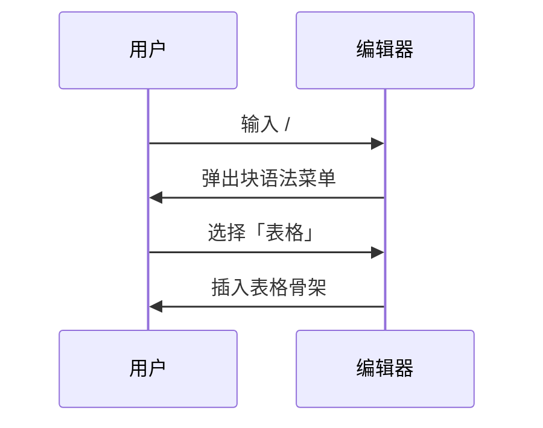

# ZenNote 语法全量验证

> 用途：在**实时预览编辑器**下逐项核对渲染效果。
> 打开方式：设置 → 编辑器 → 打开「实时预览编辑器」。
> 核对方法：光标移开看渲染结果；点进某块看它是否变回源码、且能编辑。

---

## 1. 标题

# 一级标题 H1
## 二级标题 H2
### 三级标题 H3
#### 四级标题 H4
##### 五级标题 H5
###### 六级标题 H6

**核对**：行内只显示文字，`#` 隐藏；H1/H2 下方有分隔线；H2 及以下字号递减。光标点进任意标题，`#` 显形且**能停在两个 `#` 之间**。

---

## 2. 行内标记

普通文字里包含 **粗体**、*斜体*、~~删除线~~、==高亮==、`行内代码`，以及 [一个链接](https://example.com)。

嵌套：**粗体里有 `代码`**，*斜体里有 **粗体***。

边界：`**` 紧贴文字**加粗**、行尾加粗**、*行首斜体*、`代码`连写`两段`。

**核对**：标记符号隐藏，样式生效；光标进入该段时标记显形且可编辑。

---

## 3. 列表

### 3.1 无序

- 第一项
- 第二项
  - 嵌套一层
    - 嵌套两层
- 第三项

### 3.2 有序

1. 第一项
2. 第二项
   1. 嵌套有序
   2. 再一项
3. 第三项

### 3.3 任务

- [x] 已完成的任务
- [ ] 未完成的任务
- [x] 嵌套
  - [ ] 子项未完成

**核对**：无序项显示圆点，有序项保留数字（且嵌套缩进），任务项显示复选框而不是圆点。

---

## 4. 引用

> 单层引用，左侧有竖条。
>
> 引用里的第二段。

> 外层引用
> > 嵌套引用
> > > 三层

> **引用里的粗体**与 `代码`。

---

## 5. 代码

行内的 `const x = 1` 已经在上文验证。

```typescript
// 有语言标记：右上角应显示语言名与复制按钮
interface Note {
  title: string;
  tags: string[];
}

export function countWords(text: string): number {
  return text.split(/\s+/).filter(Boolean).length;
}
```

```python
def fib(n: int) -> int:
    a, b = 0, 1
    for _ in range(n):
        a, b = b, a + b
    return a
```

```
无语言标记的围栏
```

**核对**：语法高亮生效（关键字/字符串/注释/数字不同色）；语言名与复制按钮可见；围栏符号隐藏；光标进入后变回源码、` ``` ` 显形。

---

## 6. 表格

### 6.1 基础与对齐

| 左对齐 | 居中 | 右对齐 |
| :--- | :---: | ---: |
| a | b | 1 |
| c | d | 22 |
| e | f | 333 |

### 6.2 单元格内标记

| 构造 | 状态 | 备注 |
| --- | --- | --- |
| 粗体 | **完成** | 单元格内粗体 |
| 代码 | `inline()` | 单元格内代码 |
| 链接 | [链接](https://example.com) | 单元格内链接 |
| 转义 | a \| b | 内含转义管道符 |

### 6.3 宽表（横向滚动）

| 列一 | 列二 | 列三 | 列四 | 列五 | 列六 |
| --- | --- | --- | --- | --- | --- |
| 很长的内容用于测试单元格换行行为是否正常 | 2 | 3 | 4 | 5 | 6 |

**核对**：
1. 渲染成真表格（不是管道符文本）
2. 对齐生效（第三列右对齐、第二列居中）
3. **单击单元格直接编辑**，`Tab` 提交并跳下一格，`Esc` 取消
4. `Tab` 到最后一格再按，自动补一行
5. 右键表格 → 增删行列、删除表格
6. 点击表格外的正文，表格恢复渲染态

---

## 7. 图片


**核对**：图片渲染出来；**图片加载失败时显示替代文字**而不是空白；鼠标悬停右上角出现放大按钮；点击放大按钮弹出可缩放浮层（滚轮缩放、拖拽平移、8 向手柄、Esc 关闭）；单击图片出现对齐工具栏（左/中/右）。

> 注：上面的 `assets/screenshot.png` 若不存在，应显示「图片无法显示」而不是一片空白。

---

## 8. 数学公式

行内公式：质能方程 $E = mc^2$ 出现在句子中。

另一个行内：$a^2 + b^2 = c^2$。

块级公式：

$$
\int_{0}^{\infty} e^{-x^2}\,dx = \frac{\sqrt{\pi}}{2}
$$

矩阵：

$$
\begin{pmatrix} a & b \\ c & d \end{pmatrix}
\begin{pmatrix} x \\ y \end{pmatrix}
=
\begin{pmatrix} ax + by \\ cx + dy \end{pmatrix}
$$

**核对**：行内公式随文排版；块级公式居中独立成行；光标进入后变回 `$...$` 源码。

下面是一个**故意写错**的公式，用来验证容错：

$$
\frac{1}{ 未闭合
$$

**核对**：错误公式应**原样显示源码**（灰色），而不是弹出红色报错——KaTeX 的错误标记已改为回退到源码。

---

## 9. Mermaid 图表




**核对**：渲染成图形而不是代码；右上角放大按钮可用；点击图形本体不改变光标（是 widget）；光标点进围栏内变回源码可编辑。

---

## 10. 分隔线

上面一段。

---

下面一段。

***

还有 `***` 形式。

___

以及 `___` 形式。

---

## 11. 原始 HTML

块级：

<cite>
**本文档引用的文件**
- [index.ts](file://src/i18n/index.ts)
- [en-US.ts](file://src/i18n/en-US.ts)
- [zh-CN.ts](file://src/i18n/zh-CN.ts)
</cite>

带属性的块：

<div class="note">
这是一个 div 块，内部有 <b>粗体</b> 与 <em>斜体</em>。
</div>

其他常见标签：

<details>
<summary>折叠标题（点击展开）</summary>
折叠内容。
</details>

<kbd>Ctrl</kbd> + <kbd>S</kbd> 保存。

<mark>高亮标记</mark>

**核对**：`<cite>` 块渲染成带左边竖条的引用样式，且**内部 markdown 列表被解析**（这是关键——不是显示原始文本）；`<div>` 渲染为块；`<kbd>`/`<mark>` 行内标签生效；光标进入后显示源码。

---

## 12. 脚注

第一处引用[^note]，第二次引用同一个[^second]，再引一次[^note]。

代码块里的不应识别：

```text
这一行 [^note] 是代码，不是脚注。
```

[^note]: 这是命名脚注的内容。编号按**定义顺序**决定，所以它渲染成 1。
[^second]: 第二个脚注的内容。

**核对**：角标显示为带背景的小数字（不是 `[^note]` 原文）；点击角标跳到定义处并有短暂高亮；同一个脚注被引用两次时编号相同；定义处的 `[^note]:` 标记隐藏。

---

## 13. 目录

[TOC]

**核对**：渲染成可点击的目录框；点击条目跳到对应标题；光标点进 `[TOC]` 变回源码。

---

## 14. 选区与选中态

下面这段用于测试**拖选**（这是之前反馈过的重点）：

普通文字里的 **粗体**、*斜体*、~~删除线~~、==高亮==、`行内代码` 和 [链接](https://example.com) 混排在一起，用鼠标从左到右拖过整段。

再测试跨行拖选：

第一行有 **粗体**。
第二行有 `代码`。
第三行有 ==高亮==。
第四行是 @#¥%……&*（）——+ 等符号。

**核对**：
1. 拖选时底色清晰可见
2. **被选中的文字本身可读**——尤其是语法标记（`**`、`#`、`==`）在这些行上会显形，它们必须与选区底色有对比
3. 选区覆盖行内代码与高亮时，仍能看出被选中

---

## 15. 交互功能

### 15.1 气泡工具栏

用鼠标拖选本句中的一部分文字。

**核对**：选区上方浮出工具栏（粗/斜/删/码/高亮/链接）。点在选区外收起。

### 15.2 斜杠菜单

在下方空行行首输入 `/`：

&nbsp;

**核对**：弹出块语法菜单，可用上下键选择、Enter 确认、Esc 关闭；选择后插入对应语法。

### 15.3 快捷键

选中一段文字后依次尝试：

| 快捷键 | 预期 |
| --- | --- |
| `Ctrl+B` | 加粗 / 取消加粗 |
| `Ctrl+I` | 斜体 / 取消斜体 |
| `Ctrl+E` | 行内代码 / 取消 |
| `Ctrl+K` | 插入链接，url 占位符被选中 |
| `Ctrl+Shift+X` | 删除线 |
| `Ctrl+Shift+H` | 高亮 |
| `Ctrl+1` … `Ctrl+6` | 当前块变 H1…H6 |
| `Ctrl+0` | 变回正文 |
| `Ctrl+F` | 打开查找替换 |

### 15.4 查找替换

按 `Ctrl+F`，搜索「核对」。

**核对**：所有「核对」高亮；上一个/下一个可用；替换可生效。

---

## 16. 文本边界情况

行尾两个空格产生换行：  
这一行是强制换行后的内容。

转义字符：\*不是斜体\*、\`不是代码\`、\# 不是标题。

特殊符号：< > & " ' © ® ™ € £ ¥ ° ± × ÷ ≠ ≤ ≥ ∞

中英混排：ZenNote 编辑器 supports 中英文 mixed 排版，spacing 应该正常。

长单词与 URL 换行：

https://github.com/gongshiyun/ZenNote/blob/master/README.md

超长无空格串：AAAAAAAAAAAAAAAAAAAAAAAAAAAAAAAAAAAAAAAAAAAAAAAAAAAAAAAAAAAAAAAAAAAAAAAAAAAAAAAA

全角标点：，。、；：？！「」『』（）【】《》——……

Emoji：✅ ❌ ⚠️ 🎉 👍 🚀

**核对**：强制换行生效；转义字符按字面显示；特殊符号不触发 HTML 解析；中英混排间距正常；长串不会撑破页面。

---

## 17. 空文档与结构边界

<!-- 这是一个注释，不应渲染 -->

紧贴代码块的段落：

```text
code
```
紧接着的段落。

列表紧贴表格：

- 项一
- 项二

| a | b |
| --- | --- |
| 1 | 2 |

引用里的代码：

> ```ts
> const inQuote = true;
> ```

**核对**：以上结构之间不会互相吞并；注释不显示；块与块之间的间距一致。

---

## 18. 性能观察（可选）

本文件约 300 行。滚动是否顺畅、输入是否跟手、切到其他文件再切回来是否保持滚动位置。

---

## 附：与旧编辑器（实时预览关闭时）的逐项对照

把同一份文件在两种模式下各开一次，核对下列项**表现一致**：

| 项 | 旧编辑器 | 实时预览 |
| --- | --- | --- |
| 标题字号与字体 | 衬线 | 衬线 |
| 代码块语法高亮 | 有 | 应有 |
| 表格渲染 | 有 | 应有 |
| 图片放大浮层 | 有 | 应有 |
| 图片对齐菜单 | 有 | 应有 |
| 表格右键菜单 | 有 | 应有 |
| 代码复制按钮 | 有 | 应有 |
| 脚注渲染与跳转 | 有 | 应有 |
| `[TOC]` 目录 | 有 | 应有 |
| 原始 HTML 块 | 有 | 应有 |
| 外部冲突提示条 | 有 | 应有 |
| 图片粘贴上传 | 有 | 应有 |
| 拖选后气泡工具栏 | 无 | 新增 |
| 行首 `/` 菜单 | 无 | 新增 |
| 保存 / 自动保存 / 状态栏字数 | 有 | 应有 |
